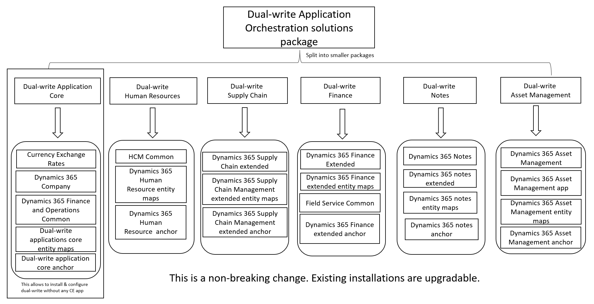

# Separated Dual-write Application Orchestration package

[!include [banner](../../includes/banner.md)]

Previously, the Dual-write Application Orchestration package was a single package that contained the following solutions:

- Dynamics 365 Notes
- Dynamics 365 finance and operations Common Anchor
- Dynamics 365 finance and operations Dual Write Entity Maps
- Dynamics 365 Asset Management App
- Dynamics 365 Asset Management
- HCM Common
- Dynamics 365 Supply Chain Extended
- Dynamics 365 Finance Extended
- Dynamics 365 finance and operations Common
- Dynamics 365 Company
- Currency Exchange Rates
- Field Service Common

Because it was a single package, this package created an "all or nothing" situation for customers. However, Microsoft has now separated it into smaller packages. Therefore, customers can select just the packages for the solutions that they require. For example, if you're a Microsoft Dynamics 365 Supply Chain Management customer, and don't require integration with Dynamics 365 Human Resources, notes, and asset management, you can exclude those solutions from the solutions that are installed. Because the underlying solution names, publisher, and map versions remain the same, this change is non-breaking. Existing installations can be upgraded.

This article explains the solutions and maps that each package contains, and its dependency on other packages.

For step-by-step instructions that show how to transition to split packages, see [Transition from the Dual-write Application Orchestration package to split packages](separated-solutions-transition-guidance.md).

## Dual-write Application Core

The Dual-write Application Core package lets users install and configure dual-write without any customer engagement app. It contains the following five solutions.

| Unique name                           | Display name                               |
|---------------------------------------|--------------------------------------------|
| Dynamics365Company                    | Dynamics 365 Company                       |
| Dynamics365FinanceAndOperationsCommon | Dynamics 365 Finance and Operations Common |
| CurrencyExchangeRates                 | Currency Exchange Rates                    |
| msdyn_DualWriteAppCoreMaps            | Dual-write applications core entity maps   |
| msdyn_DualWriteAppCoreAnchor          | Dual-write applications core anchor        |

The following maps are available in this package.

| Finance and operations apps     | Customer engagement apps                    |
|---------------------------------|---------------------------------------------|
| Operating unit                  | msdyn_internalorganizations                 |
| Organization hierarchy          | msdyn_internalorganizationhierarchies       |
| Legal entities                  | msdyn_internalorganizations                 |
| Legal entities                  | cdm_companies                               |
| Organization hierarchy purposes | msdyn_internalorganizationhierarchypurposes |
| Exchange rate currency pair     | msdyn_currencyexchangeratepairs             |
| Name affixes                    | msdyn_nameaffixes                           |
| Exchange rate type              | msdyn_exchangeratetypes                     |
| CDS Exchange Rates              | msdyn_currencyexchangerates                 |
| Organization hierarchy type     | msdyn_internalorganizationhierarchytypes    |
| Currencies                      | transactioncurrencies                       |
| Mixed reality guides entity     | msmrw_guides                                |

**Dependency information**

The Dual-write Application Core package has no dependency on other packages.

## Dual-write Human Resources

The Dual-write Human Resources package contains the solutions and maps that are required to sync Human Resources data. It contains the following three solutions.

| Unique name                | Display name                             | Solution/Package  |
|----------------------------|------------------------------------------|-------------------|
| HCMCommon                  | HCM Common                               |Dynamics 365 HR Common tables |
| msdyn_Dynamics365HCMMaps   | Dynamics 365 Human Resources entity maps | Dual-write Human resources solution |
| msdyn_Dynamics365HCMAnchor | Dynamics 365 Human Resources anchor      |Dual-write Human resources solution|

For more information on the mappings that are available in the solutions, see [Integration with Dataverse tables](/dynamics365/human-resources/hr-dataverse-integration#template-mappings).

**Dependency information**

The Dual-write Human Resources package depends on the [Dual-write Application Core](https://appsource.microsoft.com/en-us/product/dynamics-365/mscrm.dwappcore?tab=Overview&exp=ubp8) and [Dynamics 365 HR Common Tables](https://appsource.microsoft.com/en-US/product/dynamics-365/mscrm.hcmcommon?exp=ubp8) packages. Therefore, you should install these two solution packages before you install the Dual-write Human Resources package.

## Dual-write Supply Chain

The Dual-write Supply Chain package contains the solutions and maps that are required to sync Supply Chain Management data. It contains the following three solutions.

| Unique name                                | Display name                                              |
|--------------------------------------------|-----------------------------------------------------------|
| Dynamics365SupplyChainExtended             | Dynamics 365 Supply Chain Extended                        |
| msdyn_Dynamics365SupplyChainExtendedMaps   | Dynamics 365 Supply Chain Management extended entity maps |
| msdyn_Dynamics365SupplyChainExtendedAnchor | Dynamics 365 Supply Chain Management extended anchor      |

The following maps are available in this package.

| Finance and operations apps                 | Customer engagement apps                      |
|---------------------------------------------|-----------------------------------------------|
| Units                                       | uoms                                          |
| CDS sales order headers                     | salesorders                                   |
| CDS sales order lines                       | salesorderdetails                             |
| CDS sales quotation header                  | quotes                                        |
| CDS sales quotation lines                   | quotedetails                                  |
| CDS released distinct products              | products                                      |
| Warehouse zones                             | msdyn_warehousezones                          |
| Warehouse zone groups                       | msdyn_warehousezonegroups                     |
| Warehouse work lines                        | msdyn_warehouseworklines                      |
| Warehouse work headers                      | msdyn_warehouseworkheaders                    |
| Warehouses                                  | msdyn_warehouses                              |
| Inventory aisle                             | msdyn_warehouseaisles                         |
| Unit conversions                            | msdyn_unitofmeasureconversions                |
| Terms of delivery                           | msdyn_termsofdeliveries                       |
| Modes of delivery                           | msdyn_shipvias                                |
| Product master styles                       | msdyn_sharedproductstyles                     |
| Sales invoice lines V2                      | invoicedetails                                |
| Sales invoice headers V2                    | invoices                                      |
| Product master sizes                        | msdyn_sharedproductsizes                      |
| Released products V2                        | msdyn_sharedproductdetails                    |
| Product master configurations               | msdyn_sharedproductconfigurations             |
| Product master colors                       | msdyn_sharedproductcolors                     |
| Sales order origin codes                    | msdyn_salesorderorigins                       |
| Product receipt header                      | msdyn_purchaseorderreceipts                   |
| Product receipt line                        | msdyn_purchaseorderreceiptproducts            |
| Purchase order headers V2                   | msdyn_purchaseorders                          |
| CDS purchase order line soft deleted entity | msdyn_purchaseorderproducts                   |
| CDS purchase order line entity              | msdyn_purchaseorderproducts                   |
| Tracking dimension groups                   | msdyn_producttrackingdimensiongroups          |
| Styles                                      | msdyn_productstyles                           |
| Storage dimension groups                    | msdyn_productstoragedimensiongroups           |
| Product specific unit conversions           | msdyn_productspecificunitofmeasureconversions |
| Product default order settings V2           | msdyn_productspecificdefaultordersettings     |
| Sizes                                       | msdyn_productsizes                            |
| Product dimension groups                    | msdyn_productdimensiongroups                  |
| Default order settings                      | msdyn_productdefaultordersettings             |
| Configurations                              | msdyn_productconfigurations                   |
| All products                                | msdyn_globalproducts                          |
| Colors                                      | msdyn_productcolors                           |
| Product category hierarchy roles            | msdyn_productcategoryhierarchyroles           |
| Product category hierarchies                | msdyn_productcategoryhierarchies              |
| Product category assignments                | msdyn_productcategoryassignments              |
| Product categories                          | msdyn_productcategories                       |
| Warehouse locations                         | msdyn_inventorylocations                      |
| CDS inventory on                            | msdyn_inventoryonhandentries                  |
| Product categories                          | msdyn_productcategories                       |
| CDS inventory on                            | msdyn_inventoryonhandrequests                 |
| Product Number Identified Barcode           | msdyn_productbarcodes                         |
| Loyalty card                                | msdyn_loyaltycards                            |
| Loyalty reward points                       | msdyn_loyaltyrewardpoints                     |
| Price customer groups                       | msdyn_pricecustomergroups                     |
| Sites                                       | msdyn_operationalsites                        |
| CDS sales quotation lines                   | quotedetails                                  |
| CDS sales order lines                       | salesorderdetails                             |

**Dependency information**

The Dual-write Supply Chain package depends on the following three packages. Therefore, you should install these packages before you install the Dual-write Supply Chain package.

- Dual-write Application Core package
- Dual-write Finance package
- Dual-write Human Resources package
- Dynamics 365 HR Common Tables

## Dual-write Finance

The Dual-write Finance package contains the solutions and maps that are required to sync Dynamics 365 Finance data. It contains the following four solutions.

| Unique name                            | Display name                               |
|----------------------------------------|-------------------------------------------|
| Dynamics365FinanceExtended             | Dynamics 365 Finance Extended             |
| msdyn_Dynamics365FinanceExtendedMaps   | Dynamics 365 Finance extended entity maps |
| FieldServiceCommon                     | Field Service Common                      |
| msdyn_Dynamics365FinanceExtendedAnchor | Dynamics 365 Finance extended anchor      |

The following maps are available in this package.

| Finance and operations apps             | Customer engagement apps        |
|-----------------------------------------|---------------------------------|
| Withholding tax groups                  | msdyn_withholdingtaxgroups      |
| CDS Contacts V2 (Customer)              | contacts                        |
| CDS Contacts V2 (Vendor)                | contacts                        |
| Customers V3                            | contacts                        |
| Withholding tax codes                   | msdyn_withholdingtaxcodes       |
| Vendors V2                              | msdyn_vendors                   |
| Vendor payment method                   | msdyn_vendorpaymentmethods      |
| Vendor groups                           | msdyn_vendorgroups              |
| Chart of accounts                       | msdyn_chartofaccountses         |
| Sales tax ledger posting groups V2      | msdyn_taxpostinggroups          |
| Item sales tax group                    | msdyn_taxitemgroups             |
| Sales tax groups                        | msdyn_taxgroups                 |
| Sales tax exempt code entity CDS        | msdyn_taxexemptcodes            |
| Customer groups                         | msdyn_customergroups            |
| Customer payment method                 | msdyn_customerpaymentmethods    |
| Financial dimensions                    | msdyn_dimensionattributes       |
| Sales tax authorities                   | msdyn_taxauthorities            |
| Financial dimension format              | msdyn_financialdimensionformats |
| Fiscal calendar period                  | msdyn_fiscalcalendarperiods     |
| Fiscal calendar integration entity      | msdyn_fiscalcalendars           |
| Fiscal calendar year integration entity | msdyn_fiscalcalendaryears       |
| Terms of payment                        | msdyn_paymentterms              |
| Payment schedule                        | msdyn_paymentschedules          |
| Payment schedule lines                  | msdyn_paymentschedulelines      |
| Payment days CDS                        | msdyn_paymentdays               |
| Payment day lines CDS V2                | msdyn_paymentdaylines           |
| Main account                            | msdyn_mainaccounts              |
| Main account categories                 | msdyn_mainaccountcategories     |
| Ledger                                  | msdyn_ledgers                   |
| Customers V3                            | accounts                        |

**Dependency information**

The Dual-write Finance package depends on the Dual-write Application Core package. Therefore, you should install the Dual-write Application Core package before you install the Dual-write Finance package.

## Dual-write Notes

The Dual-write Notes package contains the solutions and maps that are required to sync note or annotation data. It contains the following four solutions.

| Unique name                  | Display name                   |
|------------------------------|--------------------------------|
| Dynamics365Notes             | Dynamics 365 Notes             |
| Dynamics365NotesExtended     | Dynamics 365 notes extended    |
| msdyn_Dynamics365NotesMaps   | Dynamics 365 notes entity maps |
| msdyn_Dynamics365NotesAnchor | Dynamics 365 notes anchor      |

The following maps are available in this package.

| Finance and operations                     | Customer Engagement |
|--------------------------------------------|---------------------|
| Sales order header document attachments    | annotations         |
| Customer Attachments                       | annotations         |
| Vendor document attachments                | annotations         |
| Purchase order header document attachments | annotations         |

**Dependency information**

The Dual-write Notes package depends on the following two packages. Therefore, you should install these packages before you install the Dual-write Notes package.

- Dual-write Application Core package
- Dual-write Finance package

## Dual-write Asset Management

The Dual-write Asset Management package contains the solutions and maps that are required to sync asset data from Supply Chain Management or Dynamics 365 Field Service. It contains the following four solutions.

| Unique name                          | Display name                              |
|--------------------------------------|-------------------------------------------|
| Dynamics365AssetManagement           | Dynamics 365 Asset Management             |
| Dynamics365AssetManagementApp        | Dynamics365 Asset Management App          |
| msdyn_DualWriteAssetManagementMaps   | Dynamics 365 Asset Management entity maps |
| msdyn_DualWriteAssetManagementAnchor | Dynamics 365 Asset Management anchor      |

The following maps are available in this package.

| Finance and operations apps                           | Customer engagement apps                |
|-------------------------------------------------------|-----------------------------------------|
| Asset management warranty                             | msdyn_warranties                        |
| Asset management models                               | msdyn_models                            |
| Asset management manufacturers                        | msdyn_manufacturers                     |
| Asset management functional location types            | msdyn_functionallocationtypes           |
| Asset management functional locations                 | msdyn_functionallocations               |
| Asset management functional location lifecycle states | msdyn_functionallocationlifecyclestates |
| Asset management functional location lifecycle models | msdyn_functionallocationlifecyclemodels |
| Asset management assets                               | msdyn_customerassets                    |
| Asset management asset types                          | msdyn_customerassetcategories           |
| Asset management asset lifecycle states               | msdyn_assetlifecyclestates              |
| Asset management asset lifecycle models               | msdyn_assetlifecyclemodels              |

**Dependency information**

The Dual-write Asset Management package depends on the Dual-write Application Core package. Therefore, you should install the Dual-write Application Core package before you install the Dual-write Asset Management package.

## Packages required for Project Operations
Project Operations depends on the following packages. Therefore, you should install these packages before you install Project Operations.

- Dual-write Application Core package
- Dual-write Finance package
- Dual-write Supply Chain package
- Dual-write Asset Management package
- Dual-write Human Resources package

## Dual-write party and global address book solutions

The dual-write party and global address book package contains the following solutions and maps that are required to sync party and global address book data. 

| Unique name                       | Display name                            |
|-----------------------------------|-----------------------------------------|
| Party                             | Party                                   |
| Dynamics365GABExtended            | Dynamics 365 GAB Extended               |
| Dynamics365GABDualWriteEntityMaps | Dynamics 365 GAB Dual Write Entity Maps |
| Dynamics365GABParty_Anchor        | Dynamics 365 GAB and Party              |

The following maps are available in this package.

| Finance and operations apps | Customer engagement apps | 
|-----------------------------|--------------------------|
| CDS Parties | msdyn_parties | 
| CDS postal address locations | msdyn_postaladdresscollections | 
| CDS postal address history V2 | msdyn_postaladdresses | 
| CDS Party postal address locations | msdyn_partypostaladdresses | 
| Party contacts V3 | msdyn_partyelectronicaddresses | 
| Customers V3 | accounts | 
| Customers V3 | contacts | 
| Vendors V2 | msdyn_vendors | 
| Contact person titles | msdyn_salescontactpersontitles | 
| Complimentary closings | msdyn_complimentaryclosings | 
| Salutations | msdyn_salutations | 
| Decision making roles | msdyn_decisionmakingroles | 
| Employment job functions | msdyn_employmentjobfunctions | 
| Loyalty levels | msdyn_loyaltylevels | 
| Personal character types | msdyn_personalcharactertypes | 
| Contacts V2 | msdyn_contactforparties | 
| CDS sales quotation header | quotes | 
| CDS sales order headers | salesorders | 
| Sales invoice headers V2 | invoices | 
| CDS Address roles | msdyn_addressroles |

**Dependency information**

The dual-write party and global address book solutions depend on the following three packages. Therefore, you should install these packages before you install the dual-write party and global address book solutions package.

- Dual-write Application Core package
- Dual-write Finance package
- Dual-write Supply Chain package

