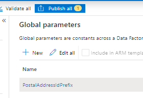

# Upgrade to the party and global address book model

[!include [banner](../../includes/banner.md)]

[!include [rename-banner](~/includes/cc-data-platform-banner.md)]

The [Microsoft Azure Data Factory templates](https://github.com/microsoft/Dynamics-365-FastTrack-Implementation-Assets/tree/master/Dual-write/Upgrade%20data%20to%20dual-write%20Party-GAB%20schema) helps you upgrade existing **Account**, **Contact**, and **Vendor** table data along with postal and electronic addresses in dual-write to the party and global address book model. There are 3 ADF templates provided that helps to reconcile the data from both finance and operations apps and customer engagement applications. [Party template (/Upgrade data to dual-write Party-GAB schema/arm_template.json)](https://github.com/microsoft/Dynamics-365-FastTrack-Implementation-Assets/blob/master/Dual-write/Upgrade%20data%20to%20dual-write%20Party-GAB%20schema/arm_template.json) helps to upgrade the party data along with **Account**, **Contact**, and **Vendor** data. [Party postal address template (/Upgrade data to dual-write Party-GAB schema/Upgrade to Party Postal Address - GAB/arm_template.json)](https://github.com/microsoft/Dynamics-365-FastTrack-Implementation-Assets/blob/master/Dual-write/Upgrade%20data%20to%20dual-write%20Party-GAB%20schema/Upgrade%20to%20Party%20Postal%20Address%20-%20GAB/arm_template.json) helps to upgrade the postal addresses associated with **Account**, **Contact**, and **Vendor** data. [Party electronic address template(/Upgrade data to dual-write Party-GAB schema/Upgrade to Party Electronic Address - GAB/arm_template.json)](https://github.com/microsoft/Dynamics-365-FastTrack-Implementation-Assets/blob/master/Dual-write/Upgrade%20data%20to%20dual-write%20Party-GAB%20schema/Upgrade%20to%20Party%20Electronic%20Address%20-%20GAB/arm_template.json) helps to upgrade electronic addresses associated with **Account**, **Contact**, and **Vendor** data. At the end of the process, **Party**, **Contacts**, **postal addresses** and **electronic addresses** fields for **Party** records will be created and associated with **Account**, **Contact**, and **Vendor** records in customer engagement applications. Following .csv files are generated:

| File name | Purpose |
|---|---|
|FONewParty.csv| Helps to create new **Party** records inside the finance and operations app|
|ImportFONewPostalAddressLocation.csv| Helps to create new **Postal Address Location** records inside the finance and operations app|
|ImportFONewPartyPostalAddress.csv| Helps to create new **Party Postal address** records inside the finance and operations app|
|ImportFONewPostalAddress.csv| Helps to create new **Postal Address** records inside the finance and operations app|
|ImportFONewElectronicAddress.csv| Helps to create new **Electronic Address** records inside the finance and operations app|

This topic provides instructions about how to use the Data Factory templates and upgrade your data. If you don’t have any customizations, you can use the template as is. If you have customizations for **Account**, **Contact**, and **Vendor** then you must modify the template using the following instructions.

> [!Note]
> There are special instructions to run postal address and electronic address templates. You need to run the Party template first, followed by Postal address template and then electronic address template. 

## Prerequisites

The following prerequisites are required to upgrade to the party and global address book model:

+ [Azure subscription](https://portal.azure.com/)
+ [Access to the templates](https://github.com/microsoft/Dynamics-365-FastTrack-Implementation-Assets/tree/master/Dual-write/Upgrade%20data%20to%20dual-write%20Party-GAB%20schema)
+ You must be an existing dual-write customer.

## Prepare for the upgrade
The following activities are needed to prepare for the upgrade:

+ **Fully synced**: Both environments are in a fully synced state for **Account (Customer)**, **Contact**, and **Vendor**.
+ **Integration keys**: **Account (Customer)**, **Contact**, and **Vendor** tables in customer engagement apps are using the integration keys that shipped out-of-the-box. If you customized the integration keys, you must customize the template.
+ **Party number**: All **Account (Customer)**, **Contact**, and **Vendor** records that will be upgraded have a **Party** number. Records without a **Party** number will be ignored. If you want to upgrade those records, add a **Party** number to them before you start the upgrade process.
+ **System outage**: During the upgrade process, you will have to take both the finance and operations and customer engagement environments offline.
+ **Snapshot**: Take snapshots of both the finance and operations apps and customer engagement apps. Use the snapshots to restore the previous state if you need to.

## Deployment

1. Download the templates from [Dynamics-365-FastTrack-Implementation-Assets](https://github.com/microsoft/Dynamics-365-FastTrack-Implementation-Assets/tree/master/Dual-write/Upgrade%20data%20to%20dual-write%20Party-GAB%20schema).

2. Sign in to [Microsoft Azure](https://portal.azure.com/).

3. Create a [resource group](/azure/azure-resource-manager/management/manage-resource-groups-portal).

4. Create a [storage account](/azure/storage/common/storage-account-create?tabs=azure-portal) in the resource group that you created.

5. Create a [data factory](/azure/data-factory/quickstart-create-data-factory-portal) in above resource group that you created.

6. Open the data factory and select the **Author & Monitor** tile.

7. On the **Manage** tab, select **ARM template**.

8. Select the **Import ARM template** to import the **Party** template.

9. Import the template into the data factory. Enter the following values for **Project details** and **Instance details**.

    Field | Value
    ---|---
    Subscription | Azure subscription
    Resource group | Provide same resource under which storage account is created.
    Region | Specify region.
    Factory Name | Specify factory name.
    FO Linked Service_service Principal Key | Specify the application's key.
    Azure Blob Storage_connection String | Azure Blob storage connection string.
    Dynamics Crm Linked Service_password | The password for the user account you specified as the username.
    FO Linked Service_properties_type Properties_url  | `https://sampledynamics.sandbox-operationsdynamics.com/data`
    FO Linked Service_properties_type Properties_tenant | Specify the tenant information (domain name or tenant ID) under which your application resides.
    FO Linked Service_properties_type Properties_aad Resource Id | `https://sampledynamics.sandboxoperationsdynamics.com`
    FO Linked Service_properties_type Properties_service Principal Id | Specify the application's client ID.
    Dynamics Crm Linked Service_properties_type Properties_username | The username to connect to Dynamics 365.

    For additional information, refer to the following topics: 
    
    - [Manually promote a Resource Manager template for each environment](/azure/data-factory/continuous-integration-deployment#manually-promote-a-resource-manager-template-for-each-environment)
    - [Linked service properties](/azure/data-factory/connector-dynamics-ax#linked-service-properties)
    - [Copy data using Azure Data Factory](/azure/data-factory/connector-dynamics-crm-office-365#dynamics-365-and-dynamics-crm-online)

10. After deployment, validate the datasets, data flow, and linked service of the data factory.

   

11. Navigate to **Manage**. Under **Connections**, select **Linked Service**. Select **DynamicsCrmLinkedService**. In the **Edit linked service (Dynamics CRM)** form, enter the following values.

    Field | Value
    ---|---
    Name | DynamicsCrmLinkedService
    Description | Linked services to connect with CRM instance to fetch entities data
    Connect via integration runtime | AutoResolvelntegrationRuntime
    Deployment type | Online
    Service Uri | `https://<organization-name>.crm[x].dynamics.com`
    Authentication type | Office365
    User name |
    Password or Azure Key Vault | Password
    Password |

## Setup instructions before running the Postal Addresses ADF Template
1)	Login to Customer Engagement apps, go to Settings -> Personalization Settings ->General Tab and perform timezone settings for the system admin account. This needs to be in UTC for updating the dates(valid from and valid to) of postal address from Finance and Operations apps. 

2)	Go to Azure Data Factory and create the following global parameters from "Manage" tab in data factory. 

|#	|Name	|Type	|Value|
|---|---|---|---|
|1	|PostalAddressIdPrefix|	string|	This parameter appends as prefix to newly created postal address serial number. Please provide a string which does not conflict with FO and CE postal address e.g. ADF-PAD-|

3)	Once the global parameters is created, click “publish all”.

## Setup instructions before running the Electronic Addresses ADF Template
 
1)	Go to Azure Data Factory and create the following global parameters from "Manage" tab in data factory. 

|#	|Name	|Type	|Value|
|---|---|---|---|
|1	|IsFOSource|	bool|	This parameter determines which primary system address will be replaced. If the value is true, FO primary addresses replace the primary addresses in CE for the conflicted ones and vice versa|
|2	|ElectronicAddressIdPrefix|	string	|This parameter appends as prefix to newly created electronic address serial number. Please provide a string which does not conflict with FO and CE electronic address e.g. ADF-EAD-|

2)	Once the global parameters is created, click “publish all”.

## Run the template

1. Stop the following **Account**, **Contact**, and **Vendor** dual-write maps using the Finance and Operations app.

    + Customers V3(accounts)
    + Customers V3(contacts)
    + CDS Contacts V2(contacts)
    + CDS Contacts V2(contacts)
    + Vendor V2 (msdyn_vendor)

2. Make sure the maps are removed from the `msdy_dualwriteruntimeconfig` table in Dataverse.

3. Install [Dual-write Party and Global Address Book Solutions](https://aka.ms/dual-write-gab) from AppSource.

4. In the finance and operations app, if the following tables contain data, then run **Initial Sync** for them.

    + Salutations
    + Personal character types
    + Complimentary closing
    + Contact person titles
    + Decision making roles
    + Loyalty levels

5. In the customer engagement app, disable the following plug-in steps.

    + Account Update
         + Microsoft.Dynamics.GABExtended.Plugins.UpdatePartyAttributesFromAccountEntity: Update of account
         + Microsoft.Dynamics.FinanceExtended.Plugins.TriggerNotesForCustomerTypeCodes: Update of account
    + Contact Update
         + Microsoft.Dynamics.GABExtended.Plugins.UpdatePartyAttributesFromContactEntity: Update of contact
         + Microsoft.Dynamics.FinanceExtended.Plugins.TriggerNotesForSellableContact: Update of contact
    + msdyn_party Update
         + Microsoft.Dynamics.GABExtended.Plugins.UpdatePartyAttributesFromPartyEntity: Update of msdyn_party
    + msdyn_vendor Update
         + Microsoft.Dynamics.GABExtended.Plugins.UpdatePartyAttributesFromVendorEntity: Update of msdyn_vendor
    + Customeraddress
         + Create
            + Microsoft.Dynamics.GABExtended.Plugins.CreatePartyAddress: Create of customeraddress
         + 	Update
            + Microsoft.Dynamics.GABExtended.Plugins.CreatePartyAddress: Update of customeraddress
         + Delete
            + Microsoft.Dynamics.GABExtended.Plugins.DeleteCustomerAddress: Delete of customeraddress
    + msdyn_partypostaladdress
         + Create
            + Microsoft.Dynamics.GABExtended.Plugins.CreateCustomerAddress: Create of msdyn_partypostaladdress
            + Microsoft.Dynamics.GABExtended.Plugins.PartyPostalAddress: Create of msdyn_partypostaladdress
         + Update
            + Microsoft.Dynamics.GABExtended.Plugins.CreateCustomerAddress: Update of msdyn_partypostaladdress
            + Microsoft.Dynamics.GABExtended.Plugins.PartyPostalAddress: Update of msdyn_partypostaladdress
    + msdyn_postaladdress
         + Create
            + Microsoft.Dynamics.GABExtended.Plugins.PostalAddress: Create of msdyn_postaladdress
            + Microsoft.Dynamics.GABExtended.Plugins.PostalAddressPostCreate: Create of msdyn_postaladdress
            + Microsoft.Dynamics.GABExtended.Plugins.UpdateCustomerAddress: Create of msdyn_postaladdress
         + Update
            + Microsoft.Dynamics.GABExtended.Plugins.PostalAddressUpdate: Update of msdyn_postaladdress
            + Microsoft.Dynamics.GABExtended.Plugins.UpdateCustomerAddress: Update of msdyn_postaladdress
    + msdyn_partyelectronicaddress
         + Create
            + Microsoft.Dynamics.GABExtended.Plugins.PartyElectronicAddressSync: Create of msdyn_partyelectronicaddress
         + Update
            + Microsoft.Dynamics.GABExtended.Plugins.PartyElectronicAddressSync: Update of msdyn_partyelectronicaddress
         + Delete
            + Microsoft.Dynamics.GABExtended.Plugins.DeletePartyElectronicAddressSync: Delete of msdyn_partyelectronicaddress

6. In the customer engagement app, disable the following workflows:

    + Create Vendors in Accounts Table
    + Create Vendors in Accounts Table
    + Create Vendors of type person in Contacts Table
    + Create Vendors of type Person in Vendors Table
    + Update Vendors in Accounts Table
    + Update Vendors in Vendors Table
    + Update Vendors of type Person in Contacts Table
    + Update Vendors of type Person in Vendors Table

7. In the data factory, run the template by selecting **Trigger now** as shown in the following image. This process might take a few hours to complete based on the data volume.

    

    > [!NOTE]
    > If you have customizations for **Account**, **Contact**, and **Vendor**, then you need to modify the template.

8. Import the new **Party** records in the Finance and Operations app.

    + Download the `FONewParty.csv` file from Azure blob storage. The path is `partybootstrapping/output/FONewParty.csv`.
    + Convert the `FONewParty.csv` file into an Excel file and import the Excel file into the finance and operations app. If the csv import works for you, you can import the csv file directly. The import could take a few hours to run, depending on the data volume. For more information, see [Data import and export jobs overview](../data-import-export-job.md).

    
    
9. Now, in the data factory, run the Postal address and electronic address templates one after another.

    

    + Running postal address ADF template upserts all postal address records in CE and associates them with respective Account, Contact and Vendor records.  It also generates 3 CSV files namely ImportFONewPostalAddressLocation.csv,ImportFONewPartyPostalAddress.csv and ImportFONewPostalAddress.csv. 
    + Running electronic address ADF template upserts all electronic addresses in CE and associates them with respective Account, Contact and Vendor records. It also generates 1 CSV file namely ImportFONewElectronicAddress.csv. 

 10.	In order to update F&O with this data, you need to convert the csv files into an Excel and [import it into F&O](https://docs.microsoft.com/en-us/dynamics365/fin-ops-core/dev-itpro/data-entities/data-import-export-job).  [Note: In case CSV import works for you, you can import CSV file directly.] This step could take few hours to complete depending on the volume.
    

    
9. In the customer engagement apps, enable the following plug-in steps:

    + Account Update
         + Microsoft.Dynamics.GABExtended.Plugins.UpdatePartyAttributesFromAccountEntity: Update of account
         + Microsoft.Dynamics.FinanceExtended.Plugins.TriggerNotesForCustomerTypeCodes: Update of account
    + Contact Update
         + Microsoft.Dynamics.GABExtended.Plugins.UpdatePartyAttributesFromContactEntity: Update of contact
         + Microsoft.Dynamics.FinanceExtended.Plugins.TriggerNotesForSellableContact: Update of contact
    + msdyn_party Update
         + Microsoft.Dynamics.GABExtended.Plugins.UpdatePartyAttributesFromPartyEntity: Update of msdyn_party
    + msdyn_vendor Update
         + Microsoft.Dynamics.GABExtended.Plugins.UpdatePartyAttributesFromVendorEntity: Update of msdyn_vendor
    + msdyn_partypostaladdress
         + Create
             + Microsoft.Dynamics.GABExtended.Plugins.CreateCustomerAddress: Create of msdyn_partypostaladdress
             + Microsoft.Dynamics.GABExtended.Plugins.PartyPostalAddress: Create of msdyn_partypostaladdress
         + Update
             + Microsoft.Dynamics.GABExtended.Plugins.CreateCustomerAddress: Update of msdyn_partypostaladdress
             + Microsoft.Dynamics.GABExtended.Plugins.PartyPostalAddress: Update of msdyn_partypostaladdress
    + msdyn_postaladdress
         + Create
             + Microsoft.Dynamics.GABExtended.Plugins.PostalAddress: Create of msdyn_postaladdress
             + Microsoft.Dynamics.GABExtended.Plugins.PostalAddressPostCreate: Create of msdyn_postaladdress
             + Microsoft.Dynamics.GABExtended.Plugins.UpdateCustomerAddress: Create of msdyn_postaladdress
         + Update
             + Microsoft.Dynamics.GABExtended.Plugins.PostalAddressUpdate: Update of msdyn_postaladdress
             + Microsoft.Dynamics.GABExtended.Plugins.UpdateCustomerAddress: Update of msdyn_postaladdress
 
    + msdyn_partyelectronicaddress
         + Create
             + Microsoft.Dynamics.GABExtended.Plugins.PartyElectronicAddressSync: Create of msdyn_partyelectronicaddress
         + Update
             + Microsoft.Dynamics.GABExtended.Plugins.PartyElectronicAddressSync: Update of msdyn_partyelectronicaddress
         + Delete
             + Microsoft.Dynamics.GABExtended.Plugins.DeletePartyElectronicAddressSync: Delete of msdyn_partyelectronicaddress

10. In the customer engagement apps, activate the following workflows if you deactivated them in previous steps:

    + Create Vendors in Accounts Table
    + Create Vendors in Accounts Table
    + Create Vendors of type person in Contacts Table
    + Create Vendors of type Person in Vendors Table
    + Update Vendors in Accounts Table
    + Update Vendors in Vendors Table
    + Update Vendors of type Person in Contacts Table
    + Update Vendors of type Person in Vendors Table

11. Run the **Party**-related maps as instructed in [Party and global address book](party-gab.md).
     

## Learn more about the "Upgrade to Party-GAB" template  
1. Steps 1 to 6 identifies the companies that are enabled for dual-write and builds a filter clause for them. 
2. Steps  7-1 to 7-9 retrieves the data from both F&O and CE and stage the data for upgrade.   
3. Steps 8 to 9 compare the party number for Account, Contact and Vendor between F&O and CE. The records that doesn’t have party number are skipped here. 
4. Step 10 generate 2 csv file for party records to create in CE and F&O 
5. FOCDSParty.csv contains all party records of both systems irrespective of company enabled for dual write 
6. FONewParty.csv contains subset of the party which Dataverse is aware of e.g. account of type prospect. 
7. Step 11 creates the Parties in CE. 
8. Step 12 retrieves the Party guids from CE and stage it for associating with Account, Contact and Vendor records in the subsequent steps. 
9. Step 13 associates the Account, Contact and Vendor records with Party guid. 
10. Steps 14-1 to 14-3 updates the Account, Contact and Vendor records in CE with Party guid.  
11. Steps 15-1 to 15-3 prepare "Contact for Party" records for Account, Contact and Vendor. 
12. Steps 16-1 to 16-7 retrieves the reference data like salutations, personal character types etc. and associate them with "Contact for Party" records. 
13. Step 17 merges the "Contact for Party" records for Account, Contact and Vendor. 
14. Step 18 Import "Contact for Party" records into CE. 
     
## Learn more about the "Upgrade to Party Postal Address-GAB" template 
1.	Steps 1-1- to 1-10 retrieve data from FO and CE both to stage data for upgrade.
2.	Step 2 de-normalize FO postal address data by joining postal address and party postal address.
3.	Step 3 de-dupe and merge account, contact and vendor address data from CE.
4.	Step 4 create csv files for FO to create new address data based on account, contact and vendor addresses.
5.	Step 5-1 create csv files for CE to create all address data based on FO and CE both. 
6.	Step 5-2 convert csv file into FO Import format for manual import.
1.	ImportFONewPostalAddressLocation.csv
2.	ImportFONewPartyPostalAddress.csv
3.	ImportFONewPostalAddress.csv
7.	Step 6 import postal address collection data in CE.
8.	Steps 7 retrieve postal address collection data from CE.
9.	Step 8 create customer address data and associate postal address collection id.
10.	Steps 9-1 to 9-2 associated party and postal address collection id to postal address and party postal address.
11.	Steps 10-1 to 10-3 import customer address, postal address and party postal address in CE.

## Learn more about the "Upgrade to Party Electronic Address-GAB" template 
1.	Steps 1-1- to 1-5 retrieve data from FO and CE both to stage data for upgrade.
2.	Step 2 consolidate CE electronic address from account, contact and vendor entities.
3.	Step 3 merge primary electronic address data from CE and FO.
4.	Step 4 create csv files.
1.	Create new electronic address data based on account, contact and vendor addresses for FO
2.	Create new electronic address data based on FO electronic address, account, contact and vendor addresses for CE
5.	Step 5-1 import electronic address in CE.
6.	Step 5-2 create csv files to update primary address for account and contact in CE.
7.	Steps 6-1 to 6-2 import account and contact primary address in CE.

## Troubleshooting

1. If the process fails, rerun the data factory starting from the failed activity.
2. Some files are generated by the data factory that you can use for data validation purpose.
3. The data factory runs based on csv files that are comma-delimited. If there is a field value that has a comma, it may interfere with the results. You need to remove the commas.
4. The **Monitoring** tab provides information about all steps and data processed. Select a specific step to debug it.

    

## Learn more about the template

You can find additional information about the template in [Comments for Azure Data Factory template readme](https://github.com/microsoft/Dynamics-365-FastTrack-Implementation-Assets/blob/master/Dual-write/Upgrade%20data%20to%20dual-write%20Party-GAB%20schema/readme.md).
