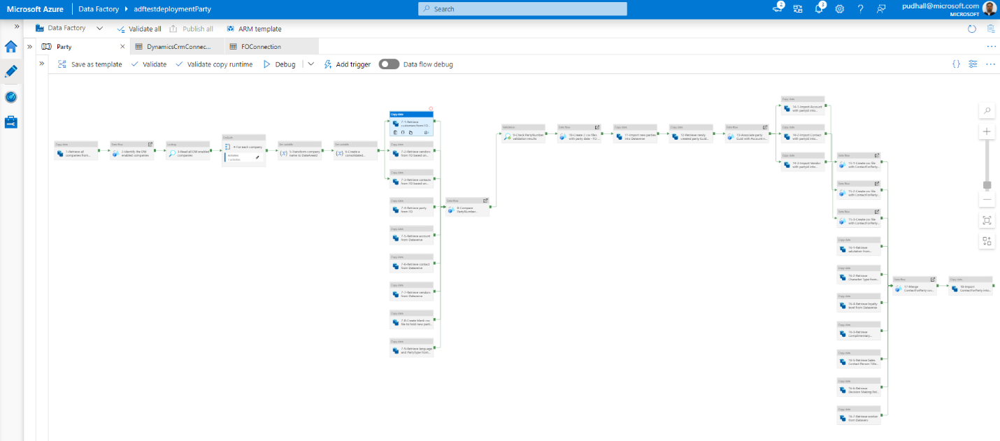
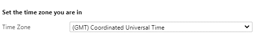
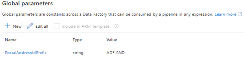
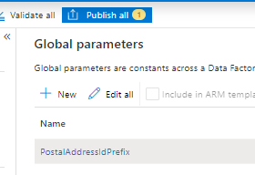
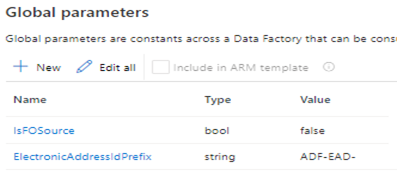
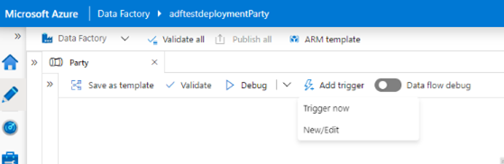
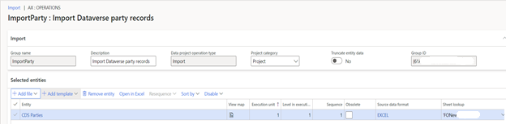
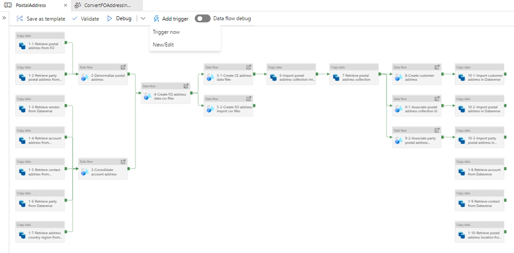
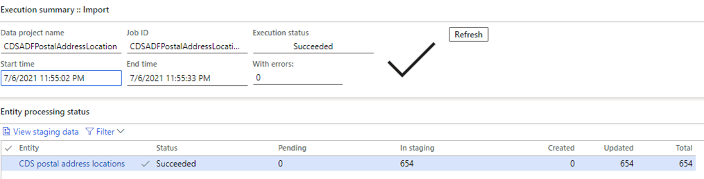
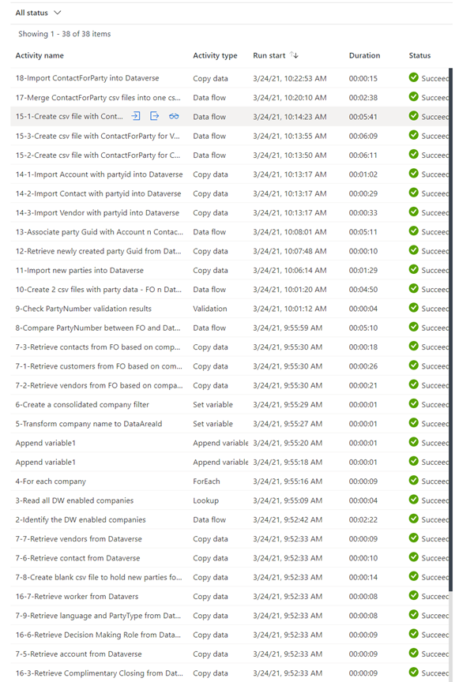

# Upgrade to the party and global address book model

[!include [banner](../../includes/banner.md)]

The [Microsoft Azure Data Factory templates](https://github.com/microsoft/Dynamics-365-FastTrack-Implementation-Assets/tree/master/Dual-write/Upgrade%20data%20to%20dual-write%20Party-GAB%20schema) help you upgrade the following existing data in dual-write to the party and global address book model: data in the **Account**, **Contact**, and **Vendor** tables, and postal and electronic addresses.

The following three Data Factory templates are provided. They help reconcile the data from both finance and operations apps and customer engagement apps.

- **[Party template](https://github.com/microsoft/Dynamics-365-FastTrack-Implementation-Assets/blob/master/Dual-write/Upgrade%20data%20to%20dual-write%20Party-GAB%20schema/arm_template.json) (Upgrade data to dual-write Party-GAB schema/arm_template.json)** – This template helps upgrade **Party** and **Contact** data that is associated with **Account**, **Contact**, and **Vendor** data.
- **[Party postal address template](https://github.com/microsoft/Dynamics-365-FastTrack-Implementation-Assets/blob/master/Dual-write/Upgrade%20data%20to%20dual-write%20Party-GAB%20schema/Upgrade%20to%20Party%20Postal%20Address%20-%20GAB/arm_template.json) (Upgrade data to dual-write Party-GAB schema/Upgrade to Party Postal Address - GAB/arm_template.json)** – This template helps upgrade the postal addresses that are associated with **Account**, **Contact**, and **Vendor** data.
- **[Party electronic address template](https://github.com/microsoft/Dynamics-365-FastTrack-Implementation-Assets/blob/master/Dual-write/Upgrade%20data%20to%20dual-write%20Party-GAB%20schema/Upgrade%20to%20Party%20Electronic%20Address%20-%20GAB/arm_template.json) (Upgrade data to dual-write Party-GAB schema/Upgrade to Party Electronic Address - GAB/arm_template.json)** – This template helps upgrade electronic addresses that are associated with **Account**, **Contact**, and **Vendor** data.

At the end of the process, the following comma-separated values (.csv) files are generated.

| File name | Purpose |
|---|---|
| FONewParty.csv | This file helps create new **Party** records inside the finance and operations app. |
| ImportFONewPostalAddressLocation.csv | This file helps create new **Postal Address Location** records in the finance and operations app. |
| ImportFONewPartyPostalAddress.csv | This file helps create new **Party Postal address** records in the finance and operations app. |
| ImportFONewPostalAddress.csv | This file helps create new **Postal Address** records in the finance and operations app. |
| ImportFONewElectronicAddress.csv | This file helps create new **Electronic Address** records in the finance and operations app. |

This article explains how to use the Data Factory templates and upgrade your data. If you don't have any customizations, you can use the templates as they are. However, if you have customizations for **Account**, **Contact**, and **Vendor** data, you must modify the templates as described in this article.

> [!IMPORTANT]
> There are special instructions for running the Party postal address and Party electronic address templates. You must run the Party template first, then the Party postal address template, and then the Party electronic address template. Each template is designed to import in a separate data factory.

## Prerequisites

The following prerequisites must be in place before you can upgrade to the party and global address book model:

+ You must have an [Azure subscription](https://portal.azure.com/).
+ You must have access to [the templates](https://github.com/microsoft/Dynamics-365-FastTrack-Implementation-Assets/tree/master/Dual-write/Upgrade%20data%20to%20dual-write%20Party-GAB%20schema).
+ You must be an existing dual-write customer.
+ If the party and global address book solution is installed, you must disable the plugin named Microsoft.Dynamics.SCMExtended.Plugins.Plugins.LeadPrimaryContactPostCreate: QualifyLead of lead. To disable the plugin, contact support.
+ You must open a support ticket to enable or disable plugins.  

## Prepare for the upgrade

An upgrade requires the following preparation:

+ **Full synchronization:** Both the Finance and operations environment and the customer engagement environment are in a fully synced state for the **Account (Customer)**, **Contact**, and **Vendor** tables.
+ **Integration keys:** The **Account (Customer)**, **Contact**, and **Vendor** tables in customer engagement apps are using the out-of-box integration keys. If you customized the integration keys, you must customize the template.
+ **Party number:** All **Account (Customer)**, **Contact**, and **Vendor** records that will be upgraded have a party number. Records that don't have a party number will be ignored. If you want to upgrade those records, add a party number to them before you start the upgrade process.
+ **System outage:** During the upgrade process, you will have to take both the Finance and operations environment and the customer engagement environment offline.
+ **Snapshot:** Take a snapshot of both the finance and operations apps and the customer engagement apps. You can then use the snapshots to restore the previous state if you must.

## Deployment

1. Download the templates from [Dynamics-365-FastTrack-Implementation-Assets](https://github.com/microsoft/Dynamics-365-FastTrack-Implementation-Assets/tree/master/Dual-write/Upgrade%20data%20to%20dual-write%20Party-GAB%20schema).
2. Sign in to the [Azure portal](https://portal.azure.com/).
3. Create a [resource group](/azure/azure-resource-manager/management/manage-resource-groups-portal).
4. Create a [storage account](/azure/storage/common/storage-account-create?tabs=azure-portal) in the resource group that you created.
5. Create a [data factory](/azure/data-factory/quickstart-create-data-factory-portal) in the resource group that you created.
6. Open the data factory, and select the **Author & Monitor** tile.
7. On the **Manage** tab, select **ARM template**.
8. Select **Import ARM template** to import the **Party** template.
9. Import the template into the data factory. Enter the following values for **Project details** and **Instance details**.

    | Field | Value |
    |---|---|
    | Subscription | The Azure subscription |
    | Resource group | Provide the same resource that the storage account is created under. |
    | Region | The region |
    | Factory Name | The factory name |
    | FO Linked Service_service Principal Key | The application's key |
    | Azure Blob Storage_connection String | The Azure Blob storage connection string |
    | Dynamics Crm Linked Service_password | The password for the user account that you specify as the user name |
    | FO Linked Service_properties_type Properties_url | `https://sampledynamics.sandbox-operationsdynamics.com/data` |
    | FO Linked Service_properties_type Properties_tenant | Information (domain name or tenant ID) about the tenant that your application resides under |
    | FO Linked Service_properties_type Properties_aad Resource Id | `https://sampledynamics.sandboxoperationsdynamics.com` |
    | FO Linked Service_properties_type Properties_service Principal Id | The application's client ID |
    | Dynamics Crm Linked Service_properties_type Properties_username | The user name that is used to connect to Dynamics 365 |

    For more information, see the following topics:

    - [Manually promote a Resource Manager template for each environment](/azure/data-factory/continuous-integration-deployment#manually-promote-a-resource-manager-template-for-each-environment)
    - [Linked service properties](/azure/data-factory/connector-dynamics-ax#linked-service-properties)
    - [Copy data using Azure Data Factory](/azure/data-factory/connector-dynamics-crm-office-365#dynamics-365-and-dynamics-crm-online)

10. After deployment, validate the datasets, data flow, and linked service of the data factory.

    

11. Go to **Manage**. Under **Connections**, select **Linked Service**. Then select **DynamicsCrmLinkedService**. In the **Edit linked service (Dynamics CRM)** dialog box, enter the following values.

    | Field | Value |
    |---|---|
    | Name | DynamicsCrmLinkedService |
    | Description | Linked services to connect with CRM instance to fetch entities data |
    | Connect via integration runtime | AutoResolvelntegrationRuntime |
    | Deployment type | Online |
    | Service Uri | `https://<organization-name>.crm[x].dynamics.com` |
    | Authentication type | Office365 |
    | User name | |
    | Password or Azure Key Vault | Password |
    | Password | |

## Prepare to run the Data Factory templates

This section describes the setup that is required before you run the Party postal address and Party electronic address Data Factory templates.

### Setup to run the Party postal address template

1. Sign in to customer engagement apps, and go to **Settings** \> **Personalization Settings**. Then, on the **General** tab, configure time zone setting for the system admin account. The time zone must be in Coordinated Universal Time (UTC) to update the "valid from" and "valid to" dates of postal addresses from finance and operations apps.

    

2. In Data Factory, on the **Manage** tab, under **Global parameters**, create the following global parameter.

    | Number | Name | Type | Value |
    |---|---|---|---|
    | 1 | PostalAddressIdPrefix | string | This parameter appends a serial number to newly created postal addresses as a prefix. Be sure to provide a string that doesn't conflict with postal addresses in finance and operations apps and customer engagement apps. For example, use **ADF-PAD-**. |

    

3. When you've finished, select **Publish all**.

    

### Setup to run the Party electronic address template

1. In Data Factory, on the **Manage** tab, under **Global parameters**, create the following global parameters.

    | Number | Name | Type | Value |
    |---|---|---|---|
    | 1 | IsFOSource | bool | This parameter determines which primary system addresses are replaced in the event of conflicts. If the value is **true**, the primary addresses in finance and operations apps will replace the primary addresses in customer engagement apps. If the value is **false**, the primary addresses in customer engagement apps will replace the primary addresses in finance and operations apps. |
    | 2 | ElectronicAddressIdPrefix | string | This parameter appends a serial number to newly created electronic addresses as a prefix. Be sure to provide a string that doesn't conflict with electronic addresses in finance and operations apps and customer engagement apps. For example, use **ADF-EAD-**. |

    

2. When you've finished, select **Publish all**.

## Run the templates

1. Stop the following **Party**, **Account**, **Contact**, and **Vendor** dual-write maps that use finance and operations apps:

    + CDS Parties (msdyn_parties) 
    + Customers V3(accounts)
    + Customers V3(contacts)
    + CDS Contacts V2(contacts)
    + CDS Contacts V2(contacts)
    + Vendor V2 (msdyn_vendor)
    + Contacts V2 (msdyn_contactforparties)
    + CDS Party postal address locations (msdyn_partypostaladdresses)
    + CDS postal address history V2 (msdyn_postaladdresses)
    + CDS postal address locations (msdyn_postaladdresscollections)
    + Party Contacts V3 (msdyn_partyelectronicaddresses)

2. Make sure that the maps are removed from the **msdy_dualwriteruntimeconfig** table in Dataverse.
3. Install [Dual-write Party and Global Address Book Solutions](https://aka.ms/dual-write-gab) from AppSource.
4. In the finance and operations app, run **Initial Sync** for the following tables if they contain data:

    + Salutations
    + Personal character types
    + Complimentary closing
    + Contact person titles
    + Decision making roles
    + Loyalty levels

5. In the customer engagement app, disable the following plugin steps. Contact support to disable the plugin:

    + Account Update

        + Microsoft.Dynamics.GABExtended.Plugins.UpdatePartyAttributesFromAccountEntity: Update of account
        + Microsoft.Dynamics.FinanceExtended.Plugins.TriggerNotesForCustomerTypeCodes: Update of account

    + Contact Update

        + Microsoft.Dynamics.GABExtended.Plugins.UpdatePartyAttributesFromContactEntity: Update of contact
        + Microsoft.Dynamics.FinanceExtended.Plugins.TriggerNotesForSellableContact: Update of contact

    + msdyn_party Update

        + Microsoft.Dynamics.GABExtended.Plugins.UpdatePartyAttributesFromPartyEntity: Update of msdyn_party

    + msdyn_vendor Update

        + Microsoft.Dynamics.GABExtended.Plugins.UpdatePartyAttributesFromVendorEntity: Update of msdyn_vendor

    + Customeraddress

        + Create

            + Microsoft.Dynamics.GABExtended.Plugins.CreatePartyAddress: Create of customeraddress

        + Update

            + Microsoft.Dynamics.GABExtended.Plugins.CreatePartyAddress: Update of customeraddress

        + Delete

            + Microsoft.Dynamics.GABExtended.Plugins.DeleteCustomerAddress: Delete of customeraddress

    + msdyn_partypostaladdress

        + Create

            + Microsoft.Dynamics.GABExtended.Plugins.CreateCustomerAddress: Create of msdyn_partypostaladdress
            + Microsoft.Dynamics.GABExtended.Plugins.PartyPostalAddress: Create of msdyn_partypostaladdress

        + Update

            + Microsoft.Dynamics.GABExtended.Plugins.CreateCustomerAddress: Update of msdyn_partypostaladdress
            + Microsoft.Dynamics.GABExtended.Plugins.PartyPostalAddress: Update of msdyn_partypostaladdress

    + msdyn_postaladdress

        + Create

            + Microsoft.Dynamics.GABExtended.Plugins.PostalAddress: Create of msdyn_postaladdress
            + Microsoft.Dynamics.GABExtended.Plugins.PostalAddressPostCreate: Create of msdyn_postaladdress
            + Microsoft.Dynamics.GABExtended.Plugins.UpdateCustomerAddress: Create of msdyn_postaladdress

        + Update

            + Microsoft.Dynamics.GABExtended.Plugins.PostalAddressUpdate: Update of msdyn_postaladdress
            + Microsoft.Dynamics.GABExtended.Plugins.UpdateCustomerAddress: Update of msdyn_postaladdress

    + msdyn_partyelectronicaddress

        + Create

            + Microsoft.Dynamics.GABExtended.Plugins.PartyElectronicAddressSync: Create of msdyn_partyelectronicaddress

        + Update

            + Microsoft.Dynamics.GABExtended.Plugins.PartyElectronicAddressSync: Update of msdyn_partyelectronicaddress

        + Delete

            + Microsoft.Dynamics.GABExtended.Plugins.DeletePartyElectronicAddressSync: Delete of msdyn_partyelectronicaddress

6. In the customer engagement app, disable the following workflows:

    + Create Vendors in Accounts Table
    + Create Vendors in Accounts Table
    + Create Vendors of type person in Contacts Table
    + Create Vendors of type Person in Vendors Table
    + Update Vendors in Accounts Table
    + Update Vendors in Vendors Table
    + Update Vendors of type Person in Contacts Table
    + Update Vendors of type Person in Vendors Table

7. In the data factory, run the template by selecting **Trigger now** as shown in the following illustration. This process might take a few hours to be completed, depending on the data volume.

    

    > [!NOTE]
    > If you have customizations for **Account**, **Contact**, and **Vendor**, you must modify the template.

8. Import the new **Party** records into the finance and operations app.

    1. Download the **FONewParty.csv** file from Azure Blob storage. The path is **partybootstrapping/output/FONewParty.csv**.
    2. Convert the **FONewParty.csv** file to an Excel file, and import the Excel file into the finance and operations app. Alternatively, if the CSV import works for you, you can import the .csv file directly. This step might take a few hours to be completed, depending on the data volume. For more information, see [Data import and export jobs overview](../data-import-export-job.md).

    

9. In the data factory, run the Party electronic address and then the Party postal address templates, one after the other.

    + The Party postal address template upserts all postal address records in the customer engagement app, and associates them with corresponding **Account**, **Contact**, and **Vendor** records. It also generates three .csv files: ImportFONewPostalAddressLocation.csv, ImportFONewPartyPostalAddress.csv, and ImportFONewPostalAddress.csv.
    + The Party electronic address template upserts all electronic addresses in the customer engagement app, and associates them with corresponding **Account**, **Contact**, and **Vendor** records. It also generates one .csv file: ImportFONewElectronicAddress.csv.

    

10. To update the finance and operations app with this data, you must convert the .csv files into an Excel workbook and [import it into the finance and operations app](../data-import-export-job.md). Alternatively, if the CSV import works for you, you can import the .csv files directly. This step might take a few hours to be completed, depending on the volume.

    

11. In the customer engagement app, enable the following plugin steps. Contact support to enable plugins:

    + Account Update

        + Microsoft.Dynamics.GABExtended.Plugins.UpdatePartyAttributesFromAccountEntity: Update of account
        + Microsoft.Dynamics.FinanceExtended.Plugins.TriggerNotesForCustomerTypeCodes: Update of account

    + Contact Update

        + Microsoft.Dynamics.GABExtended.Plugins.UpdatePartyAttributesFromContactEntity: Update of contact
        + Microsoft.Dynamics.FinanceExtended.Plugins.TriggerNotesForSellableContact: Update of contact

    + msdyn_party Update

        + Microsoft.Dynamics.GABExtended.Plugins.UpdatePartyAttributesFromPartyEntity: Update of msdyn_party

    + msdyn_vendor Update

        + Microsoft.Dynamics.GABExtended.Plugins.UpdatePartyAttributesFromVendorEntity: Update of msdyn_vendor

    + msdyn_partypostaladdress

        + Create

            + Microsoft.Dynamics.GABExtended.Plugins.CreateCustomerAddress: Create of msdyn_partypostaladdress
            + Microsoft.Dynamics.GABExtended.Plugins.PartyPostalAddress: Create of msdyn_partypostaladdress

        + Update

            + Microsoft.Dynamics.GABExtended.Plugins.CreateCustomerAddress: Update of msdyn_partypostaladdress
            + Microsoft.Dynamics.GABExtended.Plugins.PartyPostalAddress: Update of msdyn_partypostaladdress

    + msdyn_postaladdress

        + Create

            + Microsoft.Dynamics.GABExtended.Plugins.PostalAddress: Create of msdyn_postaladdress
            + Microsoft.Dynamics.GABExtended.Plugins.PostalAddressPostCreate: Create of msdyn_postaladdress
            + Microsoft.Dynamics.GABExtended.Plugins.UpdateCustomerAddress: Create of msdyn_postaladdress

        + Update

            + Microsoft.Dynamics.GABExtended.Plugins.PostalAddressUpdate: Update of msdyn_postaladdress
            + Microsoft.Dynamics.GABExtended.Plugins.UpdateCustomerAddress: Update of msdyn_postaladdress
 
    + msdyn_partyelectronicaddress

        + Create

            + Microsoft.Dynamics.GABExtended.Plugins.PartyElectronicAddressSync: Create of msdyn_partyelectronicaddress

        + Update

            + Microsoft.Dynamics.GABExtended.Plugins.PartyElectronicAddressSync: Update of msdyn_partyelectronicaddress

        + Delete

            + Microsoft.Dynamics.GABExtended.Plugins.DeletePartyElectronicAddressSync: Delete of msdyn_partyelectronicaddress

12. In the customer engagement app, activate the following workflows if you previously inactivated them:

    + Create Vendors in Accounts Table
    + Create Vendors in Accounts Table
    + Create Vendors of type person in Contacts Table
    + Create Vendors of type Person in Vendors Table
    + Update Vendors in Accounts Table
    + Update Vendors in Vendors Table
    + Update Vendors of type Person in Contacts Table
    + Update Vendors of type Person in Vendors Table

13. Run the **Party** record–related maps as described in [Party and global address book](party-gab.md).

## Explanation of the Data Factory templates

This section takes you through the steps in each Data Factory template.

### Steps in the Party template

1. Steps 1 through 6 identify the companies that are enabled for dual-write and builds a filter clause for them.
2. Steps 7-1 through 7-9 retrieve data from both the finance and operations app and the customer engagement app, and stage that data for upgrade.
3. Steps 8 through 9 compare the party number for **Account**, **Contact**, and **Vendor** records between the finance and operations app and the customer engagement app. Any records that don't have a party number are skipped.
4. Step 10 generates two .csv file for the party records that must be created in the customer engagement app and the finance and operations app.

    - **FOCDSParty.csv** – This file contains all party records of both systems, regardless of whether the company is enabled for dual-write.
    - **FONewParty.csv** – This file contains a subset of the party records that Dataverse is aware of (for example, accounts of the **Prospect** type).

5. Step 11 creates the parties in the customer engagement app.
6. Step 12 retrieves the globally unique identifiers (GUIDs) of the parties from the customer engagement app and stages them so that they can be associated with **Account**, **Contact**, and **Vendor** records in subsequent steps.
7. Step 13 associates the **Account**, **Contact**, and **Vendor** records with party GUIDs.
8. Steps 14-1 through 14-3 update the **Account**, **Contact**, and **Vendor** records in the customer engagement app with party GUIDs.
9. Steps 15-1 through 15-3 prepare **Contact for Party** records for **Account**, **Contact**, and **Vendor** records.
10. Steps 16-1 through 16-7 retrieve reference data such as salutations and personal character types, and associate it with **Contact for Party** records.
11. Step 17 merges the **Contact for Party** records for **Account**, **Contact**, and **Vendor** records.
12. Step 18 imports the **Contact for Party** records into the customer engagement app.

### Steps in the Party postal address template

1. Steps 1-1 through 1-10 retrieve data from both the finance and operations app and the customer engagement app, and stage that data for upgrade.
2. Step 2 de-normalizes the postal address data in the finance and operations app by joining the postal address and the party postal address.
3. Step 3 de-duplicates and merges account, contact, and vendor address data from the customer engagement app.
4. Step 4 creates .csv files for the finance and operations app to create new address data that is based on account, contact, and vendor addresses.
5. Step 5-1 creates .csv files for the customer engagement app to create all address data, based on both the finance and operations app and the customer engagement app.
6. Step 5-2 converts the .csv files into the finance and operations import format for manual import.

    - ImportFONewPostalAddressLocation.csv
    - ImportFONewPartyPostalAddress.csv
    - ImportFONewPostalAddress.csv

7. Step 6 imports the postal address collection data into the customer engagement app.
8. Steps 7 retrieves the postal address collection data from the customer engagement app.
9. Step 8 creates customer address data and associates a postal address collection ID.
10. Steps 9-1 through 9-2 associate party and postal address collection IDs with postal addresses and party postal addresses.
11. Steps 10-1 through 10-3 import customer addresses, postal addresses, and party postal addresses into the customer engagement app.

### Steps in the Party electronic address template

1. Steps 1-1 through 1-5 retrieve data from both the finance and operations app and the customer engagement app, and stage that data for upgrade.
2. Step 2 consolidates electronic addresses in the customer engagement app from account, contact, and vendor entities.
3. Step 3 merges primary electronic address data from the customer engagement app and the finance and operations app.
4. Step 4 creates .csv files.

    - Create new electronic address data for the finance and operations app, based on account, contact, and vendor addresses.
    - Create new electronic address data for the customer engagement app, based on electronic address, account, contact and vendor addresses in the finance and operations app.

5. Step 5-1 imports electronic addresses into the customer engagement app.
6. Step 5-2 creates .csv files to update primary addresses for accounts and contacts in the customer engagement app.
7. Steps 6-1 through 6-2 import accounts and contact primary addresses into the customer engagement app.

## Troubleshooting

1. If the process fails, rerun the data factory. Start from the failed activity.
2. Some files that are generated by the data factory can be used for data validation.
3. The data factory runs based on .csv files. Therefore, if a comma is included in any field value, it might interfere with the results. You must remove all commas from field values.
4. The **Monitoring** tab provides information about all steps and data that have been processed. Select a specific step to debug it.

    

## Learn more about the template

For more information about the template, see [Comments for Azure Data Factory template readme](https://github.com/microsoft/Dynamics-365-FastTrack-Implementation-Assets/blob/master/Dual-write/Upgrade%20data%20to%20dual-write%20Party-GAB%20schema/readme.md).

