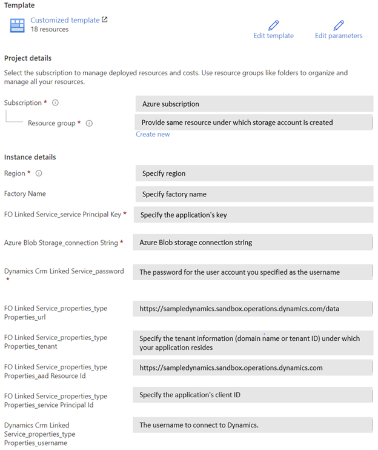
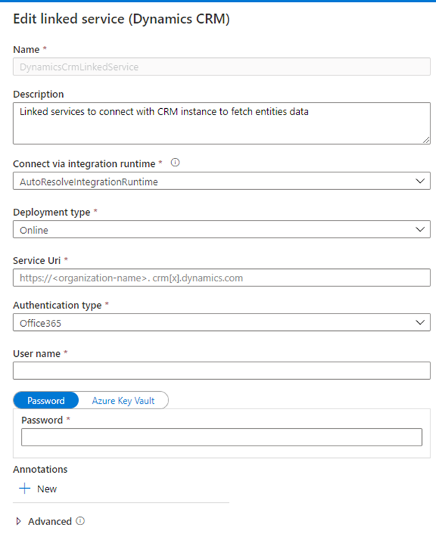
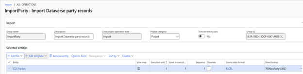

# Upgrade your dual-write data to "Party and Global Address Book" model

[!include [banner](../../includes/banner.md)]

[!include [rename-banner](~/includes/cc-data-platform-banner.md)]

For the existing dual-write customers, the [Upgrade to Party-GAB](https://www.yammer.com/dynamicsaxfeedbackprograms/#/files/951898316800) ADF template helps to upgrade the Account, Contact and Vendor data from pre-Party data model to Party-GAB model. It includes 38 steps in total to reconcile the data from both Finance and Operations applications and Customer Engagement applications. At the end of the process, Party and Contact for Party records will be created and associated with Account, Contact and Vendor records in and Customer Engagement applications. A csv file (FONewParty.csv) is generated to create new Party records inside Finance and Operations. Right now, you need to manually import this csv file into Finance and Operations. However, we are exploring options to automate it end to end.  
This pages provides step by step instructions to use the ADF template and upgrade your data.  

"Upgrade to Party-GAB" ADF template is a working template. If you don’t have any customizations, you can consume this template as-is. In case you have customizations around Account, Contact and Vendor then you need to modify the template to cater to your customizations and use it as instructed below. 

>[!Note] Scope: At present, the template helps to upgrade only the Party data. This will be expanded to include postal and electronic addresses. But the work is currently in progress. Once it is available, it will be added to the zip file. 

## Prerequisites 

1. [Azure subscription](https://portal.azure.com/) 

2. [Access to Upgrade to Party-GAB template](https://www.yammer.com/dynamicsaxfeedbackprograms/#/files/951898316800) 

  
## Assumptions and Recommendations  

1. You are an existing dual-write customer. 

2. Both systems are in fully synced state for Account(Customer), Contact and Vendor. 

3. Account(Customer), Contact and Vendor entities on Customer Engagement applications are using the integration keys we shipped out-of-the-box. If not, you need to customize the ADF Party template we have provided you. 

4. All Account (Customer), Contact and Vendor records that require upgrade has a party number. In case party number is missing, those will be ignored. If you want to upgrade them as well, then you need to add it before proceeding further.  

5. This upgrade needs a system outage for both Finance and Operations applications and Customer Engagement applications. So, make sure no one is using the system until the upgrade is complete. 

6. Take snapshot of both systems Finance and Operations applications and Customer Engagement applications to restore back to previous state if needed. 

  
## Deployment Steps

1. Download the ARM template from [here](https://www.yammer.com/dynamicsaxfeedbackprograms/#/files/951898316800).   

2. Sign in to the [Azure portal](https://portal.azure.com/). 

3. Create a  [Resource group](https://docs.microsoft.com/en-us/azure/azure-resource-manager/management/manage-resource-groups-portal). 

4. Create a [Storage account](https://docs.microsoft.com/en-us/azure/storage/common/storage-account-create?tabs=azure-portal) in the above resource group.  

5. Create a [Data factory](https://docs.microsoft.com/en-us/azure/data-factory/quickstart-create-data-factory-portal) in above resource group.  

6. Open the data factory and click on "Author & Monitor" tile shown below. 

    

7. Go to Manage tab and click on "ARM template" from the left panel. 
  
8. Click on Import ARM template to import the party template. 

   

9. [Import ARM template](https://docs.microsoft.com/en-us/azure/data-factory/continuous-integration-deployment#manually-promote-a-resource-manager-template-for-each-environment) into the data factory. During import, a settings section appears as shown below. Enter the configuration values. For more guidance, please follow [FO Linked Service Configuration](https://docs.microsoft.com/en-us/azure/data-factory/connector-dynamics-ax#linked-service-properties) and [CRM Linked Service Configuration](https://docs.microsoft.com/en-us/azure/data-factory/connector-dynamics-crm-office-365#dynamics-365-and-dynamics-crm-online). 

   

10. After deployment, validate the Datasets, Data flow and Linked Service.  

   

11. Go to Manage. Under "Connections" you will see "Linked Service" menu. When you click on it, you will see "DynamicsCrmLinkedService" item. When you click on it, you will find "Edit Linked Service" form sliding from the right.  You need to provide the Service URI as shown below. 

    

  
## Run the Data Factory with “Upgrade to Party-GAB” Template 

1. Stop the following Account, Contact and Vendor dual-write maps inside Finance and Operations. 

    + Customers V3(accounts) 

    + Customers V3(contacts) 

    + CDS Contacts V2(contacts) 

    + CDS Contacts V2(contacts) 

    + Vendor V2 (msdyn_vendor) 

2. Make sure the above 5 maps are removed from the "msdy_dualwriteruntimeconfig" entity in Dataverse. 

3. Install [dual-write Party & Global Address Book solution](https://aka.ms/dual-write-gap) from Appsource.

4. In Finance and Operations, if the following tables contain data, then please run "Initial Sync" for them. Otherwise, you can skip this step.  

    + Salutations 

    + Personal character types 

    + Complimentary closing 

    + Contact person titles 

    + Decision making roles 

    + Loyalty levels 

5. In Customer Engagement applications, disable the following plugin steps. 

    + Account Update  

         + Microsoft.Dynamics.GABExtended.Plugins.UpdatePartyAttributesFromAccountEntity: Update of account
         
         + Microsoft.Dynamics.FinanceExtended.Plugins.TriggerNotesForCustomerTypeCodes: Update of account 

    + Contact Update  

         + Microsoft.Dynamics.GABExtended.Plugins.UpdatePartyAttributesFromContactEntity: Update of contact 

         + Microsoft.Dynamics.FinanceExtended.Plugins.TriggerNotesForSellableContact: Update of contact 

    + msdyn_party Update 

         + Microsoft.Dynamics.GABExtended.Plugins.UpdatePartyAttributesFromPartyEntity: Update of msdyn_party 

    + msdyn_vendor Update  

         + Microsoft.Dynamics.GABExtended.Plugins.UpdatePartyAttributesFromVendorEntity: Update of msdyn_vendor 

6. In CE, disable the following workflows: 

    + Create Vendors in Accounts Table 		 

    + Create Vendors in Accounts Table 		 

    + Create Vendors of type person in Contacts Table 		 

    + Create Vendors of type Person in Vendors Table 		 

    + Update Vendors in Accounts Table 		 

    + Update Vendors in Vendors Table 		 

    + Update Vendors of type Person in Contacts Table 		 

    + Update Vendors of type Person in Vendors Table 

7. Now, go to your Data Factory and run the "Upgrade to Party- GAB" template by clicking on "Trigger now" as shown below. This may take few hours to complete based on the volume. [Note: In case you have customizations around Account, Contact and Vendor, then you need to add those customizations to the given template before running.] 

    

8. Import new party records in Finance and Operations 

    + Download FONewParty.csv file from Azure blob storage - (Path: partybootstrapping/output/FONewParty.csv) 

    + Convert the FONewParty.csv file into an Excel and [import it into Finance and Operations](https://docs.microsoft.com/en-us/dynamics365/fin-ops-core/dev-itpro/data-entities/data-import-export-job). In case CSV import works for you, you can import CSV file directly. This step could take few hours to complete depending on the volume. 

    

9. Now in Customer Engagement applications, enable the following plugin steps  

    + Account Update  

         + Microsoft.Dynamics.GABExtended.Plugins.UpdatePartyAttributesFromAccountEntity: Update of account 

         + Microsoft.Dynamics.FinanceExtended.Plugins.TriggerNotesForCustomerTypeCodes: Update of account 

    + Contact Update  

         + Microsoft.Dynamics.GABExtended.Plugins.UpdatePartyAttributesFromContactEntity: Update of contact 

         + Microsoft.Dynamics.FinanceExtended.Plugins.TriggerNotesForSellableContact: Update of contact 

    + msdyn_party Update 

         + Microsoft.Dynamics.GABExtended.Plugins.UpdatePartyAttributesFromPartyEntity: Update of msdyn_party 

    + msdyn_vendor Update  

         + Microsoft.Dynamics.GABExtended.Plugins.UpdatePartyAttributesFromVendorEntity: Update of msdyn_vendor 

10. Now in CE, activate the following workflows if deactivated in above steps: 

    + Create Vendors in Accounts Table 		 

    + Create Vendors in Accounts Table 		 

    + Create Vendors of type person in Contacts Table 		 

    + Create Vendors of type Person in Vendors Table 		 

    + Update Vendors in Accounts Table 		 

    + Update Vendors in Vendors Table 		 

    + Update Vendors of type Person in Contacts Table 		 

    + Update Vendors of type Person in Vendors Table 

11. Run Party related maps as instructed [here](party-gab.md). 

## Tips for troubleshooting the ADF execution: 

1. In case of failure, re-run data factory from failed activity. 

2. Few files get generated by the ADF which could be used for data validation purpose.  

3. “Monitoring” tab provide information about all steps and data processed by ADF, click on the specific step to debug. 

    
    

## Learn more about the "Upgrade to Party-GAB" template  

  + Steps 1 to 6 identifies the companies that are enabled for dual-write and builds a filter clause for them. 

  + Steps  7-1 to 7-9 retrieves the data from both Finance and Operations and Customer Engagement applications and stage the data for upgrade.   

  + Steps 8 to 9 compare the party number for Account, Contact and Vendor between Finance and Operations and Customer Engagement applications. The records that doesn’t have party number are skipped here. 

  + Step 10 generate 2 csv file for party records to create in Customer Engagement applications and Finance and Operations applications. 

  + FOCDSParty.csv contains all party records of both systems irrespective of company enabled for dual write 

  + FONewParty.csv contains subset of the party which Dataverse is aware of e.g. account of type prospect. 

  + Step 11 creates the Parties in Customer Engagement applications. 

  + Step 12 retrieves the Party guids from Customer Engagement applications and stage it for associating with Account, Contact and Vendor records in the subsequent steps.  

  + Step 13 associates the Account, Contact and Vendor records with Party guid. 

  + Steps 14-1 to 14-3 updates the Account, Contact and Vendor records in Customer Engagement applications with Party guid.  

  + Steps 15-1 to 15-3 prepare "Contact for Party" records for Account, Contact and Vendor. 

  + Steps 16-1 to 16-7 retrieves the reference data like salutations, personal character types etc. and associate them with "Contact for Party" records. 

  + Step 17 merges the "Contact for Party" records for Account, Contact and Vendor. 

  + Step 18 Import "Contact for Party" records into Customer Engagement applications. 

 
