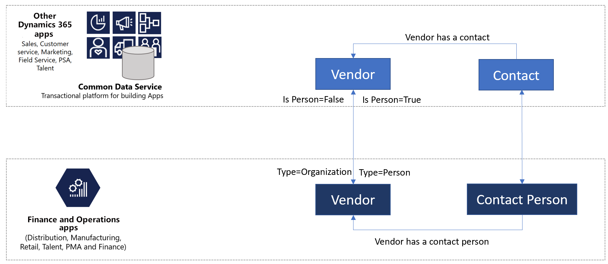
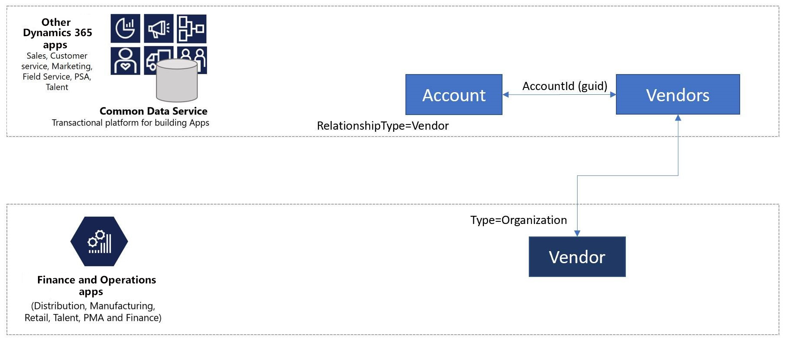

# Integrated vendor master

[!include [banner](../../includes/banner.md)]

The term *vendor* refers to a supplier organization, or a sole proprietor who supplies goods or services to a business. Although *vendor* is an established concept in Microsoft Dynamics 365 Supply Chain Management, no vendor concept exists in customer engagement apps. However, you can overload the **Account/Contact** table to store vendor information. The integrated vendor master introduces an explicit vendor concept in customer engagement apps. You can either use the new vendor design or store vendor data in the **Account/Contact** table. Dual-write supports both approaches.

In both approaches, the vendor data is integrated between Dynamics 365 Supply Chain Management, Dynamics 365 Sales, Dynamics 365 Field Service, and Power Apps portals. In Supply Chain Management, the data is available for workflows such as purchase requisitions and purchase orders.

## Vendor data flow

If you don't want to store vendor data in the **Account/Contact** table in Dataverse, you can use the new vendor design.

If you want to continue to store vendor data in the **Account/Contact** table, you can use the extended vendor design. To use the extended vendor design, you must configure the vendor workflows in the dual-write solution package. For more information, see [Switch between vendor designs](../../../fin-ops/data-entities/vendor-switch.md).

> [!TIP]
> If you're using Power Apps portals for self-service vendors, the vendor information can flow directly to finance and operations apps.

## Templates

Vendor data includes all information about the vendor, such as the vendor group, addresses, contact information, payment profile, and invoice profile. A collection of table maps work together during vendor data interaction, as shown in the following table.

Finance and operations apps | Customer engagement apps     | Description
----------------------------|-----------------------------|------------
[CDS Contacts V2](mapping-reference.md#115) | contacts | This template synchronizes all primary, secondary, and tertiary contact information, for both customers and vendors.
[Name affixes](mapping-reference.md#155) | msdyn_nameaffixes | This template synchronizes name affixes reference data, for both customers and vendors.
[Payment day lines CDS V2](mapping-reference.md#157) | msdyn_paymentdaylines | This template synchronizes payment day lines reference data, for both customers and vendors.
[Payment days CDS](mapping-reference.md#158) | msdyn_paymentdays | This template synchronizes payment days reference data, for both customers and vendors.
[Payment schedule lines](mapping-reference.md#159) | msdyn_paymentschedulelines | Syncs payment schedule lines reference data, for both customers and vendors.
[Payment schedule](mapping-reference.md#160) | msdyn_paymentschedules | This template synchronizes payment schedule reference data, for both customers and vendors.
[Terms of payment](mapping-reference.md#161) | msdyn_paymentterms | This template synchronizes payment terms (terms of payment) reference data, for both customers and vendors.
[Vendors V2](mapping-reference.md#202) | msdyn_vendors | Businesses that use a custom solution for vendors can take advantage of the out-of-box vendor concept that is being introduced in Dataverse because of finance and operations apps integration.
[Vendor groups](mapping-reference.md#200) | msdyn_vendorgroups | This template synchronizes vendor group information.
[Vendor payment method](mapping-reference.md#201) | msdyn_vendorpaymentmethods | This template synchronizes vendor payment method information.

[!INCLUDE[footer-include](../../../../includes/footer-banner.md)]

