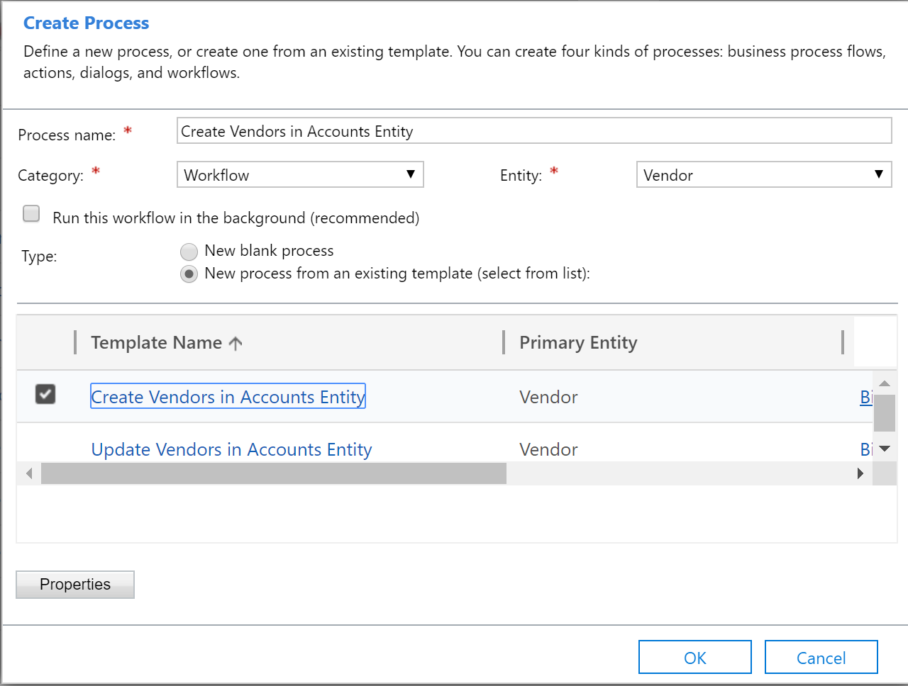
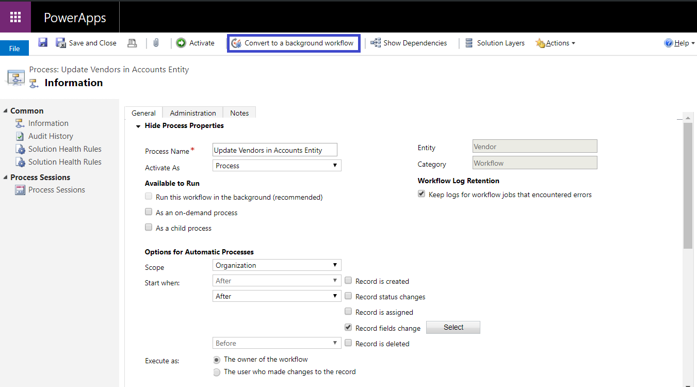

# Switch between vendor designs

[!include [banner](../../includes/banner.md)]

## Vendor data flow 

If you choose to use the **Account** table to store vendors of the **Organization** type and the **Contact** table to store vendors of the **Person** type, configure the following workflows. Otherwise, this configuration isn't required.

## Use the extended vendor design for vendors of the Organization type

The **Dynamics365FinanceExtended** solution package contains the following workflow process templates. You will create a workflow for each template.

+ Create Vendors in Accounts Table
+ Create Vendors in Vendors Table
+ Update Vendors in Accounts Table
+ Update Vendors in Vendors Table

To create new workflow processes by using the workflow process templates, follow these steps.

1. Create a workflow process for the **Vendor** table, and select the **Create Vendors in Accounts Table** workflow process template. Then select **OK**. This workflow handles the vendor creation scenario for the **Account** table.

    

2. Create a workflow process for the **Vendor** table, and select the **Update Vendors in Accounts Table** workflow process template. Then select **OK**. This workflow handles the vendor update scenario for the **Account** table.
3. Create a workflow process for the **Account** table, and select the **Create Vendors in Vendors Table** workflow process template.
4. Create a workflow process for the **Account** table, and select the **Update Vendors in Vendors Table** workflow process template.
5. You can configure the workflows as either real-time workflows or background workflows, depending on your requirements. To configure a workflow as a background workflow, select **Convert to a background workflow**.

    

6. Activate the workflows that you created for the **Account** and **Vendor** tables to start to use the **Account** table to store information for vendors of the **Organization** type.

## Use the extended vendor design for vendors of the Person type

The **Dynamics365FinanceExtended** solution package contains the following workflow process templates. You will create a workflow for each template.

+ Create Vendors of type Person in Vendors Table
+ Create Vendors of type Person in Contacts Table
+ Update Vendors of type Person in Contacts Table
+ Update Vendors of type Person in Vendors Table

To create new workflow processes by using the workflow process templates, follow these steps.

1. Create a workflow process for the **Vendor** table, and select the **Create Vendors of type Person in Contacts Table** workflow process template. Then select **OK**. This workflow handles the vendor creation scenario for the **Contact** table.
2. Create a workflow process for the **Vendor** table, and select the **Update Vendors of type Person in Contacts Table** workflow process template. Then select **OK**. This workflow handles the vendor update scenario for the **Contact** table.
3. Create a workflow process for the **Contact** table, and select the **Create Vendors of type Person in Vendors Table** template.
4. Create a workflow process for the **Contact** table, and select the **Update Vendors of type Person in Vendors Table** template.
5. You can configure the workflows as either real-time workflows or background workflows, depending on your requirements. To configure a workflow as a background workflow, select **Convert to a background workflow**.
6. Activate the workflows that you created on the **Contact** and **Vendor** tables to start to use the **Contact** table to store information for vendors of the **Person** type.

[!INCLUDE[footer-include](../../../../includes/footer-banner.md)]