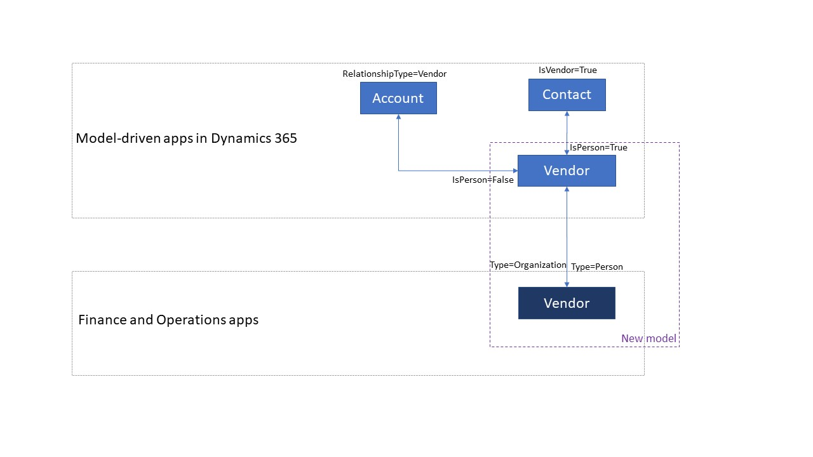

---
# required metadata

title: Switch between vendor designs
description: This topic describes how to switch between vendor data integration between Finance and Operations apps and Common Data Service.
author: RamaKrishnamoorthy 
manager: AnnBe
ms.date: 09/20/2019
ms.topic: article
ms.prod: 
ms.service: dynamics-ax-applications
ms.technology: 

# optional metadata

ms.search.form: 
# ROBOTS: 
audience: Application User, IT Pro
# ms.devlang: 
ms.reviewer: rhaertle
ms.search.scope: Core, Operations
# ms.tgt_pltfrm: 
ms.custom: 
ms.assetid: 
ms.search.region: global
ms.search.industry: 
ms.author: ramasri
ms.dyn365.ops.version: 
ms.search.validFrom: 2019-09-20

---

# Switch between vendor designs

[!include [banner](../../includes/banner.md)]

[!include [preview-banner](../../includes/preview-banner.md)]

## Vendor data flow 

If you use other Dynamics 365 apps for vendor mastering and you want to isolate vendor information from customers, use this basic vendor design.  

 
If you use other Dynamics 365 apps for vendor mastering and you want to continue to use the **Account** entity for storing vendor information, use this extended vendor design. In this design, extended vendor information like vendor on-hold status and vendor profile is stored in the **vendors** entity in Common Data Service. 

 
Follow the below steps to use the extended vendor design: 
 
1. The **SupplyChainCommon** solution package contains the workflow process templates as shown in the following image.
    > [!div class="mx-imgBorder"]
    > 
2. Create new workflow processes using the workflow process templates: 
    1. Create a new workflow process for the **Vendor** entity using the **Create Vendors in Account Entity** workflow process template and click **OK**. This workflow handles the vendor creation scenario for the **Account** entity.
        > [!div class="mx-imgBorder"]
        > 
    2. Create a new workflow process for the **Vendor** entity using the **Update Accounts Entity** workflow process template and click **OK**. This workflow handles the vendor update scenario for the **Account** entity. 
        > [!div class="mx-imgBorder"]
        > 
    3. Create new workflow processes from the templates created on the **Accounts** entity. 
        > [!div class="mx-imgBorder"]
        > 
        > [!div class="mx-imgBorder"]
        > 
    4. You can configure the workflows as real-time or background workflows based on your requirements. 
        > [!div class="mx-imgBorder"]
        > 
    5. Activate the workflows that you created on the **Account** and **Vendor** entities to start using the **Account** entity for storing vendor information. 
 
