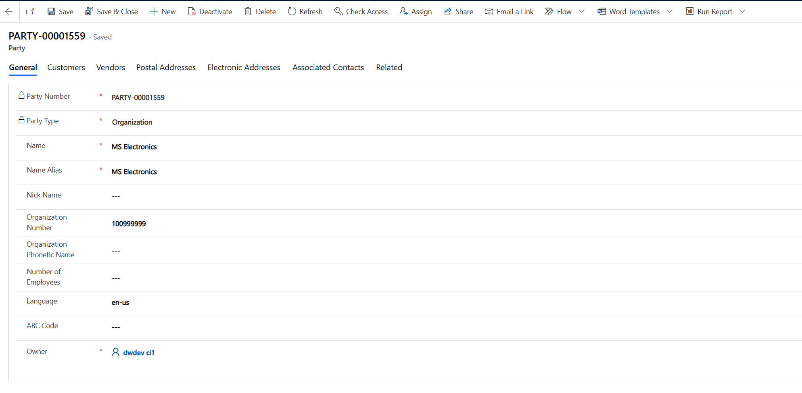
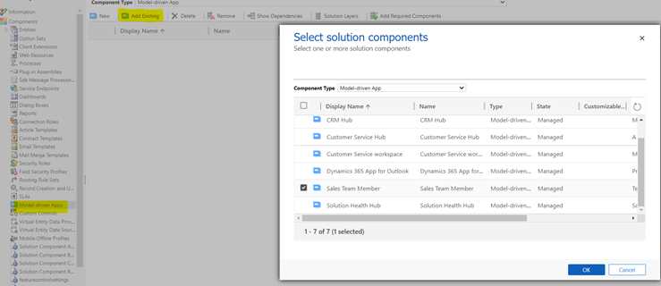
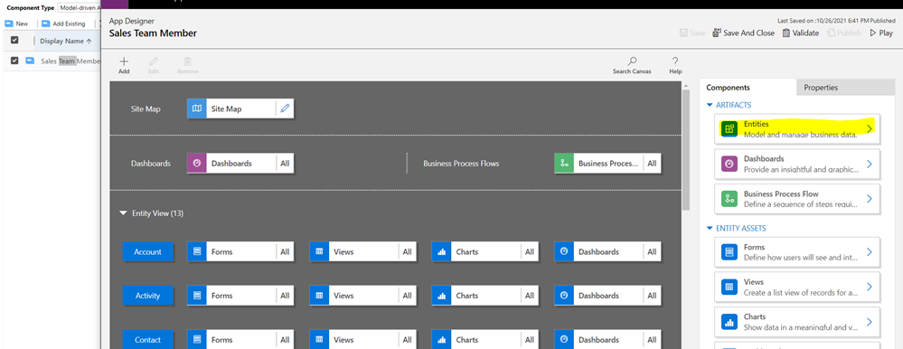
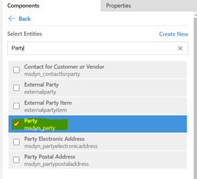
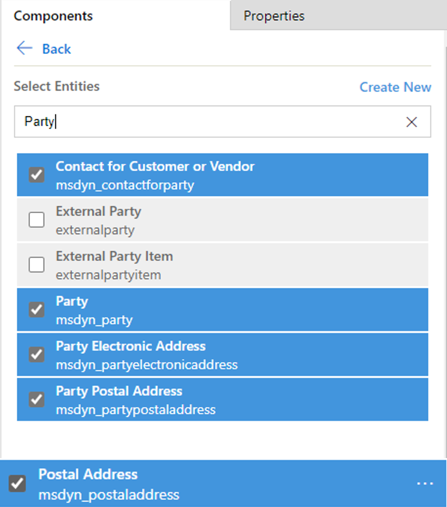
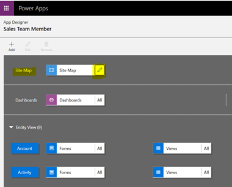
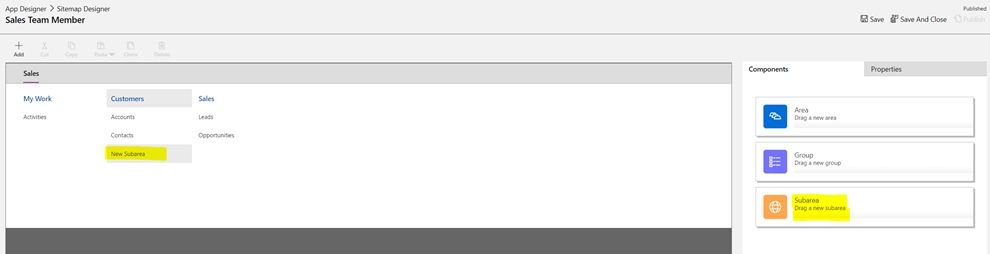
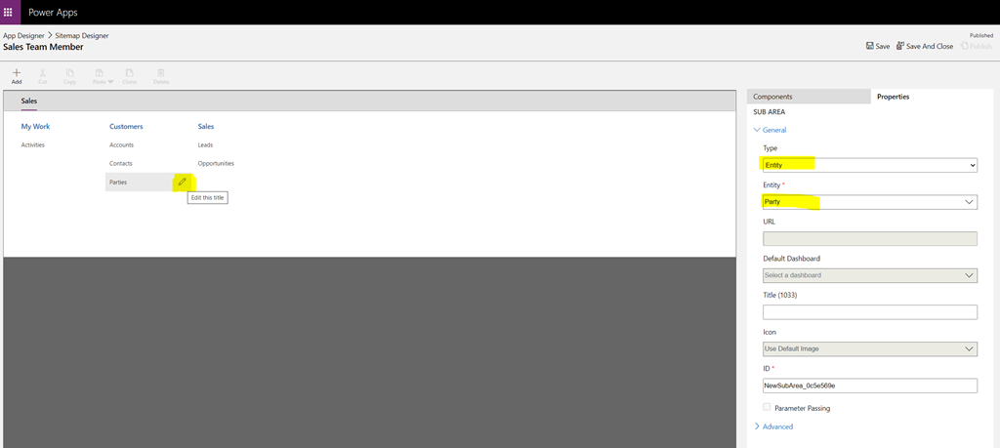
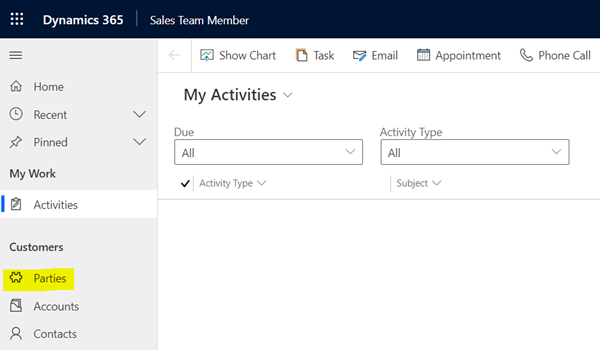

# View party data

[!include [banner](../../includes/banner.md)]

[!include [rename-banner](~/includes/cc-data-platform-banner.md)]

Like account and contact data, party data can be accessed through a user interface (UI). The dual-write party and global address book solution version 3.3.0.5 provides a **Party** page where you can view, create, and manage party records together with all their associated customers, vendors, and contacts, and their postal and electronic addresses.

On the **Party** page, you can create a new party of the **Person** or **Organization** type.

The following illustration shows a party of the **Organization** type on the **General** tab.

After a party is created, you can use the tabs on the **Party** page to manage it.

## Customers and Vendors tabs

The **Customers** tab lets you create and manage one or more customers from the party for different companies. If the party type is **Person**, you can create and manage customers of the **Person** type. These customers are known as *contacts*. If the party type is **Organization**, you can create and manage customers of the **Organization** type. These customers are known as *accounts*. 

The **Vendors** tab resembles the **Customers** tab, but it's used to create vendors of the **Person** or **Organization** type.

## Postal Addresses and Electronic Addresses tabs

The **Postal Addresses** tab lets you create and manage one or more postal addresses for the party. You can create as many postal addresses as the party requires. These addresses appear on the quotation and sales order pages.

The **Electronic Addresses** tab lets you create and manage one or more electronic addresses for the party. You can create as many electronic addresses as the party requires.

## Associated Contacts tab

The **Associated Contacts** tab lets you create contact persons (**Contact for party** records) and associate them with the party.

## Add the Party page to your app

You can add the **Party** page to your app by using site maps.

1. In your custom solution, under the **Components** node, find and select the **Model-driven Apps** node. Then select **Add Existing**.
2. In the **Select Solution Components** dialog box, find and select the app that should include the Party entity or other entities that have been created as part of dual-write solutions. In this example, you're updating the Sales Team Member app so that it includes the Party entity.

    

3. Open the app.
4. In App Designer, on the **Components** tab on the right, under **Artifacts**, select **Entities**.

    

5. Find and select the **Party** (**msdyn_party**) entity.

    

6. Select **Save**.

7. Now select the entities **msdyn_partyelectronicaddress**, **msdyn_vendor**, **msdyn_postaladdress** and **msdyn_contactforparty**, so that the quick create forms for these tables are available on the parties form.

    

8. Select **Save**.

9. In the main part of the page, in the **Site Map** section, select the **Edit** button (pencil symbol) on the **Site Map** tile.

    

10. In Sitemap Designer, drag **Subarea** from the **Components** tab on the right to the section on the left that you have to customize. In this example, you're adding add the new subarea to the **Customers** section.

    

11. Select the **Edit** button (pencil symbol) next to the new subarea. Then, on the **Properties** tab on the right, set the **Type** field to **Entity** and the **Entity** field to **Party**.

    

12. Select **Save** and then **Publish** to make the **Party** entity available in the app.

    
