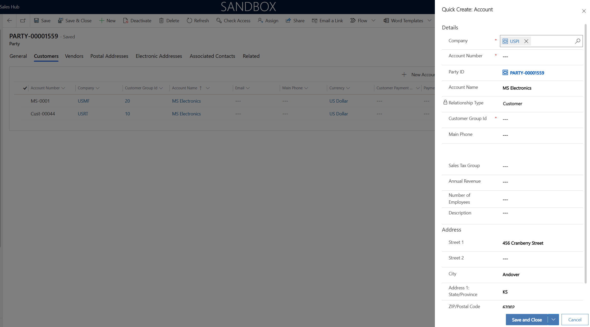
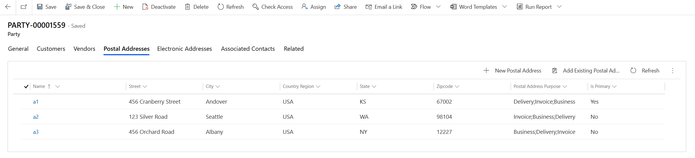
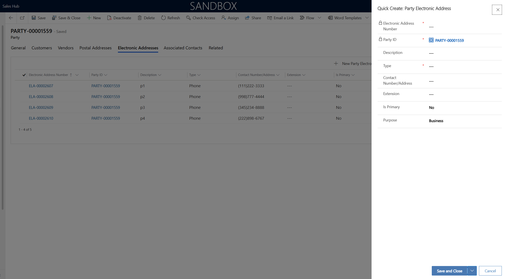
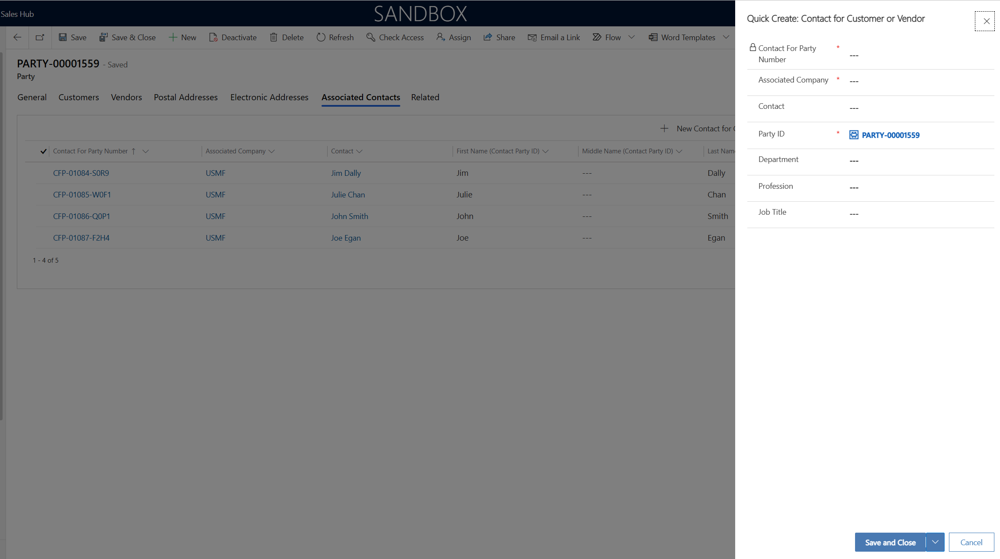

# View party data

[!include [banner](../../includes/banner.md)]

Like account and contact data, you can access party data through a user interface (UI). The dual-write party and global address book solution version 3.3.0.5 provides a **Party** page where you can view, create, and manage party records together with all their associated customers, vendors, and contacts, and their postal and electronic addresses.

On the **Party** page, you can create a new party of the **Person** or **Organization** type.

The following illustration shows a party of the **Organization** type on the **General** tab.

:::image type="content" source="media/ViewParty_Image1.PNG" alt-text="Screenshot of a party of the Organization type.":::

After you create a party, use the tabs on the **Party** page to manage it.

## Customers and Vendors tabs

The **Customers** tab lets you create and manage one or more customers from the party for different companies. If the party type is **Person**, you can create and manage customers of the **Person** type. These customers are known as *contacts*. If the party type is **Organization**, you can create and manage customers of the **Organization** type. These customers are known as *accounts*.

:::image type="content" source="media/ViewParty_Image2.PNG" alt-text="Screenshot of creating a customer for a party in the Quick Create: Account dialog box.":::

The **Vendors** tab resembles the **Customers** tab, but you use it to create vendors of the **Person** or **Organization** type.

## Postal Addresses and Electronic Addresses tabs

Use the **Postal Addresses** tab to create and manage one or more postal addresses for the party. You can create as many postal addresses as the party requires. These addresses appear on the quotation and sales order pages.

:::image type="content" source="media/ViewParty_Image3.PNG" alt-text="Screenshot of a party's postal addresses.":::

Use the **Electronic Addresses** tab to create and manage one or more electronic addresses for the party. You can create as many electronic addresses as the party requires.

:::image type="content" source="media/ViewParty_Image4.PNG" alt-text="Screenshot of creating an electronic address for a party in the Quick Create: Party Electronic Address dialog box.":::

## Associated Contacts tab

Use the **Associated Contacts** tab to create contact persons (**Contact for party** records) and associate them with the party.

:::image type="content" source="media/ViewParty_Image5.PNG" alt-text="Screenshot of creating an associated contact for a party in the Quick Create: Contact for Customer or Vendor dialog box.":::

## Add the Party page to your app

You can add the **Party** page to your app by using site maps.

1. In your custom solution, under the **Components** node, find and select the **Model-driven Apps** node. Then select **Add Existing**.
1. In the **Select Solution Components** dialog box, find and select the app that should include the Party entity or other entities that are part of dual-write solutions. In this example, you're updating the Sales Team Member app so that it includes the Party entity.

    :::image type="content" source="media/ViewParty_Image6.png" alt-text="Screenshot of Sales Team Member app selected in the Select Solution Components dialog box.":::

1. Open the app.
1. In App Designer, on the **Components** tab on the right, under **Artifacts**, select **Entities**.

    :::image type="content" source="media/ViewParty_Image7.png" alt-text="Screenshot of Entities button on the Components tab in App Designer.":::

1. Find and select the **Party** (**msdyn_party**) entity.

    :::image type="content" source="media/ViewParty_Image8.png" alt-text="Screenshot of Party (msdyn_party) entity selected on the Components tab in App Designer.":::

1. Select **Save**.
1. Find and select the **msdyn_partyelectronicaddress**, **msdyn_vendor**, **msdyn_postaladdress**, and **msdyn_contactforparty** entities, so that the **Quick Create** dialog boxes for those tables are available on the parties page.

    :::image type="content" source="media/ViewParty_Image13.PNG" alt-text="Screenshot of selecting additional entities on the Components tab in App Designer.":::

1. Select **Save**.
1. In the main part of the page, in the **Site Map** section, select the **Edit** button (pencil symbol) on the **Site Map** tile.

    :::image type="content" source="media/ViewParty_Image9.png" alt-text="Screenshot of Edit button on the Site Map tile in App Designer.":::

1. In Sitemap Designer, drag **Subarea** from the **Components** tab on the right to the section that you need to customize on the left. In this example, you're adding the new subarea to the **Customers** section.

    :::image type="content" source="media/ViewParty_Image10.png" alt-text="Screenshot of new Subarea component added to the Customer section in Sitemap Designer.":::

1. Select the **Edit** button (pencil symbol) next to the new subarea. Then, on the **Properties** tab on the right, set the **Type** field to **Entity** and the **Entity** field to **Party**.

    :::image type="content" source="media/ViewParty_Image11.png" alt-text="Screenshot of Type and Entity fields set on the Properties tab in Sitemap Designer.":::

1. Select **Save** and then **Publish** to make the **Party** entity available in the app.

    :::image type="content" source="media/ViewParty_Image12.png" alt-text="Screenshot of Party entity available in the Sales Team Member app.":::
