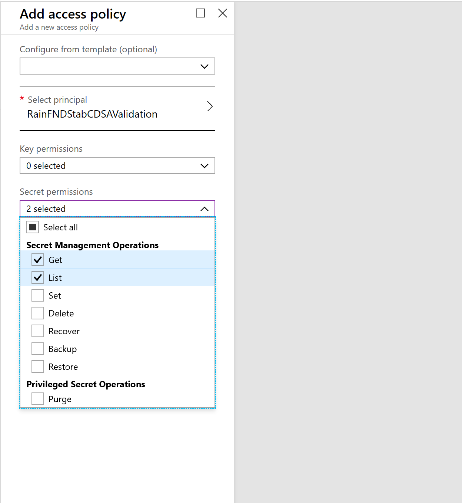

---
# required metadata

title: Make Entity store available as a Data Lake
description: This article explains how to make Entity store available as a Microsoft Azure Data Lake.
author: MilindaV2
ms.date: 09/23/2020
ms.topic: article
ms.prod: 
ms.technology: 

# optional metadata

# ms.search.form: 
# ROBOTS: NOINDEX, NOFOLLOW
audience: Developer, IT Pro
# ms.devlang: 
ms.reviewer: sericks

# ms.tgt_pltfrm: 
ms.assetid: 
ms.search.region: Global
# ms.search.industry: 
ms.author: milindav
ms.search.validFrom: 2018-12-03
ms.dyn365.ops.version: Platform Update 23

---

# Make Entity store available as a Data Lake

[!include [banner](../includes/banner.md)]

> [!IMPORTANT]
> This feature is currently in public preview. This feature is comprised of the following components:
>
> - **Automated Entity store refresh** - Available in Platform update 23.
> - **Entity store data in Microsoft Azure Data Lake (full push)** - Available in Platform update 26. 
> - **DataFlows for Entity store schemas on PowerBI.com** - Available in a future platform update.
> - **Entity store data in Azure Data Lake (trickle feed)** - Available in Platform update 28.
> - **Extend analytical workspaces by using PowerBI.com** - Available in a future platform update.

## Automated Entity store refresh
You need to enable automated Entity store refresh before enabling Data Lake integration. 
1. Go to **System administration** \> **Set up** \> **Entity store**.

    On the **Entity store** page, a message indicates that you can switch to the **Automated Entity store refresh** option. This option is managed by the system. An admin doesn't have to schedule or monitor the Entity store refresh.

2. Select **Switch now**.

    > [!IMPORTANT]
    > This action isn't reversible. After you switch to the **Automated Entity store refresh** option, you can't revert to the old user interface (UI) experience.

3. Select **Yes** to continue.

You will now see the new experience.

After the new experience is turned on, you can define the refresh for each aggregate measurement. The following refresh options are available:

- Every hour
- Twice a day
- Once a day
- Once a week

In addition, an admin can refresh any aggregate measurement on demand by selecting the **Refresh** button. Additional options will be added in future platform updates. These options will include options for real-time refresh.

> [!IMPORTANT]
> When the automated refresh is enabled, in some cases the system may disable refresh of Aggregate measurements. You must revisit aggregate measurements and validate that appropriate refresh intervals have been applied by the system.
>

## Entity store data in Azure Data Lake (full push and trickle feed)

> [!IMPORTANT]
> This feature is currently in public preview. Do not enable this feature in production environments.

When this feature is turned on, Entity store data isn't populated in the relational Entity store database in the Microsoft subscription. Instead, it's populated in an Azure Data Lake Storage Gen2 account in your own subscription. You can use the full capabilities of PowerBI.com and other Azure tools to work with Entity store.

Before you start, you must complete these tasks in the Azure portal.

1. **Create storage accounts.** Provision a storage account in the same data center where your environment is provisioned. Make a note of the connection string for the storage account, because you will have to provide it later.
2. **Create a Key Vault and a secret.** Provision Azure Key Vault in your own subscription. You will need the Domain Name System (DNS) name of the Key Vault entry that you created. Also add a secret to Key Vault. As the value, specify the connection string that you made a note of in the previous task. Make a note of the name of the secret, because you will have to provide it later.
3. **Register the app.** Create an Azure Active Directory (Azure AD) application, and grant application programming interface (API) access to Key vault. Make a note of the application ID and its application key (secret), because you will have to provide them later.
4. **Add a service principal to Key Vault.** In Key Vault, use the **Access policies** option to grant the Azure AD application **Get** and **List** permissions. In this way, the application will have access to the secrets in Key Vault.

The following sections describe each task in more detail.

### Create storage accounts

1. In the Azure portal, create a new storage account.
2. In the **Create storage account** dialog box, provide values for the following parameter fields:

    - **Location:** Select the data center where your environment is located. If the data center that you select is in a different Azure region, you will incur additional data movement costs. If your Microsoft Power BI and/or your data warehouse is in a different region, you can use replication to move storage between regions.
    - **Performance:** We recommend that you select **Standard**.
    - **Account kind:** You must select **StorageV2**.

3. In the **Advanced options** dialog box, you will see the **Data Lake storage Gen2** option. Select **Enable** under the Hierarchical namespaces feature. If you disable this option, you can't consume data written by finance and operations apps with services such as Power BI data flows. 
4. Select **Review and create**. When the deployment is completed, the new resource will be shown in the Azure portal.
5. Select the resource, and then select **Settings** \> **Access keys**.
6. Make a note of the connection string value, because you will have to provide it later.

### Create a Key Vault and a secret

1. In the Azure portal, create a new Key Vault.
2. In the **Create key vault** dialog box, in the **Location** field, select the data center where your environment is located.
3. After Key Vault is created, select it in the list, and then select **Secrets**.
4. Select **Generate/Import**.
5. In the **Create a secret** dialog box, in the **Upload options** field, select **Manual**.
6. Enter a name for the secret. Make a note of the name, because you will have to provide it later.
7. In the value field, enter the connection string that you obtained from the storage account in the previous procedure.
8. Select **Enabled**, and then select **Create**. The secret is created and added to Key Vault.

### Register the app

1. In the Azure portal, select **Azure Active Directory**, and then select **App registrations**.
2. Select **New registration** at the top of the menu, and enter the following information:

    - **Name** - Enter a friendly name for the app.
    - Select **Accounts in this Organizational directory only** unless your storage account and your Dynamics environment are in different Azure Active Directory domains.

3. After the application is created, select **API permissions**.
4. In the dialog box that appears, select **Add a permission**.
5. You will see a dialog box with a list of APIs. In the list, select **Azure Key Vault**.
6. Select the **Delegated permissions** box, select **user_impersonation**, and then select **Add permissions** to save your changes.
7. Select the **Certificates & secrets** menu on the left navigation pane, and then select **New client secret**.
8. In the **Description** field, enter a name and choose an expiry period. Select **Add**.
10. A secret is generated and shown in the **Value** field.
11. Immediately copy the secret to the clipboard, because it will disappear within one or two minutes. You will have to provide this key to the application later.

### Add a service principal to Key Vault

1. In the Azure portal, open Key Vault that you created earlier.
2. Select **Access policies**, and then select **Add** to create a new access policy.
3. In the **Select principal** field, select the name of the application that you previously registered.
4. In the **Key permissions** field, select **Get** and **List** permissions.
5. In the **Secret permissions** field, select **Get** and **List** permissions.

    

6. Select **Save**.

## Work in Entity store in a Data Lake

1. Go to **System administration** \> **Set up** \> **System parameters**.
2. On the **Data connections** tab, enter the following information that you made a note of earlier in this article:

    - **Application ID:** Enter the application ID of the Azure AD application that you registered earlier.
    - **Application Secret:** Enter the application key (secret) for the Azure AD application.
    - **DNS name:** Enter the DNS name of Key Vault.
    - **Secret name:** Enter the name of the secret that you added to Key Vault together with connection string information.

    

3. Select the **Test Azure Key Vault** and **Test Azure Storage** links to validate that system can access the configuration information that you provided.
4. Select the **Enable data connection** check box.

Entity store data should now be populated in the storage location that you provided, not in the relational Entity store database.

The aggregate measurements and refresh options that you select in the Entity store UI should now apply to data that is copied to Data Lake.

[!INCLUDE[footer-include](../../../includes/footer-banner.md)]
