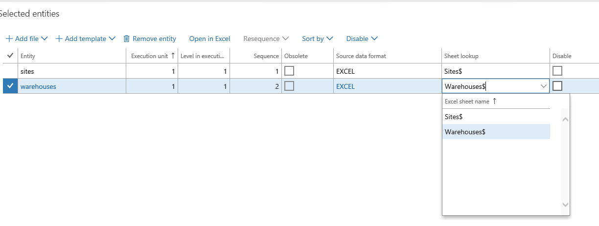

---
# required metadata

title: Data templates with multiple worksheets
description: This article describes how to import data using Excel data entity templates into finance and operations.
author: peakerbl
ms.date: 01/01/2018
ms.topic: article
ms.prod: 
ms.technology: 

# optional metadata

# ms.search.form: 
# ROBOTS: 
audience: Application user
# ms.devlang: 
ms.reviewer: twheeloc
# ms.tgt_pltfrm: 
ms.custom: 
ms.assetid: 
ms.search.region: Global
# ms.search.industry: 
ms.author: peakerbl
ms.search.validFrom: 2018-01-01
ms.dyn365.ops.version: Platform update 13

---

# Data templates with multiple worksheets

[!include [banner](../includes/banner.md)]

[!INCLUDE [PEAP](../../../includes/peap-3.md)]

Data management in the application supports Microsoft Excel-based templates for data entities. These templates can contain one or more worksheets. Templates with multiple worksheets are often used when it is convenient to manage data in a single file and import it to multiple data entities. An example would be sites and warehouses.

## Upload a file once and map it to all entities
Let's take an example where there is one Excel file with worksheets called **Sites** and **Warehouses**. To set up the data import project, you would add the first data entity, **Sites** and then upload the file. You will be able to select **Sites** as the worksheet to be used for this entity.

If you add the second entity **Warehouses** without leaving the **Add file** form, the worksheet lookup will let you select the **Warehouses** worksheet without having to upload the file again. The only reason to upload a new file would be if the **Warehouses** data was in a different file.

## Fix worksheet to entity mapping

The mapping of the worksheet to a data entity in the import job can be fixed from the grid. The **Worksheet** column in the grid shows the worksheets from the file that was mapped. You can choose a different worksheet from the drop-down menu. If the chosen worksheet is already mapped to an entity in the data project, the system asks you to confirm the change. We recommend that you fix all mappings in the grid.

## Re-map to a new file

In cases where a new version of the same file or a completely new file must be uploaded for existing entities in a data project, you must use the **Add file** experience, and add the entities again as if they were being added for the first time. The system will confirm that you want to overwrite the existing entities in the data project before proceeding. Entities that are not added again (or overwritten) will continue to hold the previous mappings from the previous file.

## Upload a file using Run project

You can upload an Excel file while using the **Run project** option to execute an import project. You must be careful to upload only files that have the same worksheets as the existing mappings on the data entities in the data project. If a worksheet is not found in the newly uploaded file, the system displays an error and will stop the import. If the mapping to the worksheet must be changed for an entity, then the mappings in the data project must be first updated from within the data project before using the file in the **Run project** experience.

[!INCLUDE[footer-include](../../../includes/footer-banner.md)]

