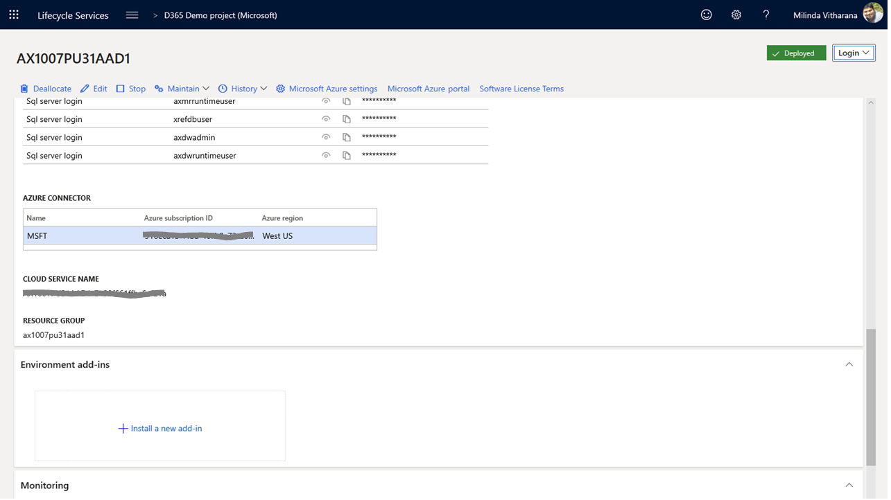
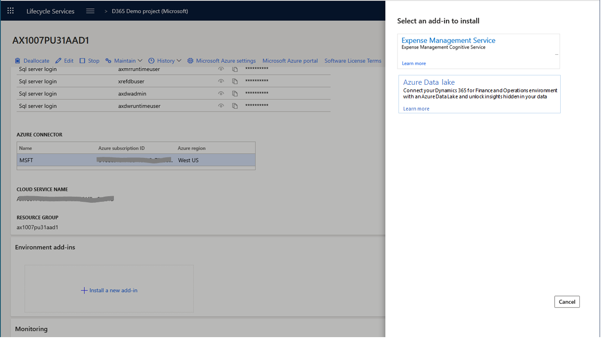
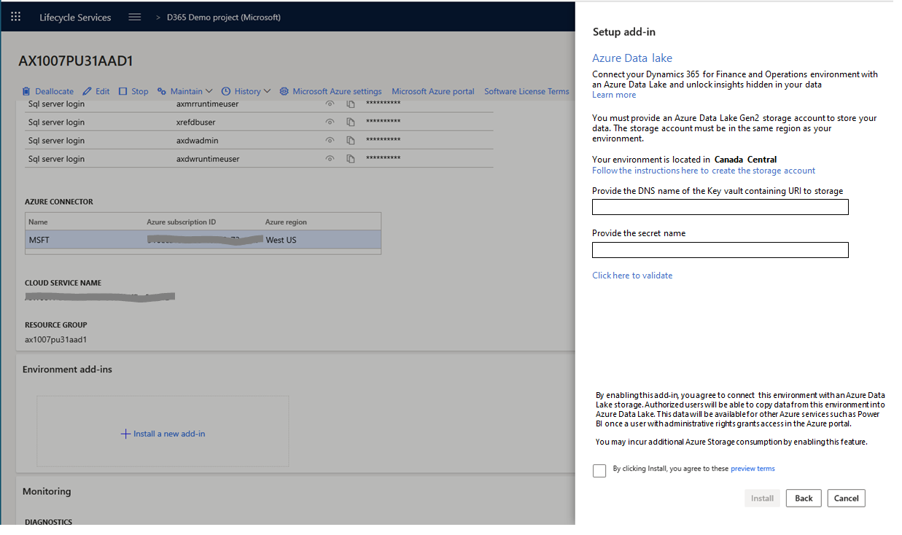
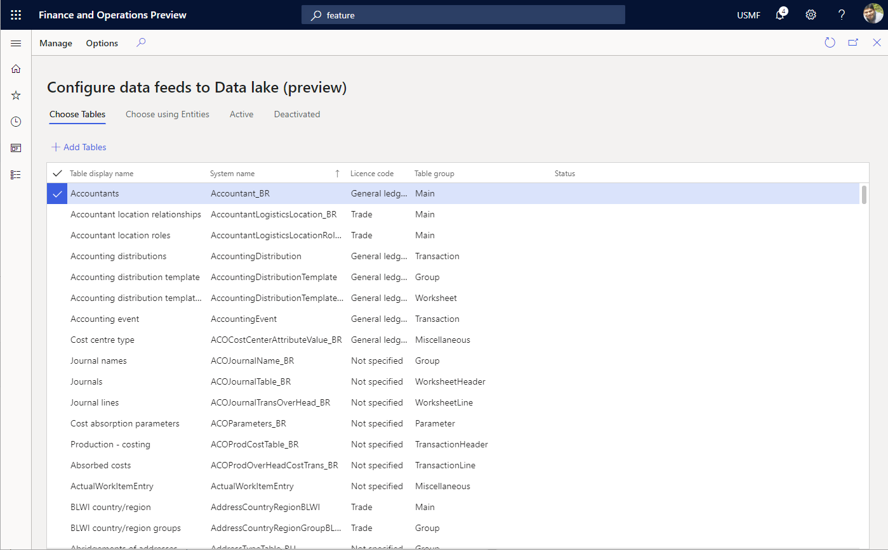
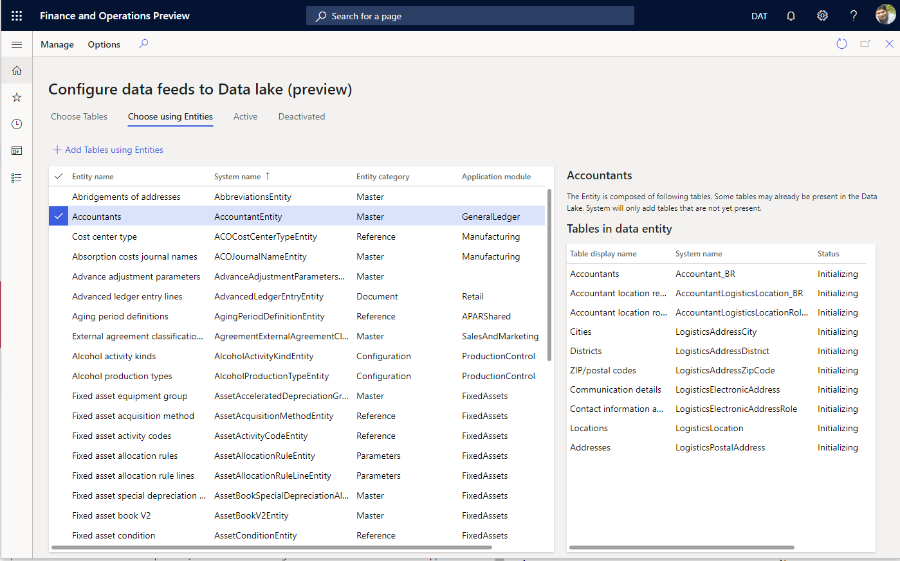
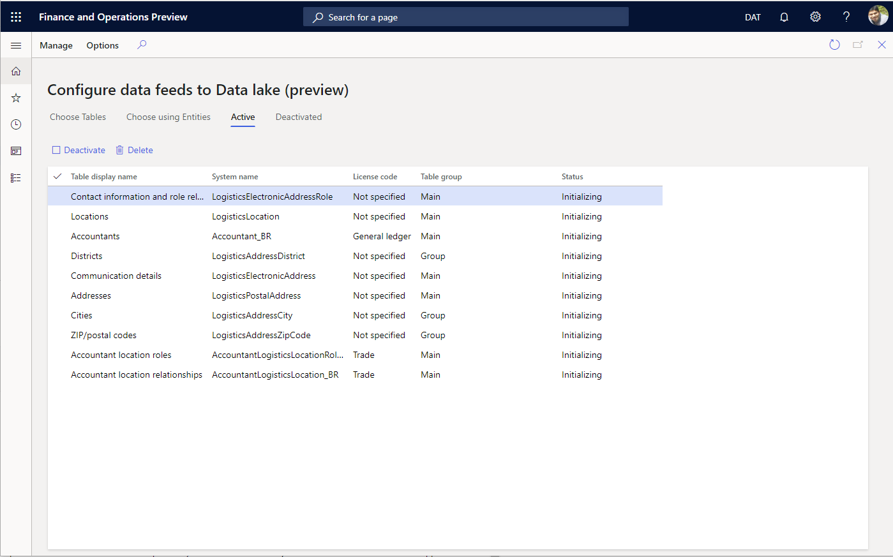

---
# required metadata

title: Dynamics 365 Finance data in Azure Data Lake
description: This topic explains...
author: MilindaV2
manager: AnnBe
ms.date: 01/15/2020
ms.topic: article
ms.prod: 
ms.service: dynamics-ax-platform
ms.technology: 

# optional metadata

# ms.search.form: 
# ROBOTS: NOINDEX, NOFOLLOW
audience: Developer, IT Pro
# ms.devlang: 
ms.reviewer: kfend
ms.search.scope: Operations

# ms.tgt_pltfrm: 
ms.custom: 96283
ms.assetid: 
ms.search.region: Global
# ms.search.industry: 
ms.author: milindav
ms.search.validFrom: 2020-03-01
ms.dyn365.ops.version: Platform Update 34

---

# Dynamics 365 Finance data in Azure Data Lake

[!include [banner](../includes/banner.md)]

You can configure your Dynamics 365 for Finance and Operations (F&O) environment
with an Azure Data Lake using this feature. Tables and Entities from F&O will be
reflected in your Azure Data lake on successful configuration.

NOTES
=====

1.  **This feature may not be available in all regions and/or all
    environments**. If you do not see this feature in your environment, it will
    become available in the future.

2.  To enable Aggregate measurements in an Azure Data Lake, you should continue
    to use the feature as described in “Entity store in Data Lake”

 

Overview
========

You need to follow several steps to enable this service

 

1.  **Accept the offer and terms** to enable Data lake integration using
    Dynamics Life Cycle Services (LCS)

2.  Ask your administrator to create an Azure Storage (Gen2) account in your
    subscription. **Configure Azure Data Lake** in F&O by providing connection
    details. This storage account will be used to store data. Alternatively, the
    system can create a storage account on your behalf within your own Azure
    subscription. You need to be a user with administrative rights to your
    organizations Azure subscription. This option will be available in the
    future

3.  Administrator must enable the **Export to Azure Data Lake** feature

4.  **Choose Tables (and/or Entities)** to be staged in the Azure Data Lake

 

You are done with the configuration.

 

5.  The system will next **initialize the tables in the Azure Data Lake**. If
    you choose Entities, tables corresponding to the Entities will be added to
    the Azure Data lake.

 

6.  Depending on the amount of data in the tables you have chosen, this may take
    some time. Once the initialization is complete, the system will start
    **updating the data in the Azure Data lake** as it gets updated in F&O. You
    can see the status of the tables being updated in the Azure data Lake at any
    time.
 

7.  You can add more tables (or remove already added tables) at any time by
    visiting the select tables form.

8.  If you perform a system/database operation such as a restore, the system
    pauses the data sync until you are complete. When the operation is complete,
    the system commences the data sync again. If there's are a lot of updates
    since the last sync operation, the system may initialize the tables.

9.  You can now consume the data stored in the Azure Data Lake

 

Accept offer and terms for Azure Data Lake integration
======================================================

You need to accept the Azure Data Lake offer in Dynamics Life Cycle Services
(LCS) before you can configure the integration. In order to perform this
operation, you need to be an environment administrator for F&O and must have
access to LCS portal.

1.  Login to lcs.dynamics.com and navigate to the environment page.

2.  Expand the **Environment add-ins** tab. If the Data Lake add-in is already
    installed, you should see **Azure Data Lake** as an add-in. You need to
    install the Azure Data Lake add-in.

3.  To install, select the **+ install a new add-in** option from the flyout
    menu.

4.  You should see **Azure Data Lake** option in the list. If you do not see the
    option, the feature many not yet be available for your environment.

 

 

5.  Provide the information required in the screen below. In order to answer the
    questions, you should have already created an Azure Storage account. If you
    have not done so already, create an Azure storage account (or ask your
    administrator to create one on your behalf)

6.  Click the validate option to ensure that the system has required access to
    the Azure Data Lake provisioned by you.

 

 

 

7.  Accept the terms of the offer by selecting the checkbox below and select
    **Install**. System will install and configure the Azure Data Lake for this
    environment. On successful completion, you will see the Azure Data Lake
    configured for this environment.

 

How to create a storage account 
--------------------------------

You can create a storage account in your own subscription and provide that
account to the system via a Key vault.

Follow the instructions below to create a storage account

<https://docs.microsoft.com/en-us/dynamics365/fin-ops-core/dev-itpro/data-entities/entity-store-data-lake#create-storage-accounts>

Next, follow the instructions below to create a Key vault and a secret. You will
need to provide the Key vault DNS and the secret name.

<https://docs.microsoft.com/en-us/dynamics365/fin-ops-core/dev-itpro/data-entities/entity-store-data-lake#create-a-key-vault-and-a-secret>

 

Let the system create storage accounts
--------------------------------------

As opposed to creating storage accounts on your own, you can ask the system to
create a storage account in your subscription on your behalf. This option will
be enabled in the future,

Enable Export to Azure Data Lake feature
========================================

Administrator must enable the Export to Azure Data Lake feature before it can be
activated as is the case for all new features in F&O. If you do not have
administrative rights to F&O, your administrator must perform this task.

1.  Visit the **Feature Management** workspace.

2.  Navigate to the **Export Data to Azure Data lake** feature. Select the
    feature and select **Enable.**

3.  The feature will be enabled and you should be able to see the **Systems
    Administration \> Export to Azure Data Lake** menu

Choose Data 
============

You can choose tables and Entities to be staged in the Azure Data Lake using the
same UI. Launch the UI by navigating to **System Administration \> Export to
Azure Data Lake** menu

 

Choose **Configure Data feeds for export to Lake** option. You will see the form
that enables choosing data.

Choose tables tab lets to choose data tables to be staged in the Azure Data
Lake. You can search for tables either using the display name or the system
name. You can also see if the table is already being synced.

 

If you are not familiar with the specific tables you need, choose using
Entities.

 

Entities are a higher-level abstraction of data that may include multiple
tables. By choosing Entities, you are choosing the tables that comprise the
Entity. Regardless of how you choose, the tables will be staged in the Azure
Data Lake.

 

Monitor Tables in Data Lake
---------------------------

The system keeps the data updated in Azure Data Lake. You do not need to monitor
data exports. You do not need to schedule data exports since the system keeps
the data fresh. However, you can see the status of ongoing data exports using
the Active tab.

