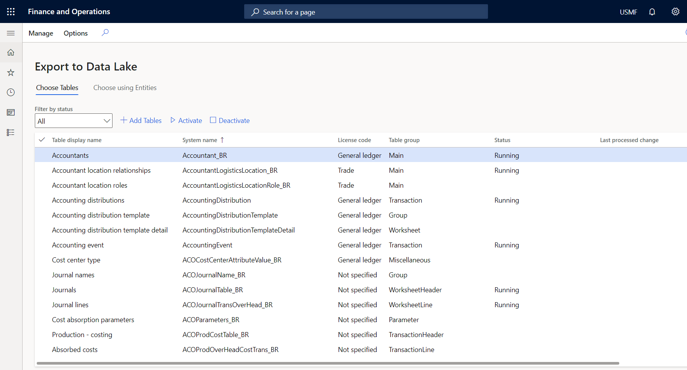
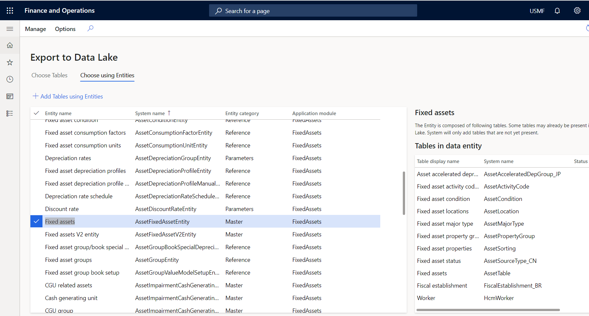

---
# required metadata

title: Export to Data Lake in Finance and Operations apps
description: This topic explains how to choose data in a Finance and Operations apps environment so that the data is available in a data lake.
author: MilindaV2
ms.date: 04/28/2022
ms.topic: article
ms.prod: 
ms.technology: 

# optional metadata

# ms.search.form: 
# ROBOTS: NOINDEX, NOFOLLOW
audience: Developer, IT Pro
# ms.devlang: 
ms.reviewer: sericks
# ms.tgt_pltfrm: 
ms.custom: 96283
ms.assetid: 
ms.search.region: Global
# ms.search.industry: 
ms.author: milindav
ms.search.validFrom: 2020-03-01
ms.dyn365.ops.version: Platform Update 34

---

# Export to Data Lake in Finance and Operations apps 

[!include [banner](../includes/banner.md)]

> [!NOTE]
> The **Export to Data Lake** feature is generally available in the United States, Canada, United Kingdom, Europe, South East Asia, East Asia, Australia, India, Latin America, and Japan regions. If your Finance and Operations environment is in any of those regions, you will be able to install the **Export to Data Lake** add-in in it. Microsoft will enable this feature in additional regions in the future. You can join the [Project Como Yammer group](https://www.yammer.com/dynamicsaxfeedbackprograms/#/threads/inGroup?type=in_group&feedId=32768909312&view=all) to stay in touch and ask questions that will help you understand the feature and upcoming improvements.

The **Export to Data Lake** feature lets you copy data from your Finance and Operations apps into your own data lake (Azure Data Lake Storage Gen2). The system lets you select the tables and entities that are included. After you select the data that you want, the system makes an initial copy. The system then keeps the selected data up to date by applying changes, deletions, and additions. After data changes in your Finance and Operations app instances, there might be a delay of a few minutes before the data is available in your data lake.

## Enable the Export to Data Lake feature
Before you can use this feature, see [Install the Export to Azure Data Lake Add-in](configure-export-data-lake.md).

## Select data

> [!NOTE]
> If the feature, **Export to Azure Data Lake** isn't available in the **Feature management** module in your environment, sign in to the environment and add the following to the URL in your browser address: &mi=DataFeedsDefinitionWorkspace. For example, https://ax123456.cloud.test.dynamics.com/?cmp=USMF&mi=DataFeedsDefinitionWorkspace.

You can select the tables and entities that should be staged in data lake.

1. In your environment, go to **System Administration** \> **Setup** \> **Export to Data Lake**.

    You can also open the **Export to Data Lake** page by using the search field on the navigation bar. Enter **Configure** in the search field. The search results should include a link to the page.

2. On the **Export to Data Lake** page, on the **Choose Tables** tab, select the data tables that should be staged in the data lake. You can search for tables by either display name or system name. You can also see whether a table is being synced. 
3. When you've finished, select **Add Tables** to add the selected tables to the data lake.

    

4. Select **Activate data feed**, and then select **OK**. When you add a table, the system might show its status as **Initializing**. This status indicates that the system is making an initial copy of data. When the initial copy is completed, the system changes the status to **Running**.

    In the event of an error, the system shows the status as **Deactivated**.

    You can consume data in the data lake when the status is **Running**. If you consume data in the data lake while the status is **Initializing** or **Deactivated** status, you might not see all the data. 

    If you aren't familiar with the specific tables that you require, you can select tables by using entities. Entities are a higher-level abstraction of data and might include multiple tables. By selecting entities, you also select the tables that include them.

    > [!NOTE]
    > When you open the **Choose using Entities** tab for the first time, you might notice that the list of entities on the page is empty. The system might require some time to fill in the list of entities. You can force a refresh of the list by selecting **Manage \> Rebuild data feed catalog** on the Action Pane. 

5. On the **Choose using Entities** tab, select the entities, and then select **Add Tables using Entities**.

    

    Regardless of the method that you use to select tables, the tables will be staged in the data lake.

## Monitor the tables in the data lake

You don't have to monitor or schedule data exports, because the system keeps the data updated in the data lake. However, you can view the status of ongoing data exports in the **Status** column on the **Export to Data Lake** page. 

When you select data, the Export to Azure Data Lake service makes an initial copy of the data in the data lake. If you select multiple tables, the system makes the initial copy by taking 10 tables at a time. Depending on the size of the data and the number of records in the table, this process might take a few minutes or even a few hours. The export progress is shown on-screen.

After the initial copy is made, the system continuously updates the data as changes occur in Finance and Operations apps. When records are inserted, updated, or deleted, data records in the data lake are inserted, updated, or deleted accordingly.

If you use the optional near-real-time change feature (currently in preview), data in the data lake is updated within minutes of a change in the Finance and Operations environment. Otherwise, data in the data lake is updated within a few hours of a change in the Finance and Operations environment.

The Export to Data Lake page in a Finance and Operations environment shows the time stamp of the last update of the data in the data lake. The system also adds data fields that help you identify the time when the data in the data lake was updated. Your downstream processes can use the time stamps to detect and process data as it changes in the data lake.

## Troubleshooting common issues and errors

### Export to Data Lake feature is not available in your region and/or your environment at this time
This feature is not available in Tier-1 (developer) environments. You need a sandbox environment (Tier 2 or higher) with Platform updates for version 10.0.13 or higher.

This feature may not be available in all Azure regions where Finance and Operations apps are available, or this feature may not be available for your environment. If you would like to join a future preview, [complete the survey](https://aka.ms/FnODataLakePreviewSurvey). We will contact you when we are ready to include you. You can also join a Yammer group by completing the survey. You can use the Yammer group to stay in contact and ask questions that will help you understand the feature. We are working hard to make this feature available soon.

### Export to Data Lake feature is currently being installed for your environment. Please check back later.
Before you can use this feature, you need to configure the export to the data lake. For more information, see [Configure export to Azure Data Lake](configure-export-data-lake.md).

### Export to Data Lake add-in is not installed. 
Ask your administrator to install this add-in using Dynamics Lifecycle Services (LCS). Before you can use this feature, you need to configure the export to the data lake. For more information, see [Configure export to Azure Data Lake](configure-export-data-lake.md).

### Export to Data Lake feature failed to install in Dynamics Life Cycle Services (LCS). 
Ask your administrator to re-install the Export to Data Lake add-in. If this issue persists, contact Support. When you configure the Export to Data Lake feature, the system may report an error. Or, there may be an error when you access the data lake after configuration due to a change in your environments. For more information, see [Configure export to Azure Data Lake](configure-export-data-lake.md).

### Export to Data Lake feature is temporarily unavailable. Please check back later.
If you see this error for a prolonged period of time, contact Support.  

### Memo fields are missing in the data lake
The system does not export fields of type Memo, nVarchar(max), VarBinary, or Blob types into the data lake. If you choose a table with fields of these types, the system will ignore these fields and export others. We are working on enabling these special fields in the future. If you would like to stay in touch with the product team and learn about upcmoing features, you can join the [Project Como Yammer group](https://www.yammer.com/dynamicsaxfeedbackprograms/#/threads/inGroup?type=in_group&feedId=32768909312&view=all).

### Status codes with extended errors
When an error occurs in a table that you added to Export to Data Lake, you may see an error code in the status column. The following error codes provide the cause of the error and how to correct the issue.

#### Error status codes 4xx indicate an issue with the table

| Error code | Issue                                                                  | Next steps                                                                                                                                                                                                                                                                                                                                                                     |
|------------|-----------------------------------------------------------------------|------------------------------------------------------------------------------------------------------------------------------------------------------------------------------------------------------------------------------------------------------------------------------------------------------------------------------------------------------------------------------------------|
| 400        | The table you added doesn't contain a RecID field.                   | RecID fields are used by the system to index table data. Tables that don't contain a RecID field can't be added to the data lake. If this issue is from a table in a Finance and Operations app, contact Microsoft support. If this table was developed by your partner or ISV, contact the developer to include a RecID field.                                  |
| 401        | The table you added is missing in the database. | The table you added is no longer available in the database and the system can't continue updating data in the lake. The table may have been removed because of a software or database update. To resolve this issue, contact your database administrator or a developer. If this table was developed by your partner or ISV, contact the developer.     You may also encounter this issue when you add "derived tables" such as the DirPerson table. Derived tables are currently not supported by the service. To choose derived tables, you need to choose the base table. There are plans to add support for derived tables in a future release.               |
| 402        | The RecID field isn't indexed.                                            | The system has detected that the RecID field contained in the table isn't part of an index or is not the first field in an index. This may lead to poor performance in updating the data lake and updates may take longer to reflect in the data lake. You can include the RecID field in an index to resolve this issue. If this issue is from a table in a Finance and Operations app, contact Microsoft support. If this table was developed by your partner or ISV, contact the developer. |
| 409        | Failed to access the storage account due to permissions. Verify the storage account configuration.      | The system is unable to access and write to the storage account. Ensure that you have enabled Hierarchical Name Spaces (HNS) and validate access roles. For more information, see [Configure export to Azure Data Lake - Grant access](configure-export-data-lake.md#grantaccess). To resolve this issue, contact the system administrator or the LCS administrator who configured the system. |
| 410        | Failed to find Application ID to access the data lake. Application ID provided is incorrect or can't be found.      | The Application ID provided in the key vault can't be found in Azure Active Directory. Validate the Application ID provided in the key vault by following the steps in [Configure export to Azure Data Lake - Create application](configure-export-data-lake.md#createapplication). |
| 411        | Failed to access data lake with given Application ID and Application secret. | Application ID (app-id) and Application secret (app-secret) provided can't be used to access the storage account. Verify the Application ID and Application secret are valid by following the steps in [Configure export to Azure Data Lake - Create Application](configure-export-data-lake.md#createapplication).    Next, validate that the application has required access to the storage account. For more information, see [Configure export to Azure Data Lake - Grant access](configure-export-data-lake.md#grantaccess). You need to contact the systems administrator or the LCS administrator who configured the system. | 
| 412        | Chosen table is not supported or has a missing RecID index. | Some internal and system tables are not supported by the Export to Data Lake feature. If you are receiving this error, you may have chosen a table that is not allowed. The selection form may not show such tables in the future. You should plan to extract the same information using a supported table.    You may also receive this error if the chosen table contains a large number of rows (more than one million) and a required RecID index is missing. The system requires larger tables to contain an index where RecID is the first field in that index. You can create a RecID index as a table extension to resolve this error. | 
| 415        | Failed to access the storage account using the storage name provided in the key vault. | Storage account provided in the key vault can't be found or is invalid. Validate that the correct storage account name is entered into the key vault by following the steps in [Configure export to Azure Data Lake - Add secrets](configure-export-data-lake.md#addsecrets).    Verify that you have provided the correct secret name for the storage account by following the steps in [Configure export to Azure Data Lake Add secrets](configure-export-data-lake.md#addsecrets). | 
| 420        | Failed to access the key vault or the key vault secrets. | Service can't access the key vault or the secrets in the key vault.  Verify that your Azure subscription has not expired.     Verify that you have created the service principal by following the steps in [Configure export to Azure Data Lake - Create service principal](configure-export-data-lake.md#createServicePrincipal).     Verify that the Key vault contains all the required secrets by following the steps in [Configure export to Azure Data Lake - Add secrets](configure-export-data-lake.md#addsecrets).    Verify that you have provided the correct key vault URI in the configuration steps in [Configure export to Azure Data Lake - Install add-in](configure-export-data-lake.md#installaddin). | 
| 425        | Failed to locate the Azure Tenant ID for the environment. | Verify that you have provided the correct Azure tenant ID by following the steps in [Configure export to Azure Data Lake - Install add-in](configure-export-data-lake.md#installaddin).  | 
| 430        | Failed to access the environment. | Ensure that the environment is available and not in a deleted or inactive state.  |
| 435        | Files in the lake are corrupted or invalid. | The system has detected corrupted files or an invalid folder structure in your data lake. The system manages files and folders in the lake provided in the configuration. You should not modify files or the folder structure in the data lake yourself. Verify that your users or a process has not modified files or folders in the lake. You can reactivate the tables to see if the issue is resolved. If this does not address the issue, uninstall and re-install the Export to Data Lake add-in.  |
| 440        | Enhanced metadata is not available for this table. | You will receive this error if you have chosen the "Enhanced metadata (preview)" feature. In this case, the system can't find enhanced metadata for the table that you have selected. To resolve the issue, ensure that you are on a Finance and Operations version required by the "Enhanced metadata (preview)" feature. If you are on the correct version, you can also manually refresh metadata using the **Manage > Republish metadata** option. You will need to wait a few minutes after this option to verify whether the issues is resolved.  |

#### Error status codes 5xx indicate a system error encountered while exporting data
Due to the error, the system has paused data export – data that exists in the lake won't be updated until the error is resolved. Try to deactivate and activate the table to see if this resolves the issue. Note that deactivating and activating the table may cause the system to re-initialize the data in the lake by taking a full copy. If the issue persists, contact Microsoft support with the table name and the error code.

#### Error status codes 8xx and 9xx indicate a change to the table or database structure since it was added

| Error code | Issue                                                                                 | Next steps                                                                                                                                                                                                                                                                                                                                                                                                                                                                                                                                                                                                                                                                                                                                                                                                                                                                      |
|------------|---------------------------------------------------------------------------------------|-------------------------------------------------------------------------------------------------------------------------------------------------------------------------------------------------------------------------------------------------------------------------------------------------------------------------------------------------------------------------------------------------------------------------------------------------------------------------------------------------------------------------------------------------------------------------------------------------------------------------------------------------------------------------------------------------------------------------------------------------------------------------------------------------------------------------------------------------------------------------------------------|
| 800        | There is a change in the data table schema.                                            | The system found a change in the table structure when adding changed data to the lake. This change is typically the result of a software update or a database modification. For example, when a new field is added to a table, or a field is modified or removed, the data updated in the lake may not be in the same format as the existing data. Because of the error, the system has paused data export. The data that exists in the lake won't be updated until the error is resolved. Deactivate and activate the table to see if the issue is resolved. |
| 801        | There is an issue with the Change data capture feature. | The Export to Data Lake feature uses the Change data capture feature. Change data can't be exported because the Change data capture feature is disabled in the Finance and Operations apps database. This may be the result of a database maintenance operation. Deactivate and activate the table to see if the issue is resolved. If the issue persists, contact Microsoft support.                                                                                                                                                                                          |
| 802        | There is an issue with the Change data capture feature for the table.                      | The Export to Data Lake feature uses the Change data capture feature. Change data can't be exported because the Change data capture feature isn't enabled for this table in your Finance and Operations apps database. This may be the result of a database maintenance operation. Deactivate and activate the table to see if the issue is resolved.                                                                                                                                                                         |
| 900        | There is an issue with the Change data capture feature in this environment.               | The Export to Data Lake feature uses the Change data capture feature. Change data can't be exported because the Change data capture feature isn't enabled for this table in the Finance and Operations apps database. This may be the result of a database maintenance operation. Deactivate and activate the table to see if the issue is resolved. If the issue persists, contact Microsoft support.                                                                                                                                                                        |

> [!NOTE]
> Deactivating and activating the table may cause the system to re-initialize the data in the lake by creating a full copy. If this is a large table, the initialize process may take some time. In the future, the system may automatically update data in the lake to reflect the table structure changes. 

[!INCLUDE[footer-include](../../../includes/footer-banner.md)]
