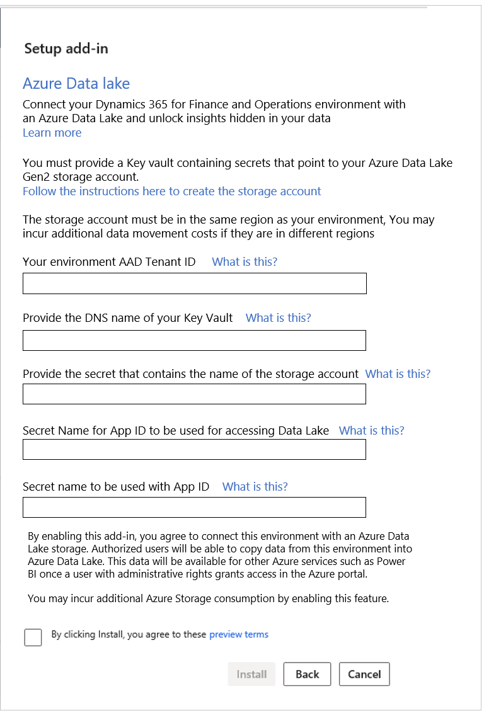

---
# required metadata

title: Finance and Operations apps data in Azure Data Lake
description: This topic explains how to configure your Finance and Operations apps environment so that it has a data lake.
author: MilindaV2
manager: AnnBe
ms.date: 03/20/2020
ms.topic: article
ms.prod: 
ms.service: dynamics-ax-platform
ms.technology: 

# optional metadata

# ms.search.form: 
# ROBOTS: NOINDEX, NOFOLLOW
audience: Developer, IT Pro
# ms.devlang: 
ms.reviewer: kfend
ms.search.scope: Operations

# ms.tgt_pltfrm: 
ms.custom: 96283
ms.assetid: 
ms.search.region: Global
# ms.search.industry: 
ms.author: milindav
ms.search.validFrom: 2020-03-01
ms.dyn365.ops.version: Platform Update 34

---

# Finance and Operations apps data in Azure Data Lake

[!include [banner](../includes/banner.md)]

[!include [banner](../includes/preview-banner.md)]

The **Export to Azure Data Lake** feature lets you configure your Finance and Operations apps environment so that it uses a data lake. After the configuration is completed, your data lake will reflect tables and entities from Finance and Operations apps.

> [!NOTE]
> - **This feature might not be available in all regions and/or all environments.** If you don't see this feature in your environment, it isn't available yet.
> - To make aggregate measurements available in a data lake, continue to use the feature in the manner that is described in [Make entity store available as a Data Lake](entity-store-data-lake.md).

## Overview

The process of making this service available has several steps.

1. Create a Microsoft Azure Data Lake Storage Gen2 account (a storage account) in your subscription.
2. Accept the offer and terms to turn on the Azure Data Lake integration.
3. Turn on the **Export to Azure Data Lake** feature.
4. Select data (that is, the tables and entities that should be staged in Data Lake).
5. Monitor the tables in Data Lake.

## Create a Data Lake Storage (Gen2) account in your subscription

The storage account will be used to store data. To manually create a storage account, you must be a user who has administrative rights to your organization's Azure subscription. (Eventually, the system will be able to create a storage account in your own Azure subscription on your behalf.)

### Manually create a storage account

You can create a storage account in your own Azure subscription and use a key vault to provide that account to the system. Next, you must create an Azure Active Directory (Azure AD) application ID that grants access to the root of your storage account. The system will use the Azure AD application to create the folder structure and write data. Finally, you will create a key vault in your subscription, and provide information about your storage account and the application to the Data Lake offer in Microsoft Dynamics Lifecycle Services (LCS).

1. Create a storage account. For instructions, see [Create storage accounts](entity-store-data-lake.md#create-storage-accounts).
2. Provide the Azure AD tenant ID of your environment. You can find your Azure AD tenant ID in the Azure portal. Sign in to the Azure portal, and open the **Azure Active Directory** service. Open the **Properties** page, and copy the value in the **Directory ID** field.
3. Create a key vault and a secret. For instructions, see [Create a key vault and a secret](entity-store-data-lake.md#create-a-key-vault-and-a-secret). You must provide the key vault's Domain Name System (DNS) name and the secret name.

### Let the system create a storage account

Instead of manually creating a storage account, you can have the system create a storage account in your own subscription on your behalf. This option will be made available in a future release.

## Accept the offer and terms to turn on the Data Lake integration

Before you can configure the Data Lake integration, you must accept the Data Lake offer in LCS. To complete this task, you must be an environment admin for Finance and Operations apps, and you must have access to the LCS portal.

1. Sign in to [LCS](https://lcs.dynamics.com).
2. On the **Environment** page, select the **Environment add-ins** FastTab. If **Azure Data Lake** appears in the list, the Data Lake add-in is already installed, and you can skip the rest of this procedure. Otherwise, follow the remaining steps to install the Data Lake add-in.

    

3. Select **Install a new add-in**.
4. In the **Select an add-in to install** dialog box, select **Azure Data lake** in the list. If it isn't listed, the feature might not yet be available for your environment.

    

5. In the **Setup add-in** dialog box, provide the required information. To answer the questions, you must already have a storage account. If you don't already have a storage account, create one, or ask your admin to create one on your behalf.

    

6. Accept the terms of the offer by selecting the check box, and then select **Install**.

The system installs and configures the data lake for the environment. After installation and configuration are completed, you should see **Azure Data Lake** listed on the **Environment** page.

## Turn on the Export Data to Azure Data Lake feature

As for all new features in Finance and Operations apps, an admin must turn on the **Export to Azure Data Lake** feature before it can be activated.

- In the **Feature management** workspace, find and select the **Export Data to Azure Data lake** feature, and then select **Enable**.

After the feature is turned on, you should see the **Export to Azure Data Lake** option under **System administration**.

## Select data

You can select the tables and entities that should be staged in Data Lake.

1. In your environment, go to **System Administration** \> **Export to Azure Data Lake**.
2. Select **Configure Data feeds for export to Lake**.
3. On the **Configure data feeds to Data lake** page, on the **Choose Tables** tab, select the data tables that should be staged in Data Lake. You can search for tables by display name or system name. You can also see whether a table is already being synced. When you've finished, select **Add Tables** to add the selected tables to Data Lake.

    

    Alternatively, if you aren't familiar with the specific tables that you require, you can select tables by using entities. Entities are a higher-level abstraction of data and might include multiple tables. By selecting entities, you're also selecting the tables that comprise them.
    
    - On the **Choose using Entities** tab, select entities, and then select **Add Tables using Entities**.

    

    Regardless of the method that you use to select tables, the tables will be staged in Data Lake.

## Monitor the tables in Data Lake

You don't have to monitor or schedule data exports, because the system keeps the data updated in Data Lake. However, you can view the status of ongoing data exports on the **Active** tab of the **Configure data feeds to Data lake** page.

