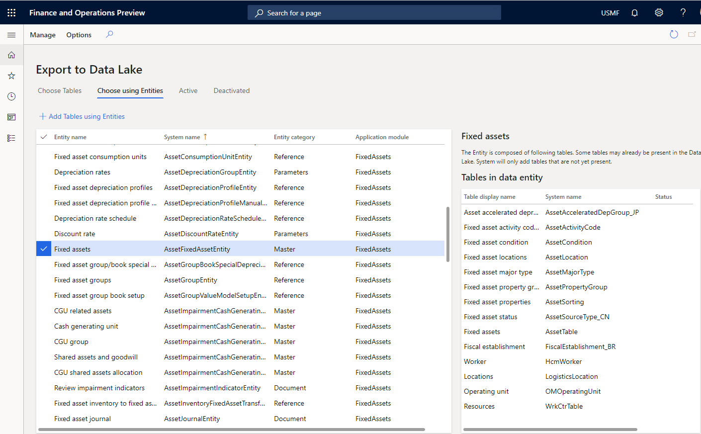

---
# required metadata

title: Finance and Operations apps data in Azure Data Lake
description: This topic explains how to configure your Finance and Operations apps environment so that it has a data lake.
author: MilindaV2
manager: AnnBe
ms.date: 06/15/2020
ms.topic: article
ms.prod: 
ms.service: dynamics-ax-platform
ms.technology: 

# optional metadata

# ms.search.form: 
# ROBOTS: NOINDEX, NOFOLLOW
audience: Developer, IT Pro
# ms.devlang: 
ms.reviewer: kfend

# ms.tgt_pltfrm: 
ms.custom: 96283
ms.assetid: 
ms.search.region: Global
# ms.search.industry: 
ms.author: milindav
ms.search.validFrom: 2020-03-01
ms.dyn365.ops.version: Platform Update 34

---

# Finance and Operations apps data in Azure Data Lake

[!include [banner](../includes/banner.md)]

> [!NOTE]
> The **Export to Azure Data Lake** feature is in limited preview and may not be available in all regions and environments supported by Finance and Operations apps. If you are unable to find the **Export to Azure Data Lake** functionality in Lifecycle Services (LCS) or your Finance and Operations apps, this feature is not currently available in your environment. 
>
> Currently, previews are closed. In the coming months we will enable additional environments in several regions. We are accepting requests from customers who would like to join the preview. If you would like to join a future preview, [complete the survey](https://aka.ms/FnODataLakePreviewSurvey). We will contact you when we are ready to include you. You can also join a Yammer group by [completing the survey](https://aka.ms/FnODataLakePreviewSurvey). You can use the Yammer group to stay in contact and ask questions that will help you understand the feature.  
>
> Until the feature is enabled in your environment, you have the option to prototype/plan the feature implementation using [GitHub tools](https://github.com/microsoft/Dynamics-365-FastTrack-Implementation-Assets/blob/master/Analytics/AzureDataFactoryARMTemplates/SQLToADLSFullExport/ReadmeV2.md). The tools will enable you to export data from your sandbox environment into a storage account in the same format as exported by the feature. 
>
> At this time, **Export to Azure Data Lake** feature is not available in Tier-1 (developer) environments. You need a cloud-based Tier-2 or higher environment to enable this feature.
>
> To make aggregate measurements available in a data lake, continue to use the feature in the manner that is described in [Make entity store available as a Data Lake](entity-store-data-lake.md).
 
 
The **Export to Azure Data Lake** feature lets you copy data from your Finance and Operations apps into your own Azure Data Lake (Gen 2). The system let's you choose the tables and entities to include. After you select the data that you want, the system will make an initial copy. The system then keeps the selected data up to date by applying changes, deletions, and additions. There may be a delay of a few minutes between data changes in your Finance and Operations apps instances and the time when the data is available in your data lake. 

Before you can use this feature, you must configure the **Export to Data Lake**. For more information, see [Configure export to Azure Data Lake](configure-export-data-lake.md).

## Turn on the Export Data to Azure Data Lake feature

An administrator must turn on the **Export to Azure Data Lake** feature before it can be activated. To do this, go to the **Feature management** workspace, locate and select the **Export Data to Azure Data Lake** feature, and then select **Enable**.

After the feature is enabled, you should see the **Export to Azure Data Lake** option under **System administration**.

## Select data

You can select the tables and entities that should be staged in Data Lake.

1. In your environment, go to **System Administration** \> **Export to Azure Data Lake**.
2. Select **Configure Data feeds for export to Lake**.
3. On the **Configure data feeds to Data Lake** page, on the **Choose Tables** tab, select the data tables that should be staged in Data Lake. You can search for tables by display name or system name. You can also see whether a table is being synced. 
4. When you've finished, select **Add Tables** to add the selected tables to Data Lake.

    

5. Select **Activate data feed**, and then select **OK**. The system may show the status of this table as **Initializing** when you add the table. This means, the system is making an initial copy of data. When the initial copy is complete, the system changes the status to **Running**

In case of an error, the system shows the status **Deactivated**. You can consume data in the lake when you see the **Running** state. If you consume data in the lake while **Initializing** or **Deactivated** status, you may not see all the data. 

If you aren't familiar with the specific tables that you require, you can select tables by using entities. Entities are a higher-level abstraction of data and might include multiple tables. By selecting entities, you're also selecting the tables that include them.
    
7. On the **Choose using Entities** tab, select the entities, and then select **Add Tables using Entities**.

    
    
    Regardless of the method that you use to select tables, the tables will be staged in Data Lake.

## Monitor the tables in Data Lake

You don't have to monitor or schedule data exports because the system keeps the data updated in Data Lake. However, you can view the status of ongoing data exports on the **Active** tab on the **Configure data feeds to Data lake** page.

## Troubleshooting common issues and errors

### Export to Data Lake feature is not available in your region and/or your environment at this time
This feature is not available in Tier-1 (developer) environments. You need a sandbox environment (Tier 2 or higher) with Platform updates for version 10.0.13 or higher.

This feature is in limited preview and may not be available in all Azure regions where Finance and Operations apps are available, or this feature may not be available for your environment. If you would like to join a future preview, [complete the survey](https://aka.ms/FnODataLakePreviewSurvey). We will contact you when we are ready to include you. You can also join a Yammer group by completing the survey. You can use the Yammer group to stay in contact and ask questions that will help you understand the feature. We are working hard to make this feature available soon.

### Export to Data Lake feature is currently being installed for your environment. Please check back later.
Before you can use this feature, you need to configure the export to Data Lake. For more information, see [Configure export to Azure Data Lake](configure-export-data-lake.md).

### Export to Data Lake add-in is not installed. 
Ask your administrator to install this add-in using Dynamics Lifecycle Services (LCS). Before you can use this feature, you need to configure the export to Data Lake. For more information, see [Configure export to Azure Data Lake](configure-export-data-lake.md).

### Export to Data Lake feature failed to install in Dynamics Life Cycle Services (LCS). 
Ask your administrator to re-install the Export to Data Lake add-in. If this issue persists, contact Support. When you configure the Export to Data Lake feature, the system may report an error. Or, there may be an error when you access the data lake after configuration due to a change in your environments. For more information, see [Configure export to Azure Data Lake](configure-export-data-lake.md).

### Export to Data Lake feature is temporarily unavailable. Please check back later.
If you see this error for a prolonged period of time, contact Support.  

### Status codes with extended errors shown in Export to Data Lake UI
In the event of an error in a table that you have added to Export to Data Lake, you may see an error code shown in the status column. Following error codes provide the cause of the error and how you can correct the issue

Error status codes 4xx indicates an issue with the table 

| Error code | Case                                                                  | What you can do next                                                                                                                                                                                                                                                                                                                                                                     |
|------------|-----------------------------------------------------------------------|------------------------------------------------------------------------------------------------------------------------------------------------------------------------------------------------------------------------------------------------------------------------------------------------------------------------------------------------------------------------------------------|
| 400        | The table you added does not contain a RecID field                    | RecID fields are used by the system to index table data. Tables that do not contain a RecID field can't be added to the Data lake at this point in time. If this issue is coming from a table in Finance and Operations, contact Microsoft support. If this table was developed by your partner or ISV, contact the developer to include a RecID field.                                  |
| 401        | The table you added is missing in the Finance and Operations database | The table you added is no longer available in the Finance and Operations database and the system is unable to continue updating data in the lake. The table may have been removed since it was added due to a subsequent software or database update. You should contact a DBA or a developer. If this table was developed by your partner or ISV, contact the developer                 |
| 402        | RecID field is not indexed                                            | System has detected that the RecID field contained in the table is not part of an index. This may lead to poor performance in updating the data lake and updates may take longer to get reflected in the data lake. If this issue is coming from a table in Finance and Operations, contact Microsoft support. If this table was developed by your partner or ISV, contact the developer |

