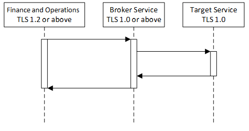

# Integration between finance and operations apps and third-party services

[!include [banner](../includes/banner.md)]

This article is intended to help architects and developers make sound design decisions when they implement integration scenarios.

The article describes integration patterns, integration scenarios, and integration solutions and best practices. However, it doesn't include technical details about how to use or set up every integration pattern. It also doesn't include sample integration code.

> [!NOTE]
> When providing guidance and discussing scenarios for choosing a pattern, data volume numbers are mentioned. These numbers must be used only to gauge the pattern and must not be considered as hard system limits. The absolute numbers will vary in real production environments due to various factors, configurations are only one aspect of this scenario. 

The following table lists the integration patterns that are available.

| Pattern                       | Documentation |
|-------------------------------|---------------|
| Power Platform integration    | [Microsoft Power Platform integration with finance and operations apps](../power-platform/overview.md) |
| OData                         | [Open Data Protocol (OData)](odata.md) |
| Batch data API                | [Recurring integrations](recurring-integrations.md) [Data management package REST API](data-management-api.md) |
| Custom service                | [Custom service development](custom-services.md) |
| Consume external web services | [Consume external web services](consume-external-web-service.md) |
| Excel integration             | [Office integration overview](../office-integration/office-integration.md) |

> [!NOTE]
> For on premise deployments, the only supported API is the [Data management package REST API](data-management-api.md). This is currently available on 7.2, platform update 12 build 7.0.4709.41184.

## Synchronous vs. asynchronous integration patterns

Processing can be either synchronous or asynchronous. Often, the type of processing that you must use determines the integration pattern that you choose.

A *synchronous* pattern is a blocking request and response pattern, where the caller is blocked until the callee has finished running and gives a response. An *asynchronous* pattern is a non-blocking pattern, where the caller submits the request and then continues without waiting for a response.

The following table lists the inbound integration patterns that are available.

| Pattern        | Timing       | Batch |
|----------------|--------------|-------|
| OData          | Synchronous  | No    |
| Batch data API | Asynchronous | Yes   |

Before you compare synchronous and asynchronous patterns, you should be aware that all the REST and SOAP integration application programming interfaces (APIs) can be invoked either synchronously or asynchronously.

The following examples illustrate this point. You can't assume that the caller will be blocked when the Open Data Protocol (OData) is used for integration. The caller might not be blocked, depending on how a call is made.

| Pattern        | Synchronous programming paradigm    | Asynchronous programming paradigm |
|----------------|-------------------------------------|-----------------------------------|
| OData          | DbResourceContextSaveChanges         | DbResourceContextSaveChangesAsync |
| Custom service | httpRequestGetResponse               | httpRequestBeginGetResponse |
| SOAP           | UserSessionServiceGetUserSessionInfo | UserSessionServiceGetUserSessionInfoAsync |
| Batch data API | ImportFromPackage                   | [BeginInvoke](/dotnet/standard/asynchronous-programming-patterns/calling-synchronous-methods-asynchronously) |

Both OData and custom services are synchronous integration patterns, because when these APIs are called, business logic is immediately run. Here are some examples:

- If OData is used to insert product records, the records are immediately inserted as part of the OData call.
- If a custom service is used to look up on-hand inventory, business logic is immediately run as part of the JSON/SOAP call, and an inventory sum number is immediately returned.

Batch data APIs are considered asynchronous integration patterns, because when these APIs are called, data is imported or exported in batch mode. For example, calls to the ImportFromPackage API can be synchronous. However, the API schedules a batch job to import only a specific data package. The scheduling job is quickly returned, and the work is done later in a batch job. Therefore, batch data APIs are categorized as asynchronous.

Batch data APIs are designed to handle large-volume data imports and exports. It's difficult to define what exactly qualifies as a large volume. The answer depends on the entity, and on the amount of business logic that is run during import or export. However, here is a rule of thumb: If the volume is more than a few hundred thousand records, you should use the batch data API for integrations.

In general, when you're trying to choose an integration pattern, we recommend that you consider the following questions:

- Is there a business requirement that the integration should be in real time?
- What is the requirement for the peak data volume?
- What is the frequency?

### Error handling 

When you use a synchronous pattern, success or failure responses are returned to the caller. For example, when an OData call is used to insert sales orders, if a sales order line has a bad reference to a product that doesn't exist, the response that the caller receives contains an error message. The caller is responsible for handling any errors in the response.

When you use an asynchronous pattern, the caller receives an immediate response that indicates whether the scheduling call was successful. The caller is responsible for handling any errors in the response. After scheduling is done, the status of the data import or export isn't pushed to the caller. The caller must poll for the result of the corresponding import or export process, and must handle any errors accordingly.

## Typical scenarios and patterns that use OData integrations

Here are some typical scenarios that use OData integrations.

> [!NOTE]
> Use of OData for Power BI reports is discouraged. Using entity store for such scenarios is encouraged.

### Create and update product information

A manufacturer defines and configures its product by using a third-party application that is hosted on-premises. This manufacturer wants to move its production information from the on-premises application to finance and operations. When a product is defined, or when it's changed in the on-premises application, the user should see the same change, in real time.

| Decision                    | Information              |
|-----------------------------|--------------------------|
| Is real-time data required? | Yes                      |
| Peak data volume            | 1,000 records per hour\* |
| Frequency                   | Ad hoc                   |

Occasionally, many new or modified production configurations will occur in a short time.

#### Recommended solution

This scenario is best implemented by using the OData service endpoints to create and update product information in finance and operations.

In finance and operations:

- Determine all the entities that are required for the integration.
- Make sure that the OData service endpoints are available for the same set of entities.

In the third-party application:

- When product information is created or modified in the third-party application, an OData call is made to finance and operations to make the same change.

### Read the status of customer orders

A company has a self-hosted customer portal where customers can check the status of their orders. Order status information is maintained in the application.

| Decision                    | Information            |
|-----------------------------|------------------------|
| Is real-time data required? | Yes                    |
| Peak data volume            | 5,000 records per hour |
| Frequency                   | Ad hoc                 |

#### Recommended solution

This scenario is best implemented by using the OData service endpoints to read order status information.

In finance and operations:

- Determine the entity that is required in order to read order status information.
- Make sure that the OData service endpoint is available for the entity.

On the customer portal site:

- When a customer checks the status of an order, make a real-time OData call to finance and operations to read the corresponding order and retrieve its status.

### Approve BOMs

A company uses a product lifecycle management (PLM) system that is hosted on-premises. The PLM system has a workflow that sends the finished bill of materials (BOM) information to the application for approval.

| Decision                    | Information            |
|-----------------------------|------------------------|
| Is real-time data required? | Yes                    |
| Peak data volume            | 1,000 records per hour |
| Frequency                   | Ad hoc                 |

#### Recommended solution

This scenario can be implemented by using an OData action.

In finance and operations:

- Determine the entity that is required for the integration.
- Make sure that the OData service endpoints are available for the entity.
- On the entity, create an action to run the required business logic.

In the PLM solution:

- Make the PLM system invoke the OData action to approve the BOM.

> [!NOTE]
> You can find an example of this type of OData action in **BOMBillOfMaterialsHeaderEntity::approve**.

## Typical scenarios and patterns that use a custom service

Here are some typical scenarios that use a custom service.

### Look up on-hand inventory

An energy company has field workers who schedule installation jobs for heaters. This company uses the application for the back office and third-party software as a service (SaaS) to schedule appointments. When field workers schedule appointments, they must look up inventory availability to make sure that installation parts are available for the job.

| Decision                    | Information            |
|-----------------------------|------------------------|
| Is real-time data required? | Yes                    |
| Peak data volume            | 1,000 records per hour |
| Frequency                   | Ad hoc                 |

#### Recommended solution

This scenario can be implemented by using a custom service.

In finance and operations:

- Create a custom service to calculate the physical on-hand inventory for a given item.

In the scheduling application:

- Make a real-time call to a custom service endpoint, through either SOAP or REST, to retrieve inventory information for the selected item.

> [!NOTE]
> You can find an example of this type of custom service in the Retail Real Time Services implementation: **RetailTransactionServiceInventory::inventoryLookup**.

You can also use the inventorySiteOnHand entity to achieve the same result. Sometimes, you can use multiple methods to expose the same data and business logic, and all the methods are equally valid and effective. In this case, choose the method that works best for a given scenario and that a developer is most comfortable with.

## Typical scenarios and patterns that use batch data integrations

Here are some typical scenarios that use batch data APIs.

### Import large volumes of sales orders

A company receives a large volume of sales orders from a front-end system that runs on-premises. These orders must periodically be sent to the application for processing and management.

| Decision                    | Information                 |
|-----------------------------|-----------------------------|
| Is real-time data required? | No                          |
| Peak data volume            | 200,000 records per hour    |
| Frequency                   | One time every five minutes |

#### Recommended solution

This scenario is best implemented by using batch data APIs.

In finance and operations:

- Determine all the entities that are required for the integration.
- Make sure that data management is enabled for the entities.

In the on-premises system:

- Use the REST batch data API to export files.

### Export large volumes of purchase orders

A company generates a large volume of purchase orders in finance and operations and uses an on-premises inventory management system to receive products. Purchase orders must be moved from finance and operations to the on-premises inventory system.

| Decision                    | Information               |
|-----------------------------|---------------------------|
| Is real-time data required? | No                        |
| Peak data volume            | 300,000 records per hour  |
| Frequency                   | One time per hour         |

#### Recommended solution

This scenario is best implemented by using batch data APIs.

In finance and operations:

- Determine all the entities that are required for the integration.
- Make sure that data management is enabled for the entities.
- If incremental push is required, make sure that change tracking can be enabled on the entities.

In the on-premises inventory system:

- Use the REST batch data API to export the file from finance and operations and import it into the inventory system.

## Typical scenarios and patterns that call external web services

It's typical that the application calls out to an external web service that is hosted either on-premises or by another SaaS provider. In this case, the application acts as the integration client. When you write an integration client, you should follow the same set of best practices and guidelines that you follow when you write an integration client for any other application. For a simple example, see [Consume external web services](consume-external-web-service.md).

> [!IMPORTANT]
> Because of security requirements, production and sandbox environments support only secured communication that uses Transport Layer Security (TLS) 1.2 or later. In other words, the target web service endpoint that the application calls out to must support TLS 1.2 or later. If the target service endpoint doesn't meet this requirement, calls fail. The exception error message resembles the following message:
>
> *Unable to read data from the transport connection: An existing connection was forcibly closed by the remote host.*
>
> If you can't modify the target service so that it uses TLS 1.2 or later, you can work around this issue by introducing a broker service and making a two-hop call, as shown in the following illustration.
>
> 

[!INCLUDE[footer-include](../../../includes/footer-banner.md)]

