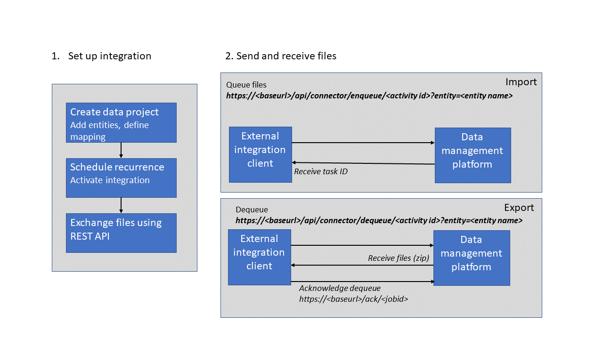
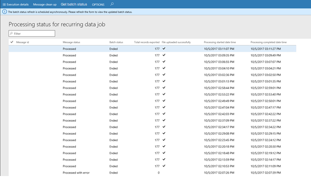

# Recurring integrations

[!include [banner](../includes/banner.md)]

Recurring integration does the following things:

- It builds on data entities and the Data management framework.
- It enables the exchange of documents or files between finance and operations and any third-party application or service.
- It supports several document formats, source mapping, Extensible Stylesheet Language Transformations (XSLT), and filters.

    

- It uses secure REST application programming interfaces (APIs) and authorization mechanisms to receive data from, and send data back to, integration systems.

    

## Authorization for the integration REST API
The integration REST API uses the same OAuth 2.0 authentication model as the other service endpoints. Before the integrating client application can consume this endpoint, you must create an application ID in Microsoft Entra ID (Azure AD) and give it appropriate permission to the application. When you create and enable a recurring job, enter the Azure AD application ID that interacts with that recurring job. Therefore, be sure to make a note of the application ID.

> [!NOTE]
> This feature is not supported with Dynamics 365 Finance + Operations (on-premises).

## Set up a data project and recurring data jobs
### Create a data project

1. On the main dashboard, select the **Data management** tile to open the **Data management** workspace.
2. Select the **Import** or **Export** tile to create a new data project.

    > [!NOTE]
    > If you have an existing data project, select **Load project** on the card for any data project on the **Data projects** tab.

3. Enter a valid job name, data source, and entity name.
4. Upload a data file for one or more entities. Make sure that each entity is added, and that no errors occur.

    > [!NOTE]
    > You can select each entity data card to set up, review, or modify field maps, and to set up XSLT-based transforms that must be applied to inbound data. For export data projects, the entity card also shows a filter link, so that you can set up filters to filter data. Currently, all recurring data jobs in a data project use the same filter.

5. Select **Save**.

### Create a recurring data job

1. On the **Data project** page, select **Create recurring data job**.
2. Enter a valid name and a description for the recurring data job.
3. On the **Set up authorization policy** tab, enter the application ID that was generated for your application, and mark it as enabled.
4. Expand **Advanced options** tab, and specify either **File** or **Data package**.

    - **File** – Your external integration pushes individual files so that they can be processed via this recurring data job. In this case, the format of the file that is expected is the same as the format that was specified when the entity was added to the data project.
    - **Data package** – You can push only data package files for processing. A data package is a new format that lets you submit multiple data files as a single unit that can be used in integration jobs.
    - **Process messages in order** – You can enable this option to force sequential processing of incoming files in an import scenario. This option is only applicable to files and not data packages.

5. Select **Set processing recurrence**, and then, in the **Define recurrence** dialog box, set up a valid recurrence for your data job.
6. Optional: Select **Set monitoring recurrence**, and set up a monitoring recurrence.

    > [!NOTE]
    > Currently, monitoring recurrence enables load monitoring only on the queue for your recurring data job. No additional policies are supported via this service. You can use this feature to fine-tune the processing recurrence as the load demand requires.

7. Select **OK**, and then select **Yes** in the confirmation message box.

For more information, see [Process and consume data packages in the finance and operations solutions](../lcs-solutions/process-data-packages-lcs-solutions.md).

## Manage recurring data jobs
1. In the **System administration** workspace (not the **System administration** module), select the **Data Management IT** workspace.
2. In the workspace, on the **Recurring data job** tab, select the recurring job to view the details. The **Manage scheduled data jobs** page contains a grid that lists any messages that are waiting in the queue. Therefore, you can monitor messages and the processing status.

    

## Clean up recurring data job messages

To clean up recurring data job messages, follow these steps.

1. Go to the **System administration** workspace (not the **System administration** module).
1. Select the **Data Management IT** workspace.
1. In the workspace, on the **Recurring data jobs** tab, select the recurring data job to open the **Manage scheduled data jobs** page.
1. Select the group under **Processing group** to open the Data management project that the recurring jobs are based on.
1. Select **Manage** -> **Manage recurring data jobs**. The **Manage scheduled data jobs** page opens.
1. Select **Manage messages**.
1. Select **Message clean up**.
1. In the **Message clean up window**, configure your parameters, and select **OK**.
1. Refresh the window after the cleanup job is complete.

## Submitting data to recurring data jobs
You can use integration REST endpoints to integrate with the client, submit documents (import), or pull available documents for download (export). These endpoints support OAuth.

## Integration REST APIs
The following set of APIs is used to exchange data between the integration client and the application.

### API for import (enqueue)
Make an HTTP POST call against the following URL.

```Console
https://<base URL>/api/connector/enqueue/<activity ID>?entity=<entity name>
```

In the message body, you can pass the data as a memory stream.

**Example**

```Console
POST https://usncax1aos.cloud.onebox.dynamics.com/api/connector/enqueue/%7B6D31E09F-0249-459F-94F0-Microsoft Entra ID9C2C47B64%7D?entity=Customer%20Groups
```

To get the activity ID, on the **Manage scheduled data jobs** page, in the **ID** field, copy the globally unique identifier (GUID).


### API for export (dequeue)
To return a data package that contains all the data entities that were defined in the data project, and that the client application can unzip and consume, use the following structure.

```Console
https://<base URL>/api/connector/dequeue/<activity ID>
```

**Example**

```Console
GET https://usncax1aos.cloud.onebox.dynamics.com/en/api/connector/dequeue/%7BC03BB937-09ED-46DE-86EE-4520D7D7E373%7D
```

After the client downloads the data, an acknowledgment must be sent back to the application, so that you can mark the data as received.

When there isn't a file uploaded to the blob, the dequeue API returns a response indicating as such.

### API for acknowledgment
Use the following API.

> [!NOTE]
> The body of the response of **/dequeue** must be sent in the body of the **/ack** POST request.

```Console
https://<base URL>/api/connector/ack/<activity ID>
```

**Example**

```Console
POST https://usncax1aos.cloud.onebox.dynamics.com/en/api/connector/ack/%7BC03BB937-09ED-46DE-86EE-4520D7D7E373%7D
```
> [!NOTE] 
> Until a message is successfully acknowledged, the same message becomes available to dequeue every 30 minutes. In cases when a message is being dequeued more than one time, the dequeue response sends the last dequeued date time. This date is blank for the first dequeue of a message. It is important to ensure that a message is successfully acknowledged to prevent a repeated download of the same message. When an acknowledgement fails, having re-try logic to acknowledge the failure is recommended.

### API for getting message status
The API to get the status of a message is available as of hotfix KB 4058074 for Platform update 12. This API is useful in import scenarios to determine if a message is successfully processed. A message is created when the [enqueue process](#api-for-import-enqueue) is completed. If the message returns a failed status, you can set your integration app to retry or take another action.

**Example**

```Console
POST /data/DataManagementDefinitionGroups/Microsoft.Dynamics.DataEntities.GetMessageStatus
BODY
{
    "messageId":"<string>"
}
```

The following table lists the possible status values.

| Value                | Meaning                                                                              |
|----------------------|--------------------------------------------------------------------------------------|
| Enqueued             | The file is successfully enqueued to blob storage                              |
| Dequeued             | The file is successfully dequeued from blob storage                            |
| Acked                | The exported file is acknowledged to be downloaded by the external application |
| Preprocessing        | The import/export operation is preprocessing the request                            |
| Processing           | The import/export operation is in process                                            |
| Processed            | The import/export operation completed successfully                                   |
| PreProcessingError   | The import/export operation failed in the preprocessing stage                       |
| ProcessedWithErrors  | The import/export operation completed with errors                                    |
| PostProcessingFailed | the import/export operation failed during post-processing                            |

> [!NOTE]
> The file in the blob storage remains in the storage for seven days, after which it's automatically deleted.

### API to get the list of execution errors
GetExecutionErrors can be used to get the list of errors in a job execution. The API takes the Execution ID as the parameter, and returns a set of error messages in a JSON list.

```Console
POST /data/DataManagementDefinitionGroups/Microsoft.Dynamics.DataEntities.GetExecutionErrors
BODY
{"executionId":"<executionId>"}
```

GetExecutionIdByMessageId can be used to get the Execution ID. The API take the enqueued message ID and return the Execution ID.

```Console
POST /data/DataManagementDefinitionGroups/Microsoft.Dynamics.DataEntities.GetExecutionIdByMessageId
BODY
{"_messageId":"<messageId>"}
```

## Automatic retry support during batch node restarts

Automatic retry support for recurring data jobs has been implemented to enable retries when a batch restarts. This feature is available starting from PU64.

Previous Design: 
There was one regular batch job with one runtime batch task.

:::image type="content" source="media/batch-one-task.png" alt-text="Diagram of the design with one regular batch job with one runtime batch task."::: 

New Design: 
There's one regular batch job (Job1) that creates a new runtime child job(Job2) and regular batch task is added to Job2 instead of Job1. 

:::image type="content" source="media/batch-child-job.png" alt-text="Diagram of the design with one regular batch job (Job1) that creates a new runtime child job(Job2) and regular batch task is added to Job2 instead of Job1."::: 

> [!NOTE]
> If you've customized your code that involves SysIntegrationActivityBatch and SysIntegrationActivityBatchTask classes, you may encounter issues with the recurring Integrations feature under the new design. For example, if you have created your own custom batch task and are adding task to Job1 as per previous design, then you are adding tasks to the wrong job. You should now add your custom tasks to job2 instead of job1 as per new design.
 

## Tips and tricks
### Viewing the batch job status for recurring integrations from the Data management workspace
Recurring integration data jobs run in batch mode. If a recurring job fails, you must investigate the instance of the batch job as part of the troubleshooting process. To make this investigation easier, click **Manage messages** to get to the **Process status for recurring data job** page, which now shows the status of the batch job.

The batch job status is retrieved asynchronously from the batch framework for the specified recurring data job. To see the most up-to-date batch job status, select **Get batch status**, and then refresh the page.

> [!NOTE]
> If the record for the batch history is deleted, the status for the batch job on the **Processing status for recurring data job** page is blank.



### Preventing uploads when there are no records
When you use recurring exports, you can choose not to upload a generated file or package if the total record count in that file or package is 0 (zero).

You can set **Prevent upload when zero records** when you configure a recurring export job or after a job is created. This option is available only when you use files or packages as data sources.

Your implementation might include runs of recurring jobs where files or packages were uploaded. Your implementation might also include runs where no files or packages were uploaded, because there was nothing to upload. If you suspect that a file that should have been uploaded wasn't uploaded, or that a file was uploaded that shouldn't be, you can use the **Manage messages** page for the recurring export job to help with the debugging process.

> [!NOTE]
> These features were added in Microsoft Dynamics 365 for finance and operations, Enterprise edition platform update 12. Jobs that were run before you upgraded to Platform update 12 won't have values in the following columns.

The **Total records exported** column shows the total count of records that were exported. A value of **0** (zero) indicates that no records were exported to the file or included in the package.

The **File uploaded successfully** column contains a check mark if the file or the package was uploaded successfully. If the file wasn't uploaded because of an error, or because there were no records, the column is blank.

### Http vs Https
The dequeue API returns HTTP instead of HTTPS. This behavior can be seen in application environments that use a load balancer, such as production environments. (You can't see the behavior in one box environments). We recommend that you change the URI scheme to HTTPS in the middleware application that is trying to dequeue from the application.


[!INCLUDE[footer-include](../../../includes/footer-banner.md)]
