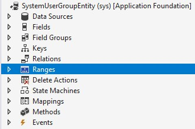
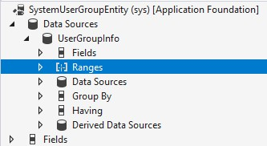
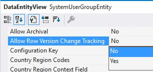
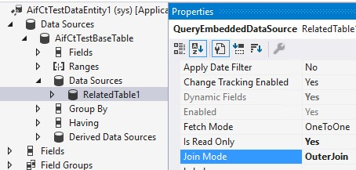
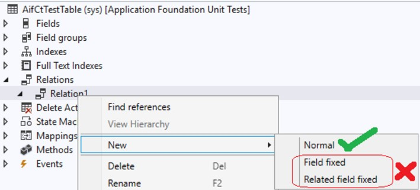

# Allow Row version change tracking for tables and data entities (Preview)

[!include[banner](../includes/banner.md)]
[!include [preview banner](../includes/preview-banner.md)]

A new change tracking option has been added to finance and operations apps. This option enables Microsoft Dataverse to be used for incremental synchronization of data. Change tracking is a prerequisite for several features, such as Data archival, Synapse integration, Mobile offline, and Relevance search. The eventual goal is to unify all existing finance and operations data synchronization frameworks into one that is based on Dataverse synchronization services.

Beginning in Microsoft Dynamics Finance 10.0.32 to 10.0.33, it's required to enable the **Sql row version change tracking** configuration key on the **License configuration** page. Beginning in Microsoft Dynamics Finance 10.0.34, it's required to enable the **Sql row version change tracking (Preview)** configuration key on the **License configuration** page. 

[!NOTE] If you have enabled the **Sql row version change tracking** configuration key before 10.0.34, it will be required to enable the new **Sql row version change tracking (Preview)** configuration key as part of moving to 10.0.34 or later. The configuration key used before 10.0.34 has been renamed to **Sql row version change tracking (Obsolete)**.

Before you create or update data entities so that you can use them with row version change tracking, verify that all tables that are used as data sources for those entities allow for row version change tracking.

For information about how to create a new entity, see [Build and consume data entities](build-consuming-data-entities.md).

## Enable row version change tracking for tables

You can enable the **Allow Row Version Change Tracking** option for tables by setting their metadata property to **Yes**. The property must be set to **Yes** for all tables that are used as data sources for a data entity to enable row version change tracking for that entity. During build operations, a **SysRowVersionNumber** column of the **rowversion** data type is added to the tables. Beginning in 10.0.34 a new **SysRowVersion** column is introduced and will be used for row version change tracking instead of the **SysRowVersionNumber** column. The **SysRowVersionNumber** column will become obsolete. Everything stated below will from 10.0.34 be true for the **SysRowVersion column**.

The **SysRowVersionNumber** column performs version stamping of table rows. SQL Server maintains a database-level counter that is incremented for each insert or update operation. Changes to a table row can be detected by comparing the current value in the **SysRowVersionNumber** column with the previous value.

> [!NOTE]
> The **SysRowVersionNumber** column (which is also known as the **rowversion** column) is read-only in SQL Server. Therefore, direct SQL update statements, such as the following example, will break if they try to create or update this column.
>
> ```SQL
> INSERT INTO table2
> SELECT * FROM table1
> ```
> The **SysRowVersionNumber** column is controlled by the **Sql row version** configuration key in the License configuration form, **System administration > Setup > Licensing > License configuration**. In the unlikely event that custom SQL update statements are trying to create or update the column, it will be required to disable the configuration key until the issue is resolved. Configuration keys can only be edited in maintenance mode, see [Maintenance mode](../sysadmin/maintenance-mode.md).

## Enable row version change tracking for data entities

You can enable the **Allow Row Version Change Tracking** option for data entities by setting their metadata property to **Yes**. Not all existing data entities are configured to support row version change tracking. The main limiting factor is the complexity of the entities. When **Allow Row Version Change Tracking** is set to **Yes** for a data entity, validation rules are evaluated at build time. However, we still recommend that you review and proactively apply these rules when you create or update entities.

ISVs and partners are recommended to always create new data entities when enabling Row version change tracking. This to avoid risks of existing custom extensions violating the validation rules below. Runtime validations will prevent new breaking extensions from being added once Allow row version is enabled

The following table describes the data entity validation rules.

| Rule | Comments | Error message |
|------|----------|---------------|
| Data entities that have a custom change tracking query aren't supported. | | Change tracking can't be enabled because the F&O entity %1 uses a custom query. |
| Data entities that have range filters aren't supported. | <p>Range filters can cause records to be filtered out from the view. In this case, the change won't be tracked as a deletion.</p>[](./media/DERanges.jpg) | Change tracking can't be enabled because the F&O entity %1 contains Ranges. |
| Data entities where the data sources have a group-by condition aren't supported. | [](./media/DataSourceGroupBy.jpg) | Change tracking can't be enabled because the data source %1 in the F&O entity %2 contains group By conditions. |
| The count of data sources in a data entity must be below the threshold. | You will receive a warning when the threshold is exceeded by 10, and when it's exceeded by 5. This count is configurable up to a maximum of 10. This limit helps improve performance. | Change tracking can't be enabled because the F&O entity %1 contains more than %2 data sources. |
| Data entities where the data sources have range filters aren't supported. | [](./media/DataSourceRangesjpg.jpg) | Change tracking can't be enabled because the data source %1 in the F&O entity %2 contains Ranges.  |
| Data entities that have non-table data sources aren't supported. | Nested data entities or data entities that contain views as data sources aren't supported. | Change tracking can't be enabled because the data source %2 in the F&O entity %1 isn't a table. |
| All tables in a data entity must allow for row version change tracking. | [](./media/AllowRowVersionChangeTracking.jpg) | Change tracking can't be enabled because the **Allow Row Version Change Tracking** property isn't set to **Yes** for the table related to data source %2 for the F&O entity %1. |
| Data sources in a data entity must be joined by using an outer join. | <p>Inner joins and exists joins aren't supported. Non-outer joins can cause records to be filtered out of the view. In this case, the change won't be tracked as a deletion.</p>[](./media/OuterJoinMode.jpg) | Change tracking can't be enabled since the Join Mode between the data source %1 and the data source %2 in the F&O entity %3 isn't %4. | 
| The relationship between data sources must be many to one. | One-to-many relationships aren't supported. A one-to-many relationship will generate duplicate virtual table **entityid** values. | Change tracking can't be enabled because the Relation %1 between the data source %2 and the data source %3 in the F&O entity %4 is one-to-many. |
| Only normal relation constraints are supported for data sources in a data entity. | [](./media/DataSourceRelations.jpg) | Change tracking can't be enabled because the Relation %1 between the data source %2 and the data source %3 in the F&O entity %4 isn't set to Normal. |
| Validate data entities that have time state–enabled tables. | Root tables that have an **Apply Date** filter aren't supported, because they can cause record disappearance. Time state tables aren't supported for related data sources, because they can cause either record disappearance or one-to-many relationships. | Change tracking can't be enabled because the data source %3 in the F&O entity %1 has a time state enabled table %2. |

When **Allow Row Version Change Tracking** is set to **Yes** for a data entity, the **SysRowVersionNumber** column of the primary table is added to the data entity view.

## Track deletions and cleanup

Data entity row deletions are tracked by using the **AifChangeTrackingDeletedObject** table.

A system batch job that is named **Delete tracking history clean-up** cleans up any records in the **AifChangeTrackingDeletedObject** table that have exceeded the retention period. Records are deleted in batches until the time-out criterion is reached. By default, the job runs every day at 1:00 AM. However, you can configure the recurrence and frequency of the job at **System Administration \> Batch Jobs**. Currently, the retention period is 10 days.

## Retrieve row version entity changes

This change tracking feature is fully compatible with Dataverse change tracking; however, there are some differences. For example, changes for finance and operations apps are returned if the last token is within the default value of 10 days, not the value of 90 days that is used for Dataverse tables. For more information, see [Use change tracking to synchronize data with external systems](/power-apps/developer/data-platform/use-change-tracking-synchronize-data-external-systems). 

[!INCLUDE[footer-include](../../../includes/footer-banner.md)]
