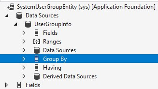

# Row version change tracking for tables and data entities

Finance and operations apps have a change tracking functionality option that's known as *row version change tracking*. This option enables Microsoft Dataverse to be used for incremental synchronization of data. Change tracking is a prerequisite for several features, such as Data archival, Synapse integration, Mobile offline, and Relevance search. The eventual goal is to unify all existing finance and operations data synchronization frameworks into one that's based on Dataverse synchronization services.

For row version change tracking functionality, a new column of type, **rowversion**, must be added to all tables in the data entity that requires change tracking. For more information about the **rowversion** column type, see [rowversion](/sql/t-sql/data-types/rowversion-transact-sql). For information about how to add a **rowversion** column to a table, see [Enable row version change tracking for tables](rowversion-change-track.md#enable-row-version-change-tracking-for-tables).

The **rowversion** column performs version stamping of table rows. SQL Server maintains a database-level counter that's incremented for each insert or update operation. Changes to a table row can be detected by comparing the current value in the **rowversion** column with the previous value.

## Enable row version change tracking functionality

Dynamics 365 Finance version 10.0.34 or later requires that you enable the **Sql row version change tracking** configuration key on the **License configuration** page (**System administration** \> **Setup** \> **Licensing** \> **License configuration**). Configuration keys are edited only in maintenance mode. For more information about maintenance mode, see [Maintenance mode](../sysadmin/maintenance-mode.md). When you exit maintenance mode after you enable the **Sql row version change tracking** configuration key, the database synchronization adds a **rowversion** column to tables that are enabled for row version change tracking.

> [!NOTE]
> The **rowversion** column is read-only in SQL Server. Therefore, direct SQL Data Manipulation Language (DML) statements that are run by using the X++ [Statement](/dotnet/api/dynamics.ax.application.statement.executeupdate) object, such as the following example, break if they try to insert or update this column.
>
> ```SQL
> INSERT INTO table2
> SELECT * FROM table1
> ```
>
> Therefore, enable and validate the configuration key in your sandbox environment before you enable it in production. In the unlikely event that direct SQL DML statements try to insert or update the column, you must disable the **Sql row version change tracking** configuration key until the issue is fixed.
>
> To fix the issue, you must modify the direct SQL DML statement in the X++ code and explicitly specify a column list for source and destination tables, as in the following example.
>
> ```SQL
> INSERT INTO table2 (Column1, Column2)
> SELECT ColumnA, ColumnB FROM table1
> ```

## Enable row version change tracking for tables

To enable row version change tracking for a table, set the **Allow Row Version Change Tracking** property of the table to **Yes**. The table then gets a new system field of the **rowversion** type that's named **SysRowVersion**.

> [!NOTE]
> Before version 10.0.34, while row version change tracking functionality was in preview, the row version column was named **SysRowVersionNumber**. In version 10.0.34, the **SysRowVersionNumber** column was replaced with a new **SysRowVersion** column. The **SysRowVersionNumber** column is now obsolete. In version 10.0.39, it's removed from the metadata of out-of-box tables. Don't make any dependencies for the **SysRowVersionNumber** column.

## Enable row version change tracking for data entities

To enable row version change tracking for a data entity, set the **Allow Row Version Change Tracking** property of the data entity to **Yes**. Not all existing data entities are configured to support row version change tracking. The main limiting factor is the complexity of the data entities. When the **Allow Row Version Change Tracking** property is set to **Yes** for a data entity, validation rules are evaluated at build time.

The following table describes the data entity validation rules.

| Rule | Comments | Error message |
|------|----------|---------------|
| Data entities that have a custom change tracking query aren't supported. | | Change tracking can't be enabled since the finance and operations entity '\{0\}' uses a custom query. |
| Data entities that have range filters aren't supported. | <p>Range filters can cause records to be filtered out from the view. In this case, the change isn't tracked as a deletion.</p>[](./media/DERanges.jpg) | Change tracking can't be enabled since the finance and operations entity '\{0\}' contains Ranges. |
| Data entities where the data sources have a group-by condition aren't supported. | [](./media/DataSourceGroupBy.jpg) | Change tracking can't be enabled since the finance and operations entity '\{0\}' contains Group By condition. |
| The count of data sources in a data entity must be below the threshold. | You receive a warning if the data source count exceeds five and an error if it exceeds 10. This limit helps improve performance. | Change tracking can't be enabled because the finance and operations entity \{0\} contains more than \{1\} data sources. |
| Data entities where the data sources have range filters aren't supported. | [](./media/DataSourceRangesjpg.jpg) | Change tracking can't be enabled since the data source '\{0\}' in the finance and operations entity '\{1\}' contains Ranges. |
| Data entities that have non-table data sources aren't supported. | Nested data entities and data entities that contain views as data sources aren't supported. | Change tracking can't be enabled since the data source '\{0\}' in the finance and operations entity '\{1\}' isn't a table. |
| All tables in a data entity must allow for row version change tracking. | [](./media/AllowRowVersionChangeTracking.jpg) | Change tracking can't be enabled since the **Allow Row Version Change Tracking** property isn't set to **Yes** for the table '\{0\}' in the finance and operations entity \{1\}.|
| Data sources in a data entity must be joined by using an outer join, and the join columns from the related data source should be immutable. | <p>Inner joins and exists joins aren't supported. Non-outer joins can cause records to be filtered out of the view. In this case, changes aren't tracked as a deletion.</p>[](./media/OuterJoinMode.jpg) | Change tracking can't be enabled since the Join Mode defined in the data source '\{0\}' in the finance and operations entity '\{1\}' isn't Outer Join.<br>Change tracking can't be enabled since the join column(s) from related table '\{0\}' are not immutable. | 
| The relationship between data sources must be many to one. | One-to-many relationships aren't supported. A one-to-many relationship generates duplicate virtual table **entityid** values. | Change tracking can't be enabled since the Relation '\{0\}' between data sources defined in the finance and operations entity '\{1\}' is one-to-many. |
| Only normal relation constraints are supported for data sources in a data entity. | [](./media/DataSourceRelations.jpg) | Change tracking can't be enabled since the Relation '\{0\}' between the data sources in the finance and operations entity '\{1\}' isn't set to Normal. |
| Validate data entities that have time state–enabled tables. | Root tables that have an **Apply Date** filter aren't supported, because they can cause record disappearance. Time state tables aren't supported for related data sources, because they can cause either record disappearance or one-to-many relationships. | Change tracking can't be enabled since the data source table '\{0\}' in finance and operations Data Entity '\{1\}' has a time state enabled.<br>Change tracking can't be enabled since the root data source '\{0\}' in the finance and operations entity '\{1\}' contains a date effective filter. |

We recommend that independent software vendors (ISVs) and partners always create new data entities when they enable row version change tracking. This approach helps reduce the risk that existing custom extensions violate the validation rules. Validation rule failures from custom extensions are surfaced as build warnings instead of errors to help prevent backward compatibility breaks.

When the **Allow Row Version Change Tracking** property is set to **Yes** for a data entity, the **SysRowVersion** column from underlying data sources is added to the data entity view.

## Track deletions and cleanup

Data entity row deletions are tracked by using the **AifChangeTrackingDeletedObject** table.

A system batch job that's named **Delete tracking history clean-up** cleans up any records in the **AifChangeTrackingDeletedObject** table that exceed the retention period. Records are deleted in batches until the time-out criterion is reached. By default, the job runs every day at 1:00 AM. However, you can configure the recurrence and frequency of the job at **System Administration \> Batch Jobs**. Currently, the retention period is 10 days.

## Retrieve entity changes

This change tracking feature is fully compatible with Dataverse change tracking. However, there are some differences. For example, changes for finance and operations apps are returned if the last token is within the default value of 10 days, not the value of 90 days that's used for Dataverse tables. For more information, see [Use change tracking to synchronize data with external systems](/power-apps/developer/data-platform/use-change-tracking-synchronize-data-external-systems).

[!INCLUDE[footer-include](../../../includes/footer-banner.md)]
