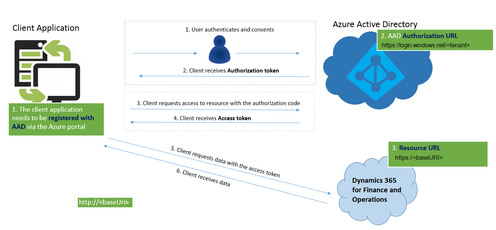

---
# required metadata

title: Service endpoints overview
description: This topic describes the service endpoints that are available.
author: peakerbl
ms.date: 06/22/2020
ms.topic: overview
ms.prod: 
ms.technology: 

# optional metadata

# ms.search.form: 
# ROBOTS: 
audience: Developer
# ms.devlang: 
ms.reviewer: sericks
# ms.tgt_pltfrm: 
ms.assetid: 5ff7fd93-1bb8-4883-9cca-c8c42ddc1746
ms.search.region: Global
# ms.search.industry: 
ms.author: peakerbl
ms.search.validFrom: 2016-02-28
ms.dyn365.ops.version: AX 7.0.0

---

# Service endpoints overview

[!include [banner](../includes/banner.md)]

This topic describes the service endpoints that are available in Microsoft Dynamics 365 Finance. It also provides a comparison to the endpoints that are available in Microsoft Dynamics AX 2012.

## List of services
The following table lists all the service endpoints, and compares the endpoints available for the application, and AX 2012.

| Service endpoint            | AX 2012 | Finance and Operations         |
|-----------------------------|---------|--------------------------------|
| Document services (AXDs)    | Yes     | No – Replaced by data entities |
| SOAP-based metadata service | Yes     | No – Replaced by REST metadata |
| SOAP-based query service    | Yes     | No – Replaced by OData         |
| OData query service         | Yes     | No – Replaced by OData         |
| SOAP-based custom service   | Yes     | Yes                            |
| JSON-based custom service   | No      | Yes                            |
| OData Service               | No      | Yes                            |
| REST Metadata Service       | No      | Yes                            |

This topic describes authentication for services, and the REST Metadata service. The following links provide detailed documentation for:

- [Custom service development](custom-services.md)
- [Open Data Protocol (OData)](odata.md)

## Authentication
OData services, JSON-based custom services, and the REST metadata service support standard OAuth 2.0 authentication.

We currently support both [Authorization Code Grant flow](/previous-versions/azure/dn645542(v=azure.100)) and [Service to service calls using client credentials (shared secret or certificate)](/azure/active-directory/develop/active-directory-protocols-oauth-service-to-service).

Two kinds of application are supported in Microsoft Azure Active Directory (AAD):

- **Native client application** – This flow uses a user name and password for authentication and authorization.
- **Web application (Confidential client)** – A confidential client is an application that can keep a client password confidential to the world. The authorization server assigned this client password to the client application.

For more information, see:

- [Authorize access to web applications using OAuth 2.0 and Azure Active Directory](/previous-versions/azure/dn645545(v=azure.100))
- [Troubleshoot service authentication issues](troubleshoot-service-authentication.md)

The following illustration describes how authorization must be configured for Authorization code grant flow.



And below is the illustration describes how authorization works for Service to service calls using client credentials (shared secret or certificate).


### Register a web application with AAD

> [!NOTE]
> These steps don't have to be completed by all the people in your organization. Only one Azure Service Administrator user can add the application and share the client ID with the developers.

**Prerequisite:** You must have an Azure subscription and admin access to Azure Active Directory (Azure AD).

Before any clients can communicate with the services, they must be registered in (Azure AD). These steps will help you register an application with (Azure AD). The steps are explained in the [Azure app registration training guide](/azure/active-directory/develop/app-registrations-training-guide-for-app-registrations-legacy-users). For specific configuration in this process, the following additional information must be used in context.

Select **Microsoft Dynamics ERP (Microsoft.ERP)**. If you search for **Microsoft Dynamics ERP** in the search field within **Select an API** it might appear to be unavailable. In that case, make sure that you search for the full name, as shown above.
Under **Delegated permissions**, you must select, at a minimum, the following options:

- Access Dynamics AX Custom Service
- Access Dynamics AX data
- Access Dynamics AX online as organization users

 > [!IMPORTANT]
 > Make sure that you copy the key, because you won't see it again. You will be required to know this secret key to complete your OAuth authentication and receive an Azure AD token.

### Register your external application 

1. In Finance and Operations apps, go to **System administration** \> **Setup** \> **Azure Active Directory applications**.
2. Select **New**.
3. Fill in the fields for the new record:

    - In the **Client Id** field, enter the application ID that you registered in Azure AD.
    - In the **Name** field, enter a name for the application.
    - In the **User ID** field, select an appropriate service account user ID. For this example, we have selected the **Admin** user. However, as a better practice, you should provision a dedicated service account that has the correct permissions for the operations that must be performed.

    When you've finished, select **Save**.

You've now finished setting up the prerequisites. After the external application retrieves an Azure AD authentication token, it should now be able to use the token in an authorization HTTP header to make subsequent service calls via OData or SOAP, for example.

### Client sample code

The following is C\# sample code for getting a token from AAD. In this flow, the user will be presented with a consent form (for cross-tenant application) and a sign-in form.

```csharp
UriBuilder uri = new UriBuilder ("https://login.windows.net/contoso2ax.onmicrosoft.com");

AuthenticationContext authenticationContext = new AuthenticationContext(uri.ToString());

//request token for the resource - which is the URI for your organization. NOTE: Important do not add a trailing slash at the end of the URI
AuthenticationResult authenticationResult = authenticationContext.AcquireToken("https://axdynamics1001aos.cloud.dynamics.com", clientId, redirectURI);

//this gets the authorization token, which needs to be passed in the Header of the HTTP Requests
string authenticationHeader = authenticationResult.CreateAuthorizationHeader();
```

To pass the user name and password without showing a pop-up, you can use the following overload of **AcquireToken**.

```csharp
UserCredential userCred = new UserCredential (username, password);
authenticationContext.AcquireToken("https://axdynamics1001aos.cloud.dynamics.com", clientId, userCred);
```

## REST metadata service
The REST metadata service is a read-only service. In other words, users can make only GET requests. The main purpose of this endpoint is to provide metadata information for elements. It is an OData implementation.

This endpoint is hosted at `http://\[baseURI\]/Metadata`.

Currently, this endpoint provides metadata for the following elements:

- **Labels** – Returns labels from the system. Labels have a dual pair key of language and ID, so that you can retrieve the value of the label.

    **Example:** `https://[baseURI\]/metadata/Labels(Id='@SVC\_ODataLabelFile:Label1',Language='en-us')`

- **Data entities** – Returns a JSON-formatted list of all the data entities in the system.

    **Example:** `https://[baseURI\]/Metadata/DataEntities`


[!INCLUDE[footer-include](../../../includes/footer-banner.md)]
