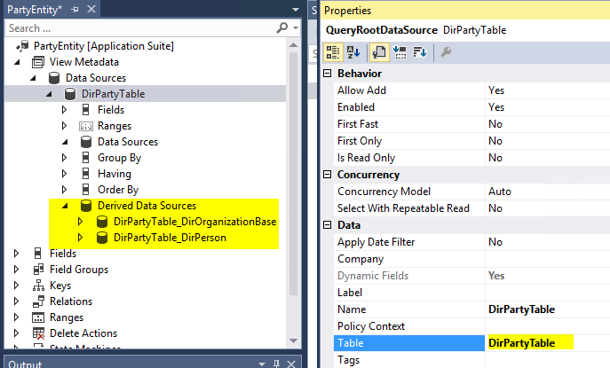
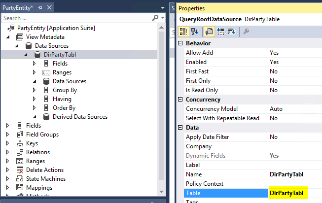
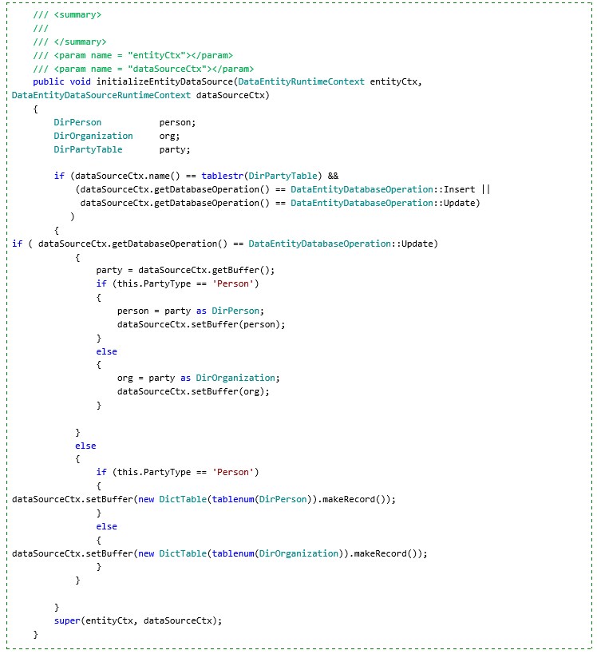

---
# required metadata

title: Super types and sub types
description: Describes support for inheritance patterns in data entities.
author: peakerbl
ms.date: 06/20/2017
ms.topic: article
ms.prod: 
ms.technology: 

# optional metadata

# ms.search.form: 
# ROBOTS: 
audience: Developer
# ms.devlang: 
ms.reviewer: twheeloc
# ms.tgt_pltfrm: 
ms.assetid: d59cefc0-be94-42e9-a22e-87493985dbcd
ms.search.region: Global
# ms.search.industry: 
ms.author: peakerbl
ms.search.validFrom: 2016-02-28
ms.dyn365.ops.version: AX 7.0.0

---

# Super types and sub types

[!include [banner](../includes/banner.md)]

[!INCLUDE [PEAP](../../../includes/peap-3.md)]

Describes support for inheritance patterns in data entities.

## Patterns

There are several ways to create entities for tables that involve inheritance:

- **Leaf/concrete type as data source:** If a concrete type is used as a data source, fields are displayed for both the base type and the current type. For example, in the following screen shots, if DirPerson is the data source, data source fields from both DirPerson and DirPartytable appear.

    

    

- **Abstract type/non-leaf as data source:** If a non-leaf type is used as a data source, fields are displayed for both the base type and the current type, but fields from any derived types aren't displayed. Fields from derived types must be added from derived data sources, as shown in the following screen shot.

    

## Data Entity View wizard
You can use the **Data Entity View** wizard to create data entities where the primary data source (and additional data sources) can be tables that are involved in inheritance.

> [!NOTE]
> Currently, the wizard doesn't support derived data sources. It shows only fields from the current type or the base type. After you create an entity, you can manually modify it to display derived data sources.

The following screen shots show a data entity that was created by using the wizard, where DirPartyTable is the primary data source.

1. Update the data source table to **DirPartyTabl**.

    

2. Update the data source table to **DirPartyTable**.

    

## Run time
There is run-time behavior for entities that related to inheritance.

### Creating entities for specified types

In this example, we create separate **Person** and **Organization** entities. The primary data source for the **Person** entity is DirPerson, and the primary data source for the **Organization** entity is DirOrganization. This approach, which is reflected in the following screen shots, doesn't require that you write any special run-time code.

### Creating entities for generalized types

In this example, we create a single entity, **Party**, that can be used for both **Person** and **Organization**. The primary data source is DirPartyTable, and derived data sources are DirPerson and DirOrganization. The new entity contains the following kinds of fields:

- **Common attributes** – Attributes that aren't specific to **Person** or **Organization**, such as **Name**. These fields are mapped to DirPartyTable.
- **Person-specific attributes** – **Gender**, **Marital Status**, and so on. These fields are mapped to derived data source DirPartyTable\_DirPerson.
- **Organization-specific attributes** – **OrgNumber**, **ABC**, and so on. These fields are mapped to derived data source DirPartyTable\_DirOrganization.

Mapping fields from base and multiple derived types in a single data entity is a design-time task. However, at run time, we must specify when each derived type should be created. This can be based on fields such as **InstanceRelationType**, or a computed column can be created to use **String** to represent different types. In the **Party** entity example, a **PartyType** computed column can be created to represent the **Person** and **Organization** derived types. The following code snippet illustrates this approach.

In this example, the **Party** type is computed by using the **InstanceRelationType** column on DirPartyTable. This approach works for reading data. However, to do **Create** or **Update** operations, you must write code where you override the **initializeEntityDataSource** method on the data entity, based on type, and set a correct instance of the derived type for the data source run-time context buffer.

[!INCLUDE[footer-include](../../../includes/footer-banner.md)]
