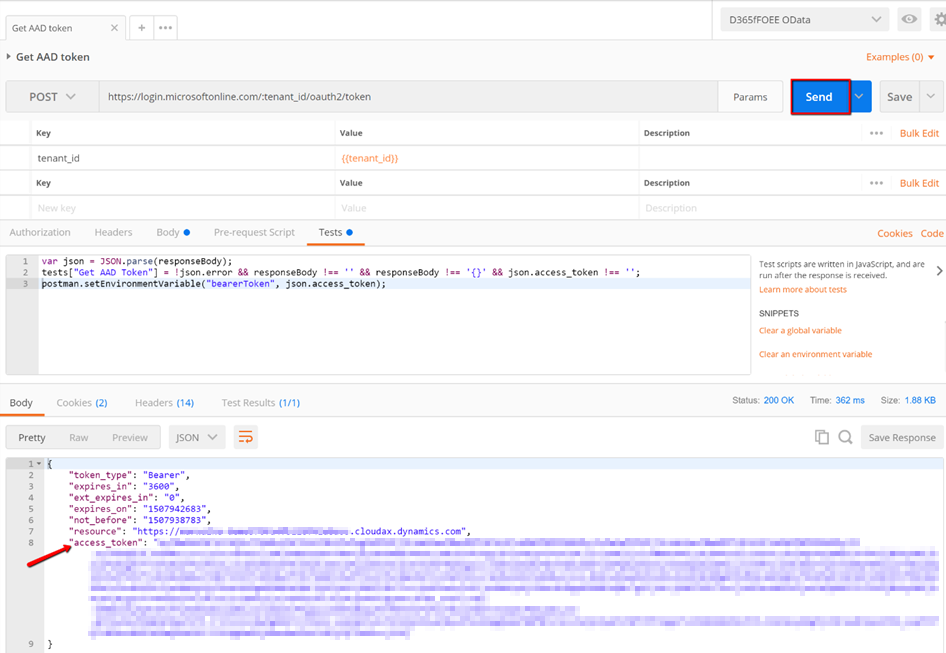
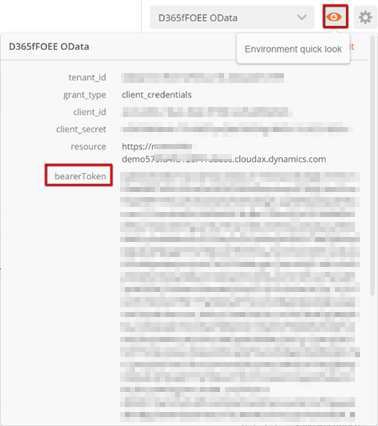

---
# required metadata

title: Test services by using third-party utilities
description: This article describes how to set up third-party utilities to test services.
author: peakerbl
ms.date: 12/05/2019
ms.topic: article
ms.prod: 
ms.technology: 

# optional metadata

# ms.search.form: 
# ROBOTS: 
audience: Developer
# ms.devlang: 
ms.reviewer: twheeloc
# ms.tgt_pltfrm: 
ms.assetid: 7137b0a0-1473-4134-b769-ede5e07fd6f5
ms.search.region: Global
# ms.search.industry: 
ms.author: peakerbl
ms.search.validFrom: 2016-02-28
ms.dyn365.ops.version: AX 7.0.0

---

# Test services by using third-party utilities

[!include [banner](../includes/banner.md)]


[!INCLUDE [PEAP](../../../includes/peap-3.md)]

At <https://github.com/Microsoft/Dynamics-AX-Integration>, Microsoft provides sample code for consuming services. However, there are many scenarios where the other endpoint in an integration might not use a Microsoft stack. Even when the other endpoint does use, for example, the Open Data Protocol (OData) client code that Microsoft makes available, you might find it useful to perform the following actions:

- Explore and analyze how an interaction's messages are constructed.
- Test the response of a service to a well-known request.
- Determine how exceptions will appear to the other endpoint.

Many frequently used tools that will help you perform these actions are available. This article isn't an endorsement of any tool. Although it provides examples that use some frequently used software utilities, the principles should broadly apply to other, similar tools.

## Prerequisites

Before you can test a service by using an external application, you must register the application in Microsoft Azure, and in finance and operations.

For details, see:

- [Register an application with AAD](services-home-page.md#register-a-web-application-with-aad)
- [Register your external application](services-home-page.md#register-your-external-application)

## Query OData by using Postman

Postman (<https://www.getpostman.com/postman>) is a tool that is often used to interact with RESTful services (such as OData) in scenarios that involve the development and testing of application programming interfaces (APIs). This procedure isn't an endorsement of Postman, and other similar tools are available. However, we are using Postman to illustrate the concepts and messages that are involved when you use OAuth to authenticate with Azure AD, and then make OData requests to and receive responses from the application.

1. Start Postman.
2. In the upper-right corner, select the gear button, and then select **Manage environments** to create or update an environment.
3. Enter a name for the environment, and then select **Bulk Edit**.
4. Enter key-value pairs as shown in the following table. Enter one pair per line, and separate the key and value by using a colon (:).

    | Key            | Value                                                                                               |
    |----------------|-----------------------------------------------------------------------------------------------------|
    | tenant\_id     | The Azure tenant ID that you looked up during the setup of prerequisites                            |
    | client\_id     | The Azure AD application ID that you registered during the setup of prerequisites                   |
    | client\_secret | The secret key that you generated during application registration during the setup of prerequisites |
    | grant\_type    | client\_credentials                                                                                 |
    | resource       | The base URL of the instance without the trailing '/'                                                 |

5. To verify that the key-value pairs can be parsed correctly, select **Key-Value Edit**, and review the results.
6. Close the environment page.
7. In the field to the left of the gear and eye buttons, select the new or updated environment.
8. To retrieve an Azure AD token, create a POST request that has a URL in the format `https://login.microsoftonline.com/[tenant ID]/oauth2/token`.

    You can use a URL parameter that refers to the **tenant\_id** environment variable, such as `https://login.microsoftonline.com/:tenant_id/oauth2/token`.

    

9. On the **Body** tab, add body elements as request parameters that refer to the environment variables that you created earlier. Select **Bulk Edit**, enter the keys from the previous table, enter a colon (:), and then enter the key name again but enclose it in double braces ({{}}). Enter one request parameter per line. For example, enter **grant\_type:{{grant\_type}}**. Here is an example.

    

10. On the **Tests** tab, create a test that validates that the response is reasonable, and that stores the returned authorization token in an environment variable. Here is an example.

    ```csharp
    var json = JSON.parse(responseBody);
    tests["Get Azure AD Token"] = !json.error && responseBody !== '' && responseBody !== '{}' && json.access_token !== '';
    postman.setEnvironmentVariable("bearerToken", json.access_token);
    ```

11. Select **Save**, enter a name and collection for the request, and then select **Save** again.
12. Select **Send** to make the authorization request. The **Body** tab should now contain an Azure AD token together with other response details.

    

13. Because of the test code, the token is now in an environment variable. You can see that the token is an environment variable by selecting the **Environment quick look** button (the eye button).

    

14. Create a request to perform create, read, update, or delete (CRUD) operations on the desired data entity via the OData service. Create the URL according to your requirements. For more information, see [Open Data Protocol (OData)](odata.md). You might find it useful to parameterize the request by using a variable that is stored in the environment, as shown earlier. The following example of a GET query uses a **Customer Account** parameter. The query returns name and address details for the customer account that is specified in the environment variable. Note that special characters must be correctly URL-encoded.

    ```Console
    https://[finance and operations instance URL]/data/Customers?$format=json&$filter=CustomerAccount%20eq%20%27{{custAccount}}%27&$select=CustomerAccount,Name,AddressDescription,FullPrimaryAddress
    ```

15. Add an Authorization header that refers to the authorization token that was retrieved earlier and stored in the **bearerToken** environment variable. The token must be prefixed by **Bearer** in the header.

    

16. Create a test to help validate the response. The following example tests that non-empty, JSON-formatted data is returned in the response body.

    ```csharp
    var json = JSON.parse(responseBody);
    tests["Get customer info"] = !json.error && responseBody !== '' && responseBody !== '{}';
    ```

17. Save and send the request, and then verify the result. You must ensure that the user account being used is set to a default company that has data. Alternatively, you can also specify cross-company=true as the query parameter in the OData request.

    

In our example, we have now successfully authenticated and then used the OData service to read a customer record.

## Query the SOAP custom service in your application by using SoapUI

SoapUI (<https://www.soapui.org/>) is a tool that is often used to interact with SOAP and REST web services in scenarios that involve API development and testing. This procedure isn't an endorsement of SoapUI, and other similar tools are available. However, we are using SoapUI to illustrate the concepts and messages that are involved when you use OAuth to authenticate with Azure AD, and then make SOAP requests to and receive responses.

1. Start SoapUI, and select the **SOAP** button to create a project.
2. Complete the information for the project:

    - In the **Project Name** field, enter a name for the project.
    - In the **Initial WSDL** field, enter the service address, and add the suffix **?wsdl**. (The service address should be in the format \[finance and operations instance base URL\]/soap/services/\[service group name\].) For more information, see the [Services home page](services-home-page.md).

        For example, we are querying the user session service at the URL `https://[finance and operations base URL]/soap/services/UserSessionService?wsdl`.

    - Select the **Create sample requests for all operations?** check box.

        Because you selected to create sample requests, one sample request is created for each service operation that is available.

        

3. Right-click the new project, and then select **New TestSuite** to create a test suite. This test suite will generate a POST request for an Azure AD authorization token.
4. Right-click the test suite, and then select **New TestCase**.
5. Expand the test case, right-click **Test Steps**, select **Add Step**, and then select **HTTP Request**.
6. Enter a name for the request, and then select **OK**.
7. Enter a name for the test step. The endpoint that you should use for the POST request is `[https://login.microsoftonline.com/[tenant_id]/oauth2/token](https://login.microsoftonline.com/%5btenant_id%5d/oauth2/token)`.
8. Use the plus sign (**+**) button next to **Parameters** to add the following values.

    | Parameter      | Value                                                           |
    |----------------|-----------------------------------------------------------------|
    | grant\_type    | client\_credentials                                             |
    | client\_id     | The application ID from the Azure AD application registration   |
    | client\_secret | The secret key value from the Azure AD application registration |
    | resource       | The URL of the instance without the trailing '/'                 |

9. To make sure that the parameters are in the POST body, select **Post QueryString**, and then select **Play**. An access token should be returned in the response pane. The values will be most readable if you use the **JSON response** tab. Copy the access token so that you can use it in the authorization header of subsequent requests.
10. Go back to the first request node under the **GetUserSessionInfo** SOAP sample request. In the request pane on the left, select the plus sign (**+**) button to add a header that is named **Authorization**. Paste the access token into the **Value** field, and add the prefix **Bearer**.
11. The sample requests that SoapUI creates won't work unless you modify them. You must edit the call context and body so that they are consistent with the schema for what you're trying to do.

    For our simple scenario, you can edit the optional call context elements so that they are null-valued. Insert a forward slash (/) before the greater than sign (&gt;) in the opening tags. Then comment out the question marks (?) and the closing tags by using the standard &lt;!--...--&gt; syntax to delimit the start and end of the comments. (Question marks aren't valid content for the XML schema.) Alternatively, you can just delete the question marks (?) so that the context elements are empty.

12. The SOAP request is now ready. Select **Play**, and validate the result on the right.

    

In our example, we have now successfully authenticated and then queried UserSessionService via SOAP.


[!INCLUDE[footer-include](../../../includes/footer-banner.md)]

