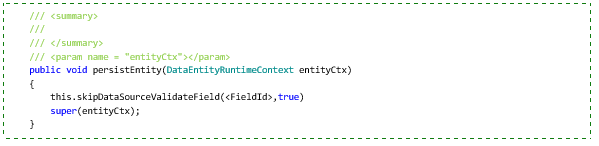
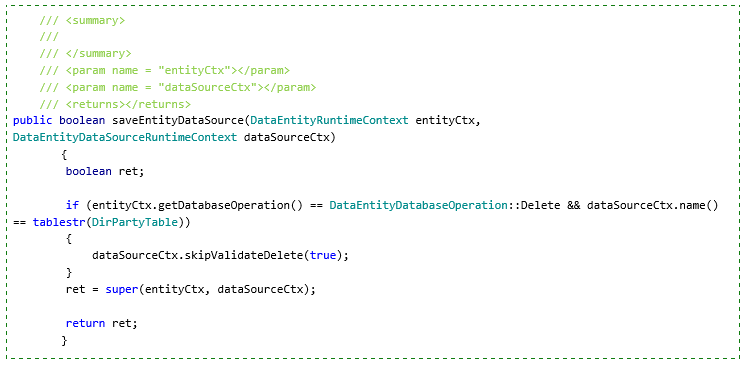
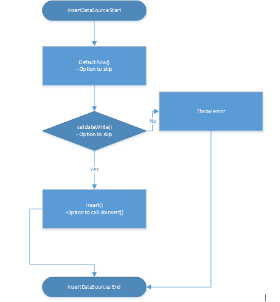

---
# required metadata

title: Validations, default values, and unmapped fields
description: This article describes how data entity values are validated, how default values can be provided, and how to use fields that are not mapped to data source values.
author: peakerbl
ms.date: 10/28/2019
ms.topic: article
ms.prod: 
ms.technology: 

# optional metadata

# ms.search.form: 
# ROBOTS: 
audience: Developer
# ms.devlang: 
ms.reviewer: twheeloc
# ms.tgt_pltfrm: 
ms.custom: 4624
ms.assetid: 7ea995fa-8ea0-403d-8a68-f19993c40a6d
ms.search.region: Global
# ms.search.industry: 
ms.author: peakerbl
ms.search.validFrom: 2016-02-28
ms.dyn365.ops.version: AX 7.0.0

---

# Validations, default values, and unmapped fields

[!include [banner](../includes/banner.md)]

[!INCLUDE [PEAP](../../../includes/peap-3.md)]

This article describes how data entity values are validated, how default values can be provided, and how to use fields that are not mapped to data source values, but instead contain virtual or computed data (unmapped fields).

## Validations
Validations can be defined on the tables that back up entities, at both the field level and the record level. Validations can also be defined at the data entity level.

### Table (data source) vs. entity validation

Entities are backed by tables (data sources), and validations are defined for these tables at both the field level (**Table.validateField()**) and the record level (**Table.validateWrite()**). The validations are respected by data entities that are built by using those tables. Although these validations are intrinsic to the tables that back a data entity, validations can also be defined at the data entity level. Like table-based validations, entity-based validations can be written at the field level (**DataEntity.validateField()**) or the record level (**DataEntity.validateWrite()**).

### Table-based validation behavior

Table validations are fired automatically as a part of the CUD operations. **Table.ValidateField, AllowEdit, AllowEditOnCreate** Field-level validations are fired automatically when you perform inserts or updates on the data entity. This is true for all paths (X++, OData, and so on). These validations occur during the mapping process, when fields are mapped from an entity to individual data sources.

After the field values from the data entity are copied to mapped data source fields, field validations are run on the set fields. Validations include table-level **validateField**, which validates **AllowEdit** and **AllowEditOnCreate**. If a validation fails because of an error, validation for the remaining fields continues. Finally, validation checks whether any error occurred during the validation process for any of the data sources. If there was an error, the process errors out at this point, and table-level **validateWrite()** isn't called. To skip **validateField** for a back-end table, a consumer can call **DataEntity.skipDataSourceValidateField(Int \_DataEntityFieldId, Boolean \_skip)**. Note that the field ID for this method is the field ID of the data-entity mapped field, not the back-end table field. By using the following API, you can skip validation for a particular field, regardless of the consumer.

**Table.ValidateWrite** Record-level **ValidateWrite** validations that are defined in back-end tables are fired automatically when you perform data-entity inserts and updates. This is true for all paths (X++, OData, and so on). These validations occur just before the actual insert or update is applied to the data source. If the validation fails, an error is thrown, and the process stops for other data sources. 

To skip **validateWrite** for all back-end tables for a data entity, a consumer can call **DataEntity.skipDataSourceValidateWrite(Boolean \_skip)**. This method turns **validateWrite** on or off for all data sources. By using the following API, you can skip validation for a particular data source, regardless of the consumer.

**Table.ValidateDelete** Record-level **ValidateDelete** validations that are defined in back-end tables are fired automatically when you perform data entity deletes. This is true for all paths (X++, OData, and so on). These validations occur just before the delete is applied to the data source. If the validation fails, an error is thrown, and the process stops for other data sources.

To skip **validateDelete** for all back-end tables for a data entity, a consumer can call **DataEntity.skipDataSourceValidateDelete(Boolean \_skip)**. This method turns **validateDelete** on or off for all data sources. By using the following API, you can skip validation for a particular data source, regardless of the consumer.

### Entity-based validation behavior

<table>
<thead>
<tr>
<th>Validation</th>
<th>Target</th>
<th>Caller</th>
</tr>
</thead>
<tbody>
<tr>
<td>DataEntity.ValidateField</td>
<td><ul>
<li>Data types</li>
<li>Mandatory relationships (both tables and extended data types [EDTs])</li>
<li>Any custom validation</li>
<li>Doesn't call <strong>validateField</strong> for underlying mapped table fields</li>
</ul></td>
<td><ul>
<li>Is called automatically from OData</li>
<li>Is called by the form engine when a field is modified</li>
<li>Isn't called automatically if an insert/update is fired from X++ code</li>
</ul></td>
</tr>
<tr>
<td>DataEntity.ValidateWrite</td>
<td><ul>
<li>Mandatory columns</li>
<li>Relationships (both tables and EDTs)</li>
<li>Any custom validation</li>
<li>Doesn't call table-level <strong>validateWrite</strong> for underlying tables</li>
</ul></td>
<td><ul>
<li>Is called automatically from OData</li>
<li>Is called by the form engine when a record is saved.</li>
<li>Isn't called automatically if an insert/update is fired from X++ code</li>
</ul></td>
</tr>
<tr>
<td>DataEntity.ValidateDelete</td>
<td><ul>
<li>DeleteActions</li>
<li>Any custom validation</li>
<li>Doesn't call table-level <strong>validateDelete</strong> for underlying tables</li>
</ul></td>
<td><ul>
<li>Is called automatically from OData.</li>
<li>Is called by the form engine when a record is deleted</li>
<li>Isn't called automatically if a delete is fired from X++ code</li>
</ul></td>
</tr>
</tbody>
</table>

## Defaults
Default values can be provided for initializations and rows.

### Initializations

**DataEntity.initValue:** A data entity is initialized with default values and by using any custom logic that is present in entity-level **initValue**. This method isn't called automatically when an insert or update is performed on a data entity from X++. It must be called explicitly if it's required. The method is called automatically by the form engine when a new record is created. **DataEntity.initValue** doesn't call the **initValue** method for back-end tables that are used in the data entity. **Table.initValue:** Table-level **initValue**, as defined for back-end tables, is fired when you perform a data entity insert. This is true for all paths (X++, OData, and so on). **Table.initValue** is run just before the entity is mapped to data source fields.

To skip entity-level **initValue** for all back-end tables for a data entity, a consumer can call **DataEntity.skipDataSourceInitValue(Boolean \_skip)**. This method turns **initValue** on or off for all data sources. By using the following API, you can skip **initValue** for a particular field, regardless of the consumer.

### DefaultRow

**DataEntity.DefaultRow: DataEntity.DefaultRow** is used in conjunction with **defaultField** and **getDefaultingDependencies** to provide defaults. It isn't called automatically by X++ or the form engine. **Table.DefaultRow: Table.DefaultRow** is called automatically for each data source after mapping is completed, and before the insert and validation on the data source.

## Unmapped fields
A data entity can have *unmapped* fields in addition those fields that are directly mapped to fields of the data sources. There are two mechanisms for generating values for unmapped fields:

- Custom X++ code
- SQL that is run by Microsoft SQL Server

The two types of unmapped fields are *virtual* and *computed*. Unmapped fields always support read actions, but the feature specification might not require any development effort to support write actions.

**Virtual field**

- A non-persisted field.
- Controlled by custom X++ code.
- Read and writes occur through custom X++ code.
- Typically used for intake values that are calculated by using X++ code and can't be replaced by computed columns.

**Computed field**

- The value is generated by an SQL view computed column.
- During reads, data is computed by SQL and fetched directly from the view.
- For writes, custom X++ code must parse the input value and then write the parsed values to the regular fields of the data entity. The values are stored in the regular fields of the data sources of the entity.
- Used mostly for reads.
- It's a good idea to use computed columns instead of virtual fields whenever you can, because computed columns are computed at the SQL Server level, whereas virtual fields are computed row by row in X++.

### Properties of unmapped fields

<table>
<thead>
<tr>
<th>Category</th>
<th>Name</th>
<th>Type</th>
<th>Default value</th>
<th>Behavior</th>
</tr>
</thead>
<tbody>
<tr>
<td>Data</td>
<td>IsComputedField</td>
<td>NoYes</td>
<td>Yes</td>
<td><ul>
<li><strong>Yes:</strong> The field is synchronized as a SQL view computed column. An X++ method is required to compute the SQL definition string for the column. The virtual column definition is static and is used when the entity is synchronized. After that, the X++ method isn't called at run time.</li>
<li><strong>No:</strong> The field is a true virtual field, where inbound and outbound values are fully controlled through custom code.</li>
</ul></td>
</tr>
<tr>
<td>Data</td>
<td>ComputedFieldMethod</td>
<td>String</td>
<td></td>
<td>A static <strong>DataEntity</strong> method in X++ is used to build the SQL expression that generates the field definition. This property is disabled and irrelevant if the <strong>IsComputedField</strong> property is set to <strong>No</strong>. The method is required if the <strong>IsComputedField</strong> property is set to <strong>Yes</strong>.</td>
</tr>
<tr>
<td>Data</td>
<td>ExtendedDataType</td>
<td>String</td>
<td></td>
<td></td>
</tr>
</tbody>
</table>

### Unmapped field comparison

<table>
<thead>
<tr>
<th></th>
<th>Virtual field</th>
<th>Computed field</th>
</tr>
</thead>
<tbody>
<tr>
<td>Metadata properties</td>
<td>Is computed = No</td>
<td><ul>
<li>Is Computed = Yes</li>
<li>Computed Field Method = static method</li>
</ul></td>
</tr>
<tr>
<td>Read</td>
<td><ul>
<li>X++ (override <strong>postLoad</strong>)</li>
<li>Row by row</li>
</ul></td>
<td><ul>
<li>SQL computed column</li>
<li>Set-based read possible</li>
</ul></td>
</tr>
<tr>
<td>Write</td>
<td>X++ (override <strong>mapEntityToDataSource</strong>)</td>
<td>X++ (override <strong>mapEntityToDataSource</strong>)</td>
</tr>
<tr>
<td>Advantages</td>
<td><ul>
<li>Unbound to the schema, keeps the public contract the same, but the implementation can change</li>
<li>Call X++ methods</li>
</ul></td>
<td>Faster reads, large export can occur directly from the view</td>
</tr>
</tbody>
</table>

### Examples

The following table provides a computed example if a **UnitOfMeasure** relationship exists, and displays that in an unmapped field.

| Virtual field | Computed field |
|---------------|----------------|
| On postLoad()*//Check to see if record exists in UnitOfMeasureInternalCode.UnitOfMeasure//Set hasFixedInternalCode value based on the field*if(this.UnitOfMeasure)this.HasFixedInternalCodeVirtual = NoYes::Yes; else this.HasFixedInternalCodeVirtual = NoYes::No; | On computedFieldMethod()*//Desired SQL computed column statement(CASE WHEN T2.RECID IS NULL THEN 0 ELSE 1 END) AS INT)* |

[!INCLUDE[footer-include](../../../includes/footer-banner.md)]
