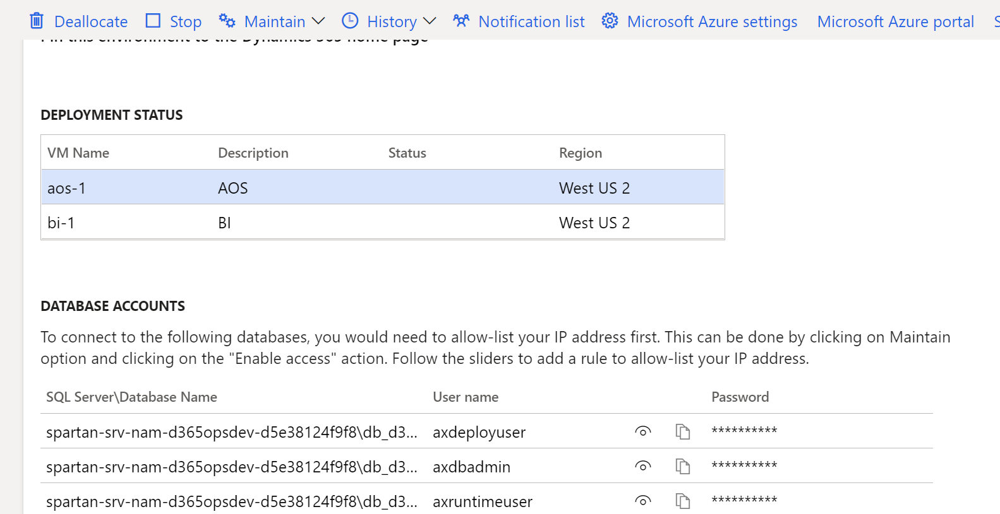

---
# required metadata

title: Enable just-in-time database access
description: This topic provides the steps necessary to enable database access in a just-in-time (JIT) fashion.
author: laneswenka
ms.date: 07/12/2021
ms.topic: article
ms.prod: 
ms.technology: 

# optional metadata

# ms.search.form: 
audience: Developer, IT Pro
# ms.devlang: 
ms.reviewer: sericks
# ms.tgt_pltfrm: 
# ms.custom: 
ms.search.region: Global
# ms.search.industry: 
ms.author: laswenka
ms.search.validFrom: 2017-06-16
ms.dyn365.ops.version: Platform update 20
---

# Enable just-in-time database access

[!include [banner](../includes/banner.md)]

This topic provides the steps necessary to enable database access using a just-in-time (JIT) fashion. This is useful if access to the database is required for various troubleshooting efforts, running unplanned queries, or data upgrade problem solving. This process is available for both self-service as well as Microsoft-managed sandbox acceptance test environments. For more information about the available environment types, see [Deployment overview](../deployment/cloud-deployment-overview.md).

## Microsoft-managed environments without RDP access

If you no longer have Remote Desktop Protocol (RDP) access to your sandbox, you can add your IP address to the allow-list in a self-service manner from Lifecycle Services (LCS). When RDP is removed from an environment, the machine credentials section of the environment details page is removed.  This leaves just the database accounts section, as shown in the following screenshot. 

From the environment details page for your sandbox environment, select **Maintain** > **Enable access**, and then in the dialog box, add the IP address of your source environment. This entry will expire, with the expire date shown alongside the IP address you entered. It also will be lost after the database is replaced by a database movement operation, such as database refresh or database import.

You can now use tools like SQL Server Management Studio (SSMS) to connect to the database, using the accounts from LCS and the IP address that you enabled. Note that LCS shows the server and database in the following format: **serverName\databaseName**.  To connect in SSMS, you will need to append the domain name suffix, such as **serverName.database.windows.net** if you are in Azure public cloud. On the **Options** tab in the SSMS connection window, you will also need to explicitly enter the databaseName value in the **Database** field to successfully connect.

## Self-service environments

The self-service environment type has never had Remote Desktop Protocol (RDP) access or static database accounts. However, it is still possible to access the database.

From the environment details page for your sandbox environment, select **Maintain** > **Enable access**, and then in the dialog box, add the IP address of your source environment. This firewall entry will expire after 8 hours or it will be lost after the database is replaced by a database movement operation (whichever comes first).  This includes operations such as database refresh or database import.

You also need to enter which type of access you require in the **Database Accounts** section. The available options include read or read-write access. Enter a short reason description and then select **Request access**.

When the page is refreshed, the database account will be shown with its expiry time.

You can now use tools like SQL Server Management Studio (SSMS) to connect to the database, using the accounts from LCS and the IP address that you enabled. Note that LCS shows the server and database in the following format: **serverName\databaseName**.  To connect in SSMS, you will need to append the domain name suffix, such as **serverName.database.windows.net** if you are in Azure public cloud. On the **Options** tab in the SSMS connection window, you will also need to explicitly enter the databaseName value in the **Database** field to successfully connect.

[!INCLUDE[footer-include](../../../includes/footer-banner.md)]
