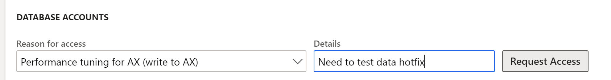
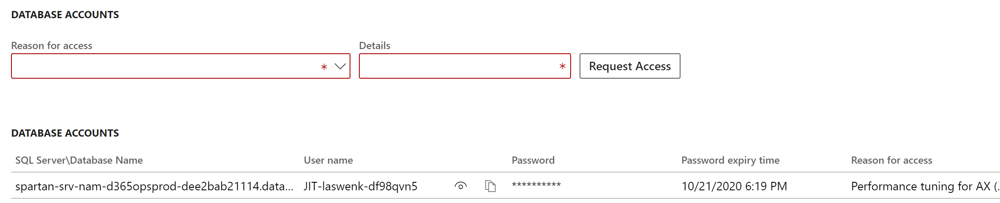

# Enable just-in-time database access

[!include [banner](../includes/banner.md)]

This article provides the steps necessary to enable database access using a just-in-time (JIT) fashion. JTT is useful if access to the database is required for various troubleshooting efforts, running unplanned queries, or data upgrade problem solving. This process is available for both Lifecycle Services managed environments and PPAC managed environments. For more information about the available environment types, see [Deployment overview](../deployment/cloud-deployment-overview.md).

## Lifecycle Services Managed Self-service environments

The self-service environment type never had Remote Desktop Protocol (RDP) access or static database accounts. However, it's still possible to access the database.

From the environment details page for your sandbox environment, select **Maintain** > **Enable access**, and then in the dialog box, add the IP address of your source environment. This firewall entry expires after 8 hours or it's lost after the database is replaced by a database movement operation (whichever comes first) including operations such as database refresh or database import.

You also need to enter which type of access you require in the **Database Accounts** section. The available options include read or read-write access. Enter a short reason description and then select **Request access**.

When the page is refreshed, the database account is shown with its expiry time.

You can now use tools like SQL Server Management Studio (SSMS) to connect to the database, using the accounts from Lifecycle Services and the IP address that you enabled. Lifecycle Services shows the server and database in the following format: **serverName\databaseName**.  To connect in SSMS, you need to append the domain name suffix, such as **serverName.database.windows.net** if you are in Azure public cloud. On the **Options** tab in the SSMS connection window, you also need to explicitly enter the databaseName value in the **Database** field to successfully connect.

> [!NOTE]
> The domain name suffix might be different for Government Community Cloud (GCC).

[!INCLUDE[footer-include](../../../includes/footer-banner.md)]
