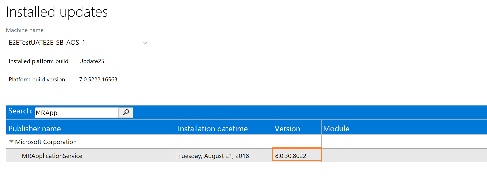

# Point-in-time restore of the production database to a sandbox environment

[!include [banner](../includes/banner.md)]

You can use Microsoft Dynamics Lifecycle Services (LCS) to do a point-in-time restore (PITR) of the production database to a user acceptance testing (UAT) sandbox environment. Microsoft maintains [automated backups](/azure/sql-database/sql-database-automated-backups) of the business and financial reporting databases for 28 days for Production environments and 7 days for Sandbox environments.

> [!IMPORTANT]
> Microsoft doesn't support copying production data to a sandbox environment for the purpose of production reporting.

## Self-service point-in-time restore Production to Sandbox

To provide customers with data application lifecycle management (DataALM) capabilities that don't rely on human or manual processes, the Lifecycle Services team has introduced an automated restore database action. The following is an overview of the process for doing a self-service database restore.

1. Go to the **Environment Details** page for your target Sandbox, and select **Maintain** \> **Move database** button.
2. Select the **Point-in-time restore Prod to Sandbox** option, and then select the desired point in time.
3. Make a note of the warnings, and review the list of data elements that aren't copied from the source environment's previous point in time.
4. The restore operation begins immediately.

> [!IMPORTANT]
> Self-service point in time restore (PITR) isn't supported between environments that are on different regions. For more information, see the Known issues section later in this article.

### Applicable scenario for production to sandbox restore

Restoring the production database to a sandbox environment is useful if you accidentally lost data in your production environment. Using this method, you have a chance to recover the data and repopulate it into your production environment. Perform a point-in-time restore from your production environment to your sandbox environment, connect to your sandbox environment to recover the data from the restored database, then repopulate it back into your production environment.

### Restore operation failure

If the restore operation isn't successful, it automatically rolls back. Your target sandbox environment is restored to the state that it was in before the restore began. Rollbacks are made available by the PITR capability of Azure SQL Database. They're typically required if a customization that is present in the target sandbox environment can't complete a database synchronization with the newly restored data.

To determine the root cause of the failure, use the **Environment change history** page to download the logs for the failed rollback operation.

### Data elements that aren't copied during restore copy

When you refresh a production environment to a sandbox environment, or a sandbox environment to another sandbox environment, some elements of the database aren't copied over to the target environment. Here are some examples:

* Email addresses in the LogisticsElectronicAddress table.
* Simple Mail Transfer Protocol (SMTP) Relay server in the SysEmailParameters table.
* Print Management settings in the PrintMgmtSettings and PrintMgmtDocInstance tables.
* Environment-specific records in the SysServerConfig, SysServerSessions, SysCorpNetPrinters, SysClientSessions, BatchServerConfig, and BatchServerGroup tables.
* All files stored in Azure blob storage. This includes document attachments (from the DocuValue and DocuDeletedValue tables) and custom Microsoft Office templates (from the DocuTemplate table).
* All users except the admin will be set to **Disabled** status.
* All batch jobs will be set to **Withhold** status.
* All users will have their partition value reset to the "initial" partition record ID.
* All Microsoft-encrypted fields will be cleared, because they can't be decrypted on a different database server. An example is the **Password** field in the SysEmailSMTPPassword table.
* Dual-write configuration.  To set up a new link on the target environment after this operation is successful, see [Enable Power Platform Integration](../../dev-itpro/power-platform/enable-power-platform-integration.md).

Some of these elements aren't copied because they're environment-specific. Examples include BatchServerConfig and SysCorpNetPrinters records. Other elements aren't copied because of the volume of support tickets. For example, duplicate emails might be sent because SMTP is still turned on in the UAT environment, invalid integration messages might be sent because batch jobs are still enabled, and users might be enabled before admins can perform post restore cleanup activities.

### Environment administrator

The system administrator account in the target environment (that is, the account that has a **UserId** value of **Admin**) is reset to the value that is found in the web.config file in the target environment. This value should match the value of the administrator account in LCS. To preview this account, go to the **Environment Details** page for your target sandbox environment in LCS. The value that was selected in the **Environment Administrator** field when the environment was first deployed is updated so that it matches the system administrator account in the transactional database. Therefore, the tenant of the environment will also be the tenant of the environment administrator.

If you've used the Admin User Provisioning Tool on your environment to change the value in the web.config file, that value might not match the value in LCS. If you require that a different account be used, you must deallocate and delete the target sandbox environment, and then redeploy it and select another account. You can then perform another restore database action to restore the data.

An environment can't be restored from one tenant to another. This restriction applies even to .onmicrosoft.com tenants. You should make sure that the admin accounts in the source and target environments are from the same tenant domain.

### Conditions for doing a PITR copy of a production environment to a sandbox environment

The following is a list of requirements and conditions of operation for a database restore:

- A restore performs a delete operation on the original target database.
- The target environment will be available until the database copy has reached the target server. After that point, the environment will be offline until the restore process is completed.
- The restore will affect only the application and Financial Reporting databases.
-  No **file stored in Azure blob storage is copied** from one environment to another. This includes **document attachments and custom Microsoft Office templates**. These documents won't be changed and will remain in their current state. 
- All users except the Admin user and other internal service user accounts will be unavailable. Therefore, the Admin user can delete or obfuscate data before  other users are allowed back into the system.
- The Admin user must make required configuration changes, such as reconnecting integration endpoints to specific services or URLs.
- All data management integration jobs that have recurring import and export enabled must be fully processed and stopped in the target system before the restore is started. In addition, we recommend that you select the database from the source after all recurring import and export jobs have been fully processed. In this way, you ensure that there are no orphaned files from either system in Azure storage. This step is important because orphaned files can't be processed after the database is restored in the target environment. After the restore, the integration jobs can be resumed.
- Business events end points must be deleted and reconfigured in the environment where the database is restored to ensure the same end points aren't used. This will also require the business events to be deactivated and reactivated to the new end points that were configured in the environment.
- Any user who has the Project owner or Environment manager role in LCS will have access to the SQL and machine credentials for all nonproduction environments.
- The databases must be hosted in the same Azure geographic region, unless the databases are Spartan-managed.  Databases are Spartan-managed when you see 'spartan' as part of the fully qualified SQL server address.
- The allocated database capacity of the source environment must be less than the maximum database capacity of the target environment.

## Steps to complete after a restore is done for environments that use Commerce functionality

[!include [environment-reprovision](../includes/environment-reprovision.md)]

## Known issues

### The Restore operation fails if the sandbox customizations are incompatible with production data

Even if a customization is successfully added to the sandbox environment (that is, the customer's AOT deployable package is successfully installed via LCS), it might not succeed for production data. For example, a customer adds a unique index on **Vendor Name** to the VendTable table. This customization can be successfully installed if there are no duplicate vendor names in the sandbox environment. However, when the production database is brought in as part of the Restore operation, installation might fail if there are duplicates in the dataset that is inbound to the sandbox environment. Duplicates in this dataset aren't supported. Therefore, you must remove the customization before you can have a successful Restore operation.

### The Restore operation is denied for environments that run Platform update 20 or earlier

The database restore process can't currently be completed if the environment is running Platform update 20 or earlier. For more information, see the [list of currently supported platform updates](../migration-upgrade/versions-update-policy.md).

### The source and target environments have incompatible versions of Financial Reporting

The database restore process (self-service or via a service request) can't be successfully completed if the version of Financial Reporting in your target environment is earlier than the version in your source environment. To resolve this issue, update both environments so that they have the latest version of Financial Reporting.

To determine the version that is installed in your source and target environments, select **View detailed version information** on the **Environment Details** page. Then search for **MRApplicationService**, and make sure that the version in the target environment is later than or the same as the version in the source environment.

Customers that are using version 8.1 or later should follow these steps.

1. Go to the **Update** tiles for your UAT environment. Save the updates to your Project asset library.
2. Apply the package to your UAT environment.
3. Verify that the error has been resolved.

Customers that are using version 8.0 or earlier should follow these steps.

1. Review the environment history of your source environment. Specifically, look for any "Platform and application binary package" package that has been deployed to the source environment but not to the target environment.
2. Apply the binary package to your target environment.
3. Verify that the error has been resolved.

### The source and target environments have incompatible application versions

The database restore process (self-service or via service request) can't be completed if the application release of your source environment and the application release of your target environment aren't the same. Because the data upgrade process isn't run by using database movement operations such as refresh, data loss can occur.

If you're upgrading your sandbox UAT environment to a newer application version (for example, from 7.3 to 8.1), be sure to perform the database restore action before you start the upgrade. After your sandbox environment is upgraded to the newer version, you can't restore an older production environment database to the sandbox UAT environment.

Conversely, if your production environment is newer than your target sandbox environment, you must either upgrade the target sandbox environment before the restore, or just deallocate, delete, and redeploy the environment before you do the refresh.

### The source and target are on different infrastructure (Microsoft-managed vs. self-Service)

The PITR process isn't supported between a Microsoft-managed environment as a source and a self-service environment as a destination. For example, if the production environment is Microsoft-managed and in East US, and a PITR is needed for the sandbox environment, which is self-service and in East US. PITR isn't supported. The alternative is to move the production environment to self-service or to opt for a regular database refresh instead.

### Point in time restore between source and target that are both on self-Service, in different regions
The PITR process isn't supported between self-service environments across different regions. For example, if the production environment is in East US and a PITR is needed for the sandbox environment, which is self-service and in West Europe, PITR isn't supported. The alternative is to get both the environments in the same region or opt for a regular database refresh instead.

[!INCLUDE[footer-include](../../../includes/footer-banner.md)]
