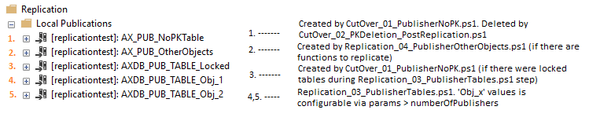
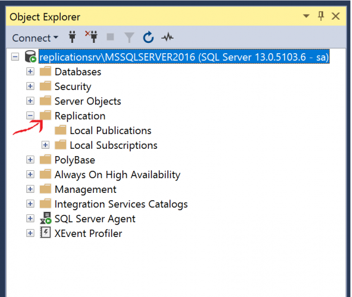
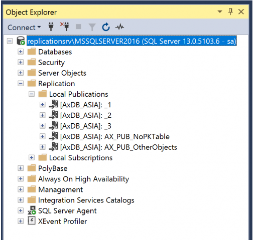
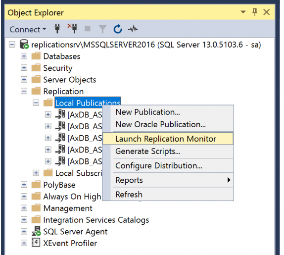
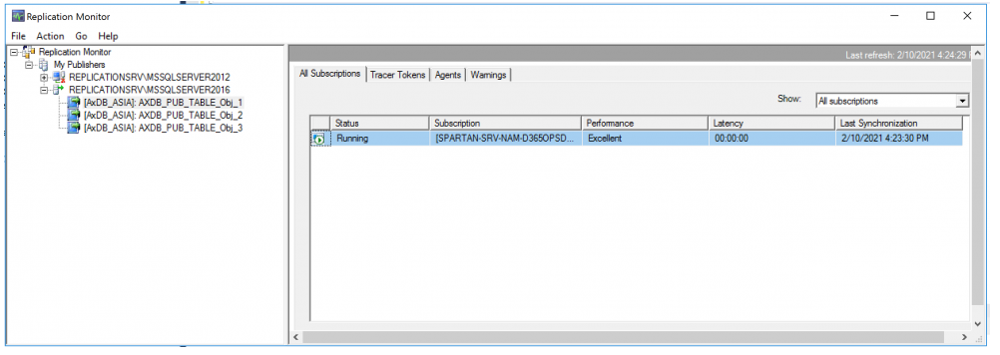
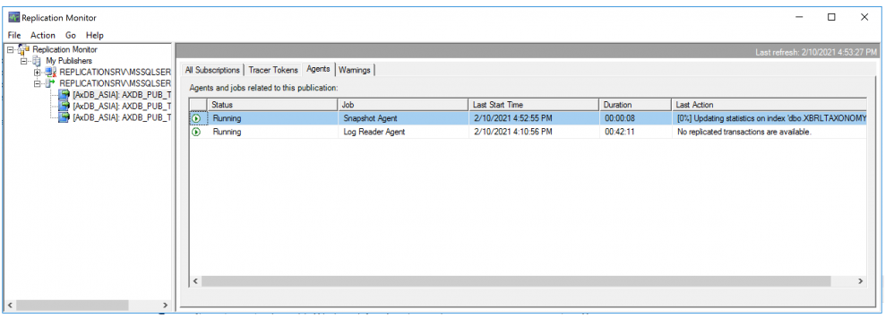
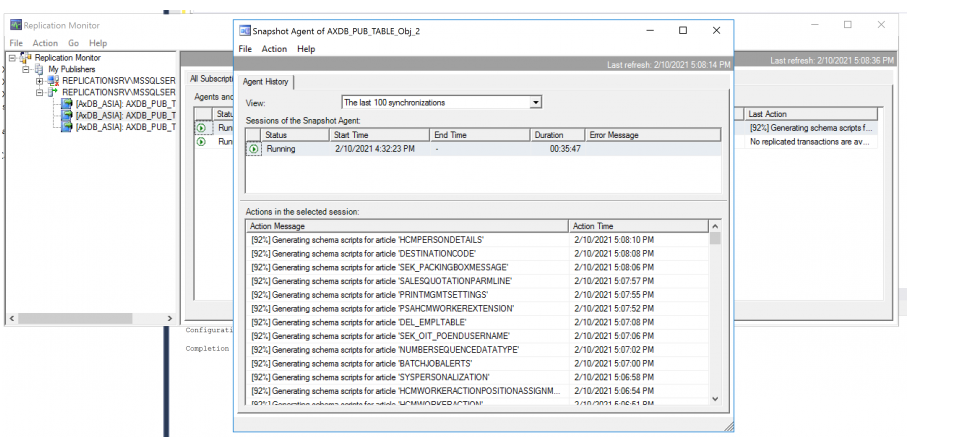

---
# required metadata

title: Upgrade from AX 2012 - SQL Transactional Replication 
description: This topic shows how to upgrade a large Microsoft Dynamics AX 2012 database to Finance and Operations apps.
author: sarvanisathish
ms.date: 04/26/2021
ms.topic: article
audience: IT Pro
ms.reviewer: sericks
ms.search.region: Global
ms.author: sarvanis
ms.search.validFrom: 2021-04-30
---

# Upgrade from AX 2012 - SQL Transactional Replication 

[!include [banner](../includes/banner.md)]

[!include [upgrade banner](../includes/upgrade-banner.md)]

This topic shows how to upgrade a large Microsoft Dynamics AX 2012 database to Finance and Operations apps. This process uses SQL Transactional Replication to bring the schema and data from the AX 2012 on-premises database to the sandbox environment.

We strongly recommend that you run the data upgrade process in a development environment before you run it in a shared sandbox environment. This approach will help reduce the overall time that is required for a successful data upgrade. For more information, see [Upgrade from AX 2012 - Pre-upgrade checklist for data upgrade](../migration-upgrade/prepare-data-upgrade.md).

## Replication setup

Replication is a set of technologies for copying and distributing data and database objects from one database to another, and then synchronizing between the databases to maintain consistency. This migration and copying happens with the source system online, which means there is no need for Finance and Operations service downtime during the replication process. The **Online Database Migration Toolkit** uses transactional replication. This is typically used in server-to-server scenarios that require high-throughput  to improve scalability and availability.

The **Online Database Migration Toolkit** can be downloaded from Lifecycle Services (LCS) in **Shared asset Library > Model**.

## Prerequisites
The following prerequisites are needed for the **Online Database Migration Toolkit**.

- The source SQL Server should have the replication feature installed ane enabled. To check whether replication is enabled, execute the following SQL script.

     ```sql
     -- If @installed is 0, replication must be added to the SQL Server installation. 
    USE master;
    GO  
    DECLARE @installed int;  
    EXEC @installed = sys.sp_MS_replication_installed;  
    SELECT @installed; 
     ```
     
	If the replication components are not installed, follow the steps in [Install SQL Server replication](/sql/database-engine/install-windows/install-sql-server-replication). 

-	SQL Agent should be running in the source database server.

-	SA Authentication: A user should have DB_Owner privilege in the source database and the target database. In the source database, the user should have access to masterDb and sourceDb.

-	Update the target firewall by allow-listing the source IP. This can be done via LCS. This only allows for 8 hours of access. After allow-listing, you need to execute the following stored procedure in the target database to have more than 8 hours of access.

     ```sql
     -- Create database-level firewall setting for IP a.b.c.d 
     EXECUTE sp_set_database_firewall_rule N'AX 2012 Upgrade', 'a.b.c.d', 'a.b.c.d'; 
     ```
- To optimize the replication latency/performance, the following are fine-tuned distributors parameters that can be updated in the params.xml.
    - MaxBcpThreads
    - NumberOfPublishers
    - Distributor database paths

- Stop the AOS service in the target environment, so that the target database will get replicated more efficiently. Running the AOS in the target may cause slowdown in the replication process. This may cause schema lock or deadlock in the replication process.

- When setting up Distributor: The script creates a database in the source server. Be sure you have enough space. The recommended is minimum to have the size of the source database. In params.xml, specify the distributor database path so that the database can be created in the specified path.

- Update params.xml

    ```xml
    <?xml version="1.0" encoding="UTF-8"?>
	<! -- Database replication parameters for an AX 2012 to Dynamics 365 upgrade -->
	<Config>
   	  <!-- Edit the properties in this section for your source AX 2012 database -->
    	 <SourceDatabase>
           	     <Server>SQLSERVERNAME\SQLINSTANCE</Server>
           	     <Database>MicrosoftDynamicsAX</Database>
              	  <UserName>ReplicationUser</UserName>
              	  <Password>********************</Password>
    	 </SourceDatabase>
    	 <!-- Edit the properties in this section for your target Dynamics 365 database -->
    	 <TargetDatabase>
              	  <Server>dbmigration.database.windows.net</Server>
             	   <Database>dbms-prod</Database>
             	   <UserName>axdbadmin</UserName>
             	   <Password>*******************</Password>
     	</TargetDatabase>
    	 <!-- Edit the properties in this section for your local SQL replication settings -->
     	<SQLReplicationSettings>
		<!-- Ensure that you have enough space in the drive/path -->
		<SnapShotWorkingDir>D:\SQLServer\SnapShot</SnapShotWorkingDir>
          	 <DistributorDBDataFolder>D:\SQLServer\Data</DistributorDBDataFolder>
         	  <DistributorLogFolder>D:\SQLServer\Data</DistributorLogFolder>
         	  <!-- Based on the number of cores, you can set this, but the max this value can be is 8. This value should be between 4 to 8 -->
         	  <MaxBCPThreads>4</MaxBCPThreads>
         	  <!-- To increase the performance of the replication. This value should be between one and three. This value will be used to create the number of publishers for tables with primary keys. -->
         	  <NumberOfPublishers>2</NumberOfPublishers>
         	  <!-- Ignore DB objects xml file. The database objects listed in these files will be not be replicated. -->
        	   <IgnoreTablesList>\Data\ignoretables.xml</IgnoreTablesList>
        	   <IgnoreFunctionsList>\Data\ignorefunctions.xml</IgnoreFunctionsList>
     	</SQLReplicationSettings>
	</Config>
    ```
    
- XML Schema: To ignore selected tables, views, and functions during replication, add this information.

    ```xml
    <IgnoreTables>                      <IgnoreFunctions>
        <Name>SYSDATABASELOG</Name>         <Name></Name>
    </IgnoreTables>                      </IgnoreFunctions>
    ```
    
## Configuring replication

The **SQLTransactionalReplication** folder has all the Windows PowerShell scripts that are required to configure the SQL transactional replication. These scripts should be executed using the following sequence. Be sure to wait for the process to finish.

1. **Replication_01_DataBaseCleanup.ps1** - Will empty the target database.
2. **Replication_02_Distributor.ps1** - Upon completion, the distributor database will get created in the source database server under the system database.
3. **Replication_03_PublisherTables.ps1** - After the publisher scripts are successfully executed, publication will be created under the replication folder. Note that this will take some time to complete. This creates publishers AXDB_PUB_TABLE_Obj_[*].

    > [!WARNING]
    > Wait for data replication to complete before executing cutover scripts. You can check the status in the following ways:
    > - Replication monitor: On the source server, right- click the **Replicatior** folder and select **Launch Replication Monitor**. 
    > - Run GetStatus.ps1 script embedded in the replication toolkit. **DataReplicationStatus** must be set to complete for each AXDB_PUB_TABLE_Obj_[*] publication.
  
4. **Replication_04_PublisherOtherObjects.ps1** - Replicates functions to the target database by creating new publication. This step can be omitted if you don't want to move functions. Note that this will be completed quickly. This creates publisher AX_PUB_OtherObjects.
5. **CutOver_01_PublisherNoPK**.ps1 - This creates two publications to replicate: 
        - Non-primary key tables 
        - Locked tables with publication names: AX_PUB_NoPKTable, AXDB_PUB_TABLE_Locked
7. **CutOver_02_PKDeletion_PostReplication.ps1** - This will clean up the temp tables created for tables with no primary keys. Deletes publication AX_PUB_NoPKTable.
8. **CutOver_03_RetrieveAndCreateNoPKConstraints.ps1** - This extracts constraints for the tables with no primary keys from the source and creates them in the target database.
9. **CutOver_04_RemoveReplication.ps1** - After successful replication of the database, you can execute this script to remove replication setup information. If you want to remove the snapshot folder without errors, execute the following stored procedure in the source Db. Otherwise, after execution you will get an error that the system was unable to remove the snapshot folders, which should be removed manually.

```sql
EXEC master.dbo.sp_configure 'show advanced options', 1
RECONFIGURE WITH OVERRIDE
EXEC master.dbo.sp_configure 'xp_cmdshell', 1
RECONFIGURE WITH OVERRIDE
```

The following publications will get created in the source database when setting up the replication.



## Find the replication status and get an exception

To find the replication status and get an exception, execute the PowerShell script and wait for it to finish.

**GetStatus.ps1** - When you execute this script, the **Replication status** table will be listed, along with the schema AgentId, PublicationName, Job, LastSynced, JobStatus, ReplicationStatus, and Comments.

- AgentId - Used to fetch the exception details about the job.
- PublicationName - The publication names created for replicating the data. You can find the same information in the SQLServerExplorer under Replication folders.
- Job - There are two types of jobs: Snapshot and Data Replication.
- JobStatus - This will display the statuses of Started, Succeeded, In Progress, Idle, Retrying, or Failed. For snapshot jobs, after the status is Succeeded this will no longer execute. For data replication jobs, the status will continue to change based on the update information in the database.
- ReplicationStatus - This applies only to the data replication jobs. Statuses include Waiting, In Progress, and Completed.
- Comments - This willcontinue to change when the JobStatus is InProgress.
 
**GetException.ps1** - Provide the AgentId to get the exceptions. AgentId can be retrieved from the status.

## Find the replication configuration and status via SQL Server Management Studio
To find the replication status configuration and status using SQL Server Management Studio, follow these steps:

- To determine if the replication feature is available and installed on the server, you should see the Replication folder in Object Explorer.
   
   

- After executing the **Replication_03_PublisherTables.ps1** script, you should be able to see the publisher configured under the Replication folder.
    
    

- To determine the replication status, right-click the **Replication** folder and select **Launch Replication Monitor**.
   
   

- In the **Replication Monitor** window, you can see all the publishers that have been created for replication.
    
    

- Select the **Snapshot** tab to see the status of the snapshot.
  
  

- To view the detail log/transaction, double-click the item.
   
   

- To view the data replication to the target, select the **All Subscription** tab and double-click the subscription for the item. 

## Troubleshooting

| **Exception** | **Solution/Fix** |
|-------------------------|-------------------------|
| After creating the publication, if the snapshot creation fails with the following errors:<br></br><em>Error messages:</em></br><em>Source: Microsoft.SqlServer.Smo</em></br><em>Target Site: Void PrefetchObjectsImpl(System.Type, Microsoft.SqlServer.Management.Smo.ScriptingPreferences)</em></br><em>Message: Prefetch objects failed for Database 'AxDB_ASIA'.</em></br><em>Stack:    at Microsoft.SqlServer.Management.Smo.Database.PrefetchObjectsImpl(Type objectType, ScriptingPreferences scriptingPreferences)</em></br><em>   at Microsoft.SqlServer.Replication.Snapshot.SmoScriptingManager.ObjectPrefetchControl.DoPrefetch(Database database)</em></br><em>   at Microsoft.SqlServer.Replication.Snapshot.SmoScriptingManager.PrefetchObjects(ObjectPrefetchControl[] objectPrefetchControls)</em></br><em>   at Microsoft.SqlServer.Replication.Snapshot.SmoScriptingManager.DoPrefetchWithRetry()</em></br><em>   at Microsoft.SqlServer.Replication.Snapshot.SmoScriptingManager.DoScripting()</em></br><em>   at Microsoft.SqlServer.Replication.Snapshot.SqlServerSnapshotProvider.DoScripting()</em></br><em>   at Microsoft.SqlServer.Replication.Snapshot.SqlServerSnapshotProvider.GenerateSnapshot()</em></br><em>   at Microsoft.SqlServer.Replication.SnapshotGenerationAgent.InternalRun()</em></br><em>   at Microsoft.SqlServer.Replication.AgentCore.Run() (Source: Microsoft.SqlServer.Smo, Error number: 0)</em> | From the Replication Monitor, restart the snapshot creation. |
| The subscriptions have been marked as inactive and must be reinitialized. NoSync subscriptions will need to be dropped and recreated. (Source: MSSQLServer, Error number: 21074) | 1) Check the status in the source database using the following query and update the status to &quot;2&quot; for the specific publication</br><em><br>Check the status, you can get the srvname from this output query</em></br>**select** * **from** syssubscriptions **WHERE** status != 2</br><em><br>Update only if the status !=2</em></br>**Update** syssubscriptions **SET** status = 2 **where** srvname = 'your target server name'</br><br>2) Check the status in the distributor database with the following query and update the status to &quot;2&quot; for the specific publication</br><em><br>To get the publication_id, use this following query and match this with your publication name</em></br>**SELECT** * **FROM** MSpublications</br><em><br>Check the status using the following query</em></br>**SELECT** * **FROM** MSsubscriptions **WHERE** status !=2 publication_id = &lt;@publicationId&gt;</br><em><br>Update if the status is !-2 for that specific publication_id</em></br>**Update** MSsubscriptions **SET** status = 2 **where** publication_id = &lt;@publicationId&gt; |
| Error messages:</br><em><br>The process could not execute 'sp_replcmds' on 'replicationsrv\MSSQLSERVER2016'. (Source: MSSQL_REPL, Error number: MSSQL_REPL20011)</em></br><em>Get help: http://help/MSSQL_REPL20011</em></br><em><br>Cannot execute as the database principal because the principal &quot;dbo&quot; does not exist, this type of principal cannot be impersonated, or you do not have permission. (Source: MSSQLServer, Error number: 15517)</em></br><em>Get help: http://help/15517</em></br><em><br>The process could not execute 'sp_replcmds' on 'replicationsrv\MSSQLSERVER2016'. (Source: MSSQL_REPL, Error number: MSSQL_REPL22037)</em></br><em>Get help: http://help/MSSQL_REPL22037</em> | Execute this in the source database and sign in with the credentials that you used to create the publication</br>**EXEC** sp_changedbowner 'sa' |
| To remove/delete a publication | Execute this stored procedure in the source database;</br><em><br>Clean the subscription:</em></br>**exec** sp_subscription_cleanup @publisher = @publisherServer, @publisher_db = @publisherDb, @publication = @publicationName</br><em><br>Drop the subscription:</em></br>**exec** sp_dropsubscription @publication = @publicationName, @subscriber = N'all', @article = N'all'</br><em><br>Drop the publication:</em></br>**exec** sp_droppublication @publication = @publicationName |
| To remove an article from the publication, see [sp_dropsubscription (Transact-SQL)](/sql/relational-databases/system-stored-procedures/sp-dropsubscription-transact-sql) | Execute this stored procedure in the source database:<br><br>**EXEC** sp_dropsubscription</br>@publication = @publication,</br>@article = N'all',</br>@subscriber = @subscriber;</br><em><br>Example: </em></br>**EXEC** sp_dropsubscription @publication = N'OtherObjects_sp', @article = N'MaintainShipCarrierRole', @subscriber = N'SPARTAN-SRV-NAM-D365OPSDEV-D5E38124F9F8.DATABASE.WINDOWS.NET'; |


