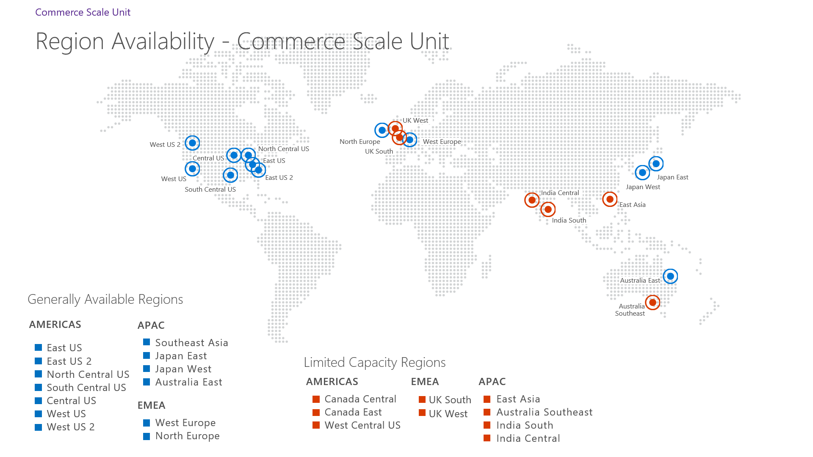

# Initialize Commerce Scale Unit (cloud)

[!include[banner](../includes/banner.md)]

This article explains how to initialize Commerce Scale Unit (cloud) in Microsoft Dynamics 365 Commerce.

If you're using a Tier-2 sandbox or production environment that has application version 8.1.2.x or later, you must initialize Commerce Scale Unit (cloud) before you can use retail channel functionality either for point of sale (POS) operations or for e-commerce operations that use Retail Server in the cloud. Initialization will deploy a Commerce Scale Unit (cloud).

> [!IMPORTANT]
> For existing customers using retail channel functionality in the cloud, to ensure continued and uninterrupted support for your business, we require that you update your retail channels to use Commerce Scale Unit. New environments deployed without Commerce Scale Unit will no longer receive quality and service updates for cloud-hosted retail channel components. There is no action required for customers who exclusively use Commerce Scale Unit (self-hosted). Contact your Microsoft FastTrack solution architect if you require an extension.

## Prerequisites

1. Deploy a Tier-2 sandbox or production environment that has version 8.1.2.x or later.
2. You can self-deploy up to two Commerce Scale Units per environment. If you require more than two Commerce Scale Units per environment, in Microsoft Dynamics Lifecycle Services, create a support request, and enter **Request for additional Commerce Scale Unit** and indicate the environment ID, number of Commerce Scale Units, and desired datacenter regions. The request will be completed within five business days. If you don't require more than two Commerce Scale Units per environment, you don't need to create a support request. 
3. You must have Project Owner permissions in Lifecycle Services before you can initialize Commerce Scale Unit.
4. Ensure that Retail license configuration keys are enabled in your environment. For more information, see [License codes and configuration keys report](../sysadmin/license-codes-configuration-keys-report.md). You must have the following keys turned on to use Commerce Scale Unit.

    - RetailBasic
    - RetaileCommerce - If you plan to use E-Commerce for Dynamics 365 Commerce.
    - RetailGiftCard - If you plan to use gift cards.
    - RetailInvent - If you plan to use inventory.
    - RetailModernPos - If you plan to use point of sale (POS).
    - RetailReplenishment - If you plan to use replenishments.
    - RetailScheduler
    - RetailStores - If you plan to use POS.

## Region availability
Commerce Scale Unit is available for deployment in the following regions.

| Global location | Region              | Availability        | Comments                              |
|-----------------|---------------------|---------------------|---------------------------------------|
| AMERICAS        | East US             | Generally available |  No comments.                         |
| AMERICAS        | East US 2           | Generally available |  No comments.                         |
| AMERICAS        | North Central US    | Limited capacity    |  No comments.                         |
| AMERICAS        | South Central US    | Limited capacity    |  No comments.                         |
| AMERICAS        | Central US          | Generally available |  No comments.                         |
| AMERICAS        | West US             | Generally available |  No comments.                         |
| AMERICAS        | West US 2           | Generally available |  No comments.                         |
| AMERICAS        | Canada Central      | Limited capacity    |  No comments.                         |
| AMERICAS        | Canada East         | Limited capacity    |   No comments.                        |
| AMERICAS        | West Central US     | Limited capacity    |   No comments.                        |
| APAC            | Australia East      | Generally available |   No comments.                        |
| APAC            | Southeast Asia      | Capacity restricted | No deployments are allowed.               |
| APAC            | Japan East          | Generally available |  No comments.                         |
| APAC            | Japan West          | Generally available |   No comments.                        |
| APAC            | Australia Southeast | Generally available |   No comments.                        |
| APAC            | East Asia           | Limited capacity    |   No comments.                        |
| APAC            | India South         | Capacity restricted | No deployments are allowed.               |
| APAC            | India Central       | Limited capacity    | An approval process is required.            |
| EMEA            | West Europe         | Generally available |  No comments.                         |
| EMEA            | North Europe        | Generally available |  No comments.                         |
| EMEA            | UK South            | Generally available |    No comments.                       |
| EMEA            | UK West             | Generally available |    No comments.                       |
| UAE             | UAE North           | Capacity restricted | LCS UAE can be used to deploy commerce scale unit in UAE. Note: Commerce scale units in UAE run only in one region and don't have BCDR region to failover in case of azure regional failure.  |

Deployment capacity in limited capacity regions is extremely constrained. Requests for deployment are evaluated on a case-by-case basis. If you have a compelling business need for deployment in limited capacity regions, you can file a support request to be added to the waitlist. Capacity restricted areas currently don't allow for Commerce Scale Unit deployment at this time. 

## Initialize Commerce Scale Unit as part of a new environment deployment

Please make sure the headquarters is available. This is required to register the scale unit with the headquarters during the initialization process. It isn't recommended to initialize a scale unit when the headquarters is under servicing, as it may become unavailable during its servicing process.

1. Make sure the headquarters environment is available and not in [Maintenance mode](../sysadmin/maintenance-mode.md).
2. In Lifecycle Services, on the environment details page, select **Environment features \> Commerce**.
3. On the Commerce setup deployment page, select **Initialize**.
4. Select the version of the Commerce Scale Unit to initialize.
5. Select a region to initialize Commerce Scale Unit in.

## Configure channels to use Commerce Scale Unit

After Commerce Scale Unit has been deployed, you must ensure that your channels are configured to use the database for it. 

To configure your channels to use the Commerce Scale Unit database, follow these steps.

1. In Commerce headquarters, go to **Retail and commerce \> Headquarters setup \> Commerce Scheduler \> Channel database**.
1. In the left pane, select a channel database.
1. On the **Retail channel** FastTab, select **Add**, and then select your retail channel in the drop-down list.

When you've finished, go to **Retail and Commerce \> Retail and commerce IT \> Distribution schedule**, and run job 9999.

> [!NOTE] 
> Job 9999 syncs all new products and customers to the Commerce Scale Unit. This process can take a long time. If the channel must be available just for e-commerce site builder configuration, you can run job 1070 instead of job 9999.

### Database refresh and Commerce Scale Units

Before you begin, make sure you're familiar with [Steps to complete after a database refresh for environments that use Commerce functionality](../database/database-refresh.md).

The scale unit channel database records (in the Channel Database form) can't be moved across environments as part of database refresh. This is because the records represent environment specific configuration.

After database refresh, you can regenerate the scale unit's channel database record by issuing a redeployment of your scale unit in Lifecycle Services. Any deployment or servicing operation in the scale unit will attempt to register the scale unit with the headquarters, if the registration is detected as missing.

You can issue a redeployment of the scale unit, without changing any components, by selecting to deploy the same version your scale unit is at already. This can be done in Lifecycle Services by the following steps:

1. In Lifecycle Services, on the environment details page, select **Environment features \> Retail**.
2. On the setup deployment page, select the scale unit you would like to redeploy.
3. On the scale unit's operation menu, select **Update**.
4. On the slider, on the drop-down for **Select version**, pick the option **Specify a version**.
5. On the text box under **Specify a version**, type in the version shown for your scale unit, shown beside the **Current version** label.
6. Click on **Update** button.

You don't need to select **Update extensions**, even if you have applied extensions previously, since the last extension package applied to the scale unit is automatically picked when updating a scale unit.

If you have multiple scale units, you need to perform the operation above for each scale unit. You may perform these operations in parallel, if desired.

## Deploy additional Commerce Scale Units (optional)

After you've initialized Commerce Scale Unit, you can self-deploy a second Scale Unit if your license entitles you to do so. To deploy more than two Scale Units, you must create a support request. In the support request, state the number of Commerce Scale Units that you require, the environment name, and the desired regions. For more information about licensing, see [Dynamics 365 Licensing Guide](https://go.microsoft.com/fwlink/?LinkId=866544&clcid=0x409). 

For each additional Commerce Scale Unit that you deploy, we recommend that you create a separate channel database group by following these steps.

1. In Commerce head office, go to **Retail and Commerce \> Retail Headquarters \> Retail Scheduler setup \> Channel database group**.
2. Create a new channel database group.
3. Go to the **Retail and Commerce \> Retail Headquarters \> Retail Scheduler setup \> Channel database**, and select the channel database that corresponds to the newly created Commerce Scale Unit.
4. Select **Edit** and select the new channel database group.
5. Select **Save**.
6. Select **Run Full data sync** for the selected channel database.

## Additional considerations if you initialize cloud-hosted Commerce channel components in an existing environment

If you're already using cloud-hosted Commerce channel components in an environment, initialization of Commerce Scale Unit will help reduce the downtime when those components are updated. Additional planning is required before initialization of Commerce Scale Unit.

When you initialize your first Commerce Scale Unit in an environment that uses cloud-hosted Commerce channel components, the initialization process will migrate your channels associated to the cloud-hosted channel components to the first scale unit. Channels associated with Store Scale units are unaffected.

The migration process is transparent to the channels. After the scale unit initialization starts, the following operations are automatically performed:

1. A new Commerce Scale Unit will be created and associated with the environment.
2. The Commerce Scale Unit will be registered as an available Channel Database in the headquarters.
3. All channels mapped to the **Default** channel database in the headquarters will be updated to map to the new Commerce Scale Unit.
4. A Commerce Data Exchange (CDX) full data sync will be performed to bring the channel data to the new scale unit.

**Planning and testing for Commerce Scale Unit initialization**

As a general rule, when initializing Commerce Scale Unit, you must plan for a five-hour downtime window for store operations as well as any e-commerce channel operations that use Retail Server or Cloud Point of Sale.

1. Perform a database refresh from your production environment to a sandbox UAT environment. 
2. Initialize Commerce Scale Unit in the sandbox UAT environment. 
3. Note the initialization time to complete for Commerce Scale Unit. This will be comparable to the time this operation takes in your production environment, during which store operations and e-commerce operations will be unavailable.

You must perform the following additional steps before initializing Commerce Scale Unit.

- **Close all POS shifts** - After migration, POS users will be unable to close any shifts that were active during the migration process.
- **Validate that all P-jobs have been successfully completed** - It's recommended that P-jobs to synchronize pending transactions have completed before CSU is initialized.
- **Sign out of all POS device** - POS operations aren't supported during migration.
- **Recall and void all suspended transactions at POS** - Suspended transactions aren't preserved as part of the initialization.

> [!IMPORTANT]
> As part of Commerce Scale Unit initialization, prior suspended transactions will be lost and can't be recalled. 

Here's what occurs during the initialization period:

- Cloud-hosted Commerce channels won't work, unless you turn on POS offline capability.
- POS devices with offline capability turned on will have reduced functionality.
- Any e-Commerce clients that depend on Retail Server will be disrupted.
- Channels that are hosted on Commerce Scale Units (self-hosted) won't be affected.
- Head office functionality isn't affected.

Here's what occurs after initialization is completed:

- The device activation state of all activated POS devices is preserved, which means that the devices won't have to be reactivated.
- Stand-alone hardware station instances will continue to work.
- POS channel–side reports will be reset and won't show data from before the initialization.
- Show journal operation will also be reset and won't show data from before the initialization.

[!INCLUDE[footer-include](../../../includes/footer-banner.md)]
