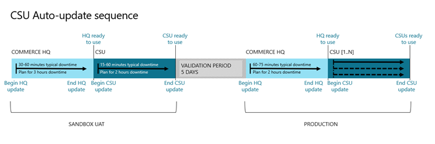

---
# required metadata

title: Apply updates and extensions to Commerce Scale Unit (cloud)
description: This topic shows how to apply updates and extensions to cloud-hosted Commerce channel components.
author: AamirAllaq
ms.date: 12/13/2021
ms.topic: article
ms.prod: 
ms.technology: 

# optional metadata

# ms.search.form:  [Operations AOT form name to tie this topic to]
audience: IT Pro
# ms.devlang: 
ms.reviewer: sericks
# ms.tgt_pltfrm: 
# ms.custom: [used by loc for topics migrated from the wiki]
ms.search.region: Global
# ms.search.industry: retail
ms.author: aamiral
ms.search.validFrom: 2018-4-30 
ms.dyn365.ops.version: 8.0 
---

# Apply updates and extensions to Commerce Scale Unit (cloud)

[!include[banner](../includes/banner.md)]

If you are updating a Tier-2 sandbox or production environment on application version 8.1.2 or newer and have initialized Commerce Scale Unit (CSU), you will also need to update channel components. This topic shows how to apply updates and extensions to CSU.

Updates to CSU are cumulative. This means that any update that you apply will include all previously released changes. Applying a Dynamics 365 Commerce deployable package for extensions is also a cumulative process and will replace the previously deployed version of the extension.

## Prerequisites

Before you proceed, you must first apply updates and extensions (if applicable) to the environment. For more information, see [Apply updates to cloud environments](apply-deployable-package-system.md).

To update CSU, complete the following steps for each:

1. On the **Environment details** page, go to **Environment features > Retail and Commerce**.
2. On the **Commerce deployment setup** page, select **Update**.
3. In the selection panel, select the version to update to.
4. You can choose to update to the newest service update to access the latest features, or you can update to the latest quality update to apply quality improvements for the currently deployed service update. For more information, see [Download updates from Lifecycle Services (LCS)](../migration-upgrade/download-hotfix-lcs.md).
5. You can choose to apply an extension at the same time. 

To apply an extension to a CSU, complete the following steps:

1. On the **Commerce deployment setup** page, select **Apply Extension**.
2. In the selection panel, select the extension to apply.

> [!NOTE]
> You must first upload the Commerce deployable package to the project asset library in Microsoft Dynamics Lifecycle Services (LCS) before you can select to deploy it on the **Commerce deployment setup page** in LCS.

Both **Apply updates** and **Apply extension** operations will involve a period of downtime that may last up to 1 hour, or in some cases up to 2 hours or more. For example, when updating non-US locations of CSU, large data volumes, or complex schema updates. For a realistic estimate of the downtime duration, note the downtime duration in Sandbox UAT for an equivalent update and dataset that you plan to use in your production environment. During this time, the following will occur:

- Cloud-hosted Commerce channels will not function (unless POS offline capability is enabled).
- POS devices that have the offline capability feature enabled will have reduced functionality.
- Any e-commerce clients that are dependent on CCSU will be disrupted.
- Channels hosted on CSUs will remain unaffected.
- Head office functionality will remain unaffected.

> [!NOTE]
> Applying an extension and an update at the same time requires a single downtime, and can be an effective way of averting multiple downtimes.

### Troubleshooting updates

#### Potential downgrade
When applying an update to a Commerce Scale Unit in your environment, you may be shown an error message about version downgrade detection.

**Error message** 

"The operation was canceled because a potential downgrade was identified from version 'X.XX.XXXXX.X' to version 'X.XX.XXXXX.X'"

**Explanation** 

This issue occurs when your Commerce Scale Unit has a Quality Update (hotfix) applied that may not be included in the Service Update that you are attempting to apply. This may be because the newest Service Update does not yet have the latest Quality Update issued (this is rare), or because you may be manually updating to a version of a Service Update that is not the latest available version.

**Resolution** 

1. Make sure you selected the most recent version of the Service Update during the update process.
2. If the latest Quality Update is not yet available in the Service Update, wait up to three business days and try again. If the issue persists, you may want to file a support request.

## View history
To view the history of recent operations on a Scale Unit, select **History** on the **Action** tab to open the **Scale Unit History** page. On this page, you can view recent operations such as initialize, service update, quality update, version, extension details, and other relevant information.

## Restart Commerce Scale Unit
For troubleshooting, Commerce Scale Unit allows self-service restart of the service. Commerce Scale Unit restart can be useful for mitigation of service reliability or performance issues. To restart Commerce Scale Unit, select a Scale Unit and then select **Restart**. A dialog box will display. Select **Restart** to restart the service. Restarting Commerce Scale Unit will close all active connections before restarting. You can also choose an immediate restart by selecting the **Force restart** option. This will immediately close all active connections and initiate a restart.

## CSU auto-update sequence

> [!NOTE]
> Auto-update for CSU is being gradually rolled out to all Commerce customers. If you are a LCS project owner or environment administrator, you'll recieve an email notification when CSU auto-update is rolled out to your LCS project.

When CSU is auto-updated by Microsoft, it takes place in the following sequence.

[!INCLUDE[footer-include](../../../includes/footer-banner.md)]
