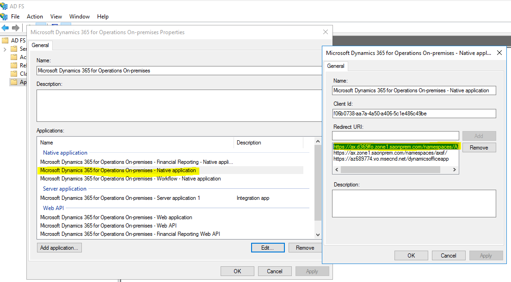
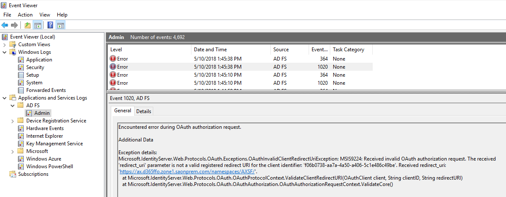

---
# required metadata

title: How authentication works in Dynamics 365 for Finance and Operations On-premises
description: This topic...
author: PeterRFriis
manager: AnnBe
ms.date: 09/30/2020
ms.topic: article
ms.prod:
ms.service: dynamics-ax-applications
ms.technology: 

# optional metadata

# ms.search.form:
audience: IT Pro
# ms.devlang: 
ms.reviewer: sericks
ms.search.scope:
# ms.tgt_pltfrm: 
# ms.custom: 
ms.search.region: Global
# ms.search.industry:
ms.author: perahlff
ms.search.validFrom: 2020-09-30
ms.dyn365.ops.version: 10.0.15
---

# How authentication works in Dynamics 365 for Finance and Operations On-premises

[!include[banner](../includes/banner.md)]

In this article I'm going to explain the moving parts to authentication in
on-premises Dynamics 365 for Finance and Operations. The intention of this
article is to provide some background to how the process works, so that if you
have issues you can work through them to figure out what's wrong.

First off - there's one option you provide during environment deployment, the
URL for AD FS, which looks something like this:  
https://dax7sqlaoadfs1.saonprem.com/adfs/.well-known/openid-configuration

You'll find that mentioned in the deployment
instructions [here](https://docs.microsoft.com/en-us/dynamics365/unified-operations/dev-itpro/deployment/setup-deploy-on-premises-pu12#configureadfs)

During deployment this is going to be used to set various options in the AOS xml
config files on each AOS machine. You'll find the AOS config in a folder similar
to below - note that the numbers vary from machine to machine:  
C:\\ProgramData\\SF\\AOS_10\\Fabric\\work\\Applications\\AXSFType_App218\\AXSF.Package.1.0.xml

Within this config file (which is on each AOS machine) you'll find a few
sections which are set from the LCS deployment setting for AD FS, this bit:

\<Section Name="Aad"\> \<Parameter Name="AADIssuerNameFormat"
Value="https://dax7sqlaoadfs1.saonprem.com/{0}/" /\> \<Parameter
Name="AADLoginWsfedEndpointFormat"
Value="https://dax7sqlaoadfs1.saonprem.com/{0}/wsfed" /\> \<Parameter
Name="AADMetadataLocationFormat"
Value="https://dax7sqlaoadfs1.saonprem.com/FederationMetadata/2007-06/FederationMetadata.xml"
/\> \<Parameter Name="AADTenantId" Value="adfs" /\> \<Parameter
Name="AADValidAudience" Value="https://ax.d365ffo.zone1.saonprem.com/" /\>
\<Parameter Name="ACSServiceEndpoint"
Value="https://accounts.accesscontrol.windows.net/tokens/OAuth/2" /\>
\<Parameter Name="ACSServicePrincipal"
Value="00000001-0001-0000-c000-000000000000" /\> \<Parameter
Name="FederationMetadataLocation"
Value="https://dax7sqlaoadfs1.saonprem.com/FederationMetadata/2007-06/FederationMetadata.xml"
/\> \<Parameter Name="Realm" Value="spn:00000015-0000-0000-c000-000000000000"
/\> \<Parameter Name="TenantDomainGUID" Value="adfs" /\> \<Parameter
Name="TrustedServiceAppIds" Value="913c6de4-2a4a-4a61-a9ce-945d2b2ce2e0" /\>
\</Section\>

Also this section:

\<Section Name="OpenIDConnect"\> \<Parameter Name="ClientID"
Value="f06b0738-aa7a-4a50-a406-5c1e486c49be" /\> \<Parameter Name="Metadata"
Value="https://dax7sqlaoadfs1.saonprem.com/adfs/.well-known/openid-configuration"
/\> \</Section\> \<Section Name="Provisioning"\> \<Parameter
Name="AdminIdentityProvider" Value="https://dax7sqlaoadfs1.saonprem.com/adfs"
/\> \<Parameter Name="AdminPrincipalName" Value="admin\@exampleDomain.com" /\>
\</Section\>

The AOS is using these config values to know where to redirect to when a user
tries to hit the application URL - so user hits the URL, AOS should redirect to
the AD FS login page (using the values from this config), user enters their
credentials, and gets redirects to the application URL again.

If values in the AOS config file are incorrect - then that typically means the
value given for ADFS during environment deployment was wrong - easiest thing is
to delete and redeploy the environment from LCS with the right value - it is
possible to manually edit the config files, but to be safe, do a redeploy. If
you do edit the config files then you need to restart the AOS services for it to
take effect - either from SF explorer (right click the AOS node under Nodes, and
choose restart, then wait for a minute or so for it's status to go back to
green) or reboot the machine.

One example of an error caused by this, if I had entered the AD FS URL in LCS
deployment wrongly (as below - note the missing hyphen) then I would get server
error 500 when going to the application URL, because it no longer knows how to
redirect to AD FS properly  
https://dax7sqlaoadfs1.saonprem.com/adfs/.wellknown/openid-configuration  
 

The second piece to the authentication process is ADFS itself, on the ADFS
server if you open "AD FS Management" (from Control Panel\\System and
Security\\Administrative Tools), and look under "Application groups", you'll
find a group called "Microsoft Dynamics 365 for Operations On-premises" - within
this group the settings for AD FS for Dynamics are kept - specifically there are
application URLs, the same one you specified during environment deployment as
the URL for the application, here's an example:

AD FS uses the Client ID and the URLs to decide whether the request for access
is ok or not. You will notice that the Client ID is also listed in the AOS
config (it's in the section I pasted above) - if both the client ID and the URL
don't match what the AOS is requesting, then AD FS will deny the token - if that
happens you'll find an error in the Event Log on the ADFS server - there's a
special event log for AD FS under "Application and Services logs\\AD FS\\Admin"

In the case that any of the AD FS application group setup is wrong, you're
likely to see an error in it's event log which explains the value it was looking
for, so you can figure out what is set incorrectly.

