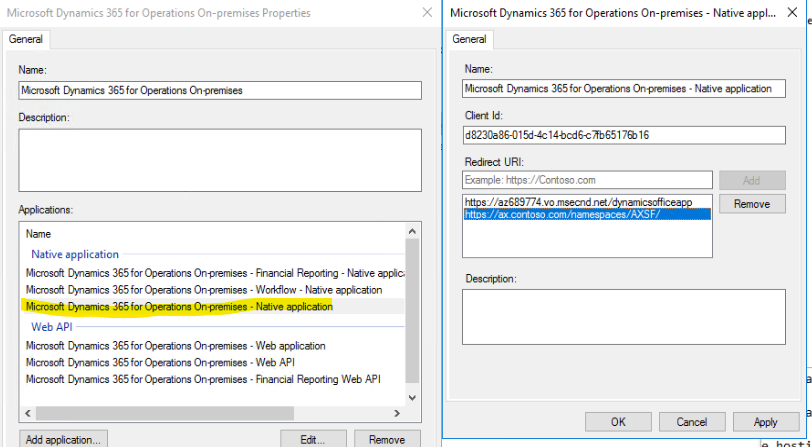
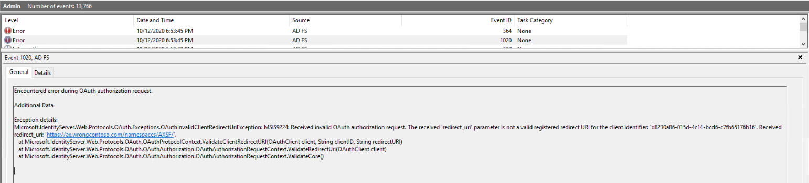

---
# required metadata

title: Authentication in Dynamics 365 Finance + Operations (on-premises) environments
description: This article provides background information about how the authentication process works so that if you have issues you can work to resolve them.
author: faix
ms.date: 11/18/2020
ms.topic: article
ms.prod: dynamics-365 
ms.service:
ms.technology:


# optional metadata

# ms.search.form:
audience: IT Pro
# ms.devlang: 
ms.reviewer: sericks
# ms.tgt_pltfrm: 
# ms.custom: 
ms.search.region: Global
# ms.search.industry:
ms.author: osfaixat
ms.search.validFrom: 2020-09-30
ms.dyn365.ops.version: 10.0.15
search.app:
  - financeandoperationsonprem-docs
---

# Authentication in Dynamics 365 Finance + Operations (on-premises) environments

[!include[banner](../includes/banner.md)]

This article explains authentication in Dynamics 365 Finance + Operations (on-premises). This article also provides background information about how the process works so that if you encounter issues with authentication you can work to resolve them.

## The URL for Active Directory Federation Services (AD FS)

The first part of the authentication process is to provide the URL for Active Directory Federation Services (AD FS). This URL will be similar to: `https://adfs.contoso.com/adfs/.well-known/openid-configuration` 

You'll find this URL in the deployment instructions found in [Configure AD FS](./setup-deploy-on-premises-latest.md#configureadfs). During deployment, the URL is used to set various options in the AOS startup variables of each AOS instance. These startup variables reside in an .XML config file located in a Service Fabric directory. This directory will vary from machine to machine, but the path should look similar to:

C:\\ProgramData\\SF\\AOS_10\\Fabric\\work\\Applications\\AXSFType_App218\\AXSF.Package.1.0.xml

## XML configuration file
There is a file called AXSF.Package.Current.xml. This file will be a copy of the AXSF.Package.1.0.xml in finance and operations deployments. The AXSF.Package.Current.xml file represents the variable that have been used to initialize the currently running AOS instance (AxService.exe).

Within this configuration file (which is on each AOS machine), you'll find some sections that are set from the Lifecycle Services (LCS) deployment setting for AD FS.

```xml
<Section Name="Aad">
    <Parameter Name="AADIssuerNameFormat" Value="http://ADFS.contoso.com/{0}/services/trust" />
    <Parameter Name="AADLoginWsfedEndpointFormat" Value="https://ADFS.contoso.com/{0}/wsfed" />
    <Parameter Name="AADMetadataLocationFormat" Value="https://ADFS.contoso.com/FederationMetadata/2007-06/FederationMetadata.xml" />
    <Parameter Name="AADTenantId" Value="adfs" />
    <Parameter Name="AADValidAudience" Value="https://ax.contoso.com/" />
    <Parameter Name="ACSServiceEndpoint" Value="https://accounts.accesscontrol.windows-ppe.net/tokens/OAuth/2" />
    <Parameter Name="ACSServicePrincipal" Value="00000001-0001-0000-c000-000000000000" />
    <Parameter Name="ADFSEndpoint" Value="https://ADFS.contoso.com/adfs" />
    <Parameter Name="ADFSIdentifier" Value="http://ADFS.contoso.com/adfs/services/trust" />
    <Parameter Name="FederationMetadataLocation" Value="https://ADFS.contoso.com/FederationMetadata/2007-06/FederationMetadata.xml" />
    <Parameter Name="Realm" Value="spn:00000015-0000-0000-c000-000000000000" />
    <Parameter Name="TenantDomainGUID" Value="adfs" />
    <Parameter Name="TrustedServiceAppIds" Value="913c6de4-2a4a-4a61-a9ce-945d2b2ce2e0" />
</Section>
```
You will also find the following sections.

```xml
<Section Name="OfficeApps">
    <Parameter Name="AppInsightsKey" Value="" />
    <Parameter Name="AuthClientId" Value="d8230a86-015d-4c14-bcd6-c7fb65176b16" />
</Section>
<Section Name="OpenIDConnect">
    <Parameter Name="ClientID" Value="d8230a86-015d-4c14-bcd6-c7fb65176b16" />
    <Parameter Name="Metadata" Value="https://ADFS.contoso.com/adfs/.well-known/openid-configuration" />
</Section>
<Section Name="Provisioning">
    <Parameter Name="AdminIdentityProvider" Value="http://ADFS.contoso.com/adfs/services/trust" />
    <Parameter Name="AdminPrincipalName" Value="axserviceuser@contoso.com" />
</Section>
```

> [!NOTE]
> The settings shown above represent a deployment configured with Microsoft 365 compatibility. For more information, see [AD FS Microsoft 365 compatibility](./onprem-adfscompatibility.md).

## Configuration values used by the AOS
The AOS uses the configuration values above to determine where to redirect an unauthenticated request when a user sends a request to the application URL.

1. Request is sent by the browser to the application URL (`https://ax.contoso.com/namespaces/AXSF/`).
2. The request is processed by the Gateway and gets forwarded to an AOS node that accepts interactive sessions.
3. The request reaches the AOS server and checks for the authentication cookies.
4. No authentication is present so the AOS server returns a redirect request for the user to authenticate with AD FS. At this point, the AOS also sets an affinity cookie to bind the user session to that AOS.
5. The Gateway receives the response and forwards it back to the browser.
6. The browser receives the redirect request and displays the AD FS authentication page so the user signs in.
7. When successfully authenticated against AD FS, the AD FS then redirects the user back to the application URL and provides the authentication cookies.
8. The Gateway receives this response and forwards the affinitized request to the appropriate AOS node.
9. The AOS checks the authentication information provided and checks against the **UserInfo** table to determine whether the user is allowed to access the application and which permissions are available.
    
If values in the AOS config file are incorrect, then that typically means the value provided for the AD FS endpoint when deploying the environment was incorrect. The easiest thing is to delete and redeploy the environment from LCS with the correct value. It is possible to manually edit the configuration files, but to be safe, do a redeploy. Otherwise you will need to manually change the values after each servicing operation on each AOS node. If you do edit the config files, then you need to restart the AOS service (AxService.exe) for it to take effect. You can do that from the Service Fabric explorer (right-click the AOS node under **Nodes**, choose **Restart**, and then wait at least a minute for the status to change to green). You can also reboot the machine.

Receiving a 500 error when accessing the application URL is an indication that there may be an invalid URL for AD FS. This is because on startup the AOS will use that URL to obtain information from the AD FS server. If the URL is incorrect or inaccessible, the AOS will be unable to start.

## AD FS
The second part of the authentication process is AD FS itself. On the AD FS server, if you open AD FS Management (from **Control Panel > System and Security > Administrative Tools**), and go to **Application groups**, you'll find a group called **Microsoft Dynamics 365 for Operations On-premises**. Within this group, the settings for AD FS for your Dynamics 365 application are stored.



AD FS uses the client ID and the URLs to determine whether the request for access should be honored. You will notice that the client ID from the screenshot above matches the IDs specified in the OfficeApps and OpenIDConnect sections from earlier. If both the client ID and the redirect URL don't match what the AOS is requesting, then AD FS will deny the request to authenticate. If that happens, you'll find an error in the event log on the AD FS server. There's a special event log for AD FS under **Application and Services logs > AD FS > Admin**.



If any of the AD FS application group setup is incorrect, you're likely see an error in the event log that explains the value it was looking for, so you can determine what is set incorrectly.


[!INCLUDE[footer-include](../../../includes/footer-banner.md)]

