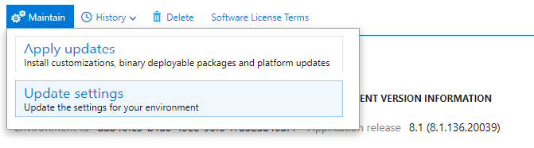
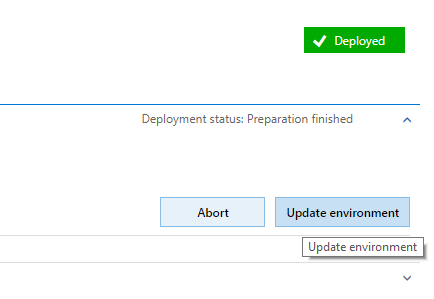
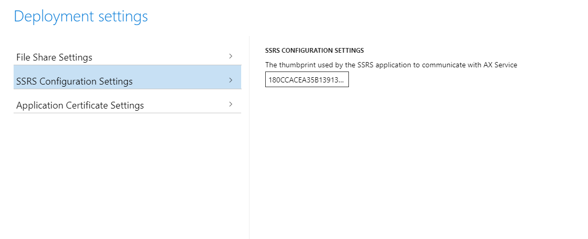

---
# required metadata

title: Certificate rotation
description: This article explains how to place existing certificates and update the references within the environment to use the new certificates.
author: faix
ms.date: 01/11/2023
ms.topic: article
ms.prod: dynamics-365 
ms.service:
ms.technology: 

# optional metadata

# ms.search.form:  [Operations AOT form name to tie this article to]
audience: IT Pro
# ms.devlang: 
ms.reviewer: sericks
# ms.tgt_pltfrm: 
# ms.custom: [used by loc for topics migrated from the wiki]
ms.search.region: Global 
# ms.search.industry: [leave blank for most, retail, public sector]
ms.author: osfaixat
ms.search.validFrom: 2019-04-30
ms.dyn365.ops.version: Platform update 25 
search.app:
  - financeandoperationsonprem-docs
---

# Certificate rotation

[!include[banner](../includes/banner.md)]

You may need to rotate the certificates used by your Dynamics 365 Finance + Operations (on-premises) environment as they approach their expiration date. In this article, you will learn how to replace the existing certificates and update the references within the environment to use the new certificates.

> [!WARNING]
> The certificate rotation process should be initiated well before the certificates expire. This is very important for the Data Encryption certificate, which could cause data loss for encrypted fields. For more information, see [After certificate rotation](#aftercertrotation). 
> 
> Old certificates must remain in place until the certificate rotation process is complete, removing them in advance will cause the rotation process to fail.
>
> The certificate rotation process should not be carried out on Service Fabric clusters running 7.0.x and 7.1.x. 
>
> Upgrade your Service Fabric cluster to 7.2.x or later before attempting certificate rotation.

## Preparation steps 

1. Update your infrastructure scripts by following the steps in [Update your Infrastructure Scripts](obtain-infrascripts-onprem.md#update-the-infrastructure-scripts).

1. In the **ConfigTemplate.xml** file, configure certificates as you require. Follow the steps in [Configure certificates](setup-deploy-on-premises-pu41.md#configurecert). Specifically, follow these steps.

    ```powershell
    # Only run the first command if you have not generated the templates yet.
    .\New-ADCSCertificates.ps1 -ConfigurationFilePath .\ConfigTemplate.xml -CreateTemplates
    .\New-ADCSCertificates.ps1 -ConfigurationFilePath .\ConfigTemplate.xml
    ```

    > [!NOTE]
    > The AD CS scripts need to run on a domain controller, or a Windows Server computer with Remote Server Admin Tools installed.
    >
    > The AD CS functionality is only available with Infrastructure scripts release 2.7.0 and later. 

    Alternatively, if you want to continue to use self-signed certificates, run the following command.

    ```powershell
    # Create self-signed certs
    .\New-SelfSignedCertificates.ps1 -ConfigurationFilePath .\ConfigTemplate.xml
    ```

    > [!WARNING]
    > Self-signed certificates should never be used in production environments. If you're using publicly trusted certificates, manually update the values of those certificates in the ConfigTemplate.xml file.

    After you've generated the certificates, run the following command.

    ```powershell
    # Exports certificates into a directory VMs\<VMName>. All the certs will be written to the infrastructure\Certs folder.
    .\Export-Certificates.ps1 -ConfigurationFilePath .\ConfigTemplate.xml
    ```

1. Continue to [set up VMs](setup-deploy-on-premises-pu41.md#setupvms). Here are the specific steps that are required for this process:

    1. Export the scripts that must be run on each VM.

        ```powershell
        # Exports the script files to be executed on each VM into a directory VMs\<VMName>.
        .\Export-Scripts.ps1 -ConfigurationFilePath .\ConfigTemplate.xml
        ```

    2. Copy the contents of each `infrastructure\VMs<VMName>` folder into the corresponding VM (if remoting scripts are used, they will automatically copy the content to the target VMs), and then run the following script. Perform this step as an administrator.

        ```powershell
        # If remoting, only execute
        # .\Configure-PreReqs-AllVMs.ps1 -MSIFilePath <share folder path of the MSIs> -ConfigurationFilePath .\ConfigTemplate.xml -ForcePushLBDScripts

        .\Configure-PreReqs.ps1
        ```

    3. Run the following script to ensure that all prerequisites are completed. Perform this step as an administrator.

        ```powershell
        # If remoting, only execute
        # .\Complete-PreReqs-AllVMs.ps1 -ConfigurationFilePath .\ConfigTemplate.xml 

        .\Complete-PreReqs.ps1
        ```

    4. Run the following script to validate the VM setup.

        ```powershell
        # If remoting, only execute
        # .\Test-D365FOConfiguration-AllVMs.ps1 -ConfigurationFilePath .\ConfigTemplate.xml
        .\Test-D365FOConfiguration.ps1
        ```

1. Run the following PowerShell command so that you have values that can be used in LCS later. For more information, see [Deploy your on-premises environment from LCS](setup-deploy-on-premises-pu41.md#deploy).

    ```powershell
    .\Get-DeploymentSettings.ps1 -ConfigurationFilePath .\ConfigTemplate.xml
    ```

## Activate new certificates within Service Fabric cluster

To make the certificate rotation process easier, Microsoft highly recommends that you use certificate common names (subject name) instead of thumbprints for your Service Fabric standalone cluster configuration. If you have an existing cluster and want to migrate from using thumbprints to using certificate common names, follow the steps in [Appendix B](#appendix-b) later in this article.

### <a name=""></a>Service Fabric cluster with certificate common names

#### Service Fabric with certificates that aren't expired

No further action is required on the Service Fabric cluster. Service Fabric will automatically detect the new certificates. You should proceed with [Update the LocalAgent certificates](#update-the-localagent-certificates). 

If you've changed the certificate common name, you must upgrade your Service Fabric cluster configuration.

1. Run the following script to generate an updated cluster configuration file.

    ```powershell
    .\Update-SFClusterConfig.ps1 -ConfigurationFilePath .\ConfigTemplate.xml -UpdateCommonNames
    ```

    > [!NOTE]
    > If the issuers have also changed, use the following command instead.
    >
    > ```powershell
    > .\Update-SFClusterConfig.ps1 -ConfigurationFilePath .\ConfigTemplate.xml -UpdateCommonNames -UpdateIssuers
    > ```

1. Apply the updated configuration to your Service Fabric cluster by using the information in [Appendix A](#appendix-a) later in this article.

#### Service Fabric with certificates that are expired

If your cluster is not available after 10 minutes from when you finished provisioning the new certificates to all of the nodes, consider restarting the nodes where the Service Fabric service is not started.

If you have changed the certificate common name (subject name), then the Service Fabric cluster will not start up. If you can't generate new certificates with the previous common name, you will need to cleanup and recreate the cluster.

#### Service Fabric with restricted certificate issuers

If the following sections are defined for your cluster configuration, the allowed certificate issuers are restricted. 

```json
"ClusterCertificateIssuerStores": [
    {
        "IssuerCommonName": "sample-ca",
        "X509StoreNames": "Root"
    }
],
"ServerCertificateIssuerStores": [
    {
        "IssuerCommonName": "sample-ca",
        "X509StoreNames": "Root"
    }
],
"ClientCertificateIssuerStores": [
    {
        "IssuerCommonName": "sample-ca",
        "X509StoreNames": "Root"
    }
],
```

In this case, if the issuer of your new certificates differs from what is defined in these configurations, you must go through a cluster configuration upgrade to add the new issuers.

If you have to update the list of issuers, you must do the update while the existing certificates are still valid.

1. Run the following script to generate an updated cluster configuration file.

    ```powershell
    .\Update-SFClusterConfig.ps1 -ConfigurationFilePath .\ConfigTemplate.xml -UpdateIssuers
    ```

1. Apply the updated configuration to your Service Fabric cluster by using the information in [Appendix A](#appendix-a) later in this article.

### <a name=""></a>Service Fabric cluster defined with certificate thumbprints

#### <a name="sfcertrotationnotexpired"></a>Service Fabric with certificates that aren't expired

1. Run the following script from a node that belongs to the Service Fabric cluster to generate an updated cluster configuration file.

    ```powershell
    .\Update-SFClusterConfig.ps1 -ConfigurationFilePath .\ConfigTemplate.xml -UpdateThumbprints
    ```

1. Apply the updated configuration to your Service Fabric cluster by using the information in [Appendix A](#appendix-a) later in this article.

#### Service Fabric with or without expired certificates (cluster not accessible)

Continue this process following the steps in [Troubleshoot on-premises deployments](troubleshoot-on-prem.md#clean-up-an-existing-environment-and-redeploy).

## Update the LocalAgent certificates

You must reinstall the LocalAgent in the following situations:

- You changed the Service Fabric cluster/server certificate.
- You changed the Service Fabric client certificate.
- You changed the LocalAgent certificate.

1. Update your **current localagent-config.json** file by replacing the **serverCertThumbprint** and **clientCertThumbprint** values with the new thumbprints.

    ```json
    {
    "serviceFabric": {
        "connectionEndpoint": "192.168.8.22:19000",
        "clusterId": "Orch",
        "certificateSettings": {
            "serverCertThumbprint": "New server thumbprint(Star/SF)",
            "clientCertThumbprint": "New client thumbprint"
        }
    },
    ```

1. Run the following PowerShell command on one of the Orchestrator nodes.

    ```powershell
    .\LocalAgentCLI.exe Cleanup <path of localagent-config.json>
    ```

1. Run the following PowerShell command and note the new LocalAgent thumbprint.

    ```powershell
    .\Get-AgentConfiguration.ps1 -ConfigurationFilePath .\ConfigTemplate.xml
    ```

1. Follow the steps in [Configure LCS connectivity for the tenant](setup-deploy-on-premises-pu41.md#configurelcs).

    > [!NOTE] 
    > If you receive the error **Update to existing credential with KeyId '\<key\>' is not allowed**, follow the instructions in [Error: "Updates to existing credential with KeyId '\<key\>' is not allowed"](troubleshoot-on-prem.md#error-updates-to-existing-credential-with-keyid-key-is-not-allowed).

1. Continue with [Configure a connector and install an on-premises local agent](setup-deploy-on-premises-pu41.md#configureconnector), specifically the following changes:

    - Client certificate thumbprint
    - Server certificate thumbprint
    - Tenant service principle certificate thumbprint

    > [!IMPORTANT]
    > Do **not** create a new connector in LCS. Update the configuration of your existing connector and download the settings file again.

## Update your current deployment configuration

Because you've updated your certificates, the configuration file that is present in your environment is outdated and must be manually updated. Otherwise, the clean-up job may fail. This manual update must be done just this one time.

1. Open the configuration file 'config.json' on your agent file share. This will be in a share similar to the following: \\\\fileserver\agent\wp\environmentID\StandaloneSetup-123456. You can find the location of this file by running the following SQL statement on the orchestrator database.

    ```sql
    select Location from DeploymentInstanceArtifact where AssetId='config.json' and DeploymentInstanceId = 'LCSENVIRONMENTID'
    ```

    > [!NOTE]
    > Replace **LCSENVIRONMENTID** with the ID of your environment. You can obtain this ID from the page for your environment in LCS (this is the GUID value associated with your environment).

    The beginning of the file should resemble the following example.

    ```json
    {
    "serviceFabric": {
        "connectionEndpoint": "192.168.8.22:19000",
        "clusterId": "Orch",
        "certificateSettings": {
            "serverCertThumbprint": "Old server thumbprint(Star/SF)",
            "clientCertThumbprint": "Old client thumbprint"
        }
    },
    ```

2. Replace the **serverCertThumprint** and **clientCertThumbprint** values with the new thumbprints.

    ```json
    {
    "serviceFabric": {
        "connectionEndpoint": "192.168.8.22:19000",
        "clusterId": "Orch",
        "certificateSettings": {
            "serverCertThumbprint": "New server thumbprint(Star/SF)",
            "clientCertThumbprint": "New client thumbprint"
        }
    },
    ```

3. Save and close the file. Remember to close any programs that are accessing this network location. Otherwise, the cleanup process might fail.

## Rotate Credentials.json

If you've generated a new **axdataencipherment** certificate, you must re-encrypt the **Credentials.json** file.

> [!NOTE]
> Make sure that you run the script from an Application Object Server (AOS) node.

```powershell
.\Configure-CredentialsJson.ps1 -ConfigurationFilePath .\ConfigTemplate.xml -Action Rotate
```

Alternatively, if you also want to rotate the existing credentials, follow these steps.

1. Decrypt the **Credentials.json** file.

    ```powershell
    .\Configure-CredentialsJson.ps1 -ConfigurationFilePath .\ConfigTemplate.xml -Action Decrypt
    ```

1. Open the **Credentials.json** file, and update any credentials that you want to update.

1. Re-encrypt the **Credentials.json** file.

    ```powershell
    .\Configure-CredentialsJson.ps1 -ConfigurationFilePath .\ConfigTemplate.xml -Action Encrypt
    ```

## Update deployment settings in LCS

> [!NOTE]
> The Client, Data Signing, and Encipherment certificates will only be replaced.
>
> Before you continue, you need to make a backup of the local Dynamics database.

1. In LCS, select the "Full Details" link for the environment where you want to change the certificates.

2. Select **Maintain** and then select **Update Settings**.

    

3. Change the thumbprints to the new thumbprints that you previously configured. You can find them in the ConfigTemplate.xml file in the InfrastructureScripts folder.

    

    

4. Select **Prepare**.

5. After downloading and preparation is complete, the **Update environment** button will display.

    

6. Select **Update environment** to start updating your environment.

7. During the update, the environment will be unavailable.

8. After the environment is successfully updated with the new certificates, you can view the new thumbprints in Service Fabric Cluster Explorer. The names of the thumbprints in Service Fabric Explorer might differ from the names in LCS. However, the values should be the same.

    Here is an example of how the name of the same thumbprint might differ.

    

    

## Update other certificates as needed

1. Always check if the SQL server certificate has expired. For more information, see [Set up SQL Server](setup-deploy-on-premises-pu41.md#setupsql).

2. Check to be sure that the Active Directory Federation Service (ADFS) certificate has not expired.

## <a name="cleanupoldsfcerts"></a>Clean up old Service Fabric certificates

This procedure should be completed after a successful certificate rotation or before the next certificate rotation.

1. Run the following script to generate an updated cluster configuration file.

    ```powershell
    .\Update-SFClusterConfig.ps1 -ConfigurationFilePath .\ConfigTemplate.xml -RemoveOldThumbprints
    ```

2. Apply the updated configuration to your Service Fabric cluster by using the information in [Appendix A](#appendix-a) later in this article.

## <a name="aftercertrotation"></a>After certificate rotation

### Data encryption certificate

This certificate is used to encrypt data that is stored in the database. By default, specific fields are encrypted by using this certificate. You can check those fields in [Document the values of encrypted fields](../database/dbmovement-scenario-goldenconfig.md#document-the-values-of-encrypted-fields). However, you can use our API to encrypt other fields as you require. 

In Platform update 33 and later, the **Encrypted data rotation system job** batch job uses the newly rotated certificate to re-encrypt data. This batch job crawls through your data to re-encrypt all the encrypted data by using the new certificate. The job will run for two hours each day until all the data has been re-encrypted. To enable the batch job, you must enable a flight and a configuration key. Run the following commands against your business database (for example, AXDB).

```sql
IF (EXISTS(SELECT * FROM SYSFLIGHTING WHERE [FLIGHTNAME] = 'EnableEncryptedDataCrawlerRotationTask'))
    UPDATE SYSFLIGHTING SET [ENABLED] = 1 WHERE [FLIGHTNAME] = 'EnableEncryptedDataCrawlerRotationTask'
ELSE
    INSERT INTO SYSFLIGHTING ([FLIGHTNAME],[ENABLED],[FLIGHTSERVICEID]) VALUES ('EnableEncryptedDataCrawlerRotationTask', 1, 0)
 
IF (EXISTS(SELECT * FROM SECURITYCONFIG WHERE [KEY_] = 'EnableEncryptedDataRotation'))
    UPDATE SECURITYCONFIG SET [VALUE] = 'True' WHERE [KEY_] = 'EnableEncryptedDataRotation'
ELSE
    INSERT INTO SECURITYCONFIG ([KEY_], [VALUE]) VALUES ('EnableEncryptedDataRotation', 'True')
```

After the commands have been run, restart your AOS nodes from Service Fabric Explorer. AOS will detect the new configuration and schedule the batch job to run during off hours. After the batch job has been created, the schedule can be modified from the user interface.

> [!WARNING]
> Make sure that the old data encryption certificate isn't removed before all encrypted data has been re-encrypted, and that it hasn't expired. Otherwise, data might be lost.

## <a name="appendix-a"></a>Appendix A

After you generate the updated Service Fabric cluster configuration, run the following PowerShell commands to apply the upgrade to your Service Fabric cluster.

```powershell
# Connect to the Service Fabric Cluster
Connect-ServiceFabricCluster

# Get path of ClusterConfig.json for following command
# Note that after running the following command, you need to manually cancel using the red button (Stop Operation) in Windows PowerShell ISE or Ctrl+C in Windows PowerShell. Otherwise, you will receive the following notification, "Start-ServiceFabricClusterConfigurationUpgrade : Operation timed out.". Be aware that the upgrade will proceed.
Start-ServiceFabricClusterConfigurationUpgrade -ClusterConfigPath ClusterConfig.json

# If you are using a single Microsoft SQL Server Reporting Services node, use UpgradeReplicaSetCheckTimeout to skip PreUpgradeSafetyCheck check, otherwise it will timeout
Update-ServiceFabricClusterUpgrade -UpgradeReplicaSetCheckTimeoutSec 30

# To monitor the status of the upgrade, run the following and note UpgradeState and UpgradeReplicaSetCheckTimeout
Get-ServiceFabricClusterUpgrade

# While monitoring the status of the upgrade, if UpgradeReplicaSetCheckTimeout was reset to the default (example 49710.06:28:15), run the following command again
Update-ServiceFabricClusterUpgrade -UpgradeReplicaSetCheckTimeoutSec 30

# When UpgradeState shows RollingForwardCompleted, the upgrade is finished
```

> [!NOTE] 
> You might receive the following error message: "Upgrading from two different certificates to two different certificates is not allowed." This message indicates that you didn't clean up old Service Fabric certificates during the previous certificate rotation exercise. In this case, see the [Clean up old Service Fabric certificates](certificate-rotation-on-prem.md#cleanupoldsfcerts) section earlier in this article, and then repeat the steps in this section.

## <a name="appendix-b"></a>Appendix B

Using certificate common names instead of thumbprints to describe your Service Fabric cluster configuration will ease future certificate rotation operations as the Service Fabric cluster will automatically switch to using new certificates once they are available in the machine. Service Fabric will not accept any certificate however, the certificate that is provided must match the subject name that is defined in the Service Fabric cluster. Additionally, the issuer of the certificate must match the issuer that is also specified in the configuration. For more information on how Service Fabric uses common names see [Common name-based certificate validation declarations](/azure/service-fabric/cluster-security-certificates#common-name-based-certificate-validation-declarations). For more information on how to secure standalone Service Fabric clusters [Secure a standalone cluster on Windows by using X.509 certificates](/azure/service-fabric/service-fabric-windows-cluster-x509-security)

1. Run the following script to generate an updated cluster configuration file.

    ```powershell
    .\Update-SFClusterConfig.ps1 -ConfigurationFilePath .\ConfigTemplate.xml -UpgradeToCommonNames
    ```

    > [!NOTE]
    > In some cases, customers may choose to not restrict the issuer of the certificates in the Service Fabric cluster configuration. While this is not recommended, it can be achieved by using the following command.
    >
    > ```powershell
    > .\Update-SFClusterConfig.ps1 -ConfigurationFilePath .\ConfigTemplate.xml -UpgradeToCommonNames -DoNotRestrictCertificateIssuers
    > ```

1. Apply the updated configuration to your Service Fabric cluster by using the information in [Appendix A](#appendix-a) above.

[!INCLUDE[footer-include](../../../includes/footer-banner.md)]
