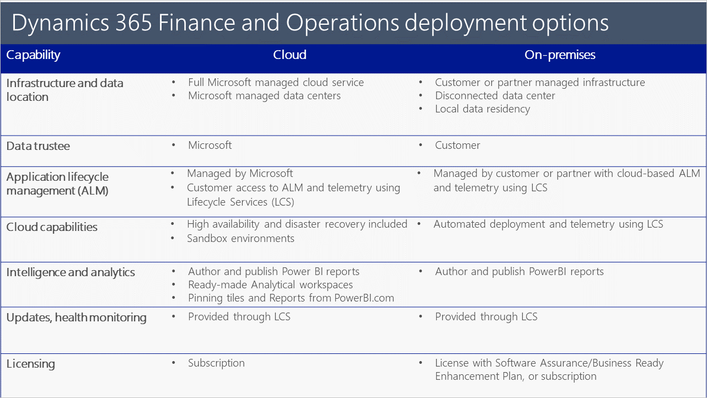

# Deployment options

[!include [banner](../includes/banner.md)]

You can deploy finance and operations apps in the cloud or on-premises. Cloud deployments offer an ERP service that is fully managed by Microsoft, while on-premises deployments are deployed locally within a customer's data center. 
> [!IMPORTANT]
> On-premises deployments are not supported on any public cloud infrastructure, including Azure. However, they are supported to run on [Microsoft Azure Stack HCI](https://azure.microsoft.com/products/azure-stack/hci/) and [Microsoft Azure Stack Hub](https://azure.microsoft.com/products/azure-stack/hub/).

The following table provides a comparison of the capabilities provided by the two deployment options.

## Why cloud
Cloud deployments provide a cloud service that is easy to scale up or down as needed, as well as data centers that are fully managed by Microsoft. The time spent implementing finance and operations apps can be significantly shortened, fewer customizations may be required, and the costs of IT hardware and infrastructure are lower. 

Cloud deployments include high availability, disaster recovery, sandbox environments, and application lifecycle management combined with cloud-based systems of intelligence, infrastructure, compute, and database services in a single offering. When needed, data failover in the cloud, automated deployment and continuous updates, and elastic compute capacity are available. A cloud deployment also provides data aggregation, financial reporting, and intelligence.

The cloud service provides customers with the greatest value, the broadest range of functionality, the best application lifecycle experience, the easiest and broadest integration with Microsoft Azure services, the best option for business insights and intelligence, and the most value for customers’ technology investments. 

## Why on-premises
With an on-premises deployment, existing data center investments can be leveraged. Customers can also configure their enterprise preferences to meet the regulatory and compliance needs of their business, comply with data sovereignty rules in regions where there are no Azure Data Centers, or ensure business continuity in areas with limited public infrastructure. 

A customer’s business data and processes are disconnected from the cloud and are stored and run locally in the customer’s or their partner’s data center. Some connectivity is required for system management and updates which are enabled through Microsoft Dynamics Lifecycle Services (LCS), a cloud-based application lifecycle management service. Customer data that is related to the configuration and application customization may be stored in the cloud. 

For customers who choose to run finance and operations apps in their own data center, the on-premises deployment option will have a similar user-interface and application functionality as other deployment options. However, customers must take on the following responsibilities:

- Stand up their own infrastructure. 
- Configure their own high-availability and disaster recovery solutions. 
- Stand up sandbox environments.
- Manage their infrastructure, including scheduling operating system updates.

The additional costs to deploy and manage these capabilities might lead to higher deployment costs and a greater Total Cost of Ownership (TCO). Tools for deploying the finance and operations apps and updates will be available to partners and customers via Lifecycle Services. Unlike the cloud deployment option, Advanced Analytics and Azure Machine Learning are not included in the on-premises deployment option. 

[!INCLUDE[footer-include](../../../includes/footer-banner.md)]

