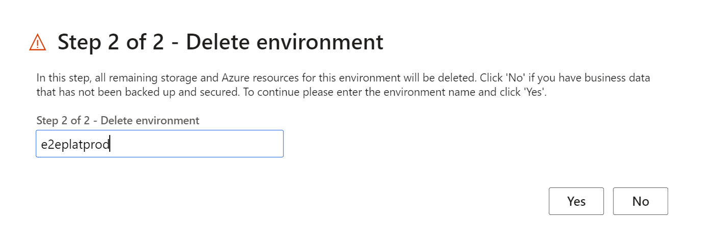
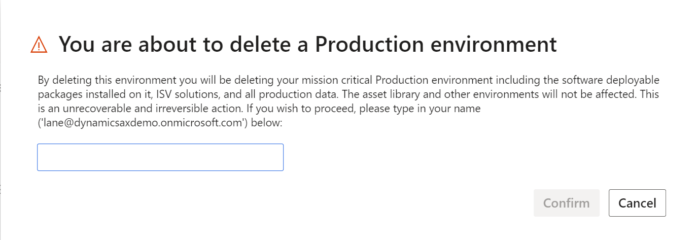

---
# required metadata

title: Delete a Production Finance and Operations apps environment
description: This article explains how to delete a production environment using a self-service experience.
author: laneswenka
ms.date: 04/19/2023
ms.topic: article
ms.prod: 
ms.technology: 

# optional metadata

# ms.search.form: 
# ROBOTS: 
audience: Developer
# ms.devlang: 
ms.reviewer: sericks
# ms.tgt_pltfrm: 
ms.custom: 24211
ms.search.region: Global
# ms.search.industry: 
ms.author: laswenka
ms.search.validFrom: 2018-12-31
ms.dyn365.ops.version: 8.1.1

---

# Delete a Production Finance and Operations apps environment

[!include [banner](../includes/banner.md)]
[!include [banner](../includes/limited-availability.md)]

This article walks through the process of deleting a Production [self-service environment](infrastructure-stack.md). This is rarely exercised after a customer goes live with the software, but may be done several times as part of prepartion for the final deployment.  In many cases, customers will go through the motions of deploying the Production environment, applying code, bringing in data, and capturing how long each step of the process takes.  If you wish to delete and repeat the steps, this guide will help you accomplish that task.

> [!IMPORTANT]
> Deleting a Production environment that is in use for your business can have severe consequences.  This process is only available for Project Owners in the Lifecycle Services project who are also from the same Azure Active Directory tenant that owns the project to help safeguard from mistakes.

### Delete the Production environment

You can delete an environment that is in the deployed state directly through the environment details page. To delete an environment, go to the environment details page and click the  **Delete** button on the action bar. A confirmation dialog box will display asking you to enter the name of the environment that you want to delete. 

After you enter the environment name and select **Yes**, you will be asked to confirm your desire to delete the Production environment one more time.  In this dialog you will be asked to type in your name to confirm and capture the intent to delete.

After this final confirmation, the deletion operation will start. When the deletion operation is complete, the **Configure** button for this environment will be enabled on the project dashboard if you want to redeploy the Production environment. 

[!INCLUDE[footer-include](../../../includes/footer-banner.md)]
