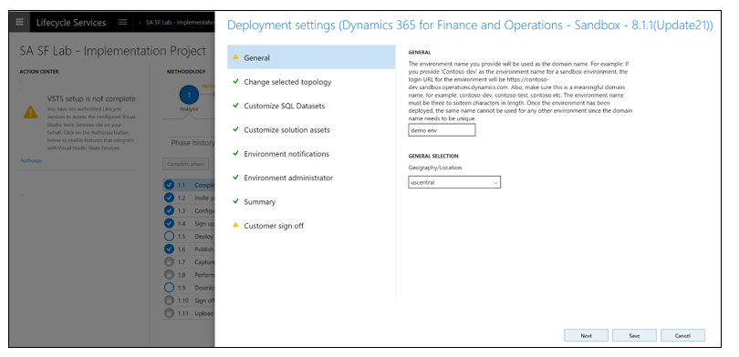

# Self-service deployment overview

[!include[banner](../includes/banner.md)]
[!include [banner](../includes/limited-availability.md)]

Self-service deployment is available for cloud environments. Self-service deployment enables easier deployment and significantly reduced deployment times.

> [!IMPORTANT]
> The functionality for this feature will be released incrementally, based on your Microsoft Azure country/region. However, this functionality is currently available only for **new customers** who are in the process of signing up for finance and operations apps. There is no change in existing environments for current customers.
>
> Note that not all new customers will see this functionality. However, the number of new customers who have access to it will gradually increase. 

## What’s new or changed

Customers using the self-service capabilities will see the following changes in their Lifecycle Services (LCS) experience. 

- Deployment is self-service and can be completed within an average time of 1-2 hours, depending on the type of environment (sandbox or production). There are no longer lead times and wait times for deployment. You can control when you deploy, and verify that the environment is deployed. This experience is the same as the current experience. For more information, see [Self-service deployment FAQ](deploymentFAQ.md).

   

- You will no longer have remote desktop access to the Tier 2+ sandbox environments. All operations that need remote desktop access are now available as self-service actions. The following image shows some of the operations in the environment’s **Maintain** \> **Move database menu** option. For more information, see [Maintenance operations for deployments](maintenanceoperationsguide-newinfrastructure.md).

    > [!IMPORTANT]
    > Remote desktop access will be restricted only to environments deployed using the self-service deployment. There is no change to existing environments or existing customers. 

   

- The diagnostics capabilities will remain the same, which enables troubleshooting without remote desktop access. For more information, see [Troubleshoot environments deployed through self-service deployment](troubleshoot-newinfrastructure.md). 

   

- You will not have SQL Server access on Tier 2+. You will continue to have SQL database access using just-in-time access.

- You will need to provide a combined deployable package for customizations. That is, all custom extension packages, including ISV packages, must be deployed as a single software deployable package. You will not be able to deploy one module at a time. This was always a recommended best practice and is now enforced.

- The document preview experience has been improved to deliver greater fidelity with the printed output. Before this change, documents viewed on screen were displayed using an HTML viewer. Although the HTML format supported interactive functions like embedded drill-thru links and collapsible sections, this was not a true representation of the document rendered by the service. With the new embedded PDF Viewer, customers have access to a preview that's consistent with the printed documents. For more information, see [Preview PDF documents with an embedded viewer](../analytics/preview-pdf-documents.md).

- Custom fonts are no longer supported for document reports rendered using the built-in SSRS framework. Finance and operations apps include access to hundreds of [standard, business-ready fonts](../analytics/supported-fonts.md) available for documents rendered by the cloud-hosted service. This portfolio will continue to grow as the service expands into new regions and industries. However, the service no longer supports the installation of custom fonts in customer environments. Requests to expand the collection of fonts supported by the service will be considered on a case-by-case basis.

- The service no longer supports business logic defined using Visual Basic script embedded in SQL Server Reporting Services (SSRS) reports. Visual Basic expressions defined in Tablix controls used to format and evaluate data at runtime will continue to be fully supported. However, the service will ignore instructions defined in Visual Basic script functions. This change was necessary to improve the security and reliability of the service.

- Sub reports are no longer supported in document reports defined using the SSRS development tools. Application solutions that include sub reports will need to be recreated or replaced with solutions that take advantage of other reporting options supported by the service.

    > [!IMPORTANT]
    > Support for sub report items has been re-introduced with the Platform update 36 release. Customers dependent on solutions that include properly formatted sub report items can transition to self-service deployments running on Platform update 36 or later.

[!INCLUDE[footer-include](../../../includes/footer-banner.md)]

