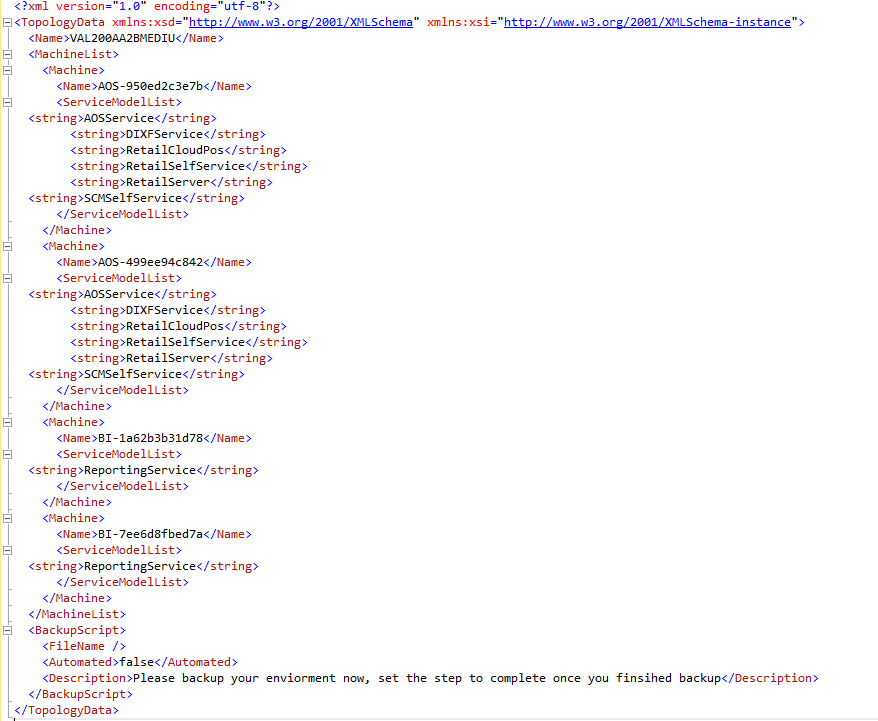

# Install deployable packages from the command line

[!include [banner](../includes/banner.md)]

This article walks you through the steps for using the command line to apply either a binary update or an application (AOT) deployable package that was created in your development or build environment.

> [!IMPORTANT]
> For most types of environments, you can apply a deployable package to an environment directly from Microsoft Dynamics Lifecycle Services (LCS). For more information, see [Apply updates to cloud environments](apply-deployable-package-system.md). Therefore, this article applies primarily to environment types that don't support the application of updates via LCS. Examples include local development environments (downloadable virtual hard disks [VHDs]), multi-box development/test environments in Microsoft Azure (LCS Partner and trial projects), and build environments. However, you can also use this article any time that you want to install deployable packages by using the command line instead of LCS.

## Key concepts
- **Deployable package** – A deployable package is a unit of deployment that can be applied to any environment. It can consist of a binary hotfix to the runtime components of Application Object Server (AOS), an updated application package, or a new application package.
- **AXUpdateInstaller** – AXUpdateInstaller is an executable program that is bundled in the deployable package. When the package is downloaded to a computer, the installer is available.
- **Runbook** – The deployment runbook is a series of steps that is generated and used to apply the deployable package to the target environment. Some of the steps are automated, and some are manual. AXUpdateInstaller enables these steps to be run one at a time and in the correct order.

## Install an application (AOT) deployable package on a development environment
> [!NOTE]
> The steps listed below are for customization packages only. Do not use the **devinstall** parameter when running the Data Upgrade deployable package as part of an upgrade from Microsoft Dynamics AX 2012 to a finance and operations app.

An AOT deployable package is a package that contains customizations and extensions to your application. If you want to use the command line just to install an AOT deployable package on a development or demo environment, follow the instructions in this section. You can then skip the rest of this article.

1. On the virtual machine (VM), download the zip file for the deployable package. Make sure that the zip file is stored in a non-user folder.

    > [!NOTE]
    > After you download the zip file, right-click it, and then select **Properties**. Then, in the **Properties** dialog box, on the **General** tab, select **Unblock** to unlock the files.

2. Extract the files.
3. Open a Command Prompt window, and go to the folder where you extracted the deployable package.
4. Run the following command.

    ```Console
    AXUpdateInstaller.exe devinstall
    ```

    The **devinstall** option installs the AOT deployable package on the VM. 
    
    > [!NOTE]
    > This command doesn't run database synchronization. You must run database synchronization from Microsoft Visual Studio after you install the deployable package.

## Collect topology configuration data
1. In LCS, on the **Environment** page, select the name of a VM. Establish a Remote Desktop connection to the VM by using the user name and password that are provided on the **Environment** page.
2. On the VM, download the zip file for the deployable package from LCS. Make sure that the zip file is stored in a non-user folder.

    > [!NOTE]
    > After you download the zip file, right-click it, and then select **Properties**. Then, in the **Properties** dialog box, on the **General** tab, select **Unblock** to unlock the files.
    
3. Extract the files.
4. In the folder where you extracted the deployable package, find and open the file that is named **DefaultTopologyData.xml**. You must specify the VM name and the installed components in this file.

   - To specify the VM name, follow these steps:

       1. In File Explorer, right-click **This PC**, and then select **Properties**.
       2. In the system properties, find and make a note of the computer name (for example, **AOS-950ed2c3e7b**).
       3. In the DefaultTopologyData.xml file, replace the machine name with the computer name that you found in the previous step.

   - To specify the installed components, follow these steps:

       1. Open a Command Prompt window as an administrator.
       2. Go to the extracted folder, and run the following command to see a list of all the components that are installed on the computer.

           ```Console
           AXUpdateInstaller.exe list
           ```

       3. Update the DefaultTopologyData.xml file with the list of components.

     When you've finished specifying the VM name and the installed components, the DefaultTopologyData.xml file should resemble the following illustration.
    
     

5. Repeat steps 1 through 4 for every other VM that is listed on the **Environment** page.

## Generate a runbook from the topology
Based on the topology information in the DefaultTopologyData.xml file, you must generate the runbook file that will provide step-by-step instructions for updating each VM.

- On any VM, run the following command to generate the runbook.

    ```Console
    AXUpdateInstaller.exe generate -runbookid=[runbookID] -topologyfile=[topologyFile] -servicemodelfile=[serviceModelFile] -runbookfile=[runbookFile]
    ```

    Here is an explanation of the parameters that are used in this command:

  - **\[runbookID\]**– A parameter that is specified by the developer who applies the deployable package.
  - **\[topologyFile\]**– The path of the DefaultTopologyData.xml file.
  - **\[serviceModelFile\]**– The path of the DefaultServiceModelData.xml file.
  - **\[runbookFile\]**– The name of the runbook file to generate (for example, **AOSRunbook.xml**).

    **Example**

    ```Console
    AXUpdateInstaller.exe generate -runbookid="VAL200AA2BMEDIU-runbook" -topologyfile="DefaultTopologyData.xml" -servicemodelfile="DefaultServiceModelData.xml" -runbookfile="VAL200AA2BMEDIU-runbook.xml"
    ```

The runbook provides the sequence of steps that must be run to update the environment. The following illustration shows an example of a runbook file. Each step in a runbook is associated with an ID, a machine name, and step execution details.

[](./media/runbook-steps.jpg)

## Install a deployable package
1. On the first machine (VM) that is listed in the runbook file, follow these steps:

    1. Import the runbook by running the following command.

        ```Console
        AXUpdateInstaller.exe import -runbookfile=[runbookFile]
        ```

        **Example**

        ```Console
        AXUpdateInstaller.exe import -runbookfile="VAL200AA2BMEDIU-runbook.xml"
        ```

    2. Verify the runbook.

        ```Console
        AXUpdateInstaller.exe list
        ```

    3. Run the runbook.

        ```Console
        AXUpdateInstaller.exe execute -runbookid=[runbookID]
        ```

        **Example**

        ```Console
        AXUpdateInstaller.exe execute -runbookid="VAL200AA2BMEDIU-runbook"
        ```

        AXUpdateInstaller updates the runbook file after each step is run on a VM. The runbook also logs information about each step.

        For manual steps, follow the instructions, and then run the following command to mark the step as completed in the runbook.

        ```Console
        AXUpdateInstaller.exe execute -runbookID=[runbookID] -setstepcomplete=[stepID]
        ```

        **Example**

        ```Console
        AXUpdateInstaller.exe execute -runbookid="VAL200AA2BMEDIU-runbook" -setstepcomplete=2
        ```

        If errors occur during any step, debug the script or the instructions in the step, and update accordingly.

    4. Export the runbook.

        ```Console
        AXUpdateInstaller.exe export -runbookid=[runbookID] -runbookfile=[runbookFile]
        ```

        **Example**

        ```Console
        AXUpdateInstaller.exe export -runbookid="VAL200AA2BMEDIU-runbook" -runbookfile="VAL200AA2BMEDIU-runbook.xml"
        ```

2. Repeat step 1 on every other VM that is listed in the runbook file. For one-box environments, such as development, build, and demo environments, there is only one VM.

## Verify installation
1. Run the following command to verify that the new updates are installed.

    ```Console
    AXUpdateInstaller.exe list
    ```

2. View the runbook to see the completed steps. Here is an example of a runbook file where the steps have been completed.

    [](./media/image013.png)

## Backup the runbook file
- After all the steps in the runbook are completed and you've exported the runbook, save the file outside the computer for future reference. For example, you might have to use the runbook file in these situations:

    - You must analyze the downtime requirements for production, and so on.
    - You must send the file to Microsoft because a deployable package can't be installed.

## Troubleshooting
- If any step in the runbook fails, you can rerun it by running the following command.

    ```Console
    AXUpdateInstaller.exe execute -runbookid=[runbookID] -rerunstep=[stepID]
    ```

- To prevent version mismatch or downgrade, or installation of the same deployable package, run the following command.

    ```Console
    AXUpdateInstaller.exe execute -runbookid=[runbook ID] -versioncheck=true
    ```

- To verify database synchronization, in the **aosservice\\scripts\\** folder, find and open the **dbsync.error.txt** file, and look for any errors.


[!INCLUDE[footer-include](../../../includes/footer-banner.md)]
