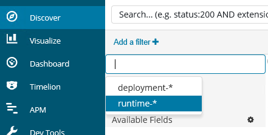
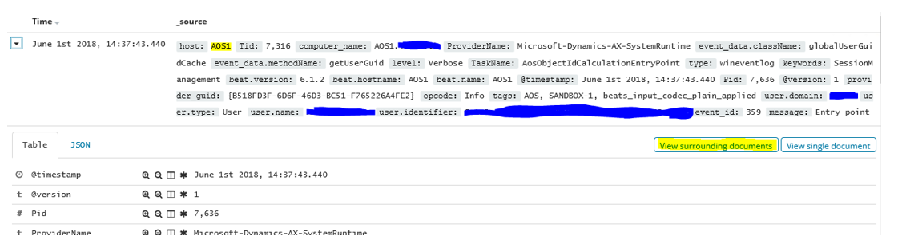

# On-premises diagnostics

[!include [banner](../includes/banner.md)]

The Microsoft Dynamics 365 team monitors the health and performance of the Azure Services that provide functionality for cloud-based customers by using state-of-the-art Azure diagnostic tools. For customers who implement Finance + Operations (on-premises) and want to monitor the health and performance of their on-premises solution, several third-party offerings are available.

This article describes the setup and configuration of Elastic Stack, a third-party product, and one of many choices that can provide  diagnostic monitoring of your on-premises solution.

When you consider a diagnostic solution, consider the following fundamentals of your implementation:

- Your diagnostic system should collect and store 30 days' worth of diagnostic information.
- Set up your diagnostic repository in a central location that many client computers can share.
- Create structured diagnostics events, including event type, classification, and data.
- Store events in raw text (deserialized) so you can easily query and search them.
- Avoid storing sensitive or personal data in events.

> [!NOTE]
> By default, communication in an Elastic Stack cluster isn't sent over HTTPS. Don't set up the Elastic Stack unless you consider the risks, and prepare or implement mitigations for those risks. The paid version of X-Pack can encrypt communication in the Elastic Stack. For setup information, see [Setting up TLS on a cluster](https://www.elastic.co/guide/en/x-pack/current/ssl-tls.html). There's also an open source Elasticsearch plug-in. Although Microsoft hasn't tested this plug-in, according to the documentation, it can enable HTTPS. Always use encrypted communication by using HTTPS, VPN, or another secure, encrypted protocol. Many industry certifications and laws require the use of encrypted transmission if your content includes end user, customer, personal, or sensitive data.

## Diagnostic data guidelines

To diagnose the deployment and execution of Finance + Operations (on-premises), you must have access to diagnostic data. For a cloud deployment, Microsoft stores and monitors the diagnostic data from services to help keep the environment healthy. For an on-premises deployment, you're responsible for this task.

You can select the diagnostic data store and query tool that you prefer to use. However, at a minimum, the tool should perform the following tasks:

- The store should store 30 days' worth of diagnostic data.
- The store should centralize event storage, so support engineers don't have to switch between multiple machines to find events that are relevant to an issue.
- The events should be discoverable based on event type and event data.
- The event data (in XML format) should be deserialized so that you can query and traverse the event data.

## Elastic Stack example

To meet the diagnostic data guidelines listed in the previous section, Microsoft tested the Elastic Stack setup. This setup includes the following components:

- **Elasticsearch** – For storage, event indexing, and event querying. For more information about Elasticsearch, see the [Elastic website](https://www.elastic.co/products/elasticsearch).
- **Logstash** – For load distribution and event data transformation.
- **Winlogbeat** – For diagnostic data collection.
- **Kibana** – An interface for querying the data that is stored in Elasticsearch.

> [!NOTE]
> By default, communication in an Elastic Stack cluster isn't sent over HTTPS. Consider the risks, and prepare or implement mitigations for those risks before setting up the Elastic Stack. The [paid version](https://www.elastic.co/subscriptions) of X-Pack can encrypt communication in the Elastic Stack. For setup information, see [Setting up TLS on a cluster](https://www.elastic.co/guide/en/x-pack/current/ssl-tls.html). There's also an open source [Elasticsearch plug-in](https://github.com/floragunncom/search-guard-ssl). Although Microsoft didn't test this plug-in, according to the documentation, it can enable HTTPS.

If you deploy the Elastic Stack, your experience might vary if you follow the steps described in this article. For its tests, Microsoft used version 6.2.3 of the Elastic Stack components and Microsoft Dynamics 365 Finance 7.3 with platform update 12.

This article describes how Microsoft handled the setup and configuration steps that are required for the Elastic Stack to work for an on-premises deployment. For guidance that isn't related to Finance + Operations (on-premises), see the documentation on Elastic.co.

## Install and configure the Elastic Stack

All hosted components of the Elastic Stack, except Winlogbeat, run on Java. For the test scenario, Microsoft first downloaded and installed the latest version of Java Runtime Environment (JRE) 8 (64-bit) on each node that runs Elasticsearch, Logstash, or Kibana (that is, all the Orchestrator nodes). You can get Java 8 from [https://www.oracle.com/technetwork/java/javase/downloads/index.html](https://www.oracle.com/technetwork/java/javase/downloads/index.html).

As of June 2018, the Elastic Stack runs on Java 8. Any attempt to run it on a newer version of Java might not work.

> [!NOTE]
> You can host the whole Elastic Stack, except Winlogbeat, on Linux. For its tests, Microsoft hosted the stack on Microsoft Windows Server 2016 virtual machines (VMs).

Remember to open ports in the firewall for the various components on each node.

If you get stuck during setup, Elastic.co has extensive and well-written documentation about the installation and configuration of the Elastic Stack. For help with specific types of errors, web searches yield reliable results from both the Elastic.co forum and StackOverflow.

### Component matrix

For its tests, Microsoft used the following setup for a small to medium-sized deployment.

| Node            | Elasticsearch | Logstash | Kibana | Winlogbeat |
|-----------------|---------------|----------|--------|------------|
| Orchestrator #1 | X             |          |        | X          |
| Orchestrator #2 | X             | X        |        | X          |
| Orchestrator #3 |               | X        | X      | X          |
| AOS #1...*n*    |               |          |        | X          |

> [!IMPORTANT]
> For testing purposes, Microsoft used the Orchestrator machines for the ELK installation. Because it can take up critical resources from the Orchestration services, don't use the Orchestrator machines for ELK installations on production environments or critical Sandbox Environments. Instead, use separate machines to host the ELK services.

### Elasticsearch

Installing Elasticsearch is straightforward. For its tests, Microsoft downloaded the [Microsoft Windows Installer (MSI) file](https://www.elastic.co/downloads/elasticsearch) onto the Orchestrator #1 and Orchestrator #2 nodes. Most of the default settings in the installer can be left as is. This section describes the settings that Microsoft changed.

To make it easier for Elasticsearch to start running again if the operating system (OS) restarts, Microsoft installed it as a service on Windows. Use the installer to set up the service.

On the **Configuration** page of the installer, use the same cluster name when you install each Elasticsearch node in the cluster.

Set every Elasticsearch node to perform all three roles: Data, Master, and Ingest.

Depending on how much you expect Kibana and Elasticsearch to be used, consider increasing the memory usage. You can change this setting later by modifying the -Xm options in the C:\\ProgramData\\Elastic\\Elasticsearch\\config\\jvm.options file and restarting Elasticsearch.

Depending on the number of Elasticsearch nodes that you set up, set the Discovery minimum master nodes appropriately. If you're not sure, you can keep the master nodes empty. For more information about discovery and nodes, see [Node](https://www.elastic.co/guide/en/elasticsearch/reference/current/modules-node.html).

For discoverability, in **Network settings**, set the **Network host** value of each node to that node's IP address and add the IP addresses of all Elasticsearch nodes to the **Unicast Hosts** list for each node. For example, for Orchestrator #1, which has the IP address 10.0.0.12, set the **Network host** value to **10.0.0.12** and add the following IP addresses to the **Unicast Hosts** list: 10.0.0.12 and 10.0.0.13, where 10.0.0.13 is Orchestrator #2.

**If you're installing Elasticsearch version 6.3 or higher, you can disregard this paragraph.** You can install X-Pack either now or later. For more information about setup and whether you should install X-Pack, see the "X-Pack" section of this article. For now, unless you know what X-Pack is for, don't install it.

> [!IMPORTANT]
> Open the HTTP port (by default, port 9200) and the node communication port (by default, port 9300) in your firewall.

To verify that the installation was successful, start a browser, and open the application address. You should see some JavaScript Object Notation (JSON) output.

### Logstash

In its test setup, Microsoft found that some events from Winlogbeat required adjustments. Logstash provides that functionality.

Microsoft downloaded Logstash to `C:\ELK\Logstash` on the Orchestrator #2 and Orchestrator #3 nodes.

To help ensure that Logstash runs on startup, use the Non-Sucking Service Manager (NSSM) to set up a service for the Logstash batch script.

1. Copy `nssm.exe` to the Logstash `bin` folder (for example, `C:\ELK\Logstash\6.2.4\bin\`).
1. Open Windows PowerShell from the `bin` folder, and run the following command.

    ```Console
    .\nssm.exe install Logstash
    ```

1. On the **Application** tab, set the following fields, and then select **Save**:

    - **Path:** `C:\ELK\Logstash\6.2.4\bin\logstash.bat`
    - **Startup directory:** `C:\ELK\Logstash\6.2.4`
    - **Arguments:** `-f C:\ELK\Logstash\config\logstash-dyn365finops.conf`

    (There are more settings that you can set. However, these settings suffice for now.)

1. Run the following command.

    ```Console
    .\nssm.exe start Logstash
    ```

In the tests that Microsoft performed, NSSM had trouble restarting the installed services. Because NSSM wasn't 100 percent reliable for Logstash and Kibana, treat the service as an OS startup service and little else.

Microsoft created a configuration file for Logstash called `logstash-dyn365finops.conf`. This file is available in the Microsoft Dynamics Lifecycle Services Shared Asset library, under the Model asset type in a zipped file called **LBD Diagnostic configurations**. Go to the [Lifecycle Services Shared Asset library](https://lcs.dynamics.com/V2/SharedAssetLibrary) to download this file. After you extract it, put it in `C:\ELK\Logstash\6.2.4\config`. This file performs useful transformations on diagnostics.

To make the configuration work for your setup, change the **hosts** fields in the **output** section so that they point to the Elasticsearch nodes in your cluster. For example, change **hosts** to `["ORCH1:9200", "ORCH2:9200"]`.

The configuration was tested by using the Winlogbeat configuration from the next section.

Remember to open the Winlogbeat port (by default, port 5044) in your firewall on the machine that is hosting Logstash, so that Beats can send data to Logstash.

### Winlogbeat

Microsoft downloads Winlogbeat to each Application Object Server (AOS) and Orchestrator node at `C:\ELK\Winlogbeat`, and configures the `winlogbeat.yml` file. You can find a sample configuration file for Winlogbeat in the Lifecycle Services Shared Asset library, under the Model asset type in a zipped file called **LBD Diagnostic configurations**. Go to the [Lifecycle Services Shared Asset library](https://lcs.dynamics.com/V2/SharedAssetLibrary) to download this file.

To make the configuration work for your set up, change the **output.logstash.hosts** fields so that they point to all your Logstash nodes. Winlogbeat handles the load balancing.

When Winlogbeat runs on an Orchestrator node, change the **Tags** field from **AOS** to **ORCH** or a similar value. Microsoft also uses the **fields.env** field to set the environment of the deployment (sandbox, sandbox-n, or production). By using this field, you get a cleaner separation when querying data from multiple environments and node types.

Winlogbeat includes a service installer. Microsoft uses this installer to set up Winlogbeat as a service on each node. Press the Windows logo key+R to start the Run tool, and then run the following command.

```powershell
powershell.exe -ExecutionPolicy Bypass -File C:\ELK\Winlogbeat\install-service-winlogbeat.ps1
```

### Kibana

Kibana provides the interface to query the diagnostic data in Elasticsearch.

Microsoft downloaded Kibana to `C:\ELK\Kibana` and configured the `kibana.yml` file as follows.

```Console
server.host: "10.0.0.14"
server.name: "Dyn365FinOps On-Premises Diagnostics"
elasticsearch.url: "http://ORCH1:9200"
```

From Kibana, Microsoft defined index patterns on the **Management** tab. Because index patterns group indexes by name, you need an index pattern for the two indexes that you create: `deployment-*` and `runtime-*`. The index names are case-sensitive.

Microsoft set the `runtime-*` index pattern as the default pattern. When you look at the index patterns on the **Management** tab, select the asterisk (\*). The index pattern then appears on the **Discover** tab.

[](./media/runtime-index-patter.png)

Microsoft runs Kibana as a service in the same manner as Logstash, so that Kibana starts at OS startup. Unlike Logstash, `kibana.bat` doesn't need the path of the configuration files. Therefore, you can just install an NSSM service that points to `C:\ELK\Kibana\6.2.4\bin\kibana.bat`.

If you want users to browse Kibana on your network, remember to open the port for Kibana. The default port is 5601.

#### Example queries on the Discover tab in Kibana

The following sample queries can help you start probing the diagnostic data. If you require something more than the examples show, try one of the following queries:

- **Find slow database queries:** Enter **slow** in the search field to find events that have the word "slow" somewhere in the event data. If you want to be more precise, find events that have a task name of **AosDatabaseSlowQuery** and then enter **TaskName:AosDatabaseSlowQuery** in the search field.
- **Find recent exceptions:** Enter **exception** in the search field to find events that have either thrown an exception, or handled an exception and logged it. In the upper-right corner of Kibana, you can select the time frame that the search should be limited to. The time frame that you set there is persisted between tabs. Therefore, the data on the **Visualize** tab reflects the selected time frame.

    [](./media/time-visualize.png)

- **Find events from an AOS node:** Enter **host:AOS1** in the search field to find all events from that node.
- **Find events with proximity, in time, to another:** When you find an event that you're interested in, select **View surrounding documents** next to the header of that event to find events that occurred at the same time. If you see events that occurred at around the same time but from different AOS nodes, you can add additional filtering to view only events from the node that you want.

    [](./media/events-with-proximity.PNG)

#### Thirty-day data retention

To keep its hard disks free from stale data, Microsoft uses Curator v5.5 to clean up indexes that are older than 30 days.

Microsoft downloads Curator to one of the Orchestrator nodes at `C:\ELK\Curator`. The sample configuration file, `curator.yml`, available in the [Lifecycle Services Shared Asset library, under the Model asset type in zipped file "LBD Diagnostic configurations"](https://lcs.dynamics.com/V2/SharedAssetLibrary), is put in `C:\ELK\Curator` to connect Curator to its Elasticsearch cluster. You need to edit the file to reference your specific servers.

Curator runs actions, and Microsoft created an action configuration file called `30day_data_retention_actions.yml` to clean up 30-day-old indexes in `C:\ELK\Curator`. The retention configuration file is available in the Lifecycle Services Shared Asset Library, under the Model asset type in a zipped file called "LBD Diagnostic configurations". Go to the [Lifecycle Services Shared Asset Library](https://lcs.dynamics.com/V2/SharedAssetLibrary) to download this file.

Microsoft creates a basic task in Windows Task Scheduler. This task has a weekly trigger on Saturday and Sunday, and the trigger has the following settings to start a program:

- **Program/script:** `C:\ELK\Curator\curator.exe`
- **Add arguments:** `--config curator.yml .\30day_data_retention_actions.yml`
- **Start in:** `C:\ELK\Curator`

## X-Pack
>
> [!IMPORTANT]
> As of June 2018, Elastic Stack components are released that start with version 6.3. This updated version handles X-Pack in a more graceful manner by enabling the free features of X-Pack by default, without requiring that you update the license every year, and by letting you opt in to the paid features afterward. If you install an Elastic Stack version that is earlier than 6.3, the content in this section only partially applies to the setup.

You can select to install X-Pack when you install Elasticsearch. Alternatively, you can [install it later](https://www.elastic.co/guide/en/x-pack/current/installing-xpack.html).

X-Pack has a free basic license that you must update every year.

Microsoft installed the free version to enable query data to be exported from Kibana in comma-separated value (CSV) format. There are other useful features in X-Pack, but some are available only in a paid subscription.

To enable only the free features and avoid using other X-Pack trial features, Microsoft added the following settings to the `elasticsearch.yml` and `kibana.yml` configuration files:

```Console
xpack.graph.enabled: false
xpack.ml.enabled: false
xpack.security.enabled: false
xpack.watcher.enabled: false
```

These settings also stop Kibana and Elasticsearch from asking for credentials because the security module is no longer enabled.

For X-Pack to work, you must also configure the `logstash.yml` configuration file in the following manner:

```Console
xpack.monitoring.elasticsearch.url: "http://orch1:9200"
```

The paid version of X-Pack includes HTTPS encryption for connections throughout the cluster, password-protected data access, and more. For more information about X-Pack, see the [Elastic website](https://www.elastic.co/products/x-pack).

### Export a query to a CSV file

In Kibana, on the **Discover** tab, write a query, and save it. After you save the query, on the **Reporting** tab at the top of the **Discover** page, click **Generate CSV**.

## Troubleshooting

### You don't receive any data in Kibana

If you don't receive any data in Kibana, review the logs from Winlogbeat to Logstash, Elasticsearch, and Kibana. The Winlogbeat installation puts its logs in `C:\ProgramData\winlogbeat\Logs`. The other Elastic Stack components put their logs close to the installation path. For example, you can find logs in `C:\ELK\Elasticsearch\logs`.

[!INCLUDE[footer-include](../../../includes/footer-banner.md)]
