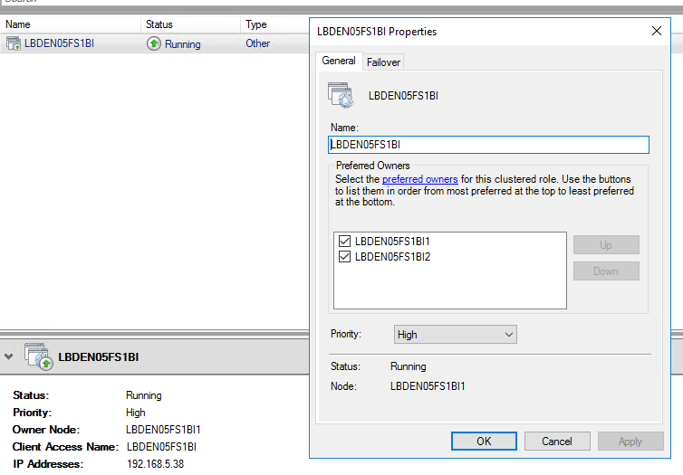

---
# required metadata

title: Configure high availability for SQL Server Reporting Services (SSRS) nodes
description: This article explains how to configure Microsoft SQL Server Reporting Services (SSRS) nodes for Dynamics 365 Finance + Operations (on-premises) deployments.
author: faix
ms.date: 02/08/2023
ms.topic: article
ms.prod: dynamics-365 
ms.service:
ms.technology: 

# optional metadata

# ms.search.form:
audience: IT Pro
# ms.devlang: 
ms.reviewer: sericks
# ms.tgt_pltfrm: 
# ms.custom: NotInTOC
ms.search.region: Global
# ms.search.industry:
ms.author: osfaixat
ms.search.validFrom: 2021-03-21
ms.dyn365.ops.version: 10.0.17
search.app:
  - financeandoperationsonprem-docs
---

# Configure high availability for SQL Server Reporting Services (SSRS) nodes

[!include[banner](../includes/banner.md)]

This article explains how to configure multiple Microsoft SQL Server Reporting Services (SSRS) nodes for Dynamics 365 Finance + Operations (on-premises) deployments.

## High availability with Windows failover clusters

This scenario uses Windows failover clusters. Therefore, you will have one active node that receives all requests and one passive node that is idle. If the active node becomes unavailable, the cluster will detect this event, and the passive node will start to receive all network traffic.

This article doesn't cover the setup of Windows failover clusters. For information, see [Create a failover cluster](/windows-server/failover-clustering/create-failover-cluster).

After the cluster is set up, you can configure your installation. The examples below will be based on the information displayed in the following illustration.



1. Update your configuration file (**ConfigTemplate.xml**):

    1. Update **ADServiceAccount** for the reporting service bootstrapper service.

        ```xml
        <ADServiceAccount type="gMSA" name="svc-ReportSvc$" refName="gmsaSSRS">
            <DNSHostName>svc-ReportSvc.contosoen05.com</DNSHostName>
        </ADServiceAccount>
        ```

    1. In the **ServiceFabricCluster** section, under **ReportServerType**, make sure that all your servers are listed.

        ```xml
        <NodeType name="ReportServerType" primary="false" namePrefix="Rep" purpose="BI">
            <VMList>
                <VM name="LBDEN05FS1BI1" ipAddress="10.179.108.10" faultDomain="fd:/fd1" updateDomain="ud1"/>
                <VM name="LBDEN05FS1BI2" ipAddress="10.179.108.11" faultDomain="fd:/fd2" updateDomain="ud2"/>
            </VMList>
        </NodeType>
        ```

    1. Update the **SSRSHTTPS** certificate settings.
        
        This example has been configured using the screenshot shown above. The **Subject** attribute should be set to the client access name. Additionally, for convenience, we have set the name and file name to be the same value. For the **DNSName** we have an entry for each of the preferred owners, as well as the client access name. 
        ```xml
        <Certificate type="SSRSHTTPS" exportable="true" generateSelfSignedCert="false" generateADCSCert="true">
            <!-- Specify the friendly name of the certificate during import operations. -->
            <Name>LBDEN05FS1BI</Name>
            <!-- Specify the file name of the pfx that will be used in export and import operations. If not specified, the name property will be used -->
            <FileName>LBDEN05FS1BI</FileName>
            <!-- Specify the DNS names for the listener, and of each of the report nodes in the cluster. -->
            <!-- The FQDNS will only be accessed from within the environment so it's not necessary to create external DNS entries for them. -->
            <DNSName>LBDEN05FS1BI;LBDEN05FS1BI1;LBDEN05FS1BI2</DNSName>
            <Subject>LBDEN05FS1BI</Subject>
            <Thumbprint></Thumbprint>
            <ProtectTo></ProtectTo>
        </Certificate>
        ```

    > [!IMPORTANT]
    > Even if you won't be using the infrastructure scripts that are provided to generate the certificate, you should fill in the certificate information, because other scripts will rely on that information.

1. Follow the setup guide to complete the setup in your usual way.

    > [!IMPORTANT]
    > If you've already created the Azure Service Fabric cluster, make sure that the nodes are added to it.
    >
    > Rerun the Export-Certificates.ps1 script, and rerun the Complete-Prereqs.ps1 script on the appropriate machines, to ensure that the certificate for the SSRS web server is distributed to all the ReportServer nodes.

## High availability with load balancers

In this scenario, a load balancer is configured to distribute requests among the different nodes that are available. These requests include all report generation requests.

When you set up this configuration, note that you must set up session affinity. The solution that you select **must** support this requirement. The type of session affinity that is required depends on the client. When the Application Object Server (AOS) node makes a request, the load balancer should direct all requests for that AOS node to the same SSRS node.

This article doesn't include instructions for setting up a specific software load balancer or hardware load balancer.

Here is a general overview of this scenario:

1. Choose a load balancing strategy or product.
1. Configure the strategy or product according to your network topology.
1. Make sure that you've set up client (source IP) affinity.
1. Update the **ConfigTemplate.xml** file. Use the previous example as a guide.
1. Continue to set up the cluster in your usual way.

> [!IMPORTANT]
> If you've already created the Service Fabric cluster, make sure that the additional nodes are added to it.
>
> Rerun the Export-Certificates.ps1 script, and rerun the Complete-Prereqs.ps1 script on the appropriate machines, to ensure that the certificate for the SSRS web server is distributed to all the ReportServer nodes.

## Deployed environments where the base deployment is earlier than Platform update 41

> [!NOTE]
> This configuration is supported only for Platform update 41 and later deployments.

If you want to enable high availability for the SSRS nodes in existing environments, you can use a predeployment script. For more information about predeployment scripts, see [Local agent pre-deployment and post-deployment scripts](../lifecycle-services/pre-post-scripts.md).

### Predeployment script

#### Invoke command example

```powershell
Configure-SSRSHA.ps1 -AgentShare "\\servername\D365FFOAgent" -Listener "LBDEN05FS1BI" -MachinesList "LBDEN05FS1BI1,LBDEN05FS1BI2" -TLSCertificateThumbprint "<cert thumbprint>" -ServiceAccount "contosoen05\svc-ReportSvc$"
```

> [!NOTE]
> These example values have been filled out according to the values used in the **ConfigTemplate.xml** file from the [High availability with Windows failover clusters](#high-availability-with-windows-failover-clusters) section.

#### Configure-SSRSHA.ps1 script

> [!NOTE]
> This script has been updated to work with Application version 10.0.32, but also works with older Application versions.

```powershell
param (
    [Parameter(Mandatory=$true)]
    [string]
    $AgentShare,

    [Parameter(Mandatory=$true)]
    [string]
    $Listener,

    [Parameter(Mandatory=$true)]
    [string]
    $MachinesList,

    [Parameter(Mandatory=$true)]
    [string]
    $TLSCertificateThumbprint,

    [Parameter(Mandatory=$true)]
    [string]
    $ServiceAccount,

    [string]
    $ssrsServicePort = "443"
)

$ErrorActionPreference = "Stop"

$basePath = Get-ChildItem $AgentShare\wp\*\StandaloneSetup-*\ |
    Select-Object -First 1 -Expand FullName

if(!(Test-Path $basePath))
{
    Write-Error "Basepath: $basePath , not found" -Exception InvalidOperation
}

$configJsonPath = "$basePath\config.json"

$configJson = Get-Content $configJsonPath | ConvertFrom-Json

$updatedComponents = @()
foreach ($component in $configJson.components)
{
    if($component.name -eq "AOS")
    {
        $component.parameters.biReporting.persistentVirtualMachineIPAddressSSRS.value = $Listener
        $component.parameters.biReporting.reportingServers.value = $MachinesList
        $component.parameters.biReporting.ssrsUseHttps.value = "True"
        $component.parameters.biReporting.ssrsHttpsPort.value = $ssrsServicePort
    }
    elseif($component.name -eq "ReportingServices")
    {
        $component.parameters.enableSecurity.value = "True"
        $component.parameters.ssrsSslCertificateThumbprint.value = $TLSCertificateThumbprint
        $component.parameters.ssrsServerFqdn.value = $Listener
        if($component.parameters.infrastructure)
        {
            $component.parameters.infrastructure.principalUserAccountType.value = "ManagedServiceAccount"
            $component.parameters.infrastructure.principalUserAccountName.value = $ServiceAccount
        }
        else
        {
            $component.parameters.principalUserAccountType.value = "ManagedServiceAccount"
            $component.parameters.principalUserAccountName.value = $ServiceAccount
        }

        $component.parameters.reportingServers.value = $MachinesList
        $component.parameters.ssrsHttpsPort.value = $ssrsServicePort
    }

    $updatedComponents += $component
}

$configJson.components = $updatedComponents

$configJson | ConvertTo-Json -Depth 100 | Out-File $configJsonPath

Write-Host "Successfully updated the configuration for SSRS HA."
```
