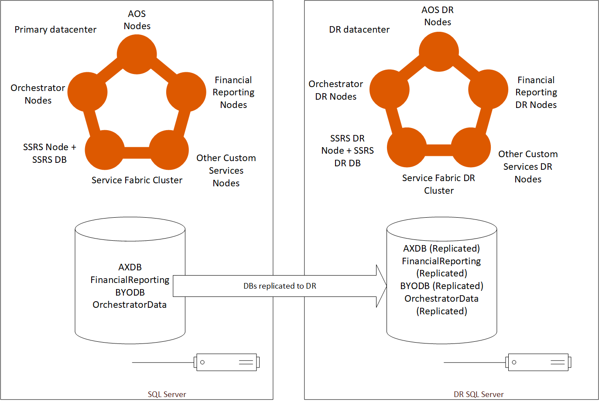
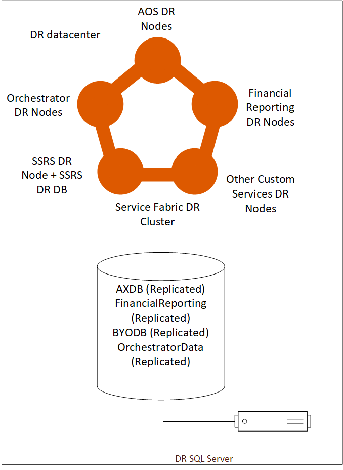

---
# required metadata

title: On-premises disaster recovery configuration
description: This article describes how to configure Dynamics 365 Finance + Operations (on-premises) for disaster recovery.
author: faix
ms.date: 09/11/2020
ms.topic: article
ms.prod: dynamics-365 
ms.service:
ms.technology: 

# optional metadata

# ms.search.form: [Operations AOT form name to tie this article to]
audience: IT Pro
# ms.devlang: 
ms.reviewer: sericks
# ms.tgt_pltfrm: 
# ms.custom: [used by loc for topics migrated from the wiki]
ms.search.region: Global
# ms.search.industry: [leave blank for most, retail, public sector]
ms.author: osfaixat
ms.search.validFrom: 2020-06-30 
ms.dyn365.ops.version: 10.0.12
search.app:
  - financeandoperationsonprem-docs
---

# On-premises disaster recovery configuration
Disaster recovery is an important consideration for on-premises deployments of Dynamics 365 Finance + Operations (on-premises) to protect from events that could put your organization's operations at risk. Examples of such events include equipment failures, datacenter break downs due to cyberattacks, electrical, physical, or other disasters.

The core concept of disaster recovery involves the use of a second datacenter including a data recover environment. We recommend that you plan, document, and test disaster recovery as carefully as your production setup.

### Limitations of this content

This article does not cover specific configuration details for disaster recovery of the following components:
  - Active Directory Federation Services (AD FS)
  - File storage
  - SQL Server

> [!NOTE]
> High availability configuration isn't covered in this article. For more information about the minimum setup required for high availability, see [System requirements for on-premises deployments](../../fin-ops/get-started/system-requirements-on-prem.md#minimum-infrastructure-requirements).

### Recommendations

Remember to keep your disaster recovery environment updated with the latest Windows Updates. Your environment should have the latest security updates and not require updates during a disaster event.

Ensure that you're applying new prerequisites that are specified by Microsoft. Also, keep your Service Fabric cluster updated and perform certificate rotations as required.

After you've read through this article, document the steps that need to be taken by your team. After you’ve done that, go through the steps multiple times to ensure that you don't encounter unexpected problems and you minimize the potential downtime.

## Overview

The basic configuration for disaster recovery involves deploying a duplicate of the production environment within another datacenter (the secondary datacenter) and replicating databases to that datacenter. If a disaster event takes place, a few manual steps can be taken to bring the environment that is within the secondary datacenter online.

The following diagram illustrates the required setup, at a high level.



## Environment configuration

In Lifecycle Services (LCS), the production environment should be deployed using the environment slot named **Production**. Your disaster recovery environment will not use an additional environment slot in LCS. It will instead reuse the slot for your production environment. 

Finance and operations AOS nodes and SQL Server must be co-located within the same datacenter. For more information, see [System requirements for on-premises deployments](../../fin-ops/get-started/system-requirements-on-prem.md#network-requirements).

## Deploying code packages to production

When code packages are deployed to the production environment, they don't need to be deployed to the disaster recovery environment. That environment should be unused and no Service Fabric services should be deployed.

## Environment deployment settings

The disaster recovery environment should have a similar configuration as the production environment. The following table illustrates the shared and specific settings for disaster recovery.

| Environment settings | Disaster recovery environment|
|---------------------------------|----------------|
| **Active Directory settings**   |                |
| Administrator user              | Same as production|
| AD FS URL                        | Same as production|
| AD FS OpenId Connect client ID for AOS | Same as production|
| AD FS OpenId Connect client ID for Financial Reporting | Same as production|
| **SQL Database configuration**  |                 |
| SQL Server name                 | Same as production |
| AX database name                | Same as production |
| Financial Reporting database name| Same as production |
| **File share settings**         |                 |
| File share for document store   | Same as production |
| File share certificate thumbprint | Same as production |
| **SSRS configuration settings** |                 |
| IP address of SSRS instance     | Can be different <sup>1</sup> |
| SSRS certificate thumbprint     | Same as production |
| **Configure service settings**  |                 |
| DNS host name of Dynamics 365 instance | Can be different <sup>2</sup>|
| AOS service user                | Same as production |
| MR application service user     | Same as production |
| MR process service user         | Same as production |
| MR click-once service user      | Same as production |
| **Application certificate settings** |                 |
| Data encryption certificate thumbprint| Same as production |
| Data signing certificate thumbprint | Same as production   |
| Session authentication certificate thumbprint | Same as production |
| SSL certificate thumbprint       | Same as production |
| Management reporter certificate thumbprint | Same as production |

<sup>1</sup> SSRS is referenced by IP. If the exact machine IP can't be configured in the disaster recovery environment, the IP can be different.

<sup>2</sup> This depends on your network configuration. If you have a load balancer that can handle diverting traffic to the other environment, then the host name can be the same. If you're unable to do that, then use a different host name. 

## SQL Server Always-On Availability configuration

The business data database (AXDB) should be replicated to the secondary datacenter, typically using SQL Server Always-On availability groups feature. For more information, see [Always On availability groups](/sql/database-engine/availability-groups/windows/always-on-availability-groups-sql-server).

| Database | Replicated |
|----------|------------|
| Business data (AXDB) | Yes |
| Financial Reporting  | Yes |
| BYODB                | Yes |
| OrchestratorData     | Yes |

## Failing over to disaster recovery

### Overview

When a disaster event occurs, the primary datacenter may be unavailable but within the secondary datacenter, the following components will be available.



At the initial moment of the disaster event, the disaster recovery environment will be empty. The only thing present will be a configured Service Fabric cluster and SQL Server, which contain all of the replicated production data. 

To bring the disaster recovery environment online, you'll need to have LCS deploy what is currently available in your Production environment into the disaster recovery environment.

>[!IMPORTANT]
> Before you continue, ensure that no Dynamics Service Fabric services are running in your production environment (in case you're only failing due to a partial disaster event).

### Deploy the LocalAgent

Download the LocalAgent installer and configuration file from LCS to your disaster recovery environment. After you have the configuration file, open it. Ensure that the connectionEndpoint under the serviceFabric section points to the IP or FQDN of a server in the disaster recovery environment. After modifying the file, save it locally and deploy the LocalAgent as you typically would.

>[!IMPORTANT]
> Do not make changes to your connector settings in LCS. 

Until your main production environment comes back online, this LocalAgent will process all requests that LCS puts into the message queue. That's why it's important that you ensure no services are running in your production environment. Eventually, when your orchestrator nodes come back up in your primary datacenter, unprovision the LocalAgent from the cluster. 

>[!CAUTION]
> The LocalAgent must only be running in one datacenter at a time. At this point it should only be running in your secondary datacenter.

### Prepare your pre-deployment scripts (optional)

Pre-deployment scripts are necessary when changes to the deployment configuration are required. This script will have to modify the config.json file with the values you specify. It will be the customers' responsibility to create this script.

You can find the location of the config.json file by running the following command.

  ```sql
    select Location from DeploymentInstanceArtifact where AssetId='config.json' and DeploymentInstanceId = 'LCSENVIRONMENTID'
  ```

  > [!NOTE]
  > Replace **LCSENVIRONMENTID** with the ID of your environment. You can obtain this ID from the full details page for your environment in LCS. 

If the SSRS node IP is different, you'll have to modify the following values.

```json
        "biReporting": {
          "persistentVirtualMachineIPAddressSSRS": {
            "value": "192.168.5.31"
          },
          "reportingServers": {
            "value": "192.168.5.31"
          },
```

If you are changing the host name, the following modifications are required.

```json
    "name": "AOS",
      "parameters": {
        "activeDirectory": {
          ...
          "aadValidAudience": {
            "value": "https://ax.contosoen05.com/"
          },
          ...
        "infrastructure": {
          "hostName": {
            "value": "ax.contosoen05.com"
          },
          ...
        }
    ...
    "name": "FinancialReporting",
      "parameters": {
        ...
        "aad": {
         ...
         "cookieDomain": {
            "value": "ax.contosoen05.com"
          },
          "validAudiences": {
            "value": "https://ax.contosoen05.com/"
          },
          ...
```

>[!IMPORTANT]
> If you are changing the hostname URL for your deployment, ensure that your AD FS server is configured to accept the new URL. For more information, see [Reuse the same AD FS instance for multiple environments](./onprem-reuseadfs.md).

If the file share is shared between the production and disaster recovery environments, this pre-deployment script should be disabled. Only enable it when deploying to your disaster recovery environment.

### Ensure reports get deployed

Because the database has previously been synchronized successfully, synchronization typically would be skipped. However, to synchronize the reports because the SSRS node is empty, perform the following actions.

#### Version 10.0.13 or later

Run the following command against your business data database (AXDB):

```sql
	UPDATE SF.synclog SET STATE=5, SyncStepName = 'ReportSyncstarted' WHERE CODEPACKAGEVERSION in (SELECT TOP(1) CODEPACKAGEVERSION from SF.SYNCLOG ORDER BY CREATIONDATE DESC)
```


#### Version 10.0.12 or earlier

Run the following command against your business data database (AXDB):

```sql
    DELETE FROM SF.synclog WHERE CODEPACKAGEVERSION in (SELECT TOP(1) CODEPACKAGEVERSION from SF.SYNCLOG ORDER BY CODEPACKAGEVERSION DESC)
```

>[!NOTE]
> If you are using version 10.0.12 or earlier, a full database synchronization will be executed.

### Deploy your environment

To deploy your environment, follow these instructions. 

1. In LCS, go to the environment page for your production environment.

1. Select **Maintain** and then select **Update Settings**.

    

1. Don't change any values. Select **Prepare**.

1. After downloading is finished and preparation is completed, the **Update environment** button will be displayed. Select this button to start updating your environment

    

1. After the environment is deployed, the disaster recovery environment is ready for use. 

## Using your disaster recovery environment

You can use your disaster recovery environment as you typically would, except that updates or hotfixes shouldn't be applied to the environment. If you must apply updates to your environment, your failback process will differ from the one described below. Failing back under this condition is not covered in this article.

## Failing back to your production environment

>[!IMPORTANT]
> At this point, no Dynamics Service Fabric services should be running in your production environment. 

Secure a downtime window in which you can switch operation from the disaster recovery environment to the Production environment. In the downtime window, disable all non-Orchestrator nodes in the disaster recovery environment through Service Fabric Explorer. Once all nodes are disabled, failover your SQL Server to the production datacenter.

After the failover has occurred, start the AOS, SSRS, and MR nodes in your primary datacenter. Carry out validation tests to ensure that your environment is functioning as expected. When you determine that your environment is working as expected, remove the LocalAgent from your disaster recovery environment and reinstall it on your Production environment.

Clean up your DR environment by manually unprovisioning all Dynamics Service Fabric services.

>[!CAUTION]
> Do not use the Cleanup functionality in LCS to perform the clean up of your disaster recovery environment. 

### Failback checklist

- Non-orchestrator nodes are disabled in disaster recovery datacenter.
- SQL Server is failed back to primary datacenter.
- LocalAgent is uninstalled in your disaster recovery datacenter.
- All Dynamics Service Fabric services (including LocalAgent) are running in your primary datacenter.
- No Dynamics Service Fabric services are deployed in your disaster recovery datacenter. 

>[!IMPORTANT]
> Your primary environment will be functioning as usual and can be serviced after you ensure that all items in the checklist are verified.


[!INCLUDE[footer-include](../../../includes/footer-banner.md)]

