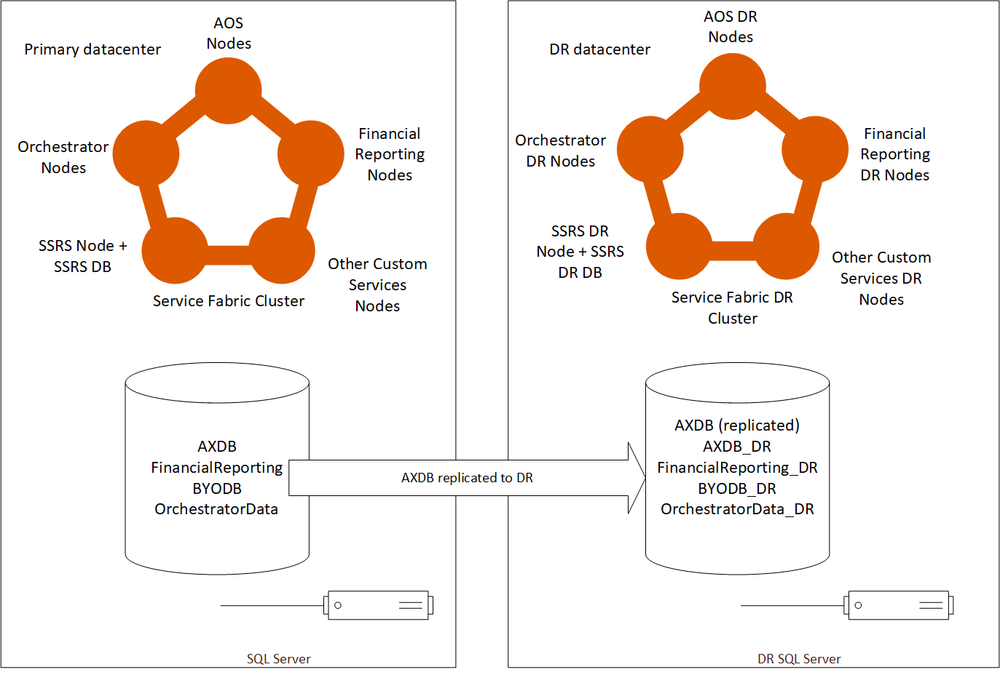
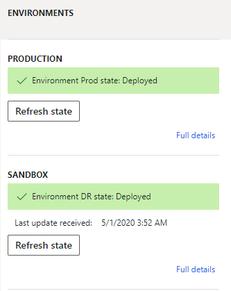

---
# required metadata

title: On-premise Disaster Recovery Configuration
description: This document describes how to configure Dynamics 365 for Finance and Operations on-premises for Disaster Recovery (DR) and the process for switching between the primary and secondary datacenters.
author: faix
manager: AnnBe
ms.date: 05/16/2020
ms.topic: article
ms.prod: 
ms.service: dynamics-ax-applications
ms.technology: 

# optional metadata

# ms.search.form: [Operations AOT form name to tie this topic to]
audience: IT Pro
# ms.devlang: 
ms.reviewer: sericks
ms.search.scope: Operations
# ms.tgt_pltfrm: 
# ms.custom: [used by loc for topics migrated from the wiki]
ms.search.region: Global
# ms.search.industry: [leave blank for most, retail, public sector]
ms.author: osfaixat
ms.search.validFrom: 2019-07-31 
ms.dyn365.ops.version: Platform update 37 

---

# On-premise Disaster Recovery Configuration

The term disaster is used here to mean an event which makes the primary datacenter unusable – for example, a connection outage which makes the primary datacenter inaccessible. High Availability configuration is not covered within this document – for the minimum setup required for High Availability please read [System requirements for on-premises deployments](../../fin-ops/get-started-system-requirements-on-prem.md#minimum-infrastructure-requirements)

### Limitations of this document

This document will not go into specific configuration details for disaster recovery of ADFS, file storage components or SQL.

## Overview

The basic configuration for DR involves deploying a duplicate of the production environment within another datacenter (the secondary datacenter) and replicating databases to that datacenter. In the event of a disaster a few manual steps can be executed to bring the environment within the secondary datacenter online.

The diagram below illustrates, at a high level, the required set up:

## Environment Configuration

Within LCS the production environment will be deployed as usual, using the environment slot named “production”, the disaster recovery (DR) environment will be deployed using a sandbox environment slot below production.

Note that Dynamics 365 for Finance and Operations [AOS and SQL Server must be co-located](../../fin-ops/get-started-system-requirements-on-prem.md#network-requirements) within the same datacenter, therefore it is not an option to utilize both the primary and secondary AOSes against the primary database during normal operations.

## Deploying code packages to DR

When code packages are deployed to the production environment, they must also be deployed separately to the DR environment.

Our recommendation is to use the DR environment during normal operations as a pre-production environment – this means using the environment to test code deployments intended for production and also to investigate support issues which occur in production. This helps to realize value from the DR environment, which could otherwise be standing unused, and ensures that the DR environment is always up to date with the code and data from production.

>[!IMPORTANT]
> It is important that both environments contain the same customizations and the same deployed version. If disaster happens and there is a package that you have applied to your DR environment which is not present in your production environment see [Mirroring AOS version on the fly](#mirroraosversion)

## Deploying Financial Reports to DR

Definitions of reports for Financial Reporting do not exist within the code packages for Dynamics 365, and are also not stored within VSTS for source control. They are stored separately within the Financial Reporting (formerly known as MR or Management Reporter)component.

Typically Finance users create new Financial Reports, or make changes to existing reports, directly within the production environment. 

Report definitions from Financial Reporting must be exported periodically from production and imported into the DR Financial Reporting instance. Instructions for exporting reports are available [here](../analytics/reset-financial-reporting-datamart-after-restore.md#reset-the-financial-reporting-data-mart-for-dynamics-365-finance--operations-on-premises-through-sql-server-management-studio).

## Environment deployment settings

The DR environment shares some environment deployment settings with the production environment – the shared settings allow the DR environment to operate against a copy of the production database after a disaster event, the table below illustrates the shared and specific settings for DR:

| Environment Deployment Settings | DR Environment | Explanation |
|---------------------------------|----------------|-------------|
| **Active Directory Settings**     |                |             |
| Administrator user              | Same as production|          |
| ADFS URL                        | Same as production|          |
| ADFS OpenId Connect client ID for AOS | Same as production|          |
| ADFS OpenId Connect client ID for Financial Reporting | Same as production|          |
| **SQL Database Configuration**  |                 |             |
| SQL server name                 | Different to production | DR uses the secondary node of production SQL Server         |
| AX database name                | Different to production | DR should use AXDB_DR to differentiate from the production replicated database |
| Financial Reporting database name| Different to production | DR should use FinancialReporting_DR to differentiate from production database |
| **File Share Settings**         |                 |             |
| File share for document store   | Same as production |            |
| File share certificate thumbprint | Same as production |            |
| **SSRS Configuration Settings** |                 |             |
| IP address of SSRS instance     | Different to Production | DR uses a separate SSRS machine with it's own IP |
| SSRS certificate thumbprint     | Same as production |          |
| **Configure Service Settings**  |                 |             |
| DNS host name of Dynamics 365 instance | Different to production| DR uses a different host name to production to allow DR to be used in parallel with production during normal operations|
| AOS service user                | Same as production |            |
| MR application service user     | Same as production |            |
| MR process service user         | Same as production |            |
| MR click-once service user      | Same as production |            |
| **Application Certificate Settings** |                 |             |
| Data encryption certificate thumbprint| Same as production |          |
| Data signing certificate thumbprint | Same as production   |          |
| Session authentication certificate thumbprint | Same as production |          |
| SSL certificate thumbprint       | Same as production |             |
| Management reporter certificate thumbprint | Same as production |     |

## SQL Server Always-On Availability Configuration

The business data database (AXDB) should be replicated to the secondary datacentre, typically using [SQL Server Always-On Availability Groups](https://docs.microsoft.com/sql/database-engine/availability-groups/windows/always-on-availability-groups-sql-server?view=sql-server-2016).

The FinancialReporting and BYODB databases do not need to be replicated, both can be regenerated from the AXDB using the reset procedures described in the failover section of this document.

The OrchestratorData database does not need to be replicated – this database is environment specific, the DR environment will maintain it’s own OrchestratorData database.

| Database | Replicated |
|----------|------------|
| Business data (AXDB) | Yes |
| Financial Reporting  | No |
| BYODB                | No |
| OrchestratorData     | No |

## Failing over to DR

### Overview

When a disaster event occurs – the primary datacentre may be completely unavailable – within the
secondary datacentre the following components will be available.

At the initial moment of the disaster event – the DR environment will be operating normally, but it will not yet be connected to the business data (AXDB) database from production – it will be connected to it’s own empty AXDB_DR database.

To bring the DR environment online in place of production we will re-point DR AOS nodes to the replicated production database, reconfigure BYODB and reconfigure FinancialReporting.

### Re-point the AOS nodes to the replicated production database

