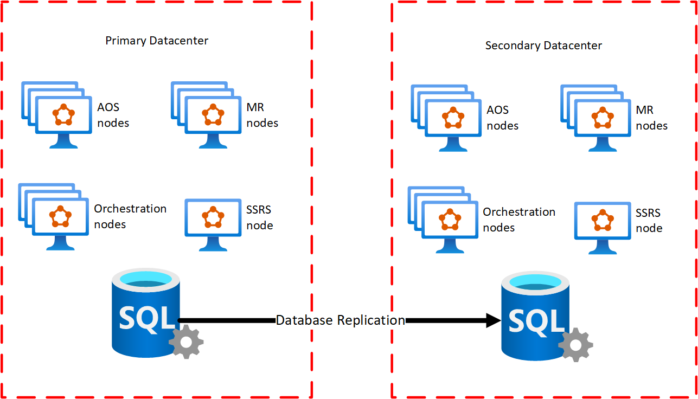
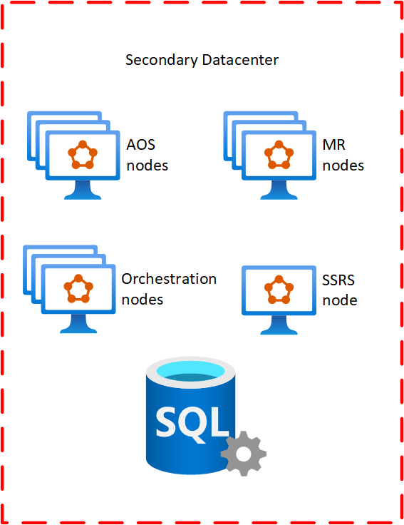
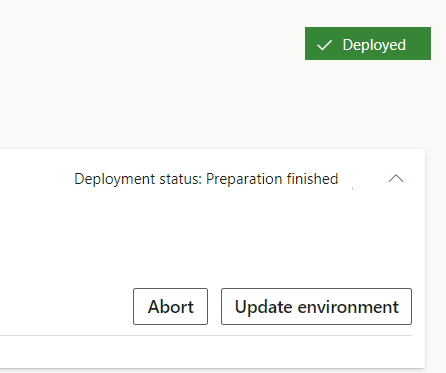

---
# required metadata

title: On-premises disaster recovery configuration
description: This content describes how to configure Dynamics 365 Finance + Operations (on-premises) for disaster recovery (DR) and the process for switching between the primary and secondary data centers.
author: faix
manager: AnnBe
ms.date: 06/10/2020
ms.topic: article
ms.prod: 
ms.service: dynamics-ax-applications
ms.technology: 

# optional metadata

# ms.search.form: [Operations AOT form name to tie this topic to]
audience: IT Pro
# ms.devlang: 
ms.reviewer: sericks
ms.search.scope: Operations
# ms.tgt_pltfrm: 
# ms.custom: [used by loc for topics migrated from the wiki]
ms.search.region: Global
# ms.search.industry: [leave blank for most, retail, public sector]
ms.author: osfaixat
ms.search.validFrom: 2020-07-31 
ms.dyn365.ops.version: Platform update 37 

---

# On-premises disaster recovery configuration
Disaster recovery (DR) is an important consideration for on-premise deployments of Dynamics 365 Finance + Operations (on-premises) to protect you from any event that may put your organization's operations at risk. Examples for this can be equipment failures, data center break downs due to cyber attacks, electrical, physical, or other disasters.

The core concept of DR involves the use of a second data center including a data recover environment (DR environment). It is recommended to plan, document, and test DR as carefully as your production setup.

> [!Note]
> High availability configuration isn't covered within this content. For the minimum setup required for high availability read [System requirements for on-premises deployments](../../fin-ops/get-started/system-requirements-on-prem.md#minimum-infrastructure-requirements).

### Limitations of this content

This content won't go into specific configuration details for disaster recovery of the following components:
  - AD FS
  - File storage
  - SQL Server

### Recommendations

Remember to keep your DR environment updated with the latest Windows Updates. Your environment will have the latest security updates and won't require updates during a disaster event.

Ensure that you're applying new pre-requisites that are specified by Microsoft. Also, keep your Service Fabric cluster updated and do certificate rotations as required.

Once you've read through this content, write-up the steps that need to be taken by your team. Afterwards, run through the steps multiple times to ensure you don't come across unexpected problems and minimize the potential downtime. 

## Overview

The basic configuration for DR involves deploying a duplicate of the production environment within another data center (the secondary datacenter) and replicating databases to that data center. If a disaster event takes place, a few manual steps can be executed to bring the environment within the secondary datacenter online.

The diagram below illustrates, at a high level, the required setup:



## Environment configuration

Within LCS, the production environment should be deployed, as usual, by using the environment slot named **PRODUCTION**. Your DR environment **won't** use an additional environment slot in LCS. It will instead **reuse** the slot for your production environment. 

Dynamics 365 for Finance and Operations [AOS and SQL Server must be colocated](../../fin-ops/get-started/system-requirements-on-prem.md#network-requirements) within the same data center.

## Deploying code packages to Production

When code packages are deployed to the production environment, they don't need to be deployed to the DR environment. That environment should be unused and no Service Fabric Services should be deployed.

## Environment deployment settings

The DR environment should have almost the same configuration as the production environment. The table below illustrates the shared and specific settings for DR:

| Environment settings | DR environment|
|---------------------------------|----------------|
| **Active Directory settings**   |                |
| Administrator user              | Same as production|
| ADFS URL                        | Same as production|
| ADFS OpenId Connect client ID for AOS | Same as production|
| ADFS OpenId Connect client ID for Financial Reporting | Same as production|
| **SQL Database configuration**  |                 |
| SQL Server name                 | Same as production |
| AX database name                | Same as production |
| Financial Reporting database name| Same as production |
| **File share settings**         |                 |
| File share for document store   | Same as production |
| File share certificate thumbprint | Same as production |
| **SSRS configuration settings** |                 |
| IP address of SSRS instance     | Can be different <sup>1</sup> |
| SSRS certificate thumbprint     | Same as production |
| **Configure service settings**  |                 |
| DNS host name of Dynamics 365 instance | Can be different <sup>2</sup>|
| AOS service user                | Same as production |
| MR application service user     | Same as production |
| MR process service user         | Same as production |
| MR click-once service user      | Same as production |
| **Application certificate settings** |                 |
| Data encryption certificate thumbprint| Same as production |
| Data signing certificate thumbprint | Same as production   |
| Session authentication certificate thumbprint | Same as production |
| SSL certificate thumbprint       | Same as production |
| Management reporter certificate thumbprint | Same as production |

<sup>1</sup> SSRS is referenced by IP. If the exact same machine IP can't be configured in the DR environment, the IP can be different.

<sup>2</sup> This depends on your network configuration, if you've a load balancer that can handle diverting traffic to the other environment then the host name can be the same. If you're unable to do that, then use a different host name. 

## SQL Server Always-On Availability configuration

The business data database (AXDB) should be replicated to the secondary data center, typically using [SQL Server Always-On Availability Groups](https://docs.microsoft.com/sql/database-engine/availability-groups/windows/always-on-availability-groups-sql-server?view=sql-server-2016).

| Database | Replicated |
|----------|------------|
| Business data (AXDB) | Yes |
| Financial Reporting  | Yes |
| BYODB                | Yes |
| OrchestratorData     | Yes |

## Failing over to DR

### Overview

When a disaster event occurs – the primary datacenter may be unavailable – within the
secondary datacenter the following components will be available.



At the initial moment of the disaster event – the DR environment will be empty. The only thing present will be a configured Service Fabric cluster and a SQL Server, which contains all of the replicated production data. 

To bring the DR environment online, you'll have LCS deploy what is currently available in your Production environment into the DR environment.

>[!IMPORTANT]
> Before you continue further, ensure that no Dynamics Service Fabric services are running in your production environment (in case you're only failing due to a partial disaster event).

### Deploy the LocalAgent

Download the LocalAgent installer and configuration file from LCS to your disaster recovery environment. Once you have the configuration file, open it. Ensure that the connectionEndpoint under the serviceFabric section points to the IP or FQDN of a server in the DR environment. After modifying the file, save it locally and deploy the LocalAgent as you normally would.

>[!IMPORTANT]
> Do not make changes to your connector settings in LCS. 

From now on and until your main production environment comes back online, this LocalAgent will process all requests that LCS puts into the message queue. That's why its important you ensure no services are running in your production environment. Eventually, when your orchestrator nodes come back up in your primary datacenter, unprovision the LocalAgent from the cluster. 

>[!CAUTION]
> The LocalAgent must only be running in one datacenter at a time. At this point it should only be running in your secondary datacenter.

### Prepare your pre-deployment scripts (optional)

Pre-deployment scripts are necessary when changes to the deployment configuration are required. This script will have to modify the config.json file with the values you specify. It will be the customers' responsibility to come up with this script.

You can find the location of the config.json file by running the following command.

    ```sql
    select Location from DeploymentInstanceArtifact where AssetId='config.json' and DeploymentInstanceId = 'LCSENVIRONMENTID'
    ```

    > [!NOTE]
    > Replace **LCSENVIRONMENTID** with the ID of your environment. You can obtain this ID from the full details page for your environment in LCS. 

In the case that the SSRS node IP is different you'll have to modify the following values:

```json
        "biReporting": {
          "persistentVirtualMachineIPAddressSSRS": {
            "value": "192.168.5.31"
          },
          "reportingServers": {
            "value": "192.168.5.31"
          },
```

If changing the host name, the following modifications will be required:

```json
    "name": "AOS",
      "parameters": {
        "activeDirectory": {
          ...
          "aadValidAudience": {
            "value": "https://ax.contosoen05.com/"
          },
          ...
        "infrastructure": {
          "hostName": {
            "value": "ax.contosoen05.com"
          },
          ...
        }
    ...
    "name": "FinancialReporting",
      "parameters": {
        ...
        "aad": {
         ...
         "cookieDomain": {
            "value": "ax.contosoen05.com"
          },
          "validAudiences": {
            "value": "https://ax.contosoen05.com/"
          },
          ...
```

>[!IMPORTANT]
> If changing the hostname URL for your deployment ensure that your AD FS server is configured to accept the new URL. For more information check out [Reuse the same AD FS instance for multiple environments](./onprem-reuseadfs.md).

As the fileshare is shared between the production and DR environments, this predeployment script should be disabled. Only enable it when deploying to your Disaster Recovery environment. 

### Ensure reports get deployed

As the database has previously been synchronized successfully, synchronization would normally be skipped. However, we need to synchronize the reports as the SSRS node is empty. Do the actions below according to the version that your environment is in. 

#### Version 10.0.13 or later

Run the following command against your business data database (AXDB):

```sql
	UPDATE SF.synclog SET STATE=5, SyncStepName = 'ReportSyncstarted' WHERE CODEPACKAGEVERSION in (SELECT TOP(1) CODEPACKAGEVERSION from SF.SYNCLOG ORDER BY CREATIONDATE DESC)
```

#### Version 10.0.12 or earlier

Run the following command against your business data database (AXDB):

```sql
    DELETE FROM SF.synclog WHERE CODEPACKAGEVERSION in (SELECT TOP(1) CODEPACKAGEVERSION from SF.SYNCLOG ORDER BY CREATIONDATE DESC)
```

>[!NOTE]
> If you are using version 10.0.12 or earlier, a full database synchronization will be executed.

### Deploy your environment

If your production environment is on 10.0.12 or earlier, follow these instructions. 

1. In LCS navigate to the environment page for your production environment.

1. Select **Maintain** and then select **Update Settings**.

    

1. Don't change any values and select **Prepare**.

1. After downloading is finished and preparation is completed, the Update environment button will be displayed.

    

1. Select Update environment to start updating your environment.

1. Once the environment is deployed, the DR environment is ready for use. 

## Using your DR environment

You can use your DR environment as you normally would except that updates or hotfixes shouldn't be applied to the environment. If you must apply updates to your environment, your failback process will differ from the one described below. Failing back under this condition isn't covered in this guide.

## Failing back to your production environment

>[!IMPORTANT]
> At this point **no** Dynamics Service Fabric services should be running in your production environment. 

Secure a downtime window in which you can switch operation from the DR environment to the Production environment. Once in the downtime window, disable all non-Orchestrator nodes in the DR environment through Service Fabric Explorer. Once all nodes are disabled, failover your SQL Server to the production data center.

Once the failover has happened, start up the AOS, SSRS, and MR nodes in your primary datacenter. Carry out validation tests to ensure your environment is functioning as expected. Once you decide the environment is working as expected, remove the LocalAgent from your Disaster Recovery environment and reinstall it on your Production environment.

Clean up your DR environment by manually unprovisioning all Dynamics Service Fabric Service.

>[!CAUTION]
> Do not use the Cleanup functionality in LCS to carry out the cleanup of your DR environment. 

### Failback Checklist

[] 1. Non-Orchestrator nodes are disabled in DR datacenter.
[] 2. SQL Server is failed back to primary datacenter.
[] 3. LocalAgent is uninstalled in your DR datacenter.
[] 4. All Dynamics Service Fabric services (including LocalAgent) are running in your primary datacenter.
[] 5. No Dynamics Service Fabric services are deployed in your DR datacenter. 

>[!IMPORTANT]
> Your primary environment will be back to functioning as usual and can once again be serviced once you ensure all items in the checklist are verified.
