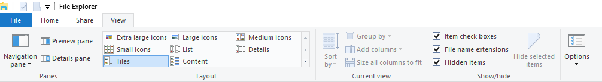

---
# required metadata

title: Remove and reinstall, or add an AOS node
description: This article explains how to remove an Application Object Server (AOS) node in your on-premises environment to reduce or replace a failed node.
author: ttreen
ms.date: 07/28/2021
ms.topic: article
ms.prod: dynamics-365 
ms.service:
ms.technology: 

# optional metadata

# ms.search.form:
audience: IT Pro
# ms.devlang: 
ms.reviewer: sericks
# ms.tgt_pltfrm: 
# ms.custom: 
ms.search.region: Global
# ms.search.industry:
ms.author: ttreen
ms.search.validFrom: 2020-03-31
ms.dyn365.ops.version: Platform update 34
search.app:
  - financeandoperationsonprem-docs
---

# Remove and reinstall, or add an AOS node

[!include[banner](../includes/banner.md)]

This article explains how to remove an Application Object Server (AOS) node in your on-premises environment to reduce or replace a failed node. It also explains how to add a new AOS node for scale-out performance.

## Remove a node

### Option 1: Use a configuration file (preferred option)

**Reference document:** [Add or remove nodes to a standalone Service Fabric cluster running on Windows Server](/azure/service-fabric/service-fabric-cluster-windows-server-add-remove-nodes)

1. In Service Fabric Explorer, select **Cluster**, and make a note of the Microsoft Service Fabric cluster version, e.g. 8.2.1686.XXXX
2. On one of the orchestrator nodes, open File Explorer. On the **View** tab, in the **Show/hide** group, make sure that the **File name extensions** and **Hidden items** check boxes are selected.

    

3. Expand drive C, and then drill down into the following folder. (Note that the bold parts of the path will vary, depending on the node name and setup.)

    C:\\ProgramData\\SF\\**ORCH1**\\Fabric\\work\\Applications\\\_\_FabricSystem\\**_App4294967295**\\work\\Store\\**131811633624852852**

    In the folder, you should see a list of folders for various versions of Microsoft Service Fabric. 

5. Open the folder with the name the same as the version of Microsoft Service Fabric cluster you that you made a note of earlier. 
6. In the folder, you should see a .cab file.
7. Copy the .cab file to C:\\Temp, and rename the copied file **MicrosoftAzureServiceFabric.cab**. (If you don't have a Temp folder, create it.)
8. Open a Windows PowerShell Command Prompt window as an admin.
9. Run the following command to connect to the Service Fabric cluster.

    ```powershell
    #Connect to the Service Fabric Cluster
    Connect-ServiceFabricCluster 
    ```
10. Run the following command to save the configuration file to C:\\Temp\\ClusterConfig.json. (Make sure that the C:\\Temp path exists.)

    ```powershell
    Get-ServiceFabricClusterConfiguration > C:\Temp\ClusterConfig.json
    ```

11. In the configuration file that you saved in the previous step, in the **fabricSettings** section, in the **Setup** section, add a section for the **NodesToBeRemoved** parameter. The parameter value should be a comma-separated list of names of the nodes that must be removed. 

    > [!NOTE]
    > Be sure to add a comma to the end of the line that precedes the new section.

    ```json
    "fabricSettings": [
        {
            "name": "Setup",
            "parameters": [
                {
                    "name": "FabricDataRoot",
                    "value": "C:\\ProgramData\\SF"
                },
                {
                    "name": "FabricLogRoot",
                    "value": "C:\\ProgramData\\SF\\Log"
                },
                {
                    "name": "NodesToBeRemoved",
                    "value": "AOS1"
                }
            ]
        }
    ]
    ```

12. Remove the node from the **Nodes** section. In the following example, the **AOS1** node was removed.

    ```json
    "Nodes": [
        {
            "NodeName": "AOS2",
            "NodeTypeRef": "AOSNodeType",
            "IPAddress": "10.0.0.10",
            "FaultDomain": "fd:/fd1",
            "UpgradeDomain": "ud1"
        },
        {
        "NodeName": "AOS3",
        "NodeTypeRef": "AOSNo…
    ```

13. Remove the following lines from the **Security** section.

    ```json
    "WindowsIdentities": {
        "\$id": "3"
    },
    ```

    > [!NOTE]
    > If you don't remove these lines, you will receive the following error message later:
    >
    > ValidationException: Authentication type can't be changed from unsecured to Windows.

14. Increment the version number of the configuration file. Make this change at the lowest increment. In the following example, the version number went from **1.0.0** to **1.0.1**.

    ```json
    "ClusterConfigurationVersion": "1.0.1"
    ```

15. Save the configuration file.
16. Run the following command to remove the node.

    ```powershell
    Start-ServiceFabricClusterConfigurationUpgrade -ClusterConfigPath C:\Temp\ClusterConfig.json
    ```

17. Run the following command to monitor the progress.

    ```powershell
    Get-ServiceFabricClusterUpgrade
    ```

    If the upgrade stops responding at "UpgradePhase: PreUpgradeSafetyCheck," make a note of the **NodeName** value, and restart that node from Service Fabric Explorer. In the following illustration, the upgrade has stopped responding. It was running for 50 minutes at the same status on node BI1.

    During upgrade of the cluster configuration, if you receive an error message that states that you previously added a node through the **Add-ServiceFabricNode** command, you will need to run a configuration upgrade without making any changes to the configuration file except for the version number. You can use the **Get-ServiceFabricClusterConfiguration** and **Start-ServiceFabricClusterConfigurationUpgrade** commands for this purpose.

    You can also view the progress in Service Fabric Explorer.

### Option 2: Use Service Fabric Explorer

1. Sign in to Service Fabric Explorer.
2. Select the **Settings** button (gear symbol), and make sure that **Advanced** mode is turned on.
3. Expand **Nodes**, select the ellipsis (**...**) button next to the node that you want to remove, and then select **Deactivate (remove data)**. Note that this option might not be available if the node is already down (for example, if the node server can't be started).
4. When you're prompted to confirm deactivation, enter the name of the node, and then select **Deactivate (remove data)**.

    After the node has been deactivated, its status is shown as **Disabled**.

5. If the server is still active and connected to the domain, you might have to follow these steps if you will be replacing the deactivated node with a new server:

    1. Sign in to the server.
    2. Remove the server from the domain.
    3. Rename the server.
    4. Make a note of the IP address, and then change the IP address to a free address that you have in your range.
    5. Shut down the server.

6. After the server has been shut down, or if it was already down, Service Fabric Explorer reflects its status. Select the ellipsis (**...**) button again next to the node, and then select **Remove node state**.
7. Confirm removal of the node.

    After the node has been removed, its status is shown as **Invalid**.

8. Make a note of the node name and type. For this example, the node name is **AOS1**, and the type is **AOSNodeType**. Remember that the node name might not match the network name. Also make a note of the **Upgrade Domain** and **Fault Domain** settings, and the IP address. The previous illustration shows all these values.

## Add a node

The next step is to start a new AOS server.

1. Follow these steps if you're replacing an existing server that was removed:

    1. Give the server the network name of the previous AOS server.
    2. Assign the original IP address. For this example, that IP address is **10.0.0.9**.
    3. Join the server to the domain.

2. If you're adding a new server to an existing cluster, update the ConfigTemplate.xml file so that it contains the additional information. This information will be used when you push out the prerequisites and apply settings through Windows PowerShell scripts.
3. Make sure that you've added the **AXServiceUser** and **svc-AXSF\$** group Managed Service Accounts (gMSAs) to the local admin group on the AOS server.

    After the server is connected to the domain, you must follow the prerequisite steps for on-premises environments in [Set up and deploy on-premises environments (Platform update 41 and later)](./setup-deploy-on-premises-pu41.md). The following steps summarize those prerequisite steps.

4. Copy the contents of each infrastructure\\VMs\<VMName\> folder into the corresponding virtual machine (VM). (If you use remoting scripts, they will automatically copy the contents to the target VMs.) Then run the following Windows PowerShell scripts as an admin.

    > [!NOTE]
    > If you're running remotely and repairing an existing server, specify the -ForcePushLBDScripts switch to ensure the file copy process is run against all servers again.

    ```powershell
    # Install prereq software on the VMs.
    
    # If remoting, execute
    # .\Configure-PreReqs-AllVMs.ps1 -MSIFilePath <share folder path of the MSIs> -ConfigurationFilePath .\ConfigTemplate.xml

    .\Configure-PreReqs.ps1 -MSIFilePath <path of the MSIs>
    ```

5. Restart the computer every time that you're prompted. Make sure that you rerun the **.\\Configure-PreReqs.ps1** script after every restart, until all the prerequisites are installed. In the case of remoting, rerun the **AllVMs** script when all the computers are back online.
6. If you use the remoting script, make sure that the current user has access to the share folder of Microsoft Windows Installer package files (.msi files).
7. If you use the remoting script, make sure that no user is accessing computers of the **AOSNodeType**, **MRType**, and **ReportServerType** types. Otherwise, the remoting script won't be able to restart the computer because users are signed in to it.
8. Run the following scripts, if they exist, to complete the VM setup.

    ```powershell
    # If remoting, execute
    # .\Complete-PreReqs-AllVMs.ps1 -ConfigurationFilePath .\ConfigTemplate.xml
    
    .\Complete-PreReqs.ps1
    ```

9. If errors occur while you run **Complete-PreReqs.ps1**, you likely need to update your gMSA account. Run the following script from your infrastructure scripts folder.

    ```powershell
    Import-Module .\D365FO-OP\D365FO-OP.psd1
    Update-D365FOGMSAAccounts -ConfigurationFilePath .\ConfigTemplate.xml
    ```

12. Run the following script to validate the VM setup.

    ```powershell
    # If Remoting, execute
    # .\Test-D365FOConfiguration-AllVMs.ps1 -ConfigurationFilePath .\ConfigTemplate.xml
    
    .\Test-D365FOConfiguration.ps1 
    ```

13. Before you continue, fix anything that fails as part of the validation script.
14. In Service Fabric Explorer, select **Cluster**, and make a note of the Microsoft Service Fabric cluster version, e.g. **8.2.1686.XXXX**.
15. On one of the orchestrator nodes, open File Explorer. On the **View** tab, in the **Show/hide** group, make sure that the **File name extensions** and **Hidden items** check boxes are selected.

    

16. Expand drive C, and then drill down into the following folder. (Note that the bold parts of the path will vary, depending on the node name and setup.)

    C:\\ProgramData\\SF\\**ORCH1**\\Fabric\\work\\Applications\\\_\_FabricSystem\\**_App4294967295**\\work\\Store\\**131811633624852852**

    In the folder, you should see a list of folders for various versions of Service Fabric. 

17. Open the folder that has the same name as the version of Microsoft Service Fabric cluster that you made a note of earlier. 
18. In the folder, you should see a .cab file.
19. Copy the .cab file to C:\\Temp, and rename the copied file **MicrosoftAzureServiceFabric.cab**. (If you don't have a Temp folder, create it.)
20. Open a Windows PowerShell Command Prompt windows as an admin.
21. Run the following command to connect to your Service Fabric cluster. (Edit the command as you require.)

    ```powershell
    #Connect to the Service Fabric Cluster. 
    Connect-ServiceFabricCluster 
    ```

22. Run the following command to add the node back in. Before you run it, make the required edits to the **NodeName**, **IPAddress**, **UpgradeDomain**, and **FaultDomain** parameters. (If you're replacing an existing server, you should have made a note of the values earlier.)

    ```powershell
    Add-ServiceFabricNode -NodeName "AOS4" -NodeType "AOSNodeType" -IpAddressOrFQDN "10.0.0.19" -UpgradeDomain "ud0" -FaultDomain "fd:/fd0" -FabricRuntimePackagePath "C:\Temp\MicrosoftAzureServiceFabric.cab"
    ```

23. After the node has been added back in, return to Service Fabric Explorer, and view the application deployment status. Several minutes will be required before all the AOS applications are restored (**AXBootstrapperAppType**, **AXSFType**, **RTGatewayAppType**, and **LBDTelemetryType-<envname\>** or **MonitoringAgentAppType**) are pushed out again and installed on the node.


[!INCLUDE[footer-include](../../../includes/footer-banner.md)]
