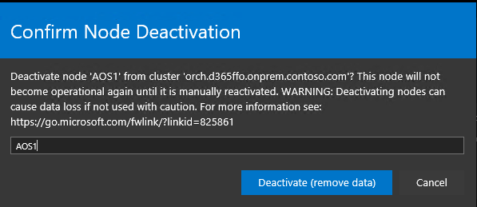

---
# required metadata

title: Remove and reinstall an AOS node
description: This Finance and Operations template contains examples of Markdown syntax, as well as guidance on setting the metadata.
author: ttreen
manager: AnnBe
ms.date: 03/06/2020
ms.topic: article
ms.prod:
ms.service: dynamics-ax-applications
ms.technology: 

# optional metadata

# ms.search.form:
audience: IT Pro
# ms.devlang: 
ms.reviewer: sericks
ms.search.scope: Operations
# ms.tgt_pltfrm: 
# ms.custom: 
ms.search.region: Global
# ms.search.industry:
ms.author: ttreen
ms.search.validFrom: 2020-03-31
ms.dyn365.ops.version: Platform update 34
---

# Remove and reinstall an AOS node

[!include[banner](../includes/banner.md)]

## Remove the node

### Option 1 – Service Fabric Explorer

1. Log in to the Service Fabric Explorer

1. Click the settings icon (cog wheel) and check that you have Advanced Mode enabled, as in the screen shot below

- Expand out the Nodes and click on the three dots “…” on the node you wish to remove.

- Click Deactivate (remove data) – Note you may not have this option if the node is already down, for example when the node server will not start.

- You will be prompted to confirm the delete, enter in the node name, and click “Deactivate (remove data)”

- Once that has completed, it will show the status disabled

- If the server is still active and connected to the domain, you may then need to complete the following steps if you’re going to replace this node with a new server.

    - Log on to the server

    - Remove the server from the domain.

    - Rename the server after it was removed from the domain.

    - Make a note of the IP address and then change the IP address to a free address you have in your range.

    - Shutdown the server.

- Once the server is shutdown, or if it was already down, you will see its status reflected in the Service Fabric Explorer. Click again on the three dots, to select the “Remove node state” option.

- Confirm the Node Removal

- Once that is completed, you will see the status of Invalid.

- Make a note of the Node name, and type. In this example the node name is AOS1, and the type is AOSNodeType. Remember the node name may not necessarily be the same as the network name. Also, note the Upgrade Domain and Fault Domain settings, and IP address. You can see all of these in the screenshot above.

### Option 1 – Config File

-   Reference doc:
    <https://docs.microsoft.com/en-us/azure/service-fabric/service-fabric-cluster-windows-server-add-remove-nodes>

-   In the Service Fabric Explorer, click on Cluster and made a note of the cluster version. In this example, it is 6.5.676.9590, as show in the screenshot below.

- On one of the Orchestrator servers, open File Explorer and ensure that you have enabled the View options “File name extensions” and “Hidden items”

- Expand out the C: drive, then drill down into the following folder (note the highlighted parts will vary depending on the node name and install):

>   C:\\ProgramData\\SF\\ORCH1\\Fabric\\work\\Applications\\__FabricSystem_App4294967295\\work\\Store\\131811633624852852

- Once you are in that folder, you should see a list of folders for various versions of Service Fabric, see example below:

- Open the folder that has the name as the version of Service Fabric that you noted above. In this example it will be 6.5.676.9590

- In that folder you will see a CAB file, see example below.

- Copy that file to C:\\Temp (If you don’t have a Temp folder just create it), and rename the copied file to “MicrosoftAzureServiceFabric.cab”

-   Open a PowerShell prompt as Admin

-   Connect to the SF Cluster:

>   \#Connect to Service Fabric Cluster. Replace 123 with server/star thumbprint
>   and use appropriate IP address

>   Connect-ServiceFabricCluster -connectionEndpoint 10.0.0.12:19000
>   -X509Credential -FindType FindByThumbprint -FindValue 123
>   -ServerCertThumbprint 123

-   Run the following command to save the config file to C:\\Temp\\ClusterConfig.json (ensure the C:\\Temp path exists):

>   Get-ServiceFabricClusterConfiguration -UseApiVersion -ApiVersion 10-2017
>   \>C:\\Temp\\ClusterConfig.json

- In the configuration file, saved in the step above, add the "NodesToBeRemoved" parameter to "Setup" section inside "FabricSettings" section. The "value" should be a comma separated list of node names of nodes that need to be removed. Note: Ensure you have the comma added to the line above the new section.

>   "fabricSettings": [

>   {

>   "name": "Setup",

>   "parameters": [

>   {

>   "name": "FabricDataRoot",

>   "value": "C:\\\\ProgramData\\\\SF"

>   },

>   {

>   "name": "FabricLogRoot",

>   "value": "C:\\\\ProgramData\\\\SF\\\\Log"

>   },

>   {

>   "name": "NodesToBeRemoved",

>   "value": "AOS1"

>   }

>   ]

>   }

>   ]

- Also, in the config file, remove the node from "Nodes" section, see example below the AOS1 node was removed.

>   "Nodes": [

>   {

>   "NodeName": "AOS2",

>   "NodeTypeRef": "AOSNodeType",

>   "IPAddress": "10.0.0.10",

>   "FaultDomain": "fd:/fd1",

>   "UpgradeDomain": "ud1"

>   },

>   {

>   "NodeName": "AOS3",

>   "NodeTypeRef": "AOSNo…

-   You’ll need to remove the following lines from the “Security” section of the
    config file:

>   "WindowsIdentities": {

>   "\$id": "3"

>   },

Note: If you do not remove the above you will get the following error later on in the process: ValidationException: Authentication type cannot be changed from unsecured to Windows.*

- The last change is to increment the config file version, do this at the lowest increment, in the example below it went from 1.0.0 to 1.0.1

>   "ClusterConfigurationVersion": "1.0.1"

-   Save the config file.

-   Run the following command to add the remove the node.

>   Start-ServiceFabricClusterConfigurationUpgrade -ClusterConfigPath
>   C:\\Temp\\ClusterConfig.json

- To monitor the progress, run the following command:

> Get-ServiceFabricClusterUpgrade

Note: If you find that the upgrade is hanging on UpgradePhase: PreUpgradeSafetyCheck, then look at the NodeName and restart that from the Service Fabric explorer. See example below of the upgrade hanging, it was running for 50mins with the same status on BI1.*

Note: If you get an error during the cluster config upgrade process that you had previously added a node through the Add-ServiceFabricNode, you may need to flush through the config without any changes apart from the version. You can use the Get-ServiceFabricClusterConfiguration and Start-ServiceFabricClusterConfigurationUpgrade commands for this.*

-   You can also see a progress in the SF Explorer:

Part 2 – Add the Node
---------------------

- The next step is to start up a new AOS server.

- Complete these initial tasks if you are replacing an existing server that was removed.

    - Rename, or name the server the network name of the previous AOS server.

    - Assign the original IP address, in this example it will be 10.0.0.9

    - Join the server to the domain.

- If you’re adding in a new server to an existing cluster, modify the “ConfigTemplate.xml” with the additional information. This will be used when pushing out the pre-requisites and apply settings through the PowerShell scripts.

- Check that you have also added the AXServiceUser and svc-AXSF\$ GMSA account to the local administrator group on the AOS server.

- Once the server is connected to the domain, you now need to run through the On-Premises prerequisite steps as outlined in this link:
    <https://docs.microsoft.com/en-us/dynamics365/fin-ops-core/dev-itpro/deployment/setup-deploy-on-premises-pu12#follow-these-steps-for-each-vm-or-use-remoting-from-a-single-machine>.
    
    Summary steps copied from that link below:

1. Copy the contents of each infrastructure\\VMs\<VMName\> folder into the corresponding VM (if remoting scripts are used, they will automatically copy the content to the target VMs), and then run the following PoweShell scripts as an Administrator.

    > [!Note:]
    > If running remotely and repairing an existing server, you’ll need to delete the file “lbdscripts_remote_status.json” located in the infrastructure folder to force the file copy to the servers again.*

>   \# Install pre-req software on the VMs.

>   \# If Remoting, execute

>   \# .\\Configure-PreReqs-AllVMs.ps1 -MSIFilePath \<share folder path of the
>   MSIs\> -ConfigurationFilePath .\\ConfigTemplate.xml

>   .\\Configure-PreReqs.ps1 -MSIFilePath \<path of the MSIs\>

- Each time you are prompted, restart the machine. Make sure that you rerun the .\\Configure-PreReqs.ps1 script after each restart until all of the prerequisites are installed. In the case of remoting, rerun the AllVMs script when all of the machines are back online.

- When you use the remoting script, ensure that the current user has access to the share folder of MSIs.

- When you use the remoting script, ensure no user is accessing the AOSNoteType, MRType, and ReportServerType type machines. Otherwise, the remoting script will fail to restart the computer because of the users being logged on to the computer.

1. Run the following scripts, if they exist, to complete the VM setup.

>   \# If Remoting, only execute

>   \# .\\Complete-PreReqs-AllVMs.ps1 -ConfigurationFilePath
>   .\\ConfigTemplate.xml

>   .\\Add-GMSAOnVM.ps1

>   .\\Import-PfxFiles.ps1

>   .\\Set-CertificateAcls.ps1

-   If you have errors running the “Add-GMSAonVM.ps1”. you will need to run the following (edit if your service account is different. Also note you remove the \$ from the service account name):

>   Get-ADServiceAccount -Identity svc-AXSF -properties
>   PrincipalsAllowedToRetrieveManagedPassword

-   You will see a list of the servers that have permission to retrieve the password for the svc-AXFS\$ gMSA. You may see a GUID value for the server that was removed, you can ignore that

- Copy the list of principals listed from the result and use those to edit/amend the following command (not the Set command is not additive, so you need to add all references back in):

>   Set-ADServiceAccount -Identity svc-AXSF
>   -PrincipalsAllowedToRetrieveManagedPassword
>   "CN=AOS1,CN=Computers,DC=contoso,DC=com","CN=AOS2,CN=Computers,DC=contoso,DC=com","CN=AOS3,CN=Computers,DC=contoso,DC=com"

- Then run the original Get command to check the new AOS node was added back in:

1. Run the following script to validate the VM setup.

>   \# If Remoting, execute

>   \# .\\Test-D365FOConfiguration-AllVMs.ps1 -ConfigurationFilePath
>   .\\ConfigTemplate.xml

>   .\\Test-D365FOConfiguration.ps1

- Fix anything that may mail as part of the validate script before continuing.

- Back in the Service Fabric Explorer, click on Cluster and made a note of the cluster version. In this example, it is 6.5.676.9590, as show in the screenshot below.

- On one of the Orchestrator servers, open File Explorer and ensure that you have enabled the View options “File name extensions” and “Hidden items”

- Expand out the C: drive, then drill down into the following folder (note the highlighted parts will vary depending on the node name and install):

>   C:\\ProgramData\\SF\\ORCH1\\Fabric\\work\\Applications\\__FabricSystem_App4294967295\\work\\Store\\131811633624852852

- Once you are in that folder, you should see a list of folders for various versions of Service Fabric, see example below:

- Open the folder that has the name as the version of Service Fabric that you noted above. In this example it will be 6.5.676.9590

- In that folder you will see a CAB file, see example below.

- Copy that file to C:\\Temp (If you don’t have a Temp folder just create it), and rename the copied file to “MicrosoftAzureServiceFabric.cab”

- Open a PowerShell prompt as Admin

- Connect to your service fabric cluster using the following command, edit as needed.

>   \#Connect to Service Fabric Cluster. Replace 123 with server/star thumbprint
>   and use appropriate IP address

>   Connect-ServiceFabricCluster -connectionEndpoint 10.0.0.12:19000
>   -X509Credential -FindType FindByThumbprint -FindValue 123
>   -ServerCertThumbprint 123

-   Run the following command to add the node back in. Make required edits prior to running on parameters NodeName, IPAddress, UpgradeDomain and FaultDomain (you should have made a note of these values in the earlier steps if replacing an existing server).

>   Add-ServiceFabricNode -NodeName "AOS1" -NodeType "AOSNodeType"
>   -IpAddressOrFQDN "10.0.0.9" -UpgradeDomain "ud0" -FaultDomain "fd:/fd0"
>   -FabricRuntimePackagePath "C:\\Temp\\MicrosoftAzureServiceFabric.cab"

- Once the node has been added back in, go back into the Service Fabric explorer and check the application deployment status. It will take some minutes before all the AOSNodeType (AXBootstrapperAppType, AXSFType, RTGatewayAppType, MonitoringAgentAppType) get pushed out again and installed on the node.

