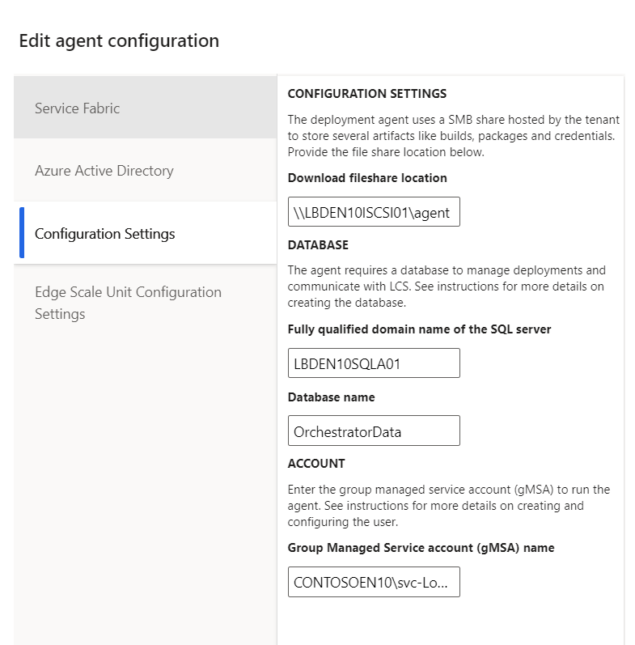
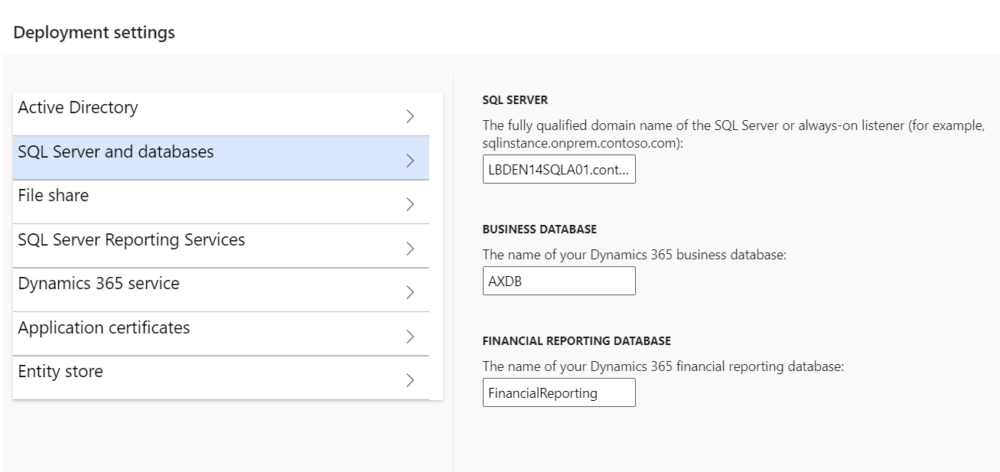

---
# required metadata

title: Upgrade or replace the SQL Server instance of Microsoft Dynamics 365 Finance + Operations (on-premises) environments
description: This article explains how to upgrade the Microsoft SQL Server instance or cluster that your environment is using.
author: faix
ms.date: 04/05/2022
ms.topic: article
ms.prod: dynamics-365 
ms.service:
audience: IT Pro
ms.reviewer: sericks
ms.search.region: Global
ms.author: osfaixat
ms.search.validFrom: 2021-11-29
search.app:
  - financeandoperationsonprem-docs
---

# Upgrade or replace the SQL Server instance of Microsoft Dynamics 365 Finance + Operations (on-premises) environments

This article explains how to upgrade the Microsoft SQL Server instance or cluster that your environment is using. You must complete this process if you want to upgrade from one major version of SQL Server to another but don't want to do an [in-place upgrade](/sql/database-engine/install-windows/choose-a-database-engine-upgrade-method). If you choose to do an in-place upgrade, you can still follow the guidance in this article although some of the steps won't apply.

## Prerequisites for upgrading the SQL Server version

### Upgrade from SQL Server 2016 to SQL Server 2019

- The environment must be on application version 10.0.21 or later.
- The local agent must be on version 2.7.0 or later.

## Preparation

1. Deploy your new SQL Server instance on a virtual machine (VM), or create a new SQL cluster.
1. Configure the new instance or cluster as described in [Set up SQL Server](./setup-deploy-on-premises-pu41.md#setupsql).
1. If you're using self-signed certificates, make sure that they have been imported into the Application Object Server (AOS), Management Reporter (MR), and Orchestrator nodes in your Azure Service Fabric cluster.

## Database operations

1. Make sure that users aren't connected, because your downtime will begin.
1. Back up all your databases from your current SQL Server instance or cluster.
1. Restore the database backups into the new SQL Server instance or cluster.
1. After your databases are restored, run the scripts in [Configure the databases](./setup-deploy-on-premises-pu41.md#configuredb).

## Upgrade other SQL Server components

All your SQL Server components across an environment must be on the same version. For example, if you're upgrading to SQL Server 2019, SQL Server Reporting Services (SSRS), SQL Server Integration Services (SSIS), and the database engines must all be on the same version.

1. On your AOS nodes, upgrade the SSIS component. When you perform this action, the Data Management Framework (DMF) will cease to work correctly, because it will rely on the older version of SSIS. After you service your environment, DMF will continue to work, because it will have been updated to use the new version of SSIS.
1. On your Business Intelligence (BI) nodes, upgrade the SSRS and database engine components. When you do this upgrade, you will have to rerun the **Complete-Prereqs.ps1** script on the node, so that the service permissions are reconfigured. When you upgrade the database engine component on your BI nodes from SQL Server 2016 to SQL Server 2019, the SSRS component will be removed. After it's removed, use the SSRS 2019 installer to install the SSRS service.

> [!IMPORTANT]
>  In SQL Server 2019, SSRS has its own installer.

## Update the local agent

1. Clean up the local agent by running the following command from an Orchestrator node.

    ```powershell
    LocalAgentCLI.exe Cleanup <path of localagent-config.json>
    ```

1. In [Microsoft Dynamics Lifecycle Services (LCS)](https://lcs.dynamics.com), update your connector configuration with the new fully qualified domain name (FQDN) of the SQL Server instance or cluster.

    

1. Download the new configuration file.
1. In the configuration file, update the SQL Server version. The version that you specify must match the version of SQL Server that is present in the environment. For more information, see [Deployment configurations for the local agent](./onprem-localagent-options.md).

    ```json
    "deploymentOptions": {
        ...
        "sqlServerVersion" : {
            "value": "2019"
        },
        ...
    }
    ```

1. Install the local agent with the new configuration file.

    ```powershell
    LocalAgentCLI.exe Install <path of the new localagent-config.json>
    ```

## Force the re-adding of the assemblies to the Global Assembly Cache

> [!NOTE]
> If your environment is on application version 10.0.31 or later, you can skip this step, because the change in the SQL version will be detected automatically.

Typically, when servicing an environment with a package deployment, the Service Fabric package version of the AXSFType changes. This will make the environment carry out additional deployment and servicing operations. When using the **Update Settings** action, the version does not change. As a result, the appropriate assemblies will not be present in the Global Assembly Cache. To force the re-adding of the assemblies to the Global Assembly Cache, complete the following steps:

1. Go to your aos-storage file share.
2. Open the **GacAssemblies** folder.
3. You will see a list of folders corresponding with the names of your AOS nodes. Open any of the folders. 
4. Rename the existing .txt file to 1.0.txt.
5. Repeat step 4 for each folder.

## Force the redeployment of your reports to the SSRS node

If you're replacing your BI node with a new node, or if you deleted your database engine and reinstalled it, you might have to force the deployment of your reports. In this case, run the following command from your business database before you trigger the **Update environment** action as described in the next section.

```SQL
UPDATE SF.synclog SET STATE=5, SyncStepName = 'ReportSyncstarted' WHERE CODEPACKAGEVERSION in (SELECT TOP(1) CODEPACKAGEVERSION from SF.SYNCLOG ORDER BY CREATIONDATE DESC)
```

## Update your environment settings

1. In [LCS](https://lcs.dynamics.com), select the **Full Details** link for the environment where you want to update the SQL Server.
1. Select **Maintain**, and then select **Update Settings**.
1. When you update the settings, update the FQDN of the new SQL Server instance or cluster.

    

1. Select **Prepare**.

    After the download and preparation are completed, the **Update environment** button appears.

	

1. Select **Update environment** to start to update your environment.

    The environment is redeployed and configured to interact with the new version of SQL Server.
