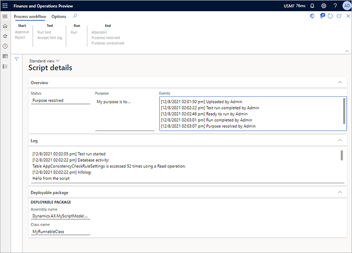

# Run custom X++ scripts with zero downtime

[!include [banner](../includes/banner.md)]

This feature lets you upload and run deployable packages that contain custom X++ scripts without having to go through Microsoft Dynamics Lifecycle Services (LCS) or suspend your system. Therefore, you can correct minor data inconsistencies without causing any disruptive downtime.

The benefit of using an X++ script to correct minor data inconsistences is that the system will automatically adjust all related tables as required when it runs the script. This approach helps ensure the integrity of the correction and helps minimize the risk of introducing new inconsistencies.

> [!IMPORTANT]
> This feature is intended for correction of minor data inconsistencies only. It must not be used for the following purposes or any other purpose:
>
> - Data collection
> - Schema changes
> - Data migration or other long-running processes
> - Correction of data that can be corrected through other means, such as regular business processes, data consistency tools, or other self-service tools
>
> The feature lets authorized users change entities and their records directly, without having to run the business logic that is associated with those entities. These changes can cause data integrity issues. Therefore, your organization might require that you obtain approval and signoff from internal and external auditors (or other equivalent stakeholders) before and/or after you run a script. For compliance reasons, changes that affect some characteristics might also have to be disclosed in external reports (such as financial statements) or reported to government authorities. Your organization is solely responsible for any changes that are made to its data via this feature, any approval and signoff or disclosure of those changes, and compliance with applicable laws. You bear all the risks of using this feature.

All deployable packages that are uploaded into the system go through a mandatory workflow. As a safety precaution, and to help ensure segregation of duties, the user who uploads a deployable package isn't allowed to approve it for the next steps in the workflow. Another user must approve it. However, after the package is approved, the user who uploaded it will be allowed to complete the remaining steps.

The system requires that all deployable packages go through a test run. Before the script will be allowed to run on production data, a user must validate that the output is correct by selecting **Accept test log**. If the output isn't correct, the user must mark the package as failed by selecting **Abandon**. In this case, the script won't be allowed to run on production data.

Every uploaded package is saved in the system and goes through a defined workflow of events. For each event, the system keeps a log that includes a timestamp and the identity of the person who performed the event. In this way, the system ensures that there is an audit trail.

As the following illustration shows, the system provides details about how each deployable package was run in X++ and which entities were touched.



## Assign duties to users to control access

This feature provides the following duties. Admins can use these duties to help control access to the feature.

- **Maintain custom scripts** – This duty grants the ability to upload, test, verify, and run custom X++ scripts in environments (user acceptance testing \[UAT\] and production).
- **Approve custom scripts** – This duty grants the ability to approve an uploaded custom X++ script. Approval is a mandatory step before any script can be tested, verified, and run.

To help minimize the risk of malicious action, each script must be explicitly approved by a user other than the user who uploaded it. Before you can use this feature in your organization, an admin must assign the preceding duties to at least two relevant and highly trusted users. Although a single user can have both duties, that user still won't be able to approve their own scripts.

## Create a deployable package

The feature requires a regular deployable package that can be created in Visual Studio. For instructions, see [Create deployable packages of models](../deployment/create-apply-deployable-package.md).

Your deployable package must contain exactly one runnable X++ class. In other words, it must have one class that includes a method that has the following signature.

```xpp
public static void main(Args _args)
```

> [!NOTE]
> The name of the main method must be lowercase.

## Code example

The following code example shows how a deployable package can be structured.

```xpp
class MyScriptClassForIssueXYZ
{
    public static void main(Args _args)
    {
        if (curExt() != 'DAT')
        {
            throw error("This script must run in the DAT company!");
        }

        ttsbegin;

        MyTable myTable;

        update_recordset myTable
            setting myField = 17
            where myTable.myReference == 'xyz';

        if (myTable.RowCount() != 1)
        {
            throw error("Not updating the expected row!");
        }

        info("Success");
  
        ttscommit;
    }

}
```

## Best practices

The following list describes some best practices for successfully writing, implementing, and running a script. The list isn't exhaustive, and it should be considered only guidance.

- **Do** write a success message at the end of the script. In this way, you will be able to see that the script ran without exceptions.
- **Do** add explicit handling of the transaction scope.
- **Do** use existing business logic, such as `update()` methods, but **do not** bypass business logic by using `doUpdate()`, `doInsert()`, and `doDelete()` methods. This approach will help ensure that dependent data is handled correctly. It will also significantly reduce the risk of further data inconsistencies.
- **Do** assert the company context. This approach will expose common mistakes as a script runs. For example, it will reveal whether the script is being run in the wrong company.
- **Do** assert that the number of affected records matches your expectations. This approach will reveal whether data unexpectedly shifted in the system while the script was being prepared.
- **Do** use unique model names for each script (for example, by including a reference to a work item in the name). This approach will prevent name clash issues when you upload the script. If a new iteration of a script is required, be sure to create a new model.
- **Do** test each script in a non-production environment first. Test for the intended impact and for unintentional side-effects on related data. Ensure that all business processes that might be affected can be successfully and fully completed afterwards.

## Upload and run a deployable package

Use the following procedure to upload and run a script.

1. In your finance and operations app, go to **System administration \> Periodic tasks \> Database \> Custom scripts**.
1. Select **Upload**.
1. Select the deployable package that you created as described earlier in this article. You will be prompted to specify the purpose of the script.
1. The script must now be approved by a user other than the user who uploaded it. The approver must follow these steps:

    1. Go to **System administration \> Periodic \> Data base \> Custom scripts**.
    1. Select the script to approve, and then select **Details**.
    1. On the Action Pane, on the **Process workflow** tab, in the **Start** group, select **Approve** or **Reject**. If you select **Approve**, the script is marked as approved and is unlocked for testing. If you select **Reject**, the script is locked. In both cases, the event is logged, and a copy of the script is kept in the system.

1. The script must be tested to ensure that it does what it's intended to do. The tester can be the same as the uploader or the approver, or it can be a third user who has the required permissions. The tester must follow these steps:

    1. Go to **System administration \> Periodic \> Data base \> Custom scripts**.
    1. Select the script to test, and then select **Details**.
    1. On the Action Pane, on the **Process workflow** tab, in the **Test** group, select **Run test**. The script is run inside a temporary transaction that the system will automatically abort while it collects various logs and SQL statements.
    1. When the script has finished running, review the logs, and verify that the results meet your expectations. Follow one of these steps:

        - If you're satisfied with the test result, select **Accept test log** in the **Test** group on the **Process workflow** tab of the Action Pane to allow the script to be run. The event log will reflect the fact that the script was tested, and it will indicate who tested it and when.
        - If you aren't satisfied with the test result, select **Abandon** in the **End** group on the **Process workflow** tab of the Action Pane to prevent the script from being run. The system will keep a copy of the script together with a log of its history.

1. When you're sure that the script meets your expectations, select **Run** in the **Run** group on the **Process workflow** tab of the Action Pane to run it. This command does the same thing as the previous test run, but the transaction will be committed at the end.
1. After the script has finished running, check the result, and confirm that the script worked as you intended. Follow one of these steps:

    - If you're satisfied with the result, select **Purpose resolved** in the **End** group on the **Process workflow** tab of the Action Pane. The event log will reflect the fact that the script ran successfully, and it will indicate who verified the script and when. The script is saved, but it's now locked and can't be run again.
    - If you aren't satisfied with the result, select **Purpose unresolved** in the **End** group on the **Process workflow** tab of the Action Pane. The event log will reflect the fact that the script failed to fulfill its intended purpose, and it will indicate who ran the script and when. The script is saved, but it's now locked and can't be run again. However, the system doesn't automatically undo the script action. You might have to write, import, and run a new script to undo the effect that the failed script had on your system.

Your selection in the last step defines the final state for the script. You can repeat the process as you require.

## Upload and run a deployable package through LCS

Instead of deploying your deployable package through the user interface for your finance and operations app, as described in the previous section, you can upload it to LCS and use the regular procedure to deploy it. For more information, see [Install deployable packages from the command line](../deployment/install-deployable-package.md).

Although this approach has fewer restrictions, it provides less error protection. Additionally, because it requires a restart of all servers, it will cause some downtime.

