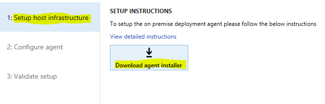
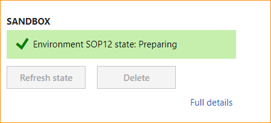
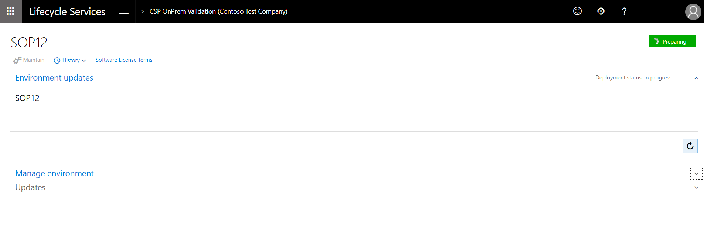
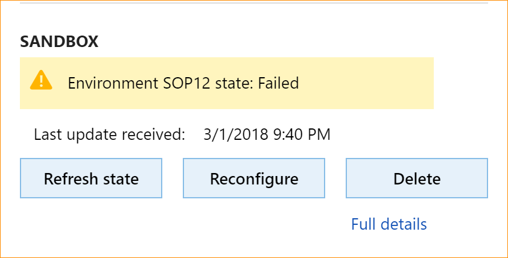

---
# required metadata

title: Set up and deploy on-premises environments (Platform updates 12 through 40)
description: This topic provides information about how to plan, set up, and deploy Dynamics 365 Finance + Operations (on-premises) with Platform updates 12 through 40.
author: PeterRFriis
ms.date: 11/30/2021
ms.topic: article
ms.prod: dynamics-365 
ms.service:
ms.technology: 

# optional metadata

# ms.search.form: 
# ROBOTS: 
audience: Developer, IT Pro
# ms.devlang: 
ms.reviewer: sericks
# ms.tgt_pltfrm: 
ms.custom: 
ms.assetid: 
ms.search.region: Global
# ms.search.industry: 
ms.author: peterfriis
ms.search.validFrom: 2017-11-30 
ms.dyn365.ops.version: Platform update 12

---

# Set up and deploy on-premises environments (Platform updates 12 through 40)

[!include [banner](../includes/banner.md)]

This topic provides information about how to plan, set up, and deploy Dynamics 365 Finance + Operations (on-premises) with Platform update 12-40.

The [Local Business Data Yammer group](https://www.yammer.com/dynamicsaxfeedbackprograms/#/threads/inGroup?type=in_group&feedId=13595809&view=all) is available. You can post questions or feedback you may have about the on-premises deployment there.

If you have questions or feedback about the content in this topic, please post them in the **Comments** section at the bottom of this page.

## Finance + Operations components

The Finance + Operations application consists of three main components:

- Application Object Server (AOS)
- Business Intelligence (BI)
- Financial Reporting/Management Reporter

These components depend on the following system software:

- Microsoft Windows Server 2016 (only English OS installations are supported)
- Microsoft SQL Server 2016 SP1 and SP2 (from Platform update 33), which has the following features:
  - Full-text index search is enabled.
  - SQL Server Reporting Services (SSRS) - This is deployed on BI virtual machines.
  - SQL Server Integration Services (SSIS) - This is deployed on AOS virtual machines.

    > [!WARNING]
    > Full Text Search must be enabled.

- SQL Server Management Studio
- Standalone Microsoft Azure Service Fabric
- Microsoft Windows PowerShell 5.0 or later
- Active Directory Federation Services (AD FS) on Windows Server 2016
- Domain controller

  > [!WARNING]
  > The domain controller must be Microsoft Windows Server 2012 R2 or later and must have a domain functional level of 2012 R2 or more.    For more information about domain functional levels, see the following topics:
  >   - [What Are Active Directory Functional Levels](/previous-versions/windows/it-pro/windows-server-2003/cc787290(v=ws.10))
  >   - [Understanding Active Directory Domain Services Functional Levels](/previous-versions/windows/it-pro/windows-server-2008-R2-and-2008/cc754918(v=ws.10))
  >   - [Full 2-way trust](../../fin-ops/get-started/system-requirements-on-prem.md#full-2-way-trust)


## Lifecycle Services

Finance + Operations bits are distributed through Microsoft Dynamics Lifecycle Services (LCS). Before you can deploy, you must purchase license keys through the [Enterprise Agreements](https://www.microsoft.com/Licensing/licensing-programs/enterprise.aspx) channel and set up an on-premises project in LCS. Deployments can be initiated only through LCS. For more information about how to set up on-premises projects in LCS, see [Set up on-premises projects in Lifecycle Services (LCS)](../lifecycle-services/lbd-create-lcs-on-prem-project.md).

## Authentication

The on-premises application works with AD FS. To interact with LCS, you must also configure Azure Active Directory (AAD). To complete the deployment and configure the LCS Local agent, you will need AAD. If you do not already have an AAD tenant, you can get one for free by using one of the options provided by AAD. For more information, see [How to get an Azure Active Directory tenant](/azure/active-directory/develop/active-directory-howto-tenant).

## Standalone Service Fabric

Finance + Operations uses standalone Service Fabric. For more information, see the [Service Fabric documentation](/azure/service-fabric/).

Setup of Finance + Operations will deploy a set of applications inside Service Fabric (SF). During deployment, each node in the cluster will be defined via configuration to have one of the following node types:

- **AOSNodeType** - Hosts the application object server (business logic).
- **OrchestratorType** - Functions as Service Fabric primary nodes, and hosts deployment- and servicing logic.
- **ReportServerType** - Hosts SSRS and reporting logic.
- **MRType** - Hosts management reporting logic.

## Infrastructure

Finance + Operations falls under the standard Microsoft support policy about operation on non-Microsoft virtualization platforms, specifically VMware. For more information, see [Support policy for Microsoft software](https://support.microsoft.com/help/897615/support-policy-for-microsoft-software-that-runs-on-non-microsoft-hardw). In short, we support our products in this environment. However, if we are asked to investigate an issue, we might first ask the customer to reproduce the issue without the virtualization platform or on the Microsoft virtualization platform.

If you are using VMWare, you must implement the fixes that are documented on the following web pages:
- [After upgrading a virtual machine to hardware version 11, network dependent workloads experience performance degradation (2129176)](https://kb.vmware.com/s/article/2129176)
- [Several issues with vmxnet3 virtual adapter](https://vinfrastructure.it/2016/05/several-issues-vmxnet3-virtual-adapter)

> [!IMPORTANT]
> Dynamics 365 Finance + Operations (on-premises) is not supported on any public cloud infrastructure, including Microsoft Azure Cloud services. However, it is supported to run on [Microsoft Azure Stack HCI](https://azure.microsoft.com/products/azure-stack/hci/) and [Microsoft Azure Stack Hub](https://azure.microsoft.com/products/azure-stack/hub/).

The hardware configuration includes the following components:

- Standalone Service Fabric cluster that is based on Windows Server 2016 virtual machines (VMs)
- Microsoft SQL Server (both Clustered SQL and Always-On are supported)
- AD FS for authentication
- Server Message Block (SMB) version 3 file share for storage
- Optional: Microsoft Office Server 2017

For more information, see [System requirements for on-premises deployments](../../fin-ops/get-started/system-requirements-on-prem.md).

### Hardware layout

Plan your infrastructure and Service Fabric cluster based on the recommended sizing in [Hardware sizing requirements for on-premises environments](../../fin-ops/get-started/hardware-sizing-on-premises-environments.md). For more information about how to plan the Service Fabric cluster, see [Plan and prepare your Service Fabric standalone cluster deployment](/azure/service-fabric/service-fabric-cluster-standalone-deployment-preparation).

The following table shows an example of a hardware layout. This example is used throughout this topic to illustrate the setup. You will need to replace the machine names and IP addresses given in the following instructions with the names and IP addresses for the machines in your environment.

> [!NOTE]
> The Primary node of the Service Fabric cluster must have at least three nodes. In this example, **OrchestratorType** is designated as the Primary node type.

| Machine purpose          | SF Node type     | Machine name    | IP address    |
|--------------------------|------------------|-----------------|---------------|
| Domain controller        |                  | DAX7SQLAODC1    | 10.179.108.2  |
| AD FS                    |                  | DAX7SQLAOADFS1  | 10.179.108.3  |
| File server              |                  | DAX7SQLAOFILE1  | 10.179.108.4  |
| SQL Always-On cluster    |                  | DAX7SQLAOSQLA01 | 10.179.108.5  |
|                          |                  | DAX7SQLAOSQLA02 | 10.179.108.6  |
|                          |                  | DAX7SQLAOSQLA   | 10.179.108.9  |
| Client                   |                  | SQLAOCLIENT1    | 10.179.108.11 |
| AOS 1                    | AOSNodeType      | SQLAOSF1AOS1    | 10.179.108.12 |
| AOS 2                    | AOSNodeType      | SQLAOSF1AOS2    | 10.179.108.13 |
| AOS 3                    | AOSNodeType      | SQLAOSF1AOS3    | 10.179.108.14 |
| Orchestrator 1           | OrchestratorType | SQLAOSF1ORCH1   | 10.179.108.15 |
| Orchestrator 2           | OrchestratorType | SQLAOSF1ORCH2   | 10.179.108.16 |
| Orchestrator 3           | OrchestratorType | SQLAOSF1ORCH3   | 10.179.108.17 |
| Management Reporter node | MRType           | SQLAOSMR1       | 10.179.108.18 |
| SSRS node                | ReportServerType | SQLAOSFBIN1     | 10.179.108.10 |

## Setup

### Prerequisites

Before you start the setup, the following prerequisites must be in place. The setup of these prerequisites is out of scope for this document.

- Active Directory Domain Services (AD DS) must be installed and configured in your network.
- AD FS must be deployed.
- SQL Server 2016 SP2 must be installed on the SSRS machines.
- SQL Server Reporting Services 2016 must be installed in **Native** mode on the SSRS machines.

The following prerequisite software is installed on the VMs by the infrastructure setup scripts downloaded from LCS.

| Node type | Component | Details |
|-----------|-----------|---------|
| AOS       | SNAC – ODBC driver 13 | [ODBC driver 13.1](/sql/connect/odbc/windows/release-notes-odbc-sql-server-windows#131) |
| AOS       | SNAC – ODBC driver 17 | This driver is needed for upgrading to PU15 or higher: <https://aka.ms/downloadmsodbcsql> |
| AOS       | The Microsoft .NET Framework version 2.0–3.5 (CLR 2.0) | **Windows features:** NET-Framework-Features, NET-Framework-Core, NET-HTTP-Activation, NET-Non-HTTP-Activ |
| AOS       | The Microsoft .NET Framework version 4.0–4.6 (CLR 4.0) | **Windows features:** NET-Framework-45-Features, NET-Framework-45-Core, NET-Framework-45-ASPNET, NET-WCF-Services45, NET-WCF-TCP-PortSharing45 |
| AOS       | The Microsoft .NET Framework version 4.7.2 (CLR 4.0) | https://dotnet.microsoft.com/download/thank-you/net472-offline |
| AOS       | Internet Information Services (IIS) | **Windows features:** WAS, WAS-Process-Model, WAS-NET-Environment, WAS-Config-APIs, Web-Server, Web-WebServer, Web-Security, Web-Filtering, Web-App-Dev, Web-Net-Ext, Web-Mgmt-Tools, Web-Mgmt-Console |
| AOS       | SQL Server Management Studio 17.2 | <https://go.microsoft.com/fwlink/?linkid=854085> |
| AOS       | Microsoft Visual C++ Redistributable Packages for Microsoft Visual Studio 2013 | <https://support.microsoft.com/help/3179560> |
| AOS       | Microsoft Visual C++ Redistributable Packages for Microsoft Visual Studio 2017 | <https://lcs.dynamics.com/V2/SharedAssetLibrary> > Models > "VC++ 17 Redistributables" |
| AOS       | Microsoft Access Database Engine 2010 Redistributable | <https://www.microsoft.com/download/details.aspx?id=13255> |
| BI        | .NET Framework version 2.0–3.5 (CLR 2.0) | **Windows features:** NET-Framework-Features, NET-Framework-Core, NET-HTTP-Activation, NET-Non-HTTP-Activ |
| BI        | .NET Framework version 4.0–4.6 (CLR 4.0) | **Windows features:** NET-Framework-45-Features, NET-Framework-45-Core, NET-Framework-45-ASPNET, NET-WCF-Services45, NET-WCF-TCP-PortSharing45 |
| BI        | The Microsoft .NET Framework version 4.7.2 (CLR 4.0) | https://dotnet.microsoft.com/download/thank-you/net472-offline |
| BI        | SQL Server Management Studio 17.2 | <https://go.microsoft.com/fwlink/?linkid=854085> |
| MR        | .NET Framework version 2.0–3.5 (CLR 2.0) | **Windows features:** NET-Framework-Features, NET-Framework-Core, NET-HTTP-Activation, NET-Non-HTTP-Activ |
| MR        | .NET Framework version 4.0–4.6 (CLR 4.0) | **Windows features:** NET-Framework-45-Features, NET-Framework-45-Core, NET-Framework-45-ASPNET, NET-WCF-Services45, NET-WCF-TCP-PortSharing45 |
| MR        | The Microsoft .NET Framework version 4.7.2 (CLR 4.0) | https://dotnet.microsoft.com/download/thank-you/net472-offline |
| MR        | Visual C++ Redistributable Packages for Visual Studio 2013 | <https://support.microsoft.com/help/3179560> |
| ORCH      | The Microsoft .NET Framework version 4.0–4.8 (CLR 4.0) | <https://dotnet.microsoft.com/download/thank-you/net48-offline> |

### Overview

The following steps must be completed to set up the infrastructure for Finance + Operations. Reading all the steps before you begin will make it easier to plan your setup.

1. [Plan your domain name and DNS zones](#plandomain)
2. [Plan and acquire your certificates](#plancert)
3. [Plan your users and service accounts](#plansvcacct)
4. [Create DNS zones, and add A records](#createdns)
5. [Join VMs to the domain](#joindomain)
6. [Download setup scripts from LCS](#downloadscripts)
7. [Describe your configuration](#describeconfig)
8. [Configure certificates](#configurecert)
9. [Setup VMs](#setupvms)
10. [Set up a standalone Service Fabric cluster](#setupsfcluster)
11. [Configure LCS connectivity for the tenant](#configurelcs)
12. [Set up file storage](#setupfile)
13. [Set up SQL Server](#setupsql)
14. [Configure the databases](#configuredb)
15. [Encrypt credentials](#encryptcred)
16. [Set up SSIS](#setupssis)
17. [Set up SSRS](#setupssrs)
18. [Configure AD FS](#configureadfs)
19. [Configure a connector and install an on-premises local agent](#configureconnector)
20. [Tear down CredSSP, if remoting was used](#teardowncredssp)
21. [Deploy your Finance + Operations environment from LCS](#deploy)
22. [Connect to your Finance + Operations environment](#connect)

### <a name="plandomain"></a> 1. Plan your domain name and DNS zones

We recommend that you use a publicly registered domain name for your production installation of AOS. In that way, the installation can be accessed outside the network, if outside access is required.

For example, if your company's domain is contoso.com, your zone for Finance + Operations might be d365ffo.onprem.contoso.com, and the host names might be as follows:

- ax.d365ffo.onprem.contoso.com for AOS machines
- sf.d365ffo.onprem.contoso.com for the Service Fabric cluster

### <a name="plancert"></a> 2. Plan and acquire your certificates

Secure Sockets Layer (SSL) certificates are required in order to secure a Service Fabric cluster and all the applications that are deployed. For your production and sandbox workloads, we recommend that you acquire certificates from a certificate authority (CA) such as [DigiCert](https://www.digicert.com/ssl-certificate/), [Comodo](https://ssl.comodo.com/), [Symantec](https://www.websecurity.symantec.com/ssl-certificate), [GoDaddy](https://www.godaddy.com/web-security/ssl-certificate), or [GlobalSign](https://www.globalsign.com/en/ssl/). If your domain is set up with [Active Directory Certificate Services](/previous-versions/windows/it-pro/windows-server-2008-R2-and-2008/cc772393(v=ws.10)) (AD CS), you can create the certificates through AD CS. Each certificate must contain a private key that was created for key exchange, and it must be exportable to a Personal Information Exchange (.pfx) file.

Self-signed certificates can be used only for testing purposes. For convenience, the setup scripts provided in LCS include scripts that generate and export self-signed certificates. If you are using self-signed scripts, you will be instructed to run the creation scripts in later steps. As we've mentioned, these certificates can be used for testing purposes only.

Recommended settings for certificates are:
- Signature algorithm: sha256RSA
- Signature hash algorithm: sha256
- Public key: RSA (2048 bits)
- Thumbprint algorithm: sha1

| Purpose                                      | Explanation | Additional requirements |
|----------------------------------------------|-------------|-------------------------|
| SQL Server SSL certificate                   | This certificate is used to encrypt data that is transmitted across a network between an instance of SQL Server and a client application. | <p>The domain name of the certificate should match the fully qualified domain name (FQDN) of the SQL Server instance or listener. For example, if the SQL listener is hosted on the machine DAX7SQLAOSQLA, the certificate's DNS name is DAX7SQLAOSQLA.contoso.com.</p> <p>CN: DAX7SQLAOSQLA.contoso.com <br> DNS Name: DAX7SQLAOSQLA.contoso.com</p> |
| Service Fabric Server certificate            | <p>This certificate is used to help secure the node-to-node communication between the Service Fabric nodes.</p> <p> This certificate is also used as the Server certificate that is presented to the client that connects to the cluster.</p> | <p>For this certificate you can also use SSL wild card certificate of your domain. For example, \*.contoso.com. This is explained in more details below the table. Otherwise, use the following values:</p> <p>CN: sf.d365ffo.onprem.contoso.com <br> DNS Name: sf.d365ffo.onprem.contoso.com</p> |
| Service Fabric Client certificate            | This certificate is used by clients to view and manage the Service Fabric cluster. | CN: client.d365ffo.onprem.contoso.com <br> DNS Name: client.d365ffo.onprem.contoso.com |
| Encipherment Certificate                     | This certificate is used to encrypt sensitive information such as the SQL Server password and user account passwords. | <p> The certificate must be created by using the provider **Microsoft Enhanced Cryptographic Provider v1.0**. </p><p>The certificate key usage must include Data Encipherment (10) and should not include Server authentication or Client authentication.</p><p>For more information, see [Managing secrets in Service Fabric applications](/azure/service-fabric/service-fabric-application-secret-management).</p> <p> CN: axdataenciphermentcert <br> DNS Name: axdataenciphermentcert </p> |
| AOS SSL Certificate                          | <p>This certificate is used as the Server certificate that is presented to the client for the AOS website. It's also used to enable Windows Communication Foundation (WCF)/Simple Object Access Protocol (SOAP) certificates.</p> | <p>You can use the same wild card certificate that you used as the Service Fabric Server certificate. Otherwise, use the following values:</p> <p> CN: ax.d365ffo.onprem.contoso.com <br> DNS Name: ax.d365ffo.onprem.contoso.com </p> |
| Session Authentication certificate           | This certificate is used by AOS to help secure a user's session information. | <p> This certificate is also the File Share certificate that will be used at the time of deployment from LCS.</p> <p> CN: SessionAuthentication <br> DNS Name: SessionAuthentication </p> |
| Data Encryption certificate                  | This certificate is used by the AOS to encrypt sensitive information.  | <p>This must be created using the provider **Microsoft Enhanced RSA and AES Cryptographic Provider**. </p> <p> CN: DataEncryption <br> DNS Name: DataEncryption </p> |
| Data Signing certificate                     | This certificate is used by the AOS to encrypt sensitive information.  | <p> This is separate from the Data Encryption certificate and must be created using the provider **Microsoft Enhanced RSA and AES Cryptographic Provider**. </p> <p> CN: DataSigning <br> DNS Name: DataSigning </p> |
| Financial Reporting client certificate       | This certificate is used to help secure the communication between the Financial Reporting services and the AOS. | <p>CN: FinancialReporting <br> DNS Name: FinancialReporting </p>  |
| Reporting certificate                        | This certificate is used to help secure the communication between SSRS and the AOS.| <p> **Do not reuse the Financial Reporting Client certificate.** </p> <p> CN: ReportingService <br> DNS Name: ReportingService </p> |
| On-Premises local agent certificate           | <p>This certificate is used to help secure the communication between a local agent that is hosted on-premises and on LCS.</p><p>This certificate enables the local agent to act on behalf of your Azure AD tenant, and to communicate with LCS to orchestrate and monitor deployments.</p><p>**Note:** Only 1 on-premises local agent certificate is needed for a tenant.</p> | <p> CN: OnPremLocalAgent <br> DNS Name: OnPremLocalAgent </p> |

SSL wild card certificate of your domain can be used to combine Service Fabric Server certificate and AOS SSL certificate.

The following is an example of a Service Fabric Server certificate combined with an AOS SSL certificate.

#### Subject name

```Text
CN = *.d365ffo.onprem.contoso.com
```

#### Subject alternative names

```Text
DNS Name=ax.d365ffo.onprem.contoso.com
DNS Name=sf.d365ffo.onprem.contoso.com
DNS Name=*.d365ffo.onprem.contoso.com
```

> [!NOTE]
> The wild card certificate allows you to secure only the first-level subdomain of the domain to which it is issued.

### <a name="plansvcacct"></a> 3. Plan your users and service accounts

You must create several user or service accounts for Finance + Operations to work. You must create a combination of group managed service accounts (gMSAs), domain accounts, and SQL accounts. The following table shows the user accounts, their purpose, and example names that will be used in this topic.

| User account                                            | Type           | Purpose | User name |
|---------------------------------------------------------|----------------|---------|-----------|
| Financial Reporting Application Service Account         | gMSA           |         | Contoso\\svc-FRAS$ |
| Financial Reporting Process Service Account             | gMSA           |         | Contoso\\svc-FRPS$ |
| Financial Reporting Click Once Designer Service Account | gMSA           |         | Contoso\\svc-FRCO$ |
| AOS Service Account                                     | gMSA           | This user should be created for future proofing. We plan to enable AOS to work with the gMSA in upcoming releases. By creating this user at the time of setup, you will help to ensure a seamless transition to the gMSA.\* | Contoso\\svc-AXSF$ |
| AOS Service Account                                     | Domain account | AOS uses this user in the general availability (GA) release. | Contoso\\AXServiceUser |
| AOS SQL DB Admin user                                   | SQL user       | Finance + Operations uses this user to authenticate with SQL\*\*. This user will also be replaced by the gMSA user in upcoming releases\*\*\*. | AXDBAdmin |
| Local Deployment Agent Service Account                  | gMSA           | This account is used by the local agent to orchestrate the deployment on various nodes. | Contoso\\Svc-LocalAgent$ |

\* These accounts should not have their regional settings changed. They should have the default EN-US region settings. 

\*\* If the password of the SQL user contains special characters, you might encounter issues during deployment.

\*\*\* The SQL user name and password for SQL authentication are secured because they are encrypted and stored in the file share.

### <a name="createdns"></a> 4. Create DNS zones and add A records

DNS is integrated with AD DS, and lets you organize, manage, and find resources in a network. The following instructions provide steps to create a DNS forward lookup zone and A records for the AOS host name and Service Fabric cluster. In this example setup, the DNS zone name is d365ffo.onprem.contoso.com, and the A records/host names are as follows:

- **ax**.d365ffo.onprem.contoso.com for AOS machines
- **sf**.d365ffo.onprem.contoso.com for the Service Fabric cluster

#### Add a DNS zone

Use the following procedure to add a DNS zone.

1. Sign in to the domain controller machine, select **Start**, and start DNS Manager by typing **dnsmgmt.msc** and selecting the **dnsmgmt (DNS)** application.
2. Right-click the domain controller name in the console tree, and then select **New Zone** \> **Next**.
3. Select **Primary Zone**.
4. Leave the **Store the zone in Active Directory (available only if the DNS Server is a writeable domain controller** check box selected, and then select **Next**.
5. Select **To all DNS Servers running on Domain Controllers in this domain: Contoso.com**, and then select **Next**.
6. Select **Forward Lookup Zone**, and then select **Next**.
7. Enter the zone name for your setup, and then select **Next**. For example, enter **d365ffo.onprem.contoso.com**.
8. Select **Do not allow dynamic updates**, and then select **Next**.
9. Select **Finish**.

#### Set up an A record for AOS

In the new DNS zone, create one A record that is named **ax.d365ffo.onprem.contoso.com** for **each** Service Fabric cluster node of the **AOSNodeType** type. Don't create A records for the other node types.

1. Find the newly created zone under the **Forward Lookup Zones** folder in DNS Manager.
2. Right-click the new zone, and then select **New Host**.
3. Enter the name and IP address of the Service Fabric node. (For example, enter **ax** as the name and enter **10.179.108.12** as the IP address.) Select **Add Host**.
4. Do not select either check box.
5. Repeat steps 1-4 for each AOS node.

#### Set up an A record for the orchestrator

In the new DNS zone, create an A record that is named **sf.d365ffo.onprem.contoso.com** for **each** Service Fabric cluster node of the **OrchestratorType** type. Don't create A records for the other node types.

1. Right-click the new zone, and then select **New Host**.
2. Enter the name and IP address of the Service Fabric node. (For example, enter **sf** as the name and enter **10.179.108.15** as the IP address.) Select **Add Host**.
3. Do not select either check box.
4. Repeat for each Orchestrator node.

### <a name="joindomain"></a> 5. Join VMs to the domain

Join each VM to the domain by completing the steps in the [Join a Computer to a Domain](/windows-server/identity/ad-fs/deployment/join-a-computer-to-a-domain) document. Alternatively, use the following Windows PowerShell script.

```powershell
$domainName = Read-Host -Prompt 'Specify domain name (ex: contoso.com)'
Add-Computer -DomainName $domainName -Credential (Get-Credential -Message 'Enter domain credential')
```

> [!IMPORTANT]
> You must restart the VMs after you join them to the domain.

### <a name="downloadscripts"></a> 6. Download setup scripts from LCS

We have provided several scripts to help improve the setup experience. Follow these steps to download the setup scripts from LCS.

> [!IMPORTANT]
> The scripts must be executed from a computer in the same domain that the on-premises infrastructure is in.

1. Sign in to [LCS](https://lcs.dynamics.com/v2).
2. On the dashboard, select the **Shared asset library** tile.
3. On the **Model** tab, in the grid, select the row for **Microsoft Dynamics 365 Finance + Operations (on-premises), Deployment scripts**.
4. Select **Versions**, and then download the latest version of the zip file for the scripts.
   >[!Note] 
   > If you need the older version for Platform update 8 or Platform update 11, download version 1.
5. Right-click the zip file, and then select **Properties**. In the dialog box, select the **Unblock** check box.
6. Copy the zip file to the machine that will be used to execute the scripts.
7. Unzip the files into a folder that is named **infrastructure**.

> [!IMPORTANT]
> Ensure all edits are made to the ConfigTemplate.xml file in this folder.

### <a name="describeconfig"></a> 7. Describe your configuration

The infrastructure setup scripts use the following configuration files to drive the setup.
- infrastructure\ConfigTemplate.xml
- infrastructure\D365FO-OP\NodeTopologyDefinition.xml
- infrastructure\D365FO-OP\DatabaseTopologyDefinition.xml

>[!NOTE]
>Configuration files must be updated based on your environment for the setup scripts to work correctly. Be sure to update these files with the proper computer names, IP addresses, service accounts, and domain based on your setup.

**infrastructure\ConfigTemplate.xml** describes:
- Service Accounts that are needed for the application to operate
- Certificates necessary for securing communications
- Database configuration
- Service Fabric cluster configuration

    > [!IMPORTANT]
    > Make sure that there are three fault domains for OrchestratorType when you configure Service Fabric cluster. 
    > Make sure that no more than one type of node is deployed in a single machine when you configure Service Fabric cluster.

For each Service Fabric node type, **infrastructure\D365FO-OP\NodeTopologyDefinition.xml** describes:

- The mapping between each node type and the application, domain and service accounts, and certificates.
- Whether to enable the UAC.
- Prerequisites for Windows features and system software.
- Whether strong name validation should be enabled.
- List of firewall ports to be opened.

For each database, **infrastructure\D365FO-OP\DatabaseTopologyDefinition.xml** describes:

- The database settings.
- The mappings between users and roles.

#### Create gMSA and domain user accounts

1. Navigate to the machine that has the unzipped infrastructure scripts in the **infrastructure** folder.
2. Copy the **infrastructure** folder to the domain controller machine.
3. Start Windows PowerShell in elevated mode, change the directory to the **infrastructure** folder, and run the following commands.
    > [!IMPORTANT]
    > The following script doesn't create a domain user AxServiceUser for you. You must create it yourself.

    ```powershell
    Import-Module .\D365FO-OP\D365FO-OP.psd1
    New-D365FOGMSAAccounts -ConfigurationFilePath .\ConfigTemplate.xml
    ```
    


4. Add the AOS Service Accounts, **Contoso\svc-AXSF$** and **Contoso\AXServiceUser** to the local administrators group for all AOS machines. For more information, see [Add a member to local group](/previous-versions/windows/it-pro/windows-server-2008-R2-and-2008/cc772524(v=ws.11)).

5. If you must make changes to accounts or machines, update the ConfigTemplate.xml file in the original **infrastructure** folder, copy it to this machine and then run the following script.

    ```powershell
    Update-D365FOGMSAAccounts -ConfigurationFilePath .\ConfigTemplate.xml
    ```

### <a name="configurecert"></a> 8. Configure certificates

1. Navigate to the machine that has the **infrastructure** folder.
2. Generate certificates: 
    1. If you must generate self-signed certificates:
        1. Set the **generateSelfSignedCert** attribute to **true**. Only set this for the certificates that you need to generate. 
        1. Run the following command. The script will create the certificates. Put the certificates in the CurrentUser\My certificate store on the machine, and update the thumbprints in the XML file.

        ```powershell
        # Create self-signed certs
        .\New-SelfSignedCertificates.ps1 -ConfigurationFilePath .\ConfigTemplate.xml
        ```
    1. If you want to generate Active Directory Certificate Services (AD CS) certificates:
        1. Set the **generateADCSCert** attribute to **false** for the certificates that you don't want generated.
        1. Run the following commands. The script will create the certificate templates in AD CS. Generate the certificates from the templates, place the certificates in the CurrentUser\My certificate store on the machine, and update the thumbprints in the XML file.

        ```powershell
        .\New-ADCSCertificates.ps1 -ConfigurationFilePath .\ConfigTemplate.xml -CreateTemplates
        .\New-ADCSCertificates.ps1 -ConfigurationFilePath .\ConfigTemplate.xml
        ```

        > [!NOTE] 
        > The AD CS scripts need to run on a Domain Controller, or a Windows Server with Remote Server Admin Tools installed.

3. If you're using SSL certificates that were already generated, skip the certificate generation and update the thumbprints in the configTemplate.xml file. The certificates need to be installed in the CurrentUser\My store and their private keys must be exportable.

    > [!WARNING]
    > Because of a leading not-printable special character, which is difficult to determine when present, the cert manager should not be used to copy thumbprints. If the not-printable special character is present, you will get the error, **X509 certificate not valid**. To retrieve the thumbprints, see results from PowerShell commands or run the following commands in PowerShell.
    > ```powershell
    > dir cert:\CurrentUser\My
    > dir cert:\LocalMachine\My
    > dir cert:\LocalMachine\Root
    > ```

4. Specify a semi-colon separated list of users or groups in the **ProtectTo** tag for each certificate. Only Active directory users and groups specified in the **ProtectTo** tag will have permissions to import the certificates that are exported using the scripts. Passwords are not supported by the script to protect the exported certificates

5. Export the certificates into .pfx files. As part of the export, this script will check that your certificates have the correct cryptographic provider set. 

    ```powershell
    # Exports Pfx files into a directory VMs\<VMName>, all the certs will be written to infrastructure\Certs folder.
    .\Export-PfxFiles.ps1 -ConfigurationFilePath .\ConfigTemplate.xml
    ```

### <a name="setupvms"></a> 9. Setup VMs
1. Export the scripts that must be run on each VM.

    ```powershell
    # Exports the script files to be execute on each VM into a directory VMs\<VMName>.
    .\Export-Scripts.ps1 -ConfigurationFilePath .\ConfigTemplate.xml
    ```

2. Download the following Microsoft Windows Installers (MSIs) into a file share that is accessible by all VMs.

    | Component | Download link | Expected file name |
    |-----------|---------------|--------------------|
    | SNAC – ODBC driver 13 | [ODBC driver 13.1](/sql/connect/odbc/windows/release-notes-odbc-sql-server-windows#131) | msodbcsql.msi |
    | SNAC – ODBC driver 17 | <https://aka.ms/downloadmsodbcsql> | msodbcsql\_17.msi |
    | Microsoft SQL Server Management Studio 17.5 | [SSMS 17.5](/sql/ssms/download-sql-server-management-studio-ssms) | SSMS-Setup-\*.exe |
    | Microsoft Visual C++ Redistributable Packages for Microsoft Visual Studio 2013 | <https://support.microsoft.com/help/3179560> | vcredist\_x64.exe |
    | Microsoft Visual C++ Redistributable Packages for Microsoft Visual Studio 2017 | Go to <https://lcs.dynamics.com/V2/SharedAssetLibrary>, select **Model** as the asset type, and then select **VC++ 17 Redistributables**. | vc\_redist.x64\_14\_16\_27024.exe |
    | Microsoft Access Database Engine 2010 Redistributable | <https://www.microsoft.com/download/details.aspx?id=13255> | AccessDatabaseEngine\_x64.exe |
    | The Microsoft .NET Framework version 4.8 (CLR 4.0) | <https://dotnet.microsoft.com/download/thank-you/net48-offline> | ndp48-x86-x64-allos-enu.exe |
    | The Microsoft .NET Framework version 4.7.2 (CLR 4.0) | <https://dotnet.microsoft.com/download/thank-you/net472-offline> | ndp472-x86-x64-allos-enu.exe |

> [!IMPORTANT]
> - Make sure the Microsoft SQL Server Management Studio setup is in the same language as the operating system of the target machine.
> - Make sure that the installer files have the names that are specified in the **"Expected file name"** column of the preceding table.
> - You may need to rename some of the downloads if the **"Expected file name"** is different. Failure to do so will result in errors when running the "Configure-PreReqs.ps1" script.  
> - When you download **VC++ 17 Redistributables**, the executable file is inside the zip file.

#### Follow these steps for each VM, or use remoting from a single machine

> [!NOTE]
> The following section requires execution on multiple VMs. This process can be eased by using the supplied remoting scripts, which provide the option of running the necessary scripts from a single machine, such as the same machine used to execute `.\Export-Scripts.ps1`. The remoting scripts, when available, are declared after a "`# If Remoting`" comment in the PowerShell sections. When the remoting scripts are used, you may not need to execute the remaining scripts in a section, please see the section text for cases such as that. Remoting uses [WinRM](/windows/win32/winrm/portal) and requires [CredSSP](/windows/win32/secauthn/credential-security-support-provider) to be enabled in certain cases. The enabling and disabling of CredSSP is handled by the remoting module on a per-execution basis. Keeping CredSSP enabled when it is not in use is not advised, as it introduces security risks in the shape of credential theft. See the [Tear down CredSSP](#teardowncredssp) section when you are finished setting up.

1. Copy the contents of each infrastructure\VMs\<VMName> folder into the corresponding VM (if remoting scripts are used, they will automatically copy the content to the target VMs), and then run the following scripts as an Administrator.

    ```powershell
    # Install pre-req software on the VMs.

    # If Remoting, execute
    # .\Configure-PreReqs-AllVMs.ps1 -MSIFilePath <share folder path of the MSIs> -ConfigurationFilePath .\ConfigTemplate.xml

    .\Configure-PreReqs.ps1 -MSIFilePath <path of the MSIs>
    ```

    > [!IMPORTANT]
    > 1. Each time you are prompted, restart the machine. Make sure that you rerun the `.\Configure-PreReqs.ps1` script after each restart until all of the prerequisites are installed. In the case of remoting, rerun the AllVMs script when all of the machines are back online.
    > 2. When you use the remoting script, ensure that the current user has access to the share folder of MSIs.
    > 3. When you use the remoting script, ensure no user is accessing the AOSNoteType, MRType, and ReportServerType type machines. Otherwise, the remoting script will fail to restart the computer because of the users being logged on to the computer.

2. Run the following scripts, if they exist, to complete the VM setup.

    ```powershell
    # If Remoting, only execute
    # .\Complete-PreReqs-AllVMs.ps1 -ConfigurationFilePath .\ConfigTemplate.xml

    # Note: Script "Add-GMSAOnVM.ps1" is not present on BI node 
    .\Add-GMSAOnVM.ps1
    .\Import-PfxFiles.ps1
    .\Set-CertificateAcls.ps1
    ```

3. Run the following script to validate the VM setup.

    ```powershell
    # If Remoting, execute
    # .\Test-D365FOConfiguration-AllVMs.ps1 -ConfigurationFilePath .\ConfigTemplate.xml

    .\Test-D365FOConfiguration.ps1 
    ```

> [!IMPORTANT]
> If remoting was used, be sure to execute the clean up steps when the setup is complete. See the [20. Tear down CredSSP](#teardowncredssp) section.

### <a name="setupsfcluster"></a> 10. Set up a standalone Service Fabric cluster

1. Download the [Service Fabric standalone installation package](https://go.microsoft.com/fwlink/?LinkId=730690) onto one of your Service Fabric nodes. After the zip file is downloaded, unblock it by right-clicking the zip file and then selecting **Properties**. In the dialog box, select the **Unblock** check box in the lower right.

2. Copy the zip file to one of the nodes in the Service Fabric cluster, and unzip it. Ensure the **infrastructure** folder has access to this folder.

3. Navigate to the **infrastructure** folder and execute the following command to generate the Service Fabric ClusterConfig.json file.

    ```powershell
   .\New-SFClusterConfig.ps1 -ConfigurationFilePath .\ConfigTemplate.xml -TemplateConfig <ServiceFabricStandaloneInstallerPath>\ClusterConfig.X509.MultiMachine.json
    ```
4. Additional modifications to your cluster configuration may be necessary based on your environment. For more information, see, [Step 1B: Create a multi-machine cluster](/azure/service-fabric/service-fabric-cluster-creation-for-windows-server#create-the-cluster), [Secure a standalone cluster on Windows using X.509 certificates](/azure/service-fabric/service-fabric-windows-cluster-x509-security), and [Create a standalone cluster running on Windows Server](/azure/service-fabric/service-fabric-cluster-creation-for-windows-server#create-the-cluster).

5. Copy the generated ClusterConfig.json file to the \<ServiceFabricStandaloneInstallerPath\>.

6. Navigate to the \<ServiceFabricStandaloneInstallerPath\> in Windows PowerShell by using elevated privileges. Run the following command to test ClusterConfig.

    ```powershell
    .\TestConfiguration.ps1 -ClusterConfigFilePath .\clusterConfig.json
    ```

7. If the test is successful, run the following command to deploy the cluster.

    ```powershell
    # If using offline (internet-disconnected) install
    # .\CreateServiceFabricCluster.ps1 -ClusterConfigFilePath .\ClusterConfig.json -FabricRuntimePackagePath <Path to MicrosoftAzureServiceFabric.cab download>
    
    .\CreateServiceFabricCluster.ps1 -ClusterConfigFilePath .\ClusterConfig.json
    ```

8. After the cluster is created, open the Service Fabric explorer on any client machine to validate the installation.

    1. Install the Service Fabric client certificate in CurrentUser\\My if it isn't already installed.
    2. Go to **IE settings** \> **Compatibility Mode**, and clear the **Display Intranet sites in compatibility mode** check box.
    3. Go to `https://sf.d365ffo.onprem.contoso.com:19080`, where sf.d365ffo.onprem.contoso.com is the host name of the Service Fabric cluster that is specified in the zone. If DNS name resolution isn't configured, use the IP address of the machine.
    4. Select the client certificate. The **Service Fabric explorer** page appears.
    5. Verify that all nodes are appear as green.
    
    > [!IMPORTANT]
    > If your client machine is a server machine like Windows Server 2016, you must turn off the IE Enhanced Security Configuration when you access the **Service Fabric explorer** page.
    > If any antivirus software is installed, ensure you set exclusion following the guidance in the [Service Fabric](/azure/service-fabric/service-fabric-cluster-standalone-deployment-preparation#environment-setup) documentation.

### <a name="configurelcs"></a> 11. Configure LCS connectivity for the tenant

Deployment and servicing of Finance + Operations is orchestrated through LCS by using an on-premises local agent. To establish connectivity from LCS to the Finance + Operations tenant, you must configure a certificate that enables the local agent to act on behalf on your Azure AD tenant (for example, Contoso.onmicrosoft.com).

Use the on-premises agent certificate that you acquired from a certificate authority or the self-signed certificate that you generated by using scripts.

The on-premises agent certificate can be reused across multiple sandbox and production environments per tenant.

Only user accounts that have the Global Administrator directory role can add certificates to authorize LCS. By default, the person who signs up for Microsoft 365 for your organization is the global administrator for the directory.

> [!IMPORTANT]
> - You must configure the certificate exactly **one** time per tenant. All on-premises environments under the same tenant must use the same certificate to connect with LCS.
> - If you run this in a server machine like Windows Server 2016, you must turn off the IE Enhanced Security Configuration temporarily. If you don't, the Azure login window content will be blocked.

1. Sign in to the [customer's Azure portal](https://portal.azure.com) to verify that you have the Global Administrator directory role.

2. Determine whether the certificate is already registered by running the following script from the **Infrastructure** folder.

    ```powershell
    # If you have issues downloading the Azure PowerShell Az module, run the following:
    # [Net.ServicePointManager]::SecurityProtocol = [Net.SecurityProtocolType]::Tls12
    
    Install-Module Az
    Import-Module Az
    .\Add-CertToServicePrincipal.ps1 -CertificateThumbprint 'OnPremLocalAgent Certificate Thumbprint' -Test
    ```

    > [!IMPORTANT]
    > If you previously installed AzureRM, please remove it as it may not be compatible with any existing AzureRM installs in PowerShell 5.1 for Windows. For more information, [Migrate Azure PowerShell from AzureRM to Az](/powershell/azure/migrate-from-azurerm-to-az).

3. If the script indicates that the certificate isn't registered, run the following command.

    ```powershell
    .\Add-CertToServicePrincipal.ps1 -CertificateThumbprint 'OnPremLocalAgent Certificate Thumbprint'
    ```

> [!NOTE]
> If you have multiple tenants associated with the login account, you can pass the tenant ID as a parameter to ensure that the context is set to the correct tenant.

> ```powershell
> .\Add-CertToServicePrincipal.ps1 -CertificateThumbprint 'OnPremLocalAgent Certificate Thumbprint' -TenantId 'xxxx-xxxx-xxxx-xxxx'
> ```

### <a name="setupfile"></a> 12. Set up file storage

You must set up the following SMB 3.0 file shares:

- A file share that stores user documents that are uploaded to AOS (for example, \\\\DAX7SQLAOFILE1\\aos-storage).
- A file share that stores the latest build and configuration files to orchestrate the deployment (for example, \\\\DAX7SQLAOFILE1\\agent).

    > [!WARNING]
    > Keep this file share path as short as possible to avoid exceeding the maximum path length on the files that will be put in the share.

For information about how to enable SMB 3.0, see [SMB Security Enhancements](/previous-versions/windows/it-pro/windows-server-2012-R2-and-2012/dn551363(v=ws.11)#BKMK_disablesmb1).

> [!IMPORTANT]
> - Secure dialect negotiation can't detect or prevent downgrades from SMB 2.0 or 3.0 to SMB 1.0. Therefore, we strongly recommend that you disable the SMB 1.0 server. By disabling the SMB 1.0 server, you can take advantage of the full capabilities of SMB encryption.
> - To help ensure that your data is protected while it's at rest in your environment, BitLocker Drive Encryption must be enabled on every machine. For information about how to enable BitLocker, see [BitLocker: How to deploy on Windows Server 2012 and later](/windows/security/information-protection/bitlocker/bitlocker-how-to-deploy-on-windows-server).

1. On the file share machine, run the following command.

    ```powershell
    Install-WindowsFeature -Name FS-FileServer -IncludeAllSubFeature -IncludeManagementTools
    ```

2. Follow these steps to set up the \\\\DAX7SQLAOFILE1\\aos-storage file share:

   1. In Server Manager, select **File and Storage Services** \> **Shares**.
   2. Select **Tasks** \> **New Share** to create a new share. Name the share **aos-storage**.
   3. Leave **Allow caching of share** selected.
   4. Check **Encrypt data access**.
   5. Grant **Modify** permissions for every machine in the Service Fabric cluster except OrchestratorType.
   6. Grant **Modify** permissions for the user AOS domain user (contoso\\AXServiceUser) and the gMSA user (contoso\\svc-AXSF$).

      >[!NOTE]
      > You may need to enable **Computers** under **Object Types** to add machines or enable **Service Accounts** under **Object Types** to add service accounts.

3. Follow these steps to set up the \\\\DAX7SQLAOFILE1\\agent file share:

    1. In Server Manager, select **File and Storage Services** \> **Shares**.
    2. Select **Tasks** \> **New Share** to create a new share. Name the share **agent**.
    3. Grant **Full-Control** permissions to the gMSA user for the local deployment agent (contoso\\svc-LocalAgent$).

    ```PowerShell
    # Specify user names
    $AOSDomainUser = 'Contoso\AXServiceUser';
    $LocalDeploymentAgent = 'contoso\svc-LocalAgent$';

    # Specify the path
    $AosStorageFolderPath = 'D:\aos-storage';
    $AgentFolderPath = 'D:\agent';

    # Create new directory
    $AosStorageFolder = New-Item -type directory -path $AosStorageFolderPath;
    $AgentFolder = New-Item -type directory -path $AgentFolderPath;

    # Create new SMB share
    New-SmbShare –Name aos-storage -Path $AosStorageFolderPath -EncryptData $True
    New-SmbShare –Name agent -Path $AgentFolderPath

    # Set ACL for AOS storage folder
    $Acl = Get-Acl $AosStorageFolder.FullName;
    $Ar = New-Object system.security.accesscontrol.filesystemaccessrule($AOSDomainUser,'Modify','Allow');
    $Acl.SetAccessRule($Ar);
    Set-Acl $AosStorageFolder.FullName $Acl;

    # Set ACL for AgentFolder
    $Acl = Get-Acl $AgentFolder.FullName;
    $Ar = New-Object system.security.accesscontrol.filesystemaccessrule($LocalDeploymentAgent,'FullControl','Allow');
    $Acl.SetAccessRule($Ar);
    Set-Acl $AgentFolder.FullName $Acl;
    ```

### <a name="setupsql"></a> 13. Set up SQL Server

1. Install SQL Server 2016 SP2 with high availability. (Unless you're deploying in a sandbox environment, where one instance of SQL Server is sufficient. You may want to install SQL Server with high availability in sandbox environments to test high-availability scenarios.)

    > [!IMPORTANT]
    > You must enable the [SQL Server and Windows Authentication mode](/sql/database-engine/configure-windows/change-server-authentication-mode).

    You can install SQL Server with high availability either as SQL clusters that include a Storage Area Network (SAN) or in an Always-On configuration. Verify that the Database Engine, SSRS, Full-Text Search, and Management Tools are already installed.

    > [!NOTE]
    > Make sure that Always-On is set up as described in [Select Initial Data Synchronization Page (Always On Availability Group Wizards)](/sql/database-engine/availability-groups/windows/select-initial-data-synchronization-page-always-on-availability-group-wizards), and follow the instructions in [To Prepare Secondary Databases Manually](/sql/database-engine/availability-groups/windows/select-initial-data-synchronization-page-always-on-availability-group-wizards#PrepareSecondaryDbs).

2. Run the SQL service as a domain user or a group-managed service account.
3. Get an SSL certificate from a certificate authority to configure SQL Server for Finance + Operations. For testing purposes, you can create and use a self-signed certificate or an AD CS certificate. You will need to replace the computer name and domain name in the following examples.

    **Certificates for an Always-On SQL instance**

    If you are setting up testing certificates for Always-On, use the following **remoting** script. This will perform the same as the following **manual** script and steps **a-e**.

    1. Self-signed certificate

        ```powershell
        .\New-SelfSigned-SQLCert-AllVMs.ps1 -SqlMachineNames SQL1,SQL2 -SqlListenerName SQL-LS -ProtectTo CONTOSO\dynuser
        ```

    1. AD CS certificate

        ```powershell
        .\New-ADCS-SQLCert-AllVMs.ps1 -SqlMachineNames SQL1,SQL2 -SqlListenerName SQL-LS -ProtectTo CONTOSO\dynuser
        ```

    **Manual self-signed steps for an Always-On SQL instance or Windows Server Failover Clustering with SQL Server** 
        
    For each node of the SQL cluster, follow these steps. 

    1. Run the following PowerShell script on each of the SQL Server Always-On replicas.

    ```powershell
    # Manually create certificate for each SQL Node (i.e. 2 nodes = 2 certificates)
    # Run script on each node
    $computerName = $env:COMPUTERNAME.ToLower()
    $domain = $env:USERDNSDOMAIN.ToLower()
    $listenerName = 'dax7sqlaosqla'
    $cert = New-SelfSignedCertificate -Subject "$computerName.$domain" -DnsName "$listenerName.$domain", $listenerName, $computerName -Provider 'Microsoft Enhanced RSA and AES Cryptographic Provider' -CertStoreLocation "cert:\LocalMachine\My" -KeyAlgorithm "RSA" -HashAlgorithm "sha256" -KeyLength 2048
    ```

    2. Grant certificate permissions to the account that is used to run the SQL service. 
        1. Open Manage Computer Certificates (**certlm.msc**).
        2. Right-click the certificate created, and then select **Tasks** \> **Manage Private Keys**.
        3. Add in the SQL Server service account and grant Read access.
    3. Enable **ForceEncryption** and the new **Certificate** in Microsoft SQL Server Configuration Manager.
        1. In **SQL Server Configuration Manager**, expand **SQL Server Network Configuration**, right-click **Protocols for [server instance]**, and then select **Properties**.
        2. In the **Properties** dialog box, on the **Certificate** tab, select the desired certificate from the drop-down menu for the **Certificate** box.
        3. In the **Properties** dialog box, on the **Flags** tab, in the **ForceEncryption** box, select **Yes**.
        4. Select **OK** to save.
    4. Export the certificate (.cer file) from each SQL cluster node, and install it in the trusted root of each Service Fabric node. You will have a minimum of 2 certificates for the Always-On cluster, but there may be more if you have additional replicas. 
    5. Restart the SQL Server service.
   > [!NOTE] 
   > For more information, see [How to enable SSL encryption for an instance of SQL Server by using Microsoft Management Console](https://support.microsoft.com/help/316898/how-to-enable-ssl-encryption-for-an-instance-of-sql-server-by-using-microsoft-management-console).


> [!IMPORTANT]
> If remoting was used, be sure to execute the clean up steps when the setup is complete. See the [20. Tear down CredSSP](#teardowncredssp) section for more information.

### <a name="configuredb"></a> 14. Configure the databases

1. Sign in to [LCS](https://lcs.dynamics.com/v2).

2. On the dashboard, select the **Shared asset library** tile.

3. On the **Model** tab, select the demo data for the release that you want and download the zip file.

    | Release | Demo data |
    |-------|------|
    | On-premises General Availability (GA) release | Dynamics 365 for Operations on-premises - Demo data |
    | On-premises Platform Update 11 Nov 2017 release | Dynamics 365 for Operations on-premises, Enterprise edition - Update 11 Demo data |
    | On-premises Platform Update 12 Mar 2018 release | Dynamics 365 for Operations on-premises, Enterprise edition - Update 12 Demo data |

4. The zip file contains empty and demo data .bak files. Select the .bak file, based on your requirements. For example, if you require demo data, download the AxBootstrapDB_Demodata.bak file.

5. Ensure the database section in the infrastructure\ConfigTempate.xml is configured correctly with the following:
    1. The database name.
    2. The db file and log settings. The db settings should not be lower than the defaults specified.
    3. The path to the backup file downloaded from LCS Shared Asset library. The default name for the Finance + Operations database is AXDB.

   > [!WARNING]
   > - The user running the SQL service and the user running the scripts should have READ access on the folder or share where the backup file is located.
   > 
   > - If a database with the same name exists, the database will be reused.

6. Copy the **infrastructure** folder to the SQL Server machine and navigate to it in a PowerShell window with elevate privileges.

#### Configure the OrchestratorData database

1. Execute the following script.

   ```powershell
   .\Initialize-Database.ps1 -ConfigurationFilePath .\ConfigTemplate.xml -ComponentName Orchestrator
   ```

   The script will do the following:
  
   - Create an empty database named **OrchestratorData**. This database is used by the on-premises local agent to orchestrate deployments.
   - Grant the local agent gMSA (svc-LocalAgent$) **db\_owner** permissions on the database.

#### Configure the Finance + Operations database

1. Execute the following scripts.

   ```powershell
   .\Initialize-Database.ps1 -ConfigurationFilePath .\ConfigTemplate.xml -ComponentName AOS
   .\Configure-Database.ps1 -ConfigurationFilePath .\ConfigTemplate.xml -ComponentName AOS
   ```

   The **Initialize-Database.ps1** script will do the following:

   1. Restore the database from the specified backup file.
   2. Create a new user that has SQL authentication enabled (axdbadmin).
   3. Map users to database roles based on the following table for AXDB.

      | User            | Type    | Database role |
      |-----------------|---------|---------------|
      | svc-AXSF$       | gMSA    | db\_owner     |
      | svc-LocalAgent$ | gMSA    | db\_owner     |
      | svc-FRPS$       | gMSA    | db\_owner     |
      | svc-FRAS$       | gMSA    | db\_owner     |
      | axdbadmin       | SqlUser | db\_owner     |


   4. Map users to database roles based on the following table for TempDB.

      | User            | Type    | Database role |
      |-----------------|---------|---------------|
      | svc-AXSF$       | gMSA    | db_datareader, db_datawriter, db_ddladmin     |
      | axdbadmin       | SqlUser | db_datareader, db_datawriter, db_ddladmin     |

   The **Configure-Database.ps1** script will do the following:

    1. Set READ_COMMITTED_SNAPSHOT ON
    2. Set ALLOW_SNAPSHOT_ISOLATION ON
    3. Set the specified database file and log settings
    4. GRANT VIEW SERVER STATE TO axdbadmin
    5. GRANT ALTER ANY EVENT SESSION TO axdbadmin
    6. GRANT VIEW SERVER STATE TO [contoso\svc-AXSF$]
    7. GRANT ALTER ANY EVENT SESSION TO [contoso\svc-AXSF$]

2. Run the following command to reset the database users.

    ```powershell
    .\Reset-DatabaseUsers.ps1 -DatabaseServer '<FQDN of the SQL server>' -DatabaseName '<AX database name>'
    ```

#### Configure the Financial Reporting database

1. Execute the following script.

   ```powershell
   .\Initialize-Database.ps1 -ConfigurationFilePath .\ConfigTemplate.xml -ComponentName MR
   ```

   The script will do the following:
   1. Create an empty database named **FinancialReporting**.
   2. Map the users to database roles based on the following table.

      | User            | Type | Database role |
      |-----------------|------|---------------|
      | svc-LocalAgent$ | gMSA | db\_owner     |
      | svc-FRPS$       | gMSA | db\_owner     |
      | svc-FRAS$       | gMSA | db\_owner     |

### <a name="encryptcred"></a> 15. Encrypt credentials

1. On any client machine, install the encipherment certificate in the LocalMachine\\My certificate store.
2. Grant the current user read access to the private key of this certificate.
3. Create the Credentials.json file, as shown here.

    ```json
    {
        "AosPrincipal": {
            "AccountPassword": "<encryptedDomainUserPassword>"
        },
        "AosSqlAuth": {
            "SqlUser": "<encryptedSqlUser>",
            "SqlPwd": "<encryptedSqlPassword>"
        }
    }
    ```

    - **AccountPassword** is the encrypted domain user password for the AOS domain user (contoso\\axserviceuser).
    - **SqlUser** is the encrypted SQL user (axdbadmin) that has access to the Finance + Operations database (AXDB), and **SqlPassword** is the encrypted SQL password.

4. Copy the .json file to the SMB file share, \\\\AX7SQLAOFILE1\\agent\\Credentials\\Credentials.json.
5. Update the Credentials.json file with encrypted values.

    ```powershell
    # Service fabric API to encrypt text and copy it to the clipboard.
    Invoke-ServiceFabricEncryptText -Text '<textToEncrypt>' -CertThumbprint '<DataEncipherment Thumbprint>' -CertStore -StoreLocation LocalMachine -StoreName My | Set-Clipboard
    ```
    > [!IMPORTANT]
    > Before you can invoke *Invoke-ServiceFabricEncryptText*, you need to install [Microsoft Azure Service Fabric SDK](/azure/service-fabric/service-fabric-get-started#sdk-installation-only).
    > If you encounter the following error, "Invoke-ServiceFabricEncryptText is not recognized command" after you install the Azure Service Fabric SDK, restart the computer and retry.

    > [!WARNING]
    > After you've finished invoking all **Invoke-ServiceFabricEncryptText** commands, remember to delete the Windows PowerShell history. Otherwise, your non-encrypted credentials will be visible.

### <a name="setupssis"></a> 16. Set up SSIS

To enable Data management and Integration workloads, SSIS must be installed on each of the AOS virtual machines. Complete the following steps on each AOS virtual machine.

1. Verify that the machine has access to the SSIS installation and open the SSIS Setup Wizard.
2. In the **Feature Selection** window, in the **Features** pane, select the **Integration Services** and **SQL Client Connectivity SDK** check boxes.
3. Complete the setup and verify that the installation was successful.

For more information, see [Install integration services](/sql/integration-services/install-windows/install-integration-services).

### <a name="setupssrs"></a> 17. Set up SSRS

1. Before you begin, make sure that the prerequisites that are listed at the beginning of this topic are installed.
2. Follow the steps in [Configure SQL Server Reporting Services for on-premises deployments](../analytics/configure-ssrs-on-premises.md).
    > [!IMPORTANT]
    > You must install then database engine when you install SSRS.

### <a name="configureadfs"></a> 18. Configure AD FS

Before you can complete this procedure, AD FS must be deployed on Windows Server 2016. For information about how to deploy AD FS, see [Deployment Guide Windows Server 2016 and 2012 R2 AD FS Deployment Guide](/windows-server/identity/ad-fs/deployment/windows-server-2012-r2-ad-fs-deployment-guide).

Finance + Operations requires additional configuration beyond the default out-of-box configuration of AD FS. The following Windows PowerShell commands must be run on the machine where the AD FS role service is installed. The user account must have enough permissions to administer AD FS. For example, the user must have a domain administrator account. For complex AD FS scenarios, consult your domain administrator.

1. Configure the AD FS identifier so that it matches the AD FS token issuer.

   This command is related to adding new users using the **Import users** option on the **Users** page (**System administration > Users > Users**) in the Finance + Operations client.

    ```PowerShell
    $adfsProperties = Get-AdfsProperties
    Set-AdfsProperties -Identifier $adfsProperties.IdTokenIssuer
    ```

2. You should disable Windows Integrated Authentication (WIA) for intranet authentication connections, unless you've configured AD FS for mixed environments. For more information about how to configure WIA so that it can be used with AD FS, see [Configure browsers to use Windows Integrated Authentication (WIA) with AD FS](/windows-server/identity/ad-fs/operations/configure-ad-fs-browser-wia).

   This command is related to using forms authentication upon signing into the Finance + Operations client. Other options, such as single sign-on, are not supported.

    ```powershell
    Set-AdfsGlobalAuthenticationPolicy -PrimaryIntranetAuthenticationProvider FormsAuthentication, MicrosoftPassportAuthentication
    ```

3. For sign-in, the user's email address must be an acceptable authentication input.

   This command is related to setting up email claims. Other options, such as transformation rules, may be available which require additional setup.

    ```powershell
    Add-Type -AssemblyName System.Net
    $fqdn = ([System.Net.Dns]::GetHostEntry('localhost').HostName).ToLower()
    $domainName = $fqdn.Substring($fqdn.IndexOf('.')+1)
    Set-AdfsClaimsProviderTrust -TargetIdentifier 'AD AUTHORITY' -AlternateLoginID mail -LookupForests $domainName
    ```

In order for AD FS to trust Finance + Operations for the exchange of authentication, various application entries must be registered in AD FS under an AD FS application group. To speed up the setup process and help reduce errors, you can use the following script for registration. Copy the Publish-ADFSApplicationGroup.ps1 script and D365FO-OP directory to a machine where the AD FS role service is installed. Then run the script by using a user account that has enough permissions to administer AD FS. (For example, use an administrator account.)

For more information about how to use the script, see the documentation that is listed in the script. Make a note of the client IDs that are specified in the output, because you will need this information in LCS in a later step. Should you lose the client IDs, log in to the machine which has AD FS installed, open **Server Manager** \> **Tools** \> **AD FS Management** \> **Application Groups** \> **Microsoft Dynamics 365 for Operations On-premises** and find the client IDs under the native applications.

> [!NOTE]
> If you want to reuse your previously configured AD FS server for additional environments, see [Reuse the same AD FS instance for multiple environments](./onprem-reuseadfs.md).

```powershell
# Host URL is your DNS record\host name for accessing the AOS
.\Publish-ADFSApplicationGroup.ps1 -HostUrl 'https://ax.d365ffo.onprem.contoso.com'
```


Finally, make sure that you can access the AD FS OpenID Configuration URL on a Service Fabric node of the **AOSNodeType** type. To perform this check, try to open `https://<adfs-dns-name>/adfs/.well-known/openid-configuration` in a web browser. If you receive a message that states that the site isn't secure, you haven't added your AD FS SSL certificate to the Trusted Root Certification Authorities store. This step is described in the AD FS deployment guide, and if you are using remoting, you can use the following script to install the certificate on all nodes in the Service Fabric cluster:

```powershell
# If remoting, execute
.\Install-ADFSCert-AllVMs.ps1 -ConfigurationFilePath .\ConfigTemplate.xml
```

If you successfully access the URL, a JavaScript Object Notation (JSON) file is returned that contains your AD FS configuration, and you will see that your AD FS URL is trusted.

You've now completed the setup of the infrastructure. The following sections describe how to navigate to [LCS](https://lcs.dynamics.com) to set up your connector and deploy your Finance + Operations environment.

### <a name="configureconnector"></a> 19. Configure a connector and install an on-premises local agent

1. Sign in to [LCS](https://lcs.dynamics.com/), and open the on-premises implementation project.
2. On the hamburger menu, select **Project settings**.

    

3. Select **On-premises connectors**.
4. Select **Add** to create a new connector. 
5. On the **Setup host infrastructure** tab, download the agent installer.

    
    
6. Verify that the zip file is unblocked. Right-click the file, and then select **Properties**. In the dialog box, select **Unblock**.
7. Unzip the agent installer on one of the Service Fabric nodes of the **OrchestratorType** type.
8. On the **Configure agent** tab, enter the configuration settings. Execute the following script on any machine with access to it and the configuration file, to get the needed values.

    ```powershell
    .\Get-AgentConfiguration.ps1 -ConfigurationFilePath .\ConfigTemplate.xml
    ```

9. Save the configuration, and then select **Download configurations** to download the localagent-config.json configuration file.

    

10. Copy the localagent-config.json file to the machine where the agent installer package is located.
11. In a **Command Prompt** window, run the following command by navigating to the folder that contains the agent installer.

    ```powershell
    LocalAgentCLI.exe Install <path of config.json>
    ```

    > [!NOTE]
    > The user who runs this command must have **db\_owner** permissions on the OrchestratorData database.

12. After the local agent is successfully installed, navigate back to your on-premises connector in LCS.
13. On the **Validate setup** tab, select **Message agent** to test for LCS connectivity to your local agent. When a connection is successfully established, the page will resemble the following illustration.

    

### <a name="teardowncredssp"></a> 20. Tear down CredSSP, if remoting was used

If any of the remoting scripts were used during setup, be sure to execute the following script when there are breaks in the setup process, or the setup has finished.

```powershell
.\Disable-CredSSP-AllVMs.ps1 -ConfigurationFilePath .\ConfigTemplate.xml
```

If the previous remoting PowerShell window was accidentally closed and CredSSP was left enabled, the script will disable it on all the machines specified in the configuration file.

### <a name="deploy"></a> 21. Deploy your Finance + Operations environment from LCS

1. In LCS, navigate to your on-premises project, go to **Environment** > **Sandbox**, and then select **Configure**. Execute the following script on the primary domain controller VM, which must have access to ADFS and the DNS server settings, to get the needed values.

    ```powershell
    .\Get-DeploymentSettings.ps1 -ConfigurationFilePath .\ConfigTemplate.xml
    ```

2. For new deployments, select your environment topology, and then complete the wizard to start your deployment.

    

3. If you have an existing Platform update 8 or Platform update 11 deployment: 
    - Update the local agent. See [Update the local agent](../lifecycle-services/update-local-agent.md) for more details.
    - Validate the local agent from LCS.
    - Deploy Platform update 12 while going through the steps in [Reconfigure environments to take a new platform or topology](../lifecycle-services/reconfigure-environment.md).
4. LCS will assemble the Service Fabric application packages for your environment during the preparation phase. It then sends a message to the local agent to start deployment. You will notice the **Preparing** status as below.

    

    Click **Full details** to take you to the environment details page, as shown below.

    

5. The local agent will now pick up the deployment request, start the deployment, and communicate back to LCS when the environment is ready. When deployment starts, the status will change to **Deploying**, as shown.

    

    

    If the deployment fails, the **Reconfigure** button will become available for your environment in LCS, as shown below. Fix the underlying issue, click **Reconfigure**, update any configuration changes, and click **Deploy** to retry the deployment.

    

    See the [Reconfigure environments to take a new platform or topology](../lifecycle-services/reconfigure-environment.md) topic for details about how to reconfigure. The following graphic shows a successful deployment.

    

### <a name="connect"></a> 22. Connect to your Finance + Operations environment
In your browser, navigate to https://[yourD365FOdomain]/namespaces/AXSF, where yourD365FOdomain is the domain name that you defined in the [Plan your domain name and DNS zones](#plandomain) section of this topic.

## Additional resources
- [Apply updates to on-premises deployments](apply-updates-on-premises.md)
- [Redeploy on-premises environments](redeploy-on-prem.md)
- [Configure document management](../../fin-ops/organization-administration/configure-document-management.md)
- [Import Electronic reporting (ER) configurations](../analytics/electronic-reporting-import-ger-configurations.md)
- [Document generation, publishing, and printing in on-premises deployments](../analytics/printing-capabilities-on-premises.md)
- [Configure proxies for on-premises environments](onprem-reverseproxy.md)
- [Set up technical support for Finance and Operations apps](../lifecycle-services/support-experience.md)
- [Client internet connectivity](../user-interface/client-disconnected.md)

## Known issues

### Error "Key does not exist" when running the New-D365FOGMSAAccounts cmdlet
If this is your first time creating and generating group Managed Service Account passwords in your domain, you need to first create the **Key Distribution Services KDS Root Key**. For more information, see [Create the Key Distribution Services KDS Root Key](/windows-server/security/group-managed-service-accounts/create-the-key-distribution-services-kds-root-key).

### Error "The WinRM client cannot process the request" when running the remoting script Configure-Prereqs-AllVms cmdlet
You need to follow the instructions in the error message to enable the computer policy **Allow delegation fresh credentials** in all machines of Service Fabric cluster.

### Error "Not process argument transformation on parameter 'Test'. Cannot convert value "System.String" to type "System.Management.Automation.SwitchParameter" when running the Config-Prereqs-AllVms cmdlet
To work around this error, remove "-Test:$Test" in line 56 of Config-Prereqs-AllVms.ps1, which is found under the **Infrastructure** folder.

### Error "Not process argument transformation on parameter 'Test'. Cannot convert value "System.String" to type "System.Management.Automation.SwitchParameter" when running the Complete-Prereqs-AllVms cmdlet
To work around this error, remove "-Test:$Test" in line 56, 61 and 66 of Complete-Prereqs-AllVms.ps1 which is found under the **Infrastructure** folder.

### Error "Install-WindowsFeature: The request to add or remove features on the specified server failed" when running Configure-Prereqs on MRType and ReportServerTyoe servers
.NET Framework 3.5 is required in MRType and ReportServerType servers. By default, however, .NET Framework 3.5 source files aren't included in your Windows Server 2016 installation. To work around this error, install it and specify the source files using the **source** option when you manually add new features by server manager.

### Error "MSIS7628: Scope names should be a valid Scope description name in AD FS configuration" when running the Publish-ADFSApplicationGroup cmdlet
This error occurs because of an OpenID scope **allatclaims** that is required by the D365FO-OP-ADFSApplicationGroup, but it might be missing in some Windows Server 2016 installation. To work around this error, add the scope description **allatclaims** through AD FS Management\Service\Scope Descriptions.

### Error "ADMIN0077: Access control policy does not exist: Permit everyone" when running the Publish-ADFSApplicationGroup cmdlet
When your AD FS is installed with a non-English version of Windows Server 2016, the permit everyone access control policy is created with your local language. Invoke the cmdlet by specifying AccessControlPolicyName parameter as: 

```powershell
.\Publish-ADFSApplicationGroup.ps1 -HostUrl 'https://ax.d365ffo.onprem.contoso.com' -AccessControlPolicyName '<Permit everyone access control policy in your language>'. 
```

[!INCLUDE[footer-include](../../../includes/footer-banner.md)]
