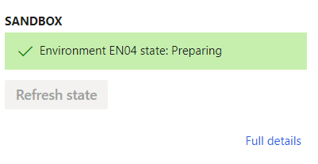
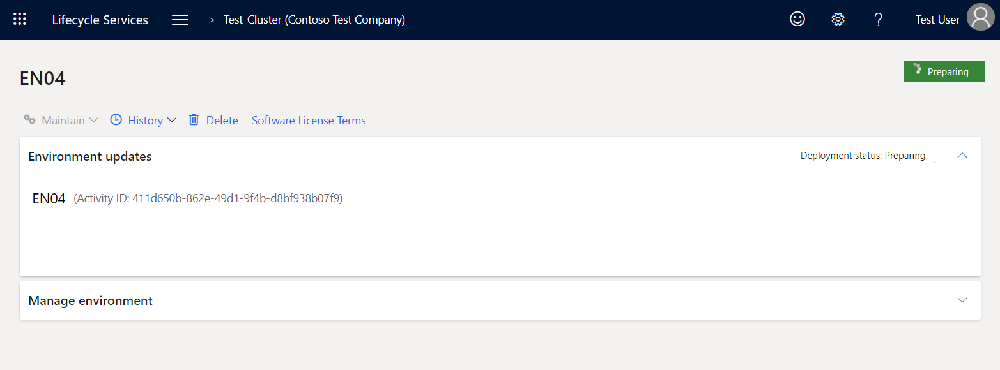
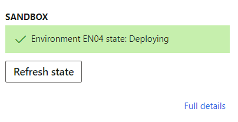
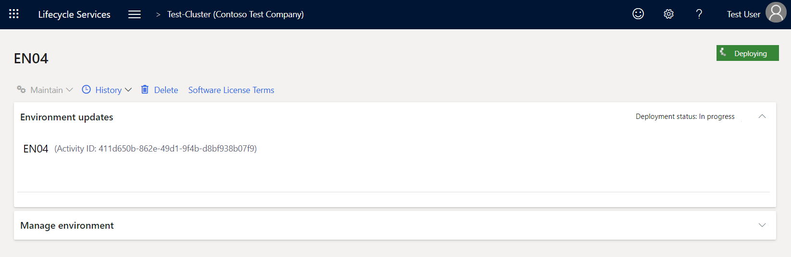
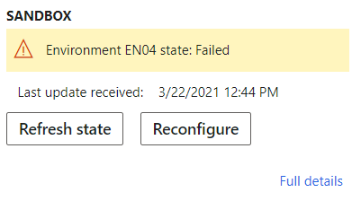
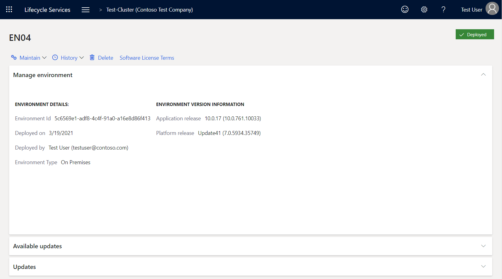

---
# required metadata

title: Set up and deploy on-premises environments (Platform update 41 through 55)
description: This article explains how to plan, set up, and deploy Microsoft Dynamics 365 Finance + Operations (on-premises) with Platform update 41 through 55.
author: faix
ms.date: 10/10/2022
ms.topic: article
ms.prod: dynamics-365 
ms.service:
ms.technology: 

# optional metadata

# ms.search.form: 
# ROBOTS: 
audience: Developer, IT Pro
# ms.devlang: 
ms.reviewer: sericks
# ms.tgt_pltfrm: 
ms.custom: 
ms.assetid: 
ms.search.region: Global
# ms.search.industry: 
ms.author: osfaixat
ms.search.validFrom: 2021-01-31 
ms.dyn365.ops.version: Platform update 41
search.app:
  - financeandoperationsonprem-docs
---

# Set up and deploy on-premises environments (Platform update 41 through 55)

[!include [banner](../includes/banner.md)]

This article explains how to plan, set up, and deploy Microsoft Dynamics 365 Finance + Operations (on-premises) with Platform update 41 through. Platform update 41 is available with version 10.0.17. Platform update 55 is available with version 10.0.31.

The [Local Business Data Yammer group](https://www.yammer.com/dynamicsaxfeedbackprograms/#/threads/inGroup?type=in_group&feedId=13595809&view=all) is available. There, you can post any questions or feedback that you have about the on-premises deployment.

## Finance + Operations components

The Finance + Operations application consists of three main components:

- Application Object Server (AOS)
- Business Intelligence (BI)
- Financial Reporting/Management Reporter

These components depend on the following system software:

- Microsoft Windows Server (Only English-language operating system installations are supported.)
- Microsoft SQL Server

    > [!IMPORTANT]
    > Full-Text Search must be enabled.

- SQL Server Reporting Services (SSRS)

    SSRS is deployed on BI virtual machines (VMs). The SSRS nodes should also have a Database Engine instance that is running locally.

- SQL Server Integration Services (SSIS)

    SSIS is deployed on AOS VMs.

- SQL Server Management Studio
- Standalone Microsoft Azure Service Fabric
- Microsoft Windows PowerShell 5.0 or later
- Active Directory Federation Services (AD FS) on Windows Server
- Domain controller

    > [!IMPORTANT]
    > The domain controller must be Microsoft Windows Server 2012 R2 or later, and it must have a domain functional level of 2012 R2 or more. For more information about domain functional levels, see the following topics:
    >
    > - [What Are Active Directory Functional Levels?](/previous-versions/windows/it-pro/windows-server-2003/cc787290(v=ws.10))
    > - [Understanding Active Directory Domain Services (AD DS) Functional Levels](/previous-versions/windows/it-pro/windows-server-2008-R2-and-2008/cc754918(v=ws.10))
    > - [Full 2-way trust](../../fin-ops/get-started/system-requirements-on-prem.md#full-2-way-trust)

- Optional but **highly** recommended: Active Directory Certificate Services (AD CS) on Windows Server

> [!IMPORTANT]
> For supported versions, see [Microsoft Dynamics 365 Finance + Operations (on-premises) supported software](./onprem-compatibility.md).

## LCS

Finance + Operations bits are distributed through Microsoft Dynamics Lifecycle Services (LCS). Before you can deploy, you must purchase license keys through the [Enterprise Agreements](https://www.microsoft.com/Licensing/licensing-programs/enterprise.aspx) channel and set up an on-premises project in LCS. Deployments can be initiated only through LCS. For more information about how to set up on-premises projects in LCS, see [Set up on-premises projects in Lifecycle Services (LCS)](../lifecycle-services/lbd-create-lcs-on-prem-project.md).

## Authentication

The on-premises application works with AD FS. To interact with LCS, you must also configure Azure Active Directory (Azure AD). To complete the deployment and configure the LCS local agent, you must have Azure AD. If you don't already have an Azure AD tenant, you can get one for free by using one of the options that Azure AD provides. For more information, see [Quickstart: Set up a tenant](/azure/active-directory/develop/active-directory-howto-tenant).

## Standalone Service Fabric

Finance + Operations uses standalone Service Fabric. For more information, see the [Service Fabric documentation](/azure/service-fabric/).

Setup of Finance + Operations will deploy a set of applications inside Service Fabric. During deployment, each node in the cluster will be defined through configuration so that it has one of the following node types:

- **AOSNodeType** – Nodes of this type host AOS (business logic).
- **OrchestratorType** – Nodes of this node type work as Service Fabric Primary nodes, and host deployment and servicing logic.
- **ReportServerType** – Nodes of this type host SSRS and reporting logic.
- **MRType** – Nodes of this type host Management Reporter logic.

## Infrastructure

Finance + Operations falls under the standard Microsoft support policy about operation on non-Microsoft virtualization platforms, specifically VMware. For more information, see [Support policy for Microsoft software that runs on non-Microsoft hardware virtualization software](https://support.microsoft.com/help/897615/support-policy-for-microsoft-software-that-runs-on-non-microsoft-hardw). In short, Microsoft supports its products in this environment. However, if Microsoft is asked to investigate an issue, we might first ask the customer to reproduce the issue without the virtualization platform or on the Microsoft virtualization platform.

If you're using VMware, you must implement the fixes that are documented on the following webpages:

- [After upgrading a virtual machine to hardware version 11, network dependent workloads experience performance degradation (2129176)](https://kb.vmware.com/s/article/2129176)
- [Several issues with vmxnet3 virtual adapter](https://vinfrastructure.it/2016/05/several-issues-vmxnet3-virtual-adapter)

> [!WARNING]
> Dynamics 365 Finance + Operations (on-premises) is not supported on any public cloud infrastructure, including Microsoft Azure Cloud services. However, it is supported to run on [Microsoft Azure Stack HCI](https://azure.microsoft.com/products/azure-stack/hci/) and [Microsoft Azure Stack Hub](https://azure.microsoft.com/products/azure-stack/hub/).

The hardware configuration includes the following components:

- A standalone Service Fabric cluster that is based on Windows Server VMs
- SQL Server (Both Clustered SQL and Always-On are supported.)
- AD FS for authentication
- Server Message Block (SMB) version 3 file share for storage
- Optional: Microsoft Office Server

For more information, see [System requirements for on-premises deployments](../../fin-ops/get-started/system-requirements-on-prem.md).

> [!IMPORTANT]
> For supported versions, see [Microsoft Dynamics 365 Finance + Operations (on-premises) supported software](./onprem-compatibility.md).

### Hardware layout

Plan your infrastructure and Service Fabric cluster, based on the recommended sizing in [Hardware sizing requirements for on-premises environments](../../fin-ops/get-started/hardware-sizing-on-premises-environments.md). For more information about how to plan the Service Fabric cluster, see [Plan and prepare your Service Fabric standalone cluster deployment](/azure/service-fabric/service-fabric-cluster-standalone-deployment-preparation).

The following table shows an example of a hardware layout. This example is used throughout this article to demonstrate the setup. When you complete the setup, you will have to replace the machine names and IP addresses that are provided in the following instructions with the names and IP addresses for the machines in your environment.

> [!NOTE]
> The Primary node of the Service Fabric cluster must have at least three nodes. In this example, **OrchestratorType** is designated as the Primary node type. If you have a node type that has more than three VMs, consider making that node type your Primary (Seed) node type to help increase the reliability of the cluster. 

| Machine purpose          | Service Fabric node type | Machine name    | IP address    |
|--------------------------|--------------------------|-----------------|---------------|
| Domain controller        |                          | LBDEN01DC1      | 10.179.108.2  |
| AD FS                    |                          | LBDEN01ADFS1    | 10.179.108.3  |
| File server              |                          | LBDEN01FS01     | 10.179.108.4  |
| SQL Always-On cluster    |                          | LBDEN01SQLA01   | 10.179.108.5  |
|                          |                          | LBDEN01SQLA02   | 10.179.108.6  |
|                          |                          | LBDEN01SQLA     | 10.179.108.9  |
| AOS 1                    | AOSNodeType              | LBDEN01SFAOS1   | 10.179.108.11 |
| AOS 2                    | AOSNodeType              | LBDEN01SFAOS2   | 10.179.108.12 |
| AOS 3                    | AOSNodeType              | LBDEN01SFAOS3   | 10.179.108.13 |
| Orchestrator 1           | OrchestratorType         | LBDEN01SFORCH1  | 10.179.108.21 |
| Orchestrator 2           | OrchestratorType         | LBDEN01SFORCH2  | 10.179.108.22 |
| Orchestrator 3           | OrchestratorType         | LBDEN01SFORCH3  | 10.179.108.23 |
| Management Reporter node | MRType                   | LBDEN01SFMR1    | 10.179.108.31 |
| SSRS node 1              | ReportServerType         | LBDEN01SFBI1    | 10.179.108.41 |
| Client                   |                          | LBDEN01CLIENT1  | 10.179.108.51 |


The following table shows an example of a hardware layout where batch execution and interactive sessions are run in dedicated nodes. For more information, see [Configure batch-only and interactive-only AOS nodes in on-premises deployments](./onprem-batchonly.md).

| Machine purpose          | Service Fabric node type   | Machine name    | IP address    |
|--------------------------|----------------------------|-----------------|---------------|
| Domain controller        |                            | LBDEN01DC1      | 10.179.108.2  |
| AD FS                    |                            | LBDEN01ADFS1    | 10.179.108.3  |
| File server              |                            | LBDEN01FS01     | 10.179.108.4  |
| SQL Always-On cluster    |                            | LBDEN01SQLA01   | 10.179.108.5  |
|                          |                            | LBDEN01SQLA02   | 10.179.108.6  |
|                          |                            | LBDEN01SQLA     | 10.179.108.9  |
| AOS 1                    | BatchOnlyAOSNodeType       | LBDEN01SFAOS1   | 10.179.108.11 |
| AOS 2                    | BatchOnlyAOSNodeType       | LBDEN01SFAOS2   | 10.179.108.12 |
| AOS 3                    | BatchOnlyAOSNodeType       | LBDEN01SFAOS3   | 10.179.108.13 |
| AOS 4                    | InteractiveOnlyAOSNodeType | LBDEN01SFAOS4   | 10.179.108.14 |
| AOS 5                    | InteractiveOnlyAOSNodeType | LBDEN01SFAOS5   | 10.179.108.15 |
| AOS 6                    | InteractiveOnlyAOSNodeType | LBDEN01SFAOS6   | 10.179.108.16 |
| Orchestrator 1           | OrchestratorType           | LBDEN01SFORCH1  | 10.179.108.21 |
| Orchestrator 2           | OrchestratorType           | LBDEN01SFORCH2  | 10.179.108.22 |
| Orchestrator 3           | OrchestratorType           | LBDEN01SFORCH3  | 10.179.108.23 |
| Management Reporter node | MRType                     | LBDEN01SFMR1    | 10.179.108.31 |
| SSRS node 1              | ReportServerType           | LBDEN01SFBI1    | 10.179.108.41 |
| Client                   |                            | LBDEN01CLIENT1  | 10.179.108.51 |


## Overview of the setup process

You must complete the following steps to set up the infrastructure for Finance + Operations. By reading all the steps before you begin, you can more easily plan your setup.

1. [Plan your domain name and DNS zones](#plandomain)
1. [Plan and acquire your certificates](#plancert)
1. [Plan your users and service accounts](#plansvcacct)
1. [Create DNS zones, and add A records](#createdns)
1. [Join VMs to the domain](#joindomain)
1. [Download setup scripts from LCS](#downloadscripts)
1. [Describe your configuration](#describeconfig)
1. [Set up file storage](#setupfile)
1. [Set up SQL Server](#setupsql)
1. [Configure certificates](#configurecert)
1. [Set up SSIS](#setupssis)
1. [Set up SSRS](#setupssrs)
1. [Set up VMs](#setupvms)
1. [Set up a standalone Service Fabric cluster](#setupsfcluster)
1. [Configure LCS connectivity for the tenant](#configurelcs)
1. [Configure the SQL Server certificate](#configuresqlcert)
1. [Configure the databases](#configuredb)
1. [Encrypt credentials](#encryptcred)
1. [Configure AD FS](#configureadfs)
1. [Configure a connector, and install an on-premises local agent](#configureconnector)
1. [Tear down CredSSP, if remoting was used](#teardowncredssp)
1. [Deploy your Finance + Operations environment from LCS](#deploy)
1. [Connect to your Finance + Operations environment](#connect)

## Setup

### Prerequisites

Before you start the setup, the following prerequisites must be in place. The setup of these prerequisites is out of the scope of this document.

- Active Directory Domain Services (AD DS) must be installed and configured in your network.
- AD FS must be deployed.
- SQL Server must be installed on the SSRS machines.
- SSRS must be installed (but not configured) in **Native** mode on the SSRS machines.
- Optional: AD CS is installed and configured in your network.

The following table shows the Microsoft Windows features that will be installed on the VMs by the infrastructure setup scripts that are downloaded from LCS. For details on additional prerequisite software that will need to be downloaded and installed see [Set up VMs](#setupvms).

| Node type | Component | Details |
|-----------|-----------|---------|
| AOS       | The Microsoft .NET Framework version 2.0–3.5 (CLR 2.0) | **Windows features:** NET-Framework-Features, NET-Framework-Core, NET-HTTP-Activation, NET-Non-HTTP-Activ |
| AOS       | The Microsoft .NET Framework version 4.0–4.6 (CLR 4.0) | **Windows features:** NET-Framework-45-Features, NET-Framework-45-Core, NET-Framework-45-ASPNET, NET-WCF-Services45, NET-WCF-TCP-PortSharing45 |
| AOS       | Microsoft Internet Information Services (IIS) | **Windows features:** WAS, WAS-Process-Model, WAS-NET-Environment, WAS-Config-APIs, Web-Server, Web-WebServer, Web-Security, Web-Filtering, Web-App-Dev, Web-Net-Ext, Web-Mgmt-Tools, Web-Mgmt-Console |
| BI        | The .NET Framework version 2.0–3.5 (CLR 2.0) | **Windows features:** NET-Framework-Features, NET-Framework-Core, NET-HTTP-Activation, NET-Non-HTTP-Activ |
| BI        | The .NET Framework version 4.0–4.6 (CLR 4.0) | **Windows features:** NET-Framework-45-Features, NET-Framework-45-Core, NET-Framework-45-ASPNET, NET-WCF-Services45, NET-WCF-TCP-PortSharing45 |
| MR        | The .NET Framework version 2.0–3.5 (CLR 2.0) | **Windows features:** NET-Framework-Features, NET-Framework-Core, NET-HTTP-Activation, NET-Non-HTTP-Activ |
| MR        | The .NET Framework version 4.0–4.6 (CLR 4.0) | **Windows features:** NET-Framework-45-Features, NET-Framework-45-Core, NET-Framework-45-ASPNET, NET-WCF-Services45, NET-WCF-TCP-PortSharing45 |

### <a name="plandomain"></a>Step 1. Plan your domain name and DNS zones

We recommend that you use a publicly registered domain name for your production installation of AOS. In that way, the installation can be accessed outside the network, if outside access is required.

For example, if your company's domain is contoso.com, your zone for Finance + Operations might be d365ffo.onprem.contoso.com, and the host names might be as follows:

- ax.d365ffo.onprem.contoso.com for AOS machines
- sf.d365ffo.onprem.contoso.com for the Service Fabric cluster

### <a name="plancert"></a>Step 2. Plan and acquire your certificates

Secure Sockets Layer (SSL) certificates are required to secure a Service Fabric cluster and all the applications that are deployed. For your production and sandbox workloads, we recommend that you acquire certificates from a certificate authority (CA) such as [DigiCert](https://www.digicert.com/ssl-certificate/), [Comodo](https://ssl.comodo.com/), [Symantec](https://www.websecurity.symantec.com/ssl-certificate), [GoDaddy](https://www.godaddy.com/web-security/ssl-certificate), or [GlobalSign](https://www.globalsign.com/en/ssl/). If your domain is set up with [AD CS](/previous-versions/windows/it-pro/windows-server-2008-R2-and-2008/cc772393(v=ws.10)), you can use the Microsoft setup scripts to create the templates and certificates. Each certificate must contain a private key that was created for key exchange, and it must be exportable to a Personal Information Exchange (.pfx) file.

Self-signed certificates can be used only for testing purposes. For the sake of convenience, the setup scripts that are provided in LCS include scripts that generate and export self-signed certificates. If you're using self-signed scripts, you will be instructed to run the creation scripts during later steps in this article. As has been mentioned, these certificates can be used only for testing purposes.

> [!IMPORTANT]
> Microsoft plans to discontinue support for the generation of self-signed certificates through the setup scripts, in favor of automatic certificate creation through AD CS.

#### General certificate settings

| Setting                  | Value           | Requirement |
|--------------------------|-----------------|-------------|
| Signature algorithm      | sha256RSA       | Recommended |
| Signature hash algorithm | sha256          | Recommended |
| Public key               | RSA (2048 bits) | Mandatory   |
| Thumbprint algorithm     | sha1            | Recommended |
| Cryptographic provider   | Microsoft Enhanced RSA and AES Cryptographic Provider | Mandatory (except for the encipherment certificate) |

#### Overview of required certificates

| Purpose                                      | Explanation | Additional requirements |
|----------------------------------------------|-------------|-------------------------|
| SQL Server SSL certificate                   | This certificate is used to encrypt data that is transmitted across a network between an instance of SQL Server and a client application. | <p>The domain name of the certificate should match the fully qualified domain name (FQDN) of the SQL Server instance or listener. For example, if the SQL listener is hosted on machine LBDEN01SQLA01, the certificate's Domain Name System (DNS) name is LBDEN01SQLA01.contoso.com.</p><ul><li>**Common name (CN):** LBDEN01SQLA01.contoso.com</li><li>**DNS name:** LBDEN01SQLA01.contoso.com</li></ul> |
| Service Fabric Server certificate            | This certificate is used to help secure the node-to-node communication between the Service Fabric nodes. It's also used as the server certificate that is presented to the client that connects to the cluster. | <p>For this certificate, you can also use the wildcard SSL certificate for your domain, such as \*.contoso.com. (For more information, see the text that follows this table.) Otherwise, use the following values:</p><ul><li>**CN:** sf.d365ffo.onprem.contoso.com</li><li>**DNS name:** sf.d365ffo.onprem.contoso.com</li></ul> |
| Service Fabric Client certificate            | Clients use this certificate to view and manage the Service Fabric cluster. | <ul><li>**CN:** client.d365ffo.onprem.contoso.com</li><li>**DNS name:** client.d365ffo.onprem.contoso.com</li></ul> |
| Encipherment certificate                     | This certificate is used to encrypt sensitive information such as the SQL Server password and user account passwords. | <p>The certificate must be created by using the **Microsoft Enhanced Cryptographic Provider v1.0** provider.</p><p>The certificate key usage must include Data Encipherment (10), and should not include server authentication or client authentication.</p><p>For more information, see [Managing secrets in Service Fabric applications](/azure/service-fabric/service-fabric-application-secret-management).</p><ul><li>**CN:** axdataenciphermentcert</li><li>**DNS name:** axdataenciphermentcert</li></ul> |
| AOS SSL certificate                          | <p>This certificate is used as the server certificate that is presented to the client for the AOS website. It's also used to enable Windows Communication Foundation (WCF)/Simple Object Access Protocol (SOAP) certificates.</p> | <p>You can use the same wildcard SSL certificate that you used as the Service Fabric server certificate. Otherwise, use the following values:</p><ul><li>**CN:** ax.d365ffo.onprem.contoso.com</li><li>**DNS name:** ax.d365ffo.onprem.contoso.com</li></ul> |
| Session Authentication certificate           | AOS uses this certificate to help secure a user's session information. | <p>This certificate is also the File Share certificate that will be used at the time of deployment from LCS.</p><ul><li>**CN:** SessionAuthentication</li><li>**DNS name:** SessionAuthentication </li></ul> |
| Data Encryption certificate                  | AOS uses this certificate to encrypt sensitive information. | <ul><li>**CN:** DataEncryption</li><li>**DNS name:** DataEncryption</li></ul> |
| Data Signing certificate                     | AOS uses this certificate to sign sensitive information. | <p>This certificate is separate from the Data Encryption certificate.</p><ul><li>**CN:** DataSigning</li><li>**DNS name:** DataSigning</li></ul> |
| Financial Reporting Client certificate       | This certificate is used to help secure the communication between the Financial Reporting services and AOS. | <ul><li>**CN:** FinancialReporting</li><li>**DNS name:** FinancialReporting</li></ul> |
| Reporting certificate                        | This certificate is used to help secure the communication between SSRS and AOS.| <p>**Important:** Do **not** reuse the Financial Reporting Client certificate.</p><ul><li>**CN:** ReportingService</li><li>**DNS name:** ReportingService</li></ul> |
| SSRS Web Server certificate                  | This certificate is used as the server certificate that is presented to the client (AOS) for the SSRS web server. | <p>The domain name of the certificate should match the FQDN of the SSRS node.</p><ul><li>**CN:** BI1.contoso.com</li><li>**DNS name:** BI1.contoso.com</li></ul>
| On-Premises local agent certificate           | <p>This certificate is used to help secure the communication between a local agent that is hosted on-premises and on LCS. It enables the local agent to act on behalf of your Azure AD tenant, and to communicate with LCS to orchestrate and monitor deployments.</p><p>**Note:** Only one on-premises local agent certificate is required for a tenant.</p> | <ul><li>**CN:** OnPremLocalAgent</li><li>**DNS name:** OnPremLocalAgent</li></ul> |

You can use the wildcard SSL certificate for your domain to combine the Service Fabric Server certificate and the AOS SSL certificate.

Here is an example of a Service Fabric Server certificate that is combined with an AOS SSL certificate.

#### Subject name

```Text
CN = *.d365ffo.onprem.contoso.com
```

#### Subject alternative names

```Text
DNS Name=ax.d365ffo.onprem.contoso.com
DNS Name=sf.d365ffo.onprem.contoso.com
DNS Name=*.d365ffo.onprem.contoso.com
```

> [!IMPORTANT]
> You can use the wildcard certificate to help secure only the first-level subdomain of the domain that it's issued to. Therefore, a certificate for \*.onprem.contoso.com won't be valid for ax.d365ffo.onprem.contoso.com.

### <a name="plansvcacct"></a>Step 3. Plan your users and service accounts

You must create several user or service accounts for Finance + Operations to work. You must create a combination of group managed service accounts (gMSAs), domain accounts, and SQL accounts. The following table shows the user accounts, their purpose, and example names that will be used in this article.

| User account                                            | Type | Purpose | User name |
|---------------------------------------------------------|------|---------|-----------|
| Financial Reporting Application Service Account         | gMSA | | Contoso\\svc-FRAS$ |
| Financial Reporting Process Service Account             | gMSA | | Contoso\\svc-FRPS$ |
| Financial Reporting Click Once Designer Service Account | gMSA | | Contoso\\svc-FRCO$ |
| AOS Service Account                                     | gMSA | You should create this user for future proofing. Microsoft plans to enable AOS to work with the gMSA in upcoming releases. By creating this user at the time of setup, you help to ensure a seamless transition to the gMSA.\* | Contoso\\svc-AXSF$ |
| SSRS bootstrapper Service Account                       | gMSA | The reporting service bootstrapper uses this account to configure the SSRS service. | Contoso\\svc-ReportSvc$ |
| AOS Service Account                                     | Domain account | AOS uses this user in the general availability (GA) release.\* | Contoso\\AXServiceUser |
| AOS SQL DB Admin user                                   | SQL user | Finance + Operations uses this user to authenticate with SQL\*\*. This user will also be replaced by the gMSA user in upcoming releases\*\*\*. | AXDBAdmin |
| Local Deployment Agent Service Account                  | gMSA | The local agent uses this account to orchestrate the deployment on various nodes. | Contoso\\Svc-LocalAgent$ |

\* These accounts should not have their regional settings changed. They should have the default EN-US region settings. 

\*\* If the password of the SQL user contains special characters, you might encounter issues during deployment.

\*\*\* The SQL user name and password for SQL authentication are secured because they are encrypted and stored in the file share.

### <a name="createdns"></a>Step 4. Create DNS zones and add A records

DNS is integrated with AD DS, and lets you organize, manage, and find resources in a network. The following procedures show how to create a DNS forward lookup zone and A records for the AOS host name and Service Fabric cluster. In this example, the DNS zone name is d365ffo.onprem.contoso.com, and the A records/host names are as follows:

- **ax**.d365ffo.onprem.contoso.com for AOS machines
- **sf**.d365ffo.onprem.contoso.com for the Service Fabric cluster

#### Add a DNS zone

1. Sign in to the domain controller machine, select **Start**. Then open DNS Manager by entering **dnsmgmt.msc** and selecting the **dnsmgmt (DNS)** application.
2. Right-click the domain controller name in the console tree, and then select **New Zone** \> **Next**.
3. Select **Primary Zone**.
4. Leave the **Store the zone in Active Directory (available only if the DNS Server is a writeable domain controller** checkbox selected, and then select **Next**.
5. Select **To all DNS Servers running on Domain Controllers in this domain: Contoso.com**, and then select **Next**.
6. Select **Forward Lookup Zone**, and then select **Next**.
7. Enter the zone name for your setup, and then select **Next**. For example, enter **d365ffo.onprem.contoso.com**.
8. Select **Do not allow dynamic updates**, and then select **Next**.
9. Select **Finish**.

#### Set up an A record for AOS

In the new DNS zone, for **each** Service Fabric cluster node of the **AOSNodeType** type, create one A record that is named ax.d365ffo.onprem.contoso.com. Don't create A records for the other node types.

1. Find the newly created zone under the **Forward Lookup Zones** folder in DNS Manager.
2. Select and hold (or right-click) the new zone, and then select **New Host**.
3. Enter the name and IP address of the Service Fabric node. (For example, enter **ax** as the name and **10.179.108.12** as the IP address.) Then select **Add Host**.
4. Leave both checkboxes cleared.
5. Repeat steps 1 through 4 for each additional AOS node.

#### Set up an A record for the orchestrator

In the new DNS zone, for **each** Service Fabric cluster node of the **OrchestratorType** type, create an A record that is named sf.d365ffo.onprem.contoso.com. Don't create A records for the other node types.

1. Select and hold (or right-click) the new zone, and then select **New Host**.
2. Enter the name and IP address of the Service Fabric node. (For example, enter **sf** as the name and **10.179.108.15** as the IP address.) Then select **Add Host**.
3. Leave both checkboxes cleared.
4. Repeat steps 1 through 3 for each additional orchestrator node.

### <a name="joindomain"></a>Step 5. Join VMs to the domain

Join each VM to the domain by completing the steps in [Join a Computer to a Domain](/windows-server/identity/ad-fs/deployment/join-a-computer-to-a-domain). Alternatively, use the following Windows PowerShell script.

```powershell
$domainName = Read-Host -Prompt 'Specify domain name (ex: contoso.com)'
Add-Computer -DomainName $domainName -Credential (Get-Credential -Message 'Enter domain credential')
```

> [!IMPORTANT]
> You must restart the VMs after you join them to the domain.

### <a name="downloadscripts"></a>Step 6. Download setup scripts from LCS

Microsoft has provided several scripts to help improve the setup experience. Follow these steps to download the setup scripts from LCS.

> [!IMPORTANT]
> The scripts must be run from a computer that is in the same domain as the on-premises infrastructure.

1. Sign in to [LCS](https://lcs.dynamics.com/v2).
2. On the dashboard, select the **Shared asset library** tile.
3. Select **Model** as the asset type, and then, in the grid, select the row for **Microsoft Dynamics 365 Finance + Operations (on-premises), Deployment scripts**.
4. Select **Versions**, and download the latest version of the zip file for the scripts.
5. After the zip file is downloaded, select and hold (or right-click) it, and then select **Properties**. In the **Properties** dialog box, select the **Unblock** checkbox.
6. Create a file share, and copy the zip file into it.
7. Unzip the files into a folder that is named **infrastructure**.

> [!IMPORTANT]
> It's important that you put the **Infrastructure** folder in a file share (for example, \\\\LBDEN01FS01\\Install). In this way, the scripts can be run on any machine without requiring that the folder be copied to each machine. 
> Make sure that all edits are made to the ConfigTemplate.xml file in this folder.

### <a name="describeconfig"></a>Step 7. Describe your configuration

The infrastructure setup scripts use the following configuration files to drive the setup:

- infrastructure\\ConfigTemplate.xml
- infrastructure\\D365FO-OP\\NodeTopologyDefinition.xml
- infrastructure\\D365FO-OP\\DatabaseTopologyDefinition.xml

> [!IMPORTANT]
> To ensure that the setup scripts work correctly, you must update these configuration files with the correct computer names, IP addresses, service accounts, and domain, based on the setup of your environment.

The infrastructure\\ConfigTemplate.xml configuration file describes the following details:

- The service accounts that are required for the application to work
- The certificates that are required to help secure communications
- The database configuration
- The Service Fabric cluster configuration
- The file shares that are required for the application to work
- The SQL cluster information 

    > [!IMPORTANT]
    > When you configure the Service Fabric cluster, make sure that there are three fault domains for the Primary node type (**OrchestratorType**). Also make sure that no more than one type of node is deployed on a single machine.

For each Service Fabric node type, the infrastructure\\D365FO-OP\\NodeTopologyDefinition.xml configuration file describes the following details:

- The mapping between each node type and the application, domain and service accounts, and certificates
- Whether User Account Control (UAC) is enabled
- The prerequisites for Windows features and system software
- Whether strong name validation should be enabled
- The list of firewall ports that should be opened
- Which permissions an account requires for a machine
- Whether the .NET Framework should be configured to use the operating system's default Transport Layer Security (TLS) protocol.
- Whether insecure TLS and SSL protocols should be disabled.
- Whether insecure TLS ciphers should be disabled.

For each database, the infrastructure\\D365FO-OP\\DatabaseTopologyDefinition.xml configuration file describes the following details:

- The database settings
- The mappings between users and roles

#### Create gMSA and domain user accounts

1. Open Windows PowerShell in elevated mode, change the directory to the **Infrastructure** folder in your file share, and run the following commands.

    > [!IMPORTANT]
    > These commands don't create an AxServiceUser domain user for you. You must create it yourself.

    ```powershell
    .\Create-GMSAAccounts.ps1 -ConfigurationFilePath .\ConfigTemplate.xml
    ```

1. If you must make changes to accounts or machines, update the **ConfigTemplate.xml** file in the **Infrastructure** folder in your file share, and then run the following command.

    ```powershell
    .\Create-GMSAAccounts.ps1 -ConfigurationFilePath .\ConfigTemplate.xml -Update
    ```

### <a name="setupfile"></a>Step 8. Set up file storage

You must set up the following SMB 3.0 file shares:

- A file share that stores user documents that are uploaded to AOS (for example, \\\\LBDEN01FS01\\aos-storage).
- A file share that stores the latest build and configuration files to orchestrate the deployment (for example, \\\\LBDEN01FS01\\agent).
- A file share that stores diagnostics information for the Service Fabric cluster (for example, \\\\LBDEN01FS01\\DiagnosticsStore).

    > [!WARNING]
    > Keep this file share path as short as possible, to avoid exceeding the maximum path length on the files that will be put in the share.

For information about how to enable SMB 3.0, see [SMB Security Enhancements](/previous-versions/windows/it-pro/windows-server-2012-R2-and-2012/dn551363(v=ws.11)#BKMK_disablesmb1).

> [!IMPORTANT]
> - Secure dialect negotiation can't detect or prevent downgrades from SMB 2.0 or 3.0 to SMB 1.0. Therefore, we strongly recommend that you disable the SMB 1.0 server. In this way, you can take advantage of the full capabilities of SMB encryption. For information about how to disable SMB 1.0, see [How to detect, enable and disable SMBv1, SMBv2, and SMBv3 in Windows](/windows-server/storage/file-server/troubleshoot/detect-enable-and-disable-smbv1-v2-v3#how-to-remove-smbv1).
> - To help ensure that your data is protected while it's at rest in your environment, you must enable BitLocker Drive Encryption on every machine. For information about how to enable BitLocker, see [BitLocker: How to deploy on Windows Server 2012 and later](/windows/security/information-protection/bitlocker/bitlocker-how-to-deploy-on-windows-server).

1. On the file share machine, run the following command.

    ```powershell
    Install-WindowsFeature -Name FS-FileServer -IncludeAllSubFeature -IncludeManagementTools
    ```

2. Set up the **\\\\LBDEN01FS01\\aos-storage** file share:

    1. In Server Manager, select **File and Storage Services** \> **Shares**.
    2. Select **Tasks** \> **New Share** to create a share. Name the new share **aos-storage**.
    3. Leave **Allow caching of share** selected.
    4. Select the **Encrypt data access** checkbox.
    5. Grant **Modify** permissions for every machine in the Service Fabric cluster except **OrchestratorType**.
    6. Grant **Modify** permissions for the gMSA user (**contoso\\svc-AXSF$**). If your AOS servers are running under a domain user, also add that domain user (**contoso\\AXServiceUser**).

    > [!NOTE]
    > To add machines, you might have to enable **Computers** under **Object Types**. To add service accounts, you might have to enable **Service Accounts** under **Object Types**.

3. Set up the **\\\\LBDEN01FS01\\agent** file share:

    1. In Server Manager, select **File and Storage Services** \> **Shares**.
    2. Select **Tasks** \> **New Share** to create a share. Name the new share **agent**.
    3. Grant **Full-Control** permissions to the gMSA user for the local deployment agent (**contoso\\svc-LocalAgent$**).

4. Optional: Set up the **\\\\LBDEN01FS01\\DiagnosticsStore** file share:

    1. In Server Manager, select **File and Storage Services** \> **Shares**.
    1. Select **Tasks** \> **New Share** to create a share. Name the new share **DiagnosticsStore**.
    1. Grant **Modify** permissions for every machine in the Service Fabric cluster.

### <a name="setupsql"></a>Step 9. Set up SQL Server

1. Install SQL Server with high availability, unless you're deploying in a sandbox environment, where one instance of SQL Server is sufficient. (Nevertheless, you might want to install SQL Server with high availability in sandbox environments to test high-availability scenarios.)

    > [!IMPORTANT]
    > Avoid using named instances. If you use named instances, you might encounter issues, because the documentation and scripts assume that default instances are used.
    >
    > You must enable the [SQL Server and Windows Authentication mode](/sql/database-engine/configure-windows/change-server-authentication-mode).

    You can install SQL Server with high availability either as SQL clusters that include a Storage Area Network (SAN) or in an Always-On configuration. Verify that the Database Engine, SSRS, Full-Text Search, and SQL Server Management Tools are already installed.

    > [!NOTE]
    > Make sure that Always-On is set up as described in [Select Initial Data Synchronization Page (Always On Availability Group Wizards)](/sql/database-engine/availability-groups/windows/select-initial-data-synchronization-page-always-on-availability-group-wizards), and follow the instructions in [To Prepare Secondary Databases Manually](/sql/database-engine/availability-groups/windows/select-initial-data-synchronization-page-always-on-availability-group-wizards#PrepareSecondaryDbs).

2. Run the SQL service as either a domain user or a gMSA.
3. In the **ConfigTemplate.xml** file, fill in the SQL cluster configuration. If you're creating a SQL cluster, specify the name of each machine together with the listener name of your availability group. If you're creating a single instance instead of a cluster, specify the name of the machine, but leave the listener name blank. If you don't want the scripts to generate a certificate for your SQL cluster/instance, set the **disabled** property to **true** for the certificate of the **SQLCert** type.

### <a name="configurecert"></a>Step 10. Configure certificates

1. Go to a machine where Remote Server Administration Tools are installed, or go to your domain controller.
1. Open PowerShell, and navigate to the file share that contains your **Infrastructure** folder.  
1. Generate certificates:

    1. If you must generate certificates, run the following commands. These commands create the certificate templates in AD CS, generate the certificates from the templates, put the certificates in the **LocalMachine\\My** certificate store on the machine, and update the thumbprints in the XML file.

        ```powershell
        # If you must create self-signed certs, set the generateSelfSignedCert attribute to true.
        #.\New-SelfSignedCertificates.ps1 -ConfigurationFilePath .\ConfigTemplate.xml

        .\New-ADCSCertificates.ps1 -ConfigurationFilePath .\ConfigTemplate.xml -CreateTemplates
        .\New-ADCSCertificates.ps1 -ConfigurationFilePath .\ConfigTemplate.xml
        ```

    1. If you must reuse any certificate and therefore don't have to generate the certificate, set the **generateADCSCert** tag to **false** in the **ConfigTemplate.xml** file.

3. If you're using SSL certificates that were previously generated, skip certificate generation, and update the thumbprints in the **ConfigTemplate.xml** file. The certificates can be installed in the **CurrentUser\\My** or **LocalMachine\\My** certificate stores. Additionally, their private keys must be exportable.

    > [!WARNING]
    > Because of a leading non-printable special character, the presence of which is difficult to determine, the Certificate Manager tool (certlm.msc) should not be used to copy thumbprints on Windows Server 2016. If the non-printable special character is present, you will receive the following error message: "X509 certificate not valid." To retrieve the thumbprints, see the results from Windows PowerShell commands, or run the following commands in Windows PowerShell.
    >
    > ```powershell
    > dir cert:\CurrentUser\My
    > dir cert:\LocalMachine\My
    > dir cert:\LocalMachine\Root
    > ```

4. In the **ProtectTo** tag for each certificate, specify a semicolon-separated list of Active Directory users or groups. Only users and groups that are specified in the **ProtectTo** tag will have the permissions to import the certificates that are exported by using the scripts. The scripts don't support passwords to help protect the exported certificates.
5. Export the certificates into .pfx files. As part of the export process, the following command will check that the correct cryptographic provider is set for your certificates. 

    ```powershell
    # Exports certificates into a directory VMs\<VMName>. All the certs will be written to the infrastructure\Certs folder.
    .\Export-Certificates.ps1 -ConfigurationFilePath .\ConfigTemplate.xml
    ```

### <a name="setupssis"></a>Step 11. Set up SSIS

To enable Data management and SSIS workloads, you must install SSIS on each AOS VM. Follow these steps on each AOS VM.

1. Verify that the machine has access to the SSIS installation, and open the **SSIS Setup** wizard.
2. On the **Feature Selection** page, in the **Features** pane, select the **Integration Services** and **SQL Client Connectivity SDK** checkboxes.
3. Complete the setup, and verify that the installation was successful.

For more information, see [Install Integration Services (SSIS)](/sql/integration-services/install-windows/install-integration-services).

### <a name="setupssrs"></a>Step 12. Set up SSRS

You can configure more than one SSRS node. For more information, see [Configuring High Availability for SSRS nodes](./onprem-SSRSHA.md).

1. Before you begin, make sure that the [prerequisites](#prerequisites) that are listed at the beginning of this article are in place.

    > [!IMPORTANT]
    > - You must install the Database Engine when you install SSRS.
    > - Do **not** configure the SSRS instance. The reporting service will automatically configure everything.
    > - Do **not** use named instances when you set up the database engine or the SSRS service.
    > - Environments that were deployed with a base topology older than Platform update 41, do not need to go through the following steps. In those environments, SSRS should be configured manually according to [Configure SQL Server Reporting Services for on-premises deployments](../analytics/configure-ssrs-on-premises.md).

1. For each BI node, follow these steps:

    1. Open Windows PowerShell in elevated mode, and navigate to the **Infrastructure** folder in your file share.
    1. Run the following commands.

        ```powershell
        .\Initialize-Database.ps1 -ConfigurationFilePath .\ConfigTemplate.xml -ComponentName BI
        .\Configure-Database.ps1 -ConfigurationFilePath .\ConfigTemplate.xml -ComponentName BI
        ```

        The Initialize-Database.ps1 script maps the gMSA to the following databases and roles.

        | User           | Database | Database role |
        |----------------|----------|---------------|
        | svc-ReportSvc$ | master   | db\_owner |
        | svc-ReportSvc$ | msdb     | db\_datareader, db\_datawriter, db\_securityadmin |

        The Configure-Database.ps1 script performs the following action:

        - Grant the **CREATE ANY DATABASE** permission to **\[contoso\\svc-ReportSvc$\]**.
    
    > [!NOTE]
    > These scripts will **not** configure SSRS. SSRS will get configured during deployment by the Service Fabric service (ReportingService) deployed to that node.
    > 
    > Instead, these scripts will grant the necessary permissions for the Service Fabric service (ReportingService) to carry out the necessary configuration.

### <a name="setupvms"></a>Step 13. Set up VMs

1.  Open Windows PowerShell in elevated mode, and navigate to the **Infrastructure** folder in your file share.

    ```powershell
    # Exports the script files to be executed on each VM into a directory VMs\<VMName>.
    # .\Export-Scripts.ps1 -ConfigurationFilePath .\ConfigTemplate.xml -D365FOVersion "10.0.17"
    .\Export-Scripts.ps1 -ConfigurationFilePath .\ConfigTemplate.xml -D365FOVersion "<Version of D365 that you will deploy>"
    ```

    > [!NOTE]
    > The scripts will install/require different versions according to the version of D365 Finance + Operations that you deploy. Specify the application version that you will deploy so that the scripts correctly configure your environment for the version you are deploying. If you will be deploying application 10.0.17 with platform update 41, you should specify 10.0.17 for the D365FOVersion parameter.

2. Download the following Microsoft Windows Installers (MSIs) into a file share that can be accessed by all VMs. For example, use the same file share where you put your **Infrastructure** folder.

    | Component | Download link | Expected file name | Required since | Not required after |
    |-----------|---------------|--------------------|----------------|--------------------|
    | SNAC – ODBC driver 13 | [ODBC Driver 13.1](/sql/connect/odbc/windows/release-notes-odbc-sql-server-windows#131) | msodbcsql.msi | 10.0.0 | Not applicable |
    | SNAC – ODBC driver 17.5.x | [ODBC Driver 17.5.2](/sql/connect/odbc/windows/release-notes-odbc-sql-server-windows#1752) | msodbcsql\_17\_5.msi | 10.0.17 | Not applicable |
    | SQL Server Management Studio 17.9.1 | [SSMS 17.9.1](/sql/ssms/release-notes-ssms#1791) | SSMS-Setup-ENU.exe | 10.0.0 | 10.0.30 |
    | SQL Server Management Studio 18.x | [SSMS 18.x](/sql/ssms/release-notes-ssms##current-ssms-release) | SSMS-Setup-18-ENU.exe | 10.0.31 | Not applicable |
    | Visual C++ Redistributable Packages for Microsoft Visual Studio 2013 | [Update for Visual C++ 2013 and Visual C++ Redistributable Package](https://support.microsoft.com/help/3179560) | vcredist\_x64.exe | 10.0.0 | Not applicable |
    | Microsoft Visual C++ 2015-2019 Redistributable | [Combined Visual C++](/cpp/windows/latest-supported-vc-redist#visual-studio-2015-2017-2019-and-2022) | vc\_redist.x64\_1519.exe | 10.0.17 | 10.0.30 |
    | Microsoft Visual C++ 2015-2022 Redistributable | [Combined Visual C++](/cpp/windows/latest-supported-vc-redist#visual-studio-2015-2017-2019-and-2022) | vc\_redist.x64\_1522.exe | 10.0.31 | Not applicable|
    | Access Database Engine 2010 Redistributable | [Microsoft Access Database Engine 2010 Redistributable](https://www.microsoft.com/download/details.aspx?id=13255) | AccessDatabaseEngine\_x64.exe | 10.0.0 | Not applicable |
    | The .NET Framework version 4.8 (CLR 4.0) | [.NET Framework 4.8 Offline Installer](https://dotnet.microsoft.com/download/thank-you/net48-offline) | ndp48-x86-x64-allos-enu.exe | 10.0.0 | Not applicable |
    | The .NET Framework version 4.7.2 (CLR 4.0) | [.NET Framework 4.7.2 Offline Installer](https://dotnet.microsoft.com/download/thank-you/net472-offline) | ndp472-x86-x64-allos-enu.exe | 10.0.0 | Not applicable |

> [!IMPORTANT]
> - Make sure that the Management Studio setup is in US English.
> - Make sure that the installer files have the names that are specified in the "Expected file name" column of the preceding table. Rename any files that don't have the expected name. Otherwise, you will encounter errors when you run the Configure-PreReqs.ps1 script.

Next, follow these steps for each VM, or use remoting from a single machine.

> [!NOTE]
> - The following procedure requires execution on multiple VMs. However, to simplify the process, you can use the remoting scripts that are provided. These scripts let you run the required scripts from a single machine, such as the same machine that is used to run the **.\\Export-Scripts.ps1** command. When the remoting scripts are available, they are declared after a **\# If Remoting** comment in the Windows PowerShell sections. If you use the remoting scripts, you might not have to run the remaining scripts in a section. In these cases, see the section text.
> - Remoting uses [WinRM](/windows/win32/winrm/portal). In some cases, it requires that [CredSSP](/windows/win32/secauthn/credential-security-support-provider) be enabled. The remoting module enables and disables CredSSP on an execution-by-execution basis. We recommend that you disable CredSSP when it isn't used. Otherwise, there is a risk of credential theft. When you've completed the setup, see the [Tear down CredSSP, if remoting was used](#teardowncredssp) section later in this article.

1. Copy the contents of each **infrastructure\\VMs\\\<VMName\>** folder to the corresponding VM. (If the remoting scripts are used, they will automatically copy the contents to the target VMs.) Then run the following command as an administrator.

    ```powershell
    # Install prereq software on the VMs.

    # If remoting, execute
    # .\Configure-PreReqs-AllVMs.ps1 -MSIFilePath <share folder path of the MSIs> -ConfigurationFilePath .\ConfigTemplate.xml

    .\Configure-PreReqs.ps1 -MSIFilePath <path of the MSIs>
    ```

    > [!IMPORTANT]
    > - Each time that you're prompted, restart the machine. Make sure that you rerun the **.\\Configure-PreReqs.ps1** command after each restart, until all the prerequisites are installed. In the case of remoting, rerun the AllVMs script when all the machines are back online.
    > - If you use the remoting scripts, make sure that the current user has access to the file share folder where the MSIs are located. Also make sure that no user is accessing machines of the **AOSNodeType**, **MRType**, and **ReportServerType** types. Otherwise, the remoting scripts will fail to restart the machines, because users are signed in to them.

2. Run the following command to complete the VM setup.

    ```powershell
    # If remoting, execute
    # .\Complete-PreReqs-AllVMs.ps1 -ConfigurationFilePath .\ConfigTemplate.xml

    .\Complete-PreReqs.ps1
    ```

3. Run the following command to validate the VM setup.

    ```powershell
    # If Remoting, execute
    # .\Test-D365FOConfiguration-AllVMs.ps1 -ConfigurationFilePath .\ConfigTemplate.xml

    .\Test-D365FOConfiguration.ps1 
    ```

> [!IMPORTANT]
> If you used remoting, be sure to run the cleanup steps after the setup is completed. For instructions, see the [Tear down CredSSP, if remoting was used](#teardowncredssp) section.

### <a name="setupsfcluster"></a>Step 14. Set up a standalone Service Fabric cluster

1. Download the [Service Fabric standalone installation package](https://go.microsoft.com/fwlink/?LinkId=730690) to one of your Service Fabric nodes.
2. After the zip file is downloaded, select and hold (or right-click) it, and then select **Properties**. In the **Properties** dialog box, select the **Unblock** checkbox.
3. Copy the zip file to one of the nodes in the Service Fabric cluster, and unzip it. Make sure that the **infrastructure** folder has access to this folder.
3. Go to the **infrastructure** folder, and run the following command to generate the Service Fabric **ClusterConfig.json** file.

    ```powershell
    .\New-SFClusterConfig.ps1 -ConfigurationFilePath .\ConfigTemplate.xml -TemplateConfig <ServiceFabricStandaloneInstallerPath>\ClusterConfig.X509.MultiMachine.json
    ```

4. You might have to make additional modifications to your cluster configuration, based on your environment. For more information, see [Step 1B: Create a multi-machine cluster](/azure/service-fabric/service-fabric-cluster-creation-for-windows-server#create-the-cluster), [Secure a standalone cluster on Windows using X.509 certificates](/azure/service-fabric/service-fabric-windows-cluster-x509-security), and [Create a standalone cluster running on Windows Server](/azure/service-fabric/service-fabric-cluster-creation-for-windows-server#create-the-cluster).
5. Copy the **ClusterConfig.json** file that is generated to **\<ServiceFabricStandaloneInstallerPath\>**.
6. Open Windows PowerShell in elevated mode, go to **\<ServiceFabricStandaloneInstallerPath\>**, and run the following command to test the **ClusterConfig.json** file.

    ```powershell
    .\TestConfiguration.ps1 -ClusterConfigFilePath .\clusterConfig.json
    ```

7. If the test is successful, run the following command to deploy the cluster.

    ```powershell
    # If using offline (internet-disconnected) install
    # .\CreateServiceFabricCluster.ps1 -ClusterConfigFilePath .\ClusterConfig.json -FabricRuntimePackagePath <Path to MicrosoftAzureServiceFabric.cab download>

    .\CreateServiceFabricCluster.ps1 -ClusterConfigFilePath .\ClusterConfig.json
    ```

8. After the cluster is created, open Service Fabric Explorer on any client machine, and validate the installation:

    1. Install the Service Fabric client certificate in the **CurrentUser\\My** certificate store if it isn't already installed.
    2. In Internet Explorer, select **Tools** (the gear symbol), and then select **Compatibility View settings**. Clear the **Display intranet sites in Compatibility View** checkbox.
    3. Go to `https://sf.d365ffo.onprem.contoso.com:19080`, where **sf.d365ffo.onprem.contoso.com** is the host name of the Service Fabric cluster that is specified in the zone. If DNS name resolution isn't configured, use the IP address of the machine.
    4. Select the client certificate. The **Service Fabric Explorer** page appears.
    5. Verify that all nodes appear as green.

    > [!IMPORTANT]
    > - If your client machine is a server machine (for example, a machine that is running Windows Server 2019), you must turn off the Internet Explorer Enhanced Security Configuration when you access the **Service Fabric Explorer** page.
    > - If any antivirus software is installed, make sure that you set exclusion. Follow the guidance in the [Service Fabric](/azure/service-fabric/service-fabric-cluster-standalone-deployment-preparation#environment-setup) documentation.

### <a name="configurelcs"></a>Step 15. Configure LCS connectivity for the tenant

An on-premises local agent is used to orchestrate deployment and servicing of Finance + Operations through LCS. To establish connectivity from LCS to the Finance + Operations tenant, you must configure a certificate that enables the local agent to act on behalf of your Azure AD tenant (for example, contoso.onmicrosoft.com).

Use the on-premises agent certificate that you acquired from a CA or the self-signed certificate that you generated by using scripts. The on-premises agent certificate can be reused across multiple sandbox and production environments per tenant.

Only user accounts that have the Global Administrator directory role can add certificates to authorize LCS. By default, the person who signs up for Microsoft 365 for your organization is the global administrator for the directory.

> [!IMPORTANT]
> - You must configure the certificate exactly **one** time per tenant. All on-premises environments under the same tenant must use the same certificate to connect with LCS.
> - If you run the script below on a server machine (for example, a machine that is running Windows Server 2019), you must temporarily turn off the Internet Explorer Enhanced Security Configuration. Otherwise, the content on the Azure sign-in page will be blocked.

1. Sign in to the customer's [Azure portal](https://portal.azure.com) to verify that you have the Global Administrator directory role.
2. From the **infrastructure** folder, run the following commands to determine whether the certificate is already registered.

    ```powershell
    # If you have issues downloading the Azure PowerShell Az module, run the following:
    # [Net.ServicePointManager]::SecurityProtocol = [Net.SecurityProtocolType]::Tls12

    Install-Module Az -RequiredVersion 7.4.0
    .\Add-CertToServicePrincipal.ps1 -CertificateThumbprint 'OnPremLocalAgent Certificate Thumbprint' -Test
    ```

    > [!IMPORTANT]
    > If you previously installed AzureRM, you should remove it, because it might not be compatible with any existing AzureRM installations in Windows PowerShell 5.1. For more information, see [Migrate Azure PowerShell from AzureRM to Az](/powershell/azure/migrate-from-azurerm-to-az).

3. If the script indicates that the certificate isn't registered, run the following command.

    ```powershell
    .\Add-CertToServicePrincipal.ps1 -CertificateThumbprint 'OnPremLocalAgent Certificate Thumbprint'
    ```

> [!NOTE]
> If you have multiple tenants that are associated with the login account, you can run the following command to pass the tenant ID as a parameter. In this way, you can ensure that the context is set to the correct tenant.
>
> ```powershell
> .\Add-CertToServicePrincipal.ps1 -CertificateThumbprint 'OnPremLocalAgent Certificate Thumbprint' -TenantId 'xxxx-xxxx-xxxx-xxxx'
> ```

### <a name="configuresqlcert"></a>Step 16. Configure the SQL Server certificate

Get an SSL certificate from a CA to configure SQL Server for Finance + Operations. By default, an AD CS or self-signed certificate was generated by a previous step.

> [!NOTE]
> If you're ordering the certificate from a public CA, ensure that the Subject Alternative Name of the certificate matches the FQDN of each node/instance in the SQL availability group.

#### Use a script to deploy certificates for an Always-On SQL availability group or instance

The following script automates the steps of the manual process that is described in the next section. If you aren't using remoting, connect to a SQL machine, and open PowerShell with administrator privileges. Then navigate to the **infrastructure** folder in your file share, and run the following command. Complete these steps for each node.

```powershell
# If Remoting, execute
#.\Configure-SQLCert-AllVMs.ps1 -ConfigurationFilePath .\ConfigTemplate.xml

.\Configure-SQLCert.ps1 -PfxCertificatePath ".\Certs\SQL1.contoso.com.pfx"
```

You can verify that everything has been configured correctly by running the following command.

```powershell
# If Remoting, execute
#.\Configure-SQLCert-AllVMs.ps1 -ConfigurationFilePath .\ConfigTemplate.xml -Test

.\Configure-SQLCert.ps1 -PfxCertificatePath ".\Certs\SQL1.contoso.com.pfx" -Test
```

#### Manually configure the certificate for an Always-On SQL availability group or instance

1. The **infrastructurescripts** folder should include a folder that is named **Certs**. In this folder, find the .pfx file that has your certificate.

1. For each node of the SQL cluster, follow these steps:

    1. Copy the generated .pfx file to the node, and import the certificate into the **LocalMachine** store.

    1. Grant certificate permissions to the account that is used to run the SQL service:

        1. Open the Certificate Manager tool (**certlm.msc**).
        2. Select and hold (or right-click) the certificate that was created, and then select **Tasks** \> **Manage Private Keys**.
        3. Add the SQL Server service account, and grant it **Read** access.

    1. Enable **ForceEncryption** and the new certificate in SQL Server Configuration Manager:

        1. Open SQL Server Configuration Manager, expand **SQL Server Network Configuration**, select and hold (or right-click) **Protocols for \[server instance\]**, and then select **Properties**.
        2. In the **Properties** dialog box, on the **Certificate** tab, in the **Certificate** field, select the desired certificate.
        3. On the **Flags** tab, in the **ForceEncryption** box, select **Yes**.
        4. Select **OK** to save your changes.

    1. Restart the SQL service.

1. If you used self-signed certificates, export the certificate (.cer file), and install it in the trusted root of each Service Fabric node. You will have only one certificate for all the nodes in your SQL cluster.

> [!NOTE] 
> For more information, see [How to enable SSL encryption for an instance of SQL Server by using Microsoft Management Console](https://support.microsoft.com/help/316898/how-to-enable-ssl-encryption-for-an-instance-of-sql-server-by-using-microsoft-management-console).

> [!IMPORTANT]
> If you used remoting, be sure to run the cleanup steps after the setup is completed. For instructions, see the [Tear down CredSSP, if remoting was used](#teardowncredssp) section.

### <a name="configuredb"></a>Step 17. Configure the databases

1. Sign in to [LCS](https://lcs.dynamics.com/v2).
1. On the dashboard, select the **Shared asset library** tile.
1. Select **Model** as the asset type. Then, in the grid, select the data type for the release that you want, and download the zip file.

    | Release | Database |
    |---------|----------|
    | Version 10.0.29 | Microsoft Dynamics 365 Finance + Operations (on-premises), Version 10.0.29 Demo Data |
    | Version 10.0.29 | Microsoft Dynamics 365 Finance + Operations (on-premises), Version 10.0.29 Empty Data |
    | Version 10.0.26 (with Platform update 50) | Microsoft Dynamics 365 Finance + Operations (on-premises), Version 10.0.26 Demo Data |
    | Version 10.0.26 (with Platform update 50) | Microsoft Dynamics 365 Finance + Operations (on-premises), Version 10.0.26 Empty Data |
    | Version 10.0.23 (with Platform update 47) | Microsoft Dynamics 365 Finance + Operations (on-premises), Version 10.0.23 Demo Data |
    | Version 10.0.23 (with Platform update 47) | Microsoft Dynamics 365 Finance + Operations (on-premises), Version 10.0.23 Empty Data |
    | Version 10.0.21 (with Platform update 45) | Microsoft Dynamics 365 Finance + Operations (on-premises), Version 10.0.21 Demo Data |
    | Version 10.0.21 (with Platform update 45) | Microsoft Dynamics 365 Finance + Operations (on-premises), Version 10.0.21 Empty Data |
    | Version 10.0.20 (with Platform update 44) | Microsoft Dynamics 365 Finance + Operations (on-premises), Version 10.0.20 Demo Data |
    | Version 10.0.20 (with Platform update 44) | Microsoft Dynamics 365 Finance + Operations (on-premises), Version 10.0.20 Empty Data |
    | Version 10.0.17 (with Platform update 41) | Microsoft Dynamics 365 Finance + Operations (on-premises), Version 10.0.17 Demo Data |
    | Version 10.0.17 (with Platform update 41) | Microsoft Dynamics 365 Finance + Operations (on-premises), Version 10.0.17 Empty Data |

1. The zip file contains a single backup (.bak) file. Select the file to download, based on your requirements.
1. After the zip file is downloaded, verify that it's unblocked. Select and hold (or right-click) the file, and then select **Properties**. In the **Properties** dialog box, select the **Unblock** checkbox.
1. Make sure that the database section in the **infrastructure\\ConfigTempate.xml** file is correctly configured with the following information:

    - The database name.
    - The database file and log settings. The database settings should not be lower than the default values that are specified.
    - The path of the backup file that you downloaded earlier. The default name of the Finance + Operations database is **AXDB**.

    > [!IMPORTANT]
    > - The user who is running the SQL service and the user who is running the scripts should have **Read** access on the folder or share where the backup file is located.
    > - If an existing database already has the same name, it won't be overwritten.

1. Connect to a machine in your SQL cluster. Then open Windows PowerShell in elevated mode, and navigate to the **Infrastructure** folder in your file share.

#### Configure the OrchestratorData database

- Run the following command.

    ```powershell
    .\Initialize-Database.ps1 -ConfigurationFilePath .\ConfigTemplate.xml -ComponentName Orchestrator
    ```

    The Initialize-Database.ps1 script performs the following actions:

    1. Create an empty database that is named **OrchestratorData**. This database is used by the on-premises local agent to orchestrate deployments.
    1. Grant **db\_owner** permissions on the database to the local agent gMSA (**svc-LocalAgent$**).

#### Configure the Finance + Operations database

1. Run the following commands.

    ```powershell
    .\Initialize-Database.ps1 -ConfigurationFilePath .\ConfigTemplate.xml -ComponentName AOS
    .\Configure-Database.ps1 -ConfigurationFilePath .\ConfigTemplate.xml -ComponentName AOS
    ```

    The Initialize-Database.ps1 script performs the following actions:

    1. Restore the database from the specified backup file.
    2. Create a new user that SQL authentication is enabled for (**axdbadmin**).
    3. Map users to database roles, based on the following table for the **AXDB** database.

        | User            | Type    | Database role |
        |-----------------|---------|---------------|
        | svc-AXSF$       | gMSA    | db\_owner     |
        | svc-LocalAgent$ | gMSA    | db\_owner     |
        | svc-FRPS$       | gMSA    | db\_owner     |
        | svc-FRAS$       | gMSA    | db\_owner     |
        | axdbadmin       | SqlUser | db\_owner     |

    4. Map users to database roles, based on the following table for the **TempDB** database.

        | User      | Type    | Database role |
        |-----------|---------|---------------|
        | svc-AXSF$ | gMSA    | db\_datareader, db\_datawriter, db\_ddladmin |
        | axdbadmin | SqlUser | db\_datareader, db\_datawriter, db\_ddladmin |

    The Configure-Database.ps1 script performs the following actions:

    1. Set **READ\_COMMITTED\_SNAPSHOT** to **ON**.
    2. Set **ALLOW\_SNAPSHOT\_ISOLATION** to **ON**.
    3. Set the specified database file and log settings.
    4. Grant the **VIEW SERVER STATE** permission to **axdbadmin**.
    5. Grant the **ALTER ANY EVENT SESSION** permission to **axdbadmin**.
    6. Grant the **VIEW SERVER STATE** permission to **\[contoso\\svc-AXSF$\]**.
    7. Grant the **ALTER ANY EVENT SESSION** permission to **\[contoso\\svc-AXSF$\]**.

2. Run the following command to reset the database users.

    ```powershell
    .\Reset-DatabaseUsers.ps1 -DatabaseServer '<FQDN of the SQL server>' -DatabaseName '<AX database name>'
    ```

#### Configure the Financial Reporting database

- Run the following command.

    ```powershell
    .\Initialize-Database.ps1 -ConfigurationFilePath .\ConfigTemplate.xml -ComponentName MR
    ```

    The Initialize-Database.ps1 script performs the following actions:

    1. Create an empty database that is named **FinancialReporting**.
    2. Map the users to database roles, based on the following table.

        | User            | Type | Database role |
        |-----------------|------|---------------|
        | svc-LocalAgent$ | gMSA | db\_owner     |
        | svc-FRPS$       | gMSA | db\_owner     |
        | svc-FRAS$       | gMSA | db\_owner     |

### <a name="encryptcred"></a>Step 18. Encrypt credentials

1. Copy your infrastructure folder to an AOS node.
2. Create the **Credentials.json** file by running the following command.

    ```powershell
    .\Configure-CredentialsJson.ps1 -ConfigurationFilePath .\ConfigTemplate.xml -Action Create
    ```

    The script will prompt you to enter several credentials:

    - **AccountPassword** – The encrypted domain user password for the AOS domain user (**contoso\\axserviceuser**). If you're deploying by using a recent base deployment where a gMSA account is used instead of the domain user, this prompt will be skipped. However, the script will create a placeholder value, because the installers will still look for it. Microsoft will address this issue in a future update.
    - **SqlUser** – The encrypted SQL user (**axdbadmin**) that has access to the Finance + Operations database (**AXDB**).
    - **SqlPassword** – The encrypted SQL password.
    
    > [!NOTE]
    > The script will automatically put the Credentials.json file in the SMB file share (**\\\\AX7SQLAOFILE1\\agent\\Credentials\\Credentials.json**).
    >
    > The script will request the credentials that are required for the Entity Store feature, but this request can be skipped. For more information, see [PowerBI.com integration with on-premises environments](../analytics/entity-store-on-prem.md).

### <a name="configureadfs"></a>Step 19. Configure AD FS

Before you can complete this procedure, AD FS must be deployed on Windows Server. For information about how to deploy AD FS, see [Deployment Guide Windows Server 2016 and 2012 R2 AD FS Deployment Guide](/windows-server/identity/ad-fs/deployment/windows-server-2012-r2-ad-fs-deployment-guide).

Finance + Operations requires additional configuration of AD FS, beyond the default out-of-box configuration. The following Windows PowerShell commands must be run on the machine where the AD FS role service is installed. The user account must have enough permissions to administer AD FS. For example, the user must have a domain administrator account. For complex AD FS scenarios, consult your domain administrator.

1. Configure the AD FS identifier so that it matches the AD FS token issuer.

    This command is related to adding new users by using the **Import users** option on the **Users** page (**System administration** \> **Users** \> **Users**) in the Finance + Operations client.

    ```PowerShell
    $adfsProperties = Get-AdfsProperties
    Set-AdfsProperties -Identifier $adfsProperties.IdTokenIssuer
    ```

    > [!WARNING]
    > If your AD FS is set up to work with Microsoft 365 (formerly Office 365) for single sign-on, this step will break that scenario. Don't run the preceding command if you will use the AD FS Microsoft 365 compatibility deployment option.
    >
    > To ensure that the scenario continues to work, you can specify a deployment option to adapt your Dynamics 365 for Finance + Operations installation to that requirement. For more information, see [AD FS Microsoft 365 compatibility](./onprem-adfscompatibility.md).

2. You should disable Windows Integrated Authentication (WIA) for intranet authentication connections, unless you've configured AD FS for mixed environments. For more information about how to configure WIA so that it can be used with AD FS, see [Configure browsers to use Windows Integrated Authentication (WIA) with AD FS](/windows-server/identity/ad-fs/operations/configure-ad-fs-browser-wia).

    This command is related to using forms authentication upon sign-in to the Finance + Operations client. Other options, such as single sign-on, are not supported.

    ```powershell
    Set-AdfsGlobalAuthenticationPolicy -PrimaryIntranetAuthenticationProvider FormsAuthentication, MicrosoftPassportAuthentication
    ```

3. For sign-in, the user's email address must be acceptable authentication input.

    This command is related to setting up email claims. Other options, such as transformation rules, might be available but require additional setup.

    ```powershell
    Add-Type -AssemblyName System.Net
    $fqdn = ([System.Net.Dns]::GetHostEntry('localhost').HostName).ToLower()
    $domainName = $fqdn.Substring($fqdn.IndexOf('.')+1)
    Set-AdfsClaimsProviderTrust -TargetIdentifier 'AD AUTHORITY' -AlternateLoginID mail -LookupForests $domainName
    ```

4. To be able to sign in through the Office add-ins, Cross Origin Resource Sharing (CORS) headers need to be enabled.

    ```powershell
    Set-AdfsResponseHeaders -EnableCORS $true
    Set-AdfsResponseHeaders -CORSTrustedOrigins https://az689774.vo.msecnd.net
    ```

    > [!NOTE]
    > These commands can only be run on an AD FS server running Windows Server 2019 or later. AD FS on Windows Server 2016 has been deprecated. For more information see [Microsoft Dynamics 365 Finance + Operations (on-premises) supported software](onprem-compatibility.md#active-directory-federation-services-ad-fs).

5. Restart the AD FS service so that the settings are applied correctly.

Before AD FS can trust Finance + Operations for the exchange of authentication, various application entries must be registered under an AD FS application group in AD FS. To speed up the setup process and help reduce errors, you can use the Publish-ADFSApplicationGroup.ps1 script for registration. Run the script by using a user account that has enough permissions to administer AD FS. (For example, use an administrator account.)

For more information about how to use the script, see the documentation that is listed in the script. Make a note of the client IDs that are specified in the output, because you will need this information in LCS later. If you lose the client IDs, sign in to the machine where AD FS is installed, open Server Manager, and go to **Tools** \> **AD FS Management** \> **Application Groups** \> **Microsoft Dynamics 365 for Operations On-premises**. You can find the client IDs under the native applications.

> [!NOTE]
> If you want to reuse your previously configured AD FS server for additional environments, see [Reuse the same AD FS instance for multiple environments](./onprem-reuseadfs.md).

Connect to a server that is hosting your AD FS instance/farm, open PowerShell with administrator privileges, and navigate to the **Infrastructure** folder in your file share. Then run the following command.

```powershell
# Host URL is your DNS record\host name for accessing the AOS
.\Publish-ADFSApplicationGroup.ps1 -HostUrl 'https://ax.d365ffo.onprem.contoso.com'
```


Finally, verify that you can access the AD FS OpenID configuration URL on a Service Fabric node of the **AOSNodeType** type. To do this check, try to open `https://<adfs-dns-name>/adfs/.well-known/openid-configuration` in a web browser. If you receive a message that states that the site isn't secure, you haven't added your AD FS SSL certificate to the Trusted Root Certification Authorities store. This step is described in the AD FS deployment guide. If you're using remoting, you can run the following command to install the certificate on all nodes in the Service Fabric cluster.

```powershell
# If remoting, execute
.\Install-ADFSCert-AllVMs.ps1 -ConfigurationFilePath .\ConfigTemplate.xml
```

If you can access the URL, a JavaScript Object Notation (JSON) file is returned. This file contains your AD FS configuration, and it will indicate that your AD FS URL is trusted.

You've now completed the setup of the infrastructure. The following sections describe how to set up your connector and deploy your Finance + Operations environment in LCS.

### <a name="configureconnector"></a>Step 20. Configure a connector and install an on-premises local agent

1. Sign in to [LCS](https://lcs.dynamics.com/), and open your on-premises implementation project.
2. Select the Menu button (sometimes referred to as the hamburger or the hamburger button), and then select **Project settings**.
3. Select **On-premises connectors**.
4. Select **Add** to create a new on-premises connector. 
5. On the **1: Setup host infrastructure** tab, select **Download agent installer**.
6. After the zip file is downloaded, verify that it's unblocked. Select and hold (or right-click) the file, and then select **Properties**. In the **Properties** dialog box, select the **Unblock** checkbox.
7. Unzip the agent installer on one of the Service Fabric nodes of the **OrchestratorType** type.
8. After the file is unzipped, go back to your on-premises connector in LCS.
9. On the **2: Configure agent** tab, select **Enter configuration**, and enter the configuration settings. To get the required values, run the following command on any machine that has the **infrastructure** folder and up-to-date configuration files.

    ```powershell
    .\Get-AgentConfiguration.ps1 -ConfigurationFilePath .\ConfigTemplate.xml
    ```

    > [!NOTE]
    > Make sure that you select the correct SQL Server version for your installation, either version 2016 or 2019.

10. Save the configuration, and then select **Download configurations** to download the **localagent-config.json** configuration file.
11. Copy the **localagent-config.json** file to the machine where the agent installer package is located.
12. The local agent has some additional, optional configurations that can be set to specify environment-specific setup/requirements. For information about the additional options, see [Deployment configurations for the local agent](./onprem-localagent-options.md). 
13. In a **Command Prompt** window, go to the folder that contains the agent installer, and run the following command.

    ```powershell
    LocalAgentCLI.exe Install <path of config.json>
    ```

    > [!NOTE]
    > The user who runs this command must have **db\_owner** permissions on the OrchestratorData database.

14. After the local agent is successfully installed, go back to your on-premises connector in LCS.
15. On the **3: Validate setup** tab, select **Message agent** to test for LCS connectivity to your local agent. When a connection is successfully established, you will receive the following message: "Validation complete. Agent connection established."

### <a name="teardowncredssp"></a>Step 21. Tear down CredSSP, if remoting was used

If you used any of the remoting scripts during setup, be sure to run the following command during breaks in the setup process, or after the setup is completed.

```powershell
.\Disable-CredSSP-AllVMs.ps1 -ConfigurationFilePath .\ConfigTemplate.xml
```

If the previous remoting Windows PowerShell window was accidentally closed, and CredSSP was left enabled, this command disables it on all the machines that are specified in the configuration file.

### <a name="deploy"></a>Step 22. Deploy your Finance + Operations environment from LCS

1. In LCS, open your on-premises implementation project.
2. Go to **Environment** \> **Sandbox**, and select **Configure**. To get the required values, run the following command on the primary domain controller VM. That VM must have access to ADFS and the DNS server settings.

    ```powershell
    .\Get-DeploymentSettings.ps1 -ConfigurationFilePath .\ConfigTemplate.xml
    ```

3. For new deployments, select your environment topology, and then complete the wizard to start your deployment.

    During the preparation phase, LCS assembles the Service Fabric application packages for your environment. It then sends a message to the local agent to start deployment. You should notice that the environment state is **Preparing**.

    

4. Select **Full details** to open the environment details page. Notice that the upper-right corner of the page shows the environment status as **Preparing**.

    

    The local agent picks up the deployment request, starts the deployment, and communicates back to LCS when the environment is ready. When deployment is started, you should notice that the environment state is changed to **Deploying**.

    

5. Select **Full details** to open the environment details page. Notice that the upper-right corner of the page shows the environment status as **Deploying**.

    

6. If the deployment fails, the environment state is changed to **Failed**, and the **Reconfigure** button becomes available for the environment. Fix the underlying issue, select **Reconfigure**, update any configuration changes, and then select **Deploy** to retry the deployment.

    

    For information about how to reconfigure an environment, see [Reconfigure environments to take a new platform or topology](../lifecycle-services/reconfigure-environment.md).

The following illustration shows a successful deployment. Notice that the upper-right corner of the page shows the environment status as **Deployed**.



### <a name="connect"></a>Step 23. Connect to your Finance + Operations environment

- In a web browser, go to `https://[yourD365FOdomain]/namespaces/AXSF`, where **yourD365FOdomain** is the domain name that you defined in the [Step 1. Plan your domain name and DNS zones](#plandomain) section earlier in this article.

## Known issues

### When you run the .\Create-GMSAAccounts.ps1 script, you receive the following error message: "Key does not exist" 

If you're creating and generating gMSA passwords in your domain for the first time, you must first create the Key Distribution Services KDS Root Key. For more information, see [Create the Key Distribution Services KDS Root Key](/windows-server/security/group-managed-service-accounts/create-the-key-distribution-services-kds-root-key).

### When you run the remoting script Configure-Prereqs-AllVms cmdlet, you receive the following error message: "The WinRM client cannot process the request"

Follow the instructions in the error message to enable the **Allow delegation fresh credentials** computer policy on all machines of the Service Fabric cluster.

### When you Configure-Prereqs on servers of the MRType and ReportServerType types, you receive the following error message: "Install-WindowsFeature: The request to add or remove features on the specified server failed" 

The .NET Framework version 3.5 is required on servers of the **MRType** and **ReportServerType** types. However, by default, source files for the .NET Framework version 3.5 aren't included in Windows Server 2016 installations. To work around the error, install the .NET Framework version 3.5. When you use Server Manager to manually add new features, specify the source files by using the **source** option.

### When you run the Publish-ADFSApplicationGroup cmdlet, you receive the following error message: "MSIS7628: Scope names should be a valid Scope description name in AD FS configuration"

This error occurs because an OpenID **allatclaims** scope that D365FO-OP-ADFSApplicationGroup requires might be missing in some Windows Server 2016 installations. To work around the error, open Server Manager, go to **Tools** /> **AD FS Management** /> **Service** /> **Scope Descriptions**, and add the **allatclaims** scope description.

### When you run the Publish-ADFSApplicationGroup cmdlet, you receive the following error message: "ADMIN0077: Access control policy does not exist: Permit everyone"

If AD FS is installed with a non-English version of Windows Server 2016, the **Permit everyone** access control policy is created in the local language. Invoke the cmdlet in the following way to specify the **AccessControlPolicyName** parameter.

```powershell
.\Publish-ADFSApplicationGroup.ps1 -HostUrl 'https://ax.d365ffo.onprem.contoso.com' -AccessControlPolicyName '<Permit everyone access control policy in your language>'
```

## Additional resources

- [Apply updates to on-premises deployments](apply-updates-on-premises.md)
- [Redeploy on-premises environments](redeploy-on-prem.md)
- [Configure document management](../../fin-ops/organization-administration/configure-document-management.md)
- [Import Electronic reporting (ER) configurations](../analytics/electronic-reporting-import-ger-configurations.md)
- [Document generation, publishing, and printing in on-premises deployments](../analytics/printing-capabilities-on-premises.md)
- [Configure proxies for on-premises environments](onprem-reverseproxy.md)
- [Set up technical support for finance and operations apps](../lifecycle-services/support-experience.md)
- [Client internet connectivity](../user-interface/client-disconnected.md)

