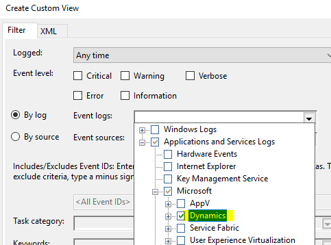
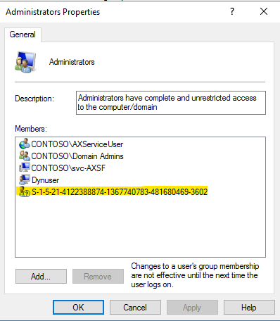
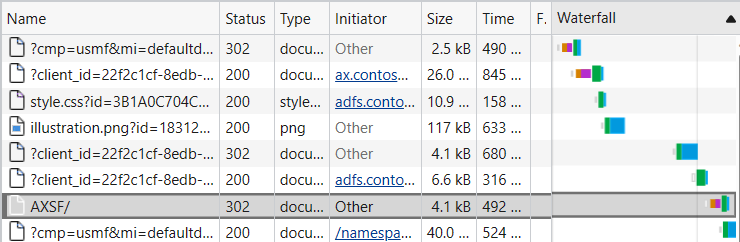
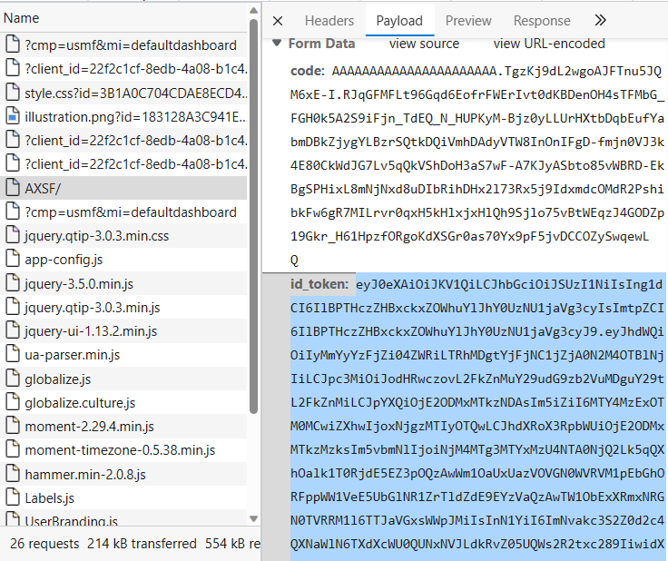

# Troubleshoot on-premises deployments

[!include [banner](../includes/banner.md)]

This article provides troubleshooting information for deployments of Microsoft Dynamics 365 Finance + Operations (on-premises).

## Access Service Fabric Explorer

You can access Service Fabric Explorer in a web browser by using the default address, `https://sf.d365ffo.onprem.contoso.com:19080`.

To verify the address, note the value that was used in the "Create DNS zones and add A records" section of the appropriate setup and deployment article for your environment:

- [Application 10.0.32 and later](setup-deploy-on-premises-latest.md#createdns)
- [Platform update 41 through 55](setup-deploy-on-premises-pu41.md#createdns)

You can access the site only if the client certificate is in cert:\\CurrentUser\\My on the machine that you're accessing the site on. (In Certificate Manger, go to **Certificates - Current User** \> **Personal** \> **Certificates**.) When you access the site, select the client certificate when you're prompted.

## Monitor the deployment

### Identify the primary orchestrator

To determine the machine that is the primary instance for stateful services such as a local agent, in Service Fabric Explorer, expand **Cluster** \> **Applications** \> **\<*intended application example*\> LocalAgentType** \> **fabric:/LocalAgent/OrchestrationService** \> **(GUID)**.

The primary node is shown. For stateless services or the remaining applications, you must check all the nodes.

Note the following points:

- OrchestrationService orchestrates the deployment and servicing actions for Finance + Operations.
- ArtifactsManager downloads files from Microsoft Azure cloud storage to the local agent file share. It also unzips the files into the required format.

### Review the orchestrator event logs

From the primary OrchestrationService orchestrator machine, in Event Viewer, go to **Applications and Services Logs** \> **Microsoft** \> **Dynamics** \> **AX-LocalAgent**.

> [!NOTE]
> To view the full error message, you must select the **Details** tab.

The following modules must be installed:

- Common
- ReportingServices
- AOS
- FinancialReporting

The following commands must be run:

- **Setup**
- **Dvt** – This command runs a deployment verification test.
- **Cleanup** – This command is used to service and delete an environment.

The following folders contain additional information:

- AX-SetupModuleEvents
- AX-SetupInfrastructureEvents
- AX-BridgeService

To review Microsoft Dynamics entries in Event Viewer, follow these steps.

1. In Event Viewer, right-click **Custom Views**, and then select **Create Custom View**.

    

2. In the **Event logs** field, select **Dynamics**.

    

> [!NOTE]
> Also look at **Administrative Events** in **Custom Views**.

### Service Fabric Explorer

Note the state of the cluster, application, and nodes. For information about how to access Service Fabric Explorer, see [Access Service Fabric Explorer](troubleshoot-on-prem.md#access-service-fabric-explorer).

#### Error: "Partition is below target replica or instance count"

You might receive the following error:

> Partition is below target replica or instance count

This error isn't a root error. It indicates that the status of each node isn't ready. For AXSFType (AOS), the status might still be **InBuild**.

On the machines that are related to the error message, use Event Viewer to view the latest activity.

#### AXSFType

If a status of **InBuild** is shown for AXSFType (AOS), review the DB Sync status and other events from Application Object Server (AOS) machines.

To diagnose errors, use Event Viewer to review the following event logs:

- Applications and Services Logs \> Microsoft \> Dynamics \> AX-DatabaseSynchronize
- Custom Views \> Administrative Events

#### Error: "'ExtractInstallerService failed to extract' C:\Users\dynuser.CONTOSO\AppData\Local\Temp\1blssblh.w0n\FabricInstallerService.Code\FabricClient.dll"

You might receive the following error:

> "ExtractInstallerService failed to extract" C:\Users\dynuser.CONTOSO\AppData\Local\Temp\1blssblh.w0n\FabricInstallerService.Code\FabricClient.dll.

If you receive this error, download the latest version of [Azure Service Fabric](https://go.microsoft.com/fwlink/?LinkId=730690). Note that the user name and path in the error message vary, depending on your environment.

#### Service Fabric logs

You can find more details about Service Fabric applications in the log files at C:\\ProgramData\\SF\\\<OrchestratorMachineName\>\\Fabric\\work\\Applications\\LocalAgentType\_App\<N\>\\log.

### Lifecycle Services

Note the current deployment status for the environment in Microsoft Dynamics Lifecycle Services (LCS).

## A time-out error occurs when a Service Fabric cluster is created

Run Test-D365FOConfiguration.ps1 as noted in the "Set up a standalone Service Fabric cluster" section of the appropriate setup and deployment article for your environment. Note any errors.

- [Application 10.0.32 and later](setup-deploy-on-premises-latest.md#setupsfcluster)
- [Platform update 41 through 55](setup-deploy-on-premises-pu41.md#setupsfcluster)

Be sure to complete these steps:

- Verify that the Service Fabric Server client certificate exists in the LocalMachine store on all Service Fabric nodes.
- Verify that the Service Fabric Server certificate has the access control list (ACL) for Network Service on all Service Fabric nodes.
- Review the antivirus exclusions that are noted in [Environment setup](/azure/service-fabric/service-fabric-cluster-standalone-deployment-preparation#environment-setup).

## A time-out error occurs while you're waiting for Installer Service to be completed for machine x.x.x.x

Only one node type is supported for each Internet Protocol (IP) address (that is, for each machine). Check whether the nodes are being reused on the same machine. For example, AOS and ORCH must not be on the same machine, and ConfigTemplate.xml must be correctly defined.

## Remove a specific application

We recommend that you use LCS to remove or clean up deployments. However, you can also use Service Fabric Explorer to remove an application as you require.

In Service Fabric Explorer, go to **Application node** \> **Applications** \> **MonitoringAgentAppType-Agent**. Select the ellipsis button (**...**) next to **fabric:/Agent-Monitoring**, and delete the application. Enter the full name of the application to confirm the deletion of the application.

You can also remove MonitoringAgentAppType-Agent by selecting the ellipsis button and then selecting **Unprovision Type**. Enter the full name to confirm the removal of the application.

## Remove all applications from Service Fabric

The following script removes and unprovisions all Service Fabric applications except LocalAgent and the monitoring agent for LocalAgent. You must run this script on an orchestrator virtual machine (VM).

```powershell
$applicationNamesToIgnore = @('fabric:/LocalAgent', 'fabric:/Agent-Monitoring', 'fabric:/Agent-LBDTelemetry', 'fabric:/LBDTelemetry-Agent')
$applicationTypeNamesToIgnore = @('MonitoringAgentAppType-Agent', 'LocalAgentType', 'LBDTelemetryType-Agent')

Connect-ServiceFabricCluster

Get-ServiceFabricApplication | `
    Where-Object { $_.ApplicationName -notin $applicationNamesToIgnore } | `
    Remove-ServiceFabricApplication -Force

Get-ServiceFabricApplicationType | `
    Where-Object { $_.ApplicationTypeName -notin $applicationTypeNamesToIgnore } | `
    Unregister-ServiceFabricApplicationType -Force
```

## Remove Service Fabric

To completely remove the Service Fabric cluster, follow these steps.

1. Run the following command.

    ```powershell
    .\RemoveServiceFabricCluster.ps1 -ClusterConfigFilePath .\ClusterConfig.json
    ```

2. If an error occurs, remove a specific node on the cluster by using the **CleanFabric.ps1** command. You can find this command in C:\\Program Files\\Microsoft Service Fabric\\bin\\fabric\\fabric.code.
3. Remove the **C:\\ProgramData\\SF** folder, if you're using the default location. Otherwise, remove the specified folder.

    If you receive an "Access denied" error, restart Microsoft Windows PowerShell or the machine.

## Clean up an existing environment and redeploy

To clean up an existing environment and redeploy, follow these steps.

1. In LCS, open the project, and then, in the **Environments** section, delete the deployment.

    The applications should start to disappear from Service Fabric Explorer in the environment. This process will take one to two minutes.

2. Access the orchestrator machine that contains LocalAgentCLI.exe, and follow these steps:

    1. Run the local agent cleanup.

        ```powershell
        .\LocalAgentCLI.exe Cleanup '<path of localagent-config.json>'
        ```

    2. Remove Service Fabric.

        ```powershell
        .\RemoveServiceFabricCluster.ps1 -ClusterConfigFilePath '<path of ClusterConfig.json>'
        ```

    3. If any nodes fail, run the **CleanFabric.ps1** command. You can find this command in C:\\Program Files\\Microsoft Service Fabric\\bin\\fabric\\fabric.code.
    4. Remove the **C:\\ProgramData\\SF\\** folder on all Service Fabric nodes.

        If you receive an "Access denied" error, restart the machine, and try again.

3. Remove or update certificates as required.

    Remove old certificates from all AOS, BI, ORCH, and DC nodes.

    - The certificates exist in the following certificate stores: Cert:\\CurrentUser\\My\\, Cert:\\LocalMachine\\My, and Cert:\\LocalMachine\\Root.
    - If the setup of Microsoft SQL Server will be modified, remove the SQL Server certificates.
    - If the settings for Active Directory Federation Services (AD FS) will be modified, remove the AD FS certificate.

4. Update the following configuration files as required:

    - ConfigTemplate.xml
    - ClusterConfig.json

    For information about how to correctly fill in the fields in the templates, see the appropriate setup and deployment article for your environment:

    - [Application 10.0.32 and later](setup-deploy-on-premises-latest.md)
    - [Platform update 41 through 55](setup-deploy-on-premises-pu41.md)
  

5. In LCS, open the project, and update the LCS on-premises connector as required.

    1. Re-create the LCS on-premises connector for the environment, or edit the settings of an existing connector.

        To obtain easy-to-copy values for LCS, use the .\\Get-AgentConfiguration.ps1 script.

    2. Download the latest local agent configuration, localagent-config.json.

6. Deploy again by following the instructions in the appropriate setup and deployment article for the environment:

    - [Application 10.0.32 and later](setup-deploy-on-premises-latest.md)
    - [Platform update 41 through 55](setup-deploy-on-premises-pu41.md)

## Find the local agent values that are used

You can find local agent values in Service Fabric Explorer. Go to **Cluster** \> **Applications** \> **LocalAgentType** \> **fabric:/LocalAgent**, and then select **Details**.

Alternatively, run the following Windows PowerShell command.

```powershell
.\Get-AgentConfiguration.ps1 -ConfigurationFilePath .\ConfigTemplate.xml
```

## Install, upgrade, or uninstall a local agent

For information about how to update the local agent, see [Update the local agent](../lifecycle-services/update-local-agent.md).

You can also use the following upgrade and uninstallation commands:

```powershell
LocalAgentCLI.exe Install <path of localagent-config.json>
LocalAgentCLI.exe Cleanup <path of localagent-config.json>
```

> [!NOTE]
> The **Cleanup** command doesn't remove any files that were put in the file share. The file share can be reused.

## An error occurs when local agent services are started

When local agent services are started, you might receive the following error:

> Could not load file or assembly 'Lcs.DeploymentAgent.Proxy.Contract, Version=1.0.0.0, Culture=neutral, PublicKeyToken=31bf3856ad364e35' or one of its dependencies.

This error means that strong name verification is turned on. You can turn off this verification by using Configure-PreReqs.ps1. To validate that strong name verification is no longer turned on, run Test-D365FOConfiguration.ps1.

## A "Validation in progress" message is shown for several minutes in LCS

Follow these steps to troubleshoot general issues with local agent validation.

1. Run **Configure-PreReqs.ps1** on all orchestrator machines to configure the machines correctly.
2. Verify that the Test-D365FOConfiguration.ps1 script passes on all the orchestrator machines.
3. Verify that the installation of LocalAgentCLI.exe is successfully completed.
4. In Service Fabric Explorer, verify that all the applications are healthy.
5. If the applications aren't healthy, find the primary node for the service that is failing. In Event Viewer, look for events in the following locations:

    - Custom Views \> Administrative Events
    - Applications and Services Log \> Microsoft \> Dynamics \> AX-LocalAgent

## Local agent errors

### Issue

**Error:** When you install the local agent, you receive the following error.

```stacktrace
LocalAgentCLI.exe Error: 0 : Exception System.InvalidOperationException: unable to get settings for telemetry setup component
    at LBDTelemetryCommon.LBDTelemetrySetupManager.GetComponentSettings()
    at LBDTelemetryCommon.LBDTelemetrySetupManager.ApplyParameters()
    at LocalAgentCLI.Program.Main(String[] args)
Press any key to exit
```

**Reason:** You're trying to install local agent version 2.3.0 or later, but the localagent-config.json file that you're using isn't up to date.

**Steps:** Get the new version of the localagent-config.json file from LCS by following the instructions in the "Configure a connector and install an on-premises local agent" section of [Set up and deploy on-premises environments](setup-deploy-on-premises-latest.md#configureconnector).

You can also manually add the following values in the **components** section of the localagent-config.json file.
```json
{
    "name": "LBDTelemetry",
    "placementCriteria": "(IsOrchestratorEnabled == True)",
    "parameters": {
        "applicationPackagePath": {
            "value": "Applications\\LBDTelemetry"
        }
    }
},
```

### Issue

**Error:** You might receive the following errors:

> Unable to process commands

> Unable to get the channel information

> RunAsync failed due to an unhandled exception causing the host process to crash: System.ArgumentNullException: Value cannot be null. Parameter name: certificate

**Reason:** These errors can occur because the certificate that is specified for the OnPremLocalAgent certificate either isn't valid or isn't correctly configured for the tenant.

**Steps:** Follow these steps to resolve the error.

1. Run **Test-D365FOConfiguration.ps1** on all orchestrator nodes to make sure that all checks pass.
2. Verify that the certificate that is specified in the local agent configuration is correct.

    - Make sure that the thumbprint that you specify in LCS and in the ConfigTemplate.xml file has no special characters.
    - The certificate should be the same certificate that is specified in the following section in infrastructure\\ConfigTemplate.xml.

        ```xml
        <Certificate type="Orchestrator" exportable="true" generateSelfSignedCert="true">
            <Name>OnPremLocalAgent</Name>
            <Thumbprint></Thumbprint>
            <ProtectTo></ProtectTo>
        </Certificate>
        ```

3. Make sure that the same certificate that is specified in the local agent configuration in LCS was used to complete the steps in the "Configure LCS connectivity for the tenant" section of the appropriate setup and deployment article for your environment:

    - [Application 10.0.32 and later](setup-deploy-on-premises-latest.md#configurelcs)
    - [Platform update 41 through 55](setup-deploy-on-premises-pu41.md#configurelcs)

4. Uninstall the local agent.
5. Specify the correct certificate in the local agent configuration, and download the configuration file again.
6. Install the local agent again by using the new configuration file.

### Error

**Error:** During servicing, you receive an "Unable to download asset" error, and the details state, "The credentials supplied to the package were not recognized."

**Reason:** The ACL wasn't correctly defined on certificates.

**Steps:**

Check whether ACL was removed from client certificate on orchestrator machines. Run the .\Test-D365FOConfiguration.ps1 script on orchestrator machines, and verify the ACL.

To resolve the error, run the .\Set-CertificateAcls.ps1 script to reset the ACLs. 

### Error

**Error:**

> Access to the path '\\...\\agent\\assets\\StandAloneSetup-76308-1.zip' is denied.

**Reason:** The file share that is specified in the local agent configuration isn't valid.

**Steps:** Follow these steps to resolve the error.

1. Verify that the specified share exists.
2. Verify that the local agent user has full permission on the share. The local agent user is the Domain Name System (DNS) name that is specified in the following section in ConfigTemplate.xml.

    ```xml
    <ADServiceAccount type="gMSA" name="svc-LocalAgent$" refName="gmsaLocalAgent">
        <DNSHostName>svc-LocalAgent.d365ffo.onprem.contoso.com</DNSHostName>
    </ADServiceAccount>
    ```

3. Make sure that the "Set up file storage" section of the appropriate setup and deployment article for your environment is completed:

    - [Application 10.0.32 and later](setup-deploy-on-premises-latest.md#setupfile)
    - [Platform update 41 through 55](setup-deploy-on-premises-pu41.md#setupfile)

4. Uninstall the local agent.
5. Specify the correct file share in the local agent configuration, and download the configuration file again.
6. Install the local agent again by using the new configuration file.

### Error

**Error:** When you do a servicing operation, you receive the following error:

> Unable to get extract setup folder for command

**Reason:** The file share has been removed or changed.

**Steps:** To see what the file share is set to, open Microsoft SQL Server Management Studio, and run the following query on the orchestrator database:

```sql
select * from OrchestratorCommandArtifact where CommandId = 'xxx'
```

### Error

**Error:**

> Login failed for user 'D365\\svc-LocalAgent$'. Reason: Could not find a login matching the name provided. \[CLIENT: 10.0.2.23\]

**Reason:** The local agent user can't connect to the orchestrator database. This issue can occur because users have been deleted and then re-created in Active Directory Domain Services (AD DS). Therefore, the security identifier (SID) of the user has changed, and any access that was given to the user for the SQL Server instance or the database no longer works.

**Steps:** Follow these steps to resolve the error.

1. Run the following script on the SQL Server instance.

    ```powershell
    .\Initialize-Database.ps1 -ConfigurationFilePath .\ConfigTemplate.xml -ComponentName Orchestrator
    ```

    This script creates an empty orchestrator database, if an empty database doesn't already exist. It then adds the local agent user to the database and gives it db\_owner permission.

    After the correct permissions are provided, the application should automatically go to a healthy state.

2. If any settings, such as the fully qualified domain name (FQDN) of the SQL Server instance, the database name, or the local agent user, were provided incorrectly in LCS, change the settings, and then reinstall the local agent.

If the preceding steps don't resolve the error, manually remove the local agent user from the SQL Server instance and the database, and then rerun the Initialize-Database script.

If you re-create a user in AD DS, remember that the SID will change. In this case, remove the previous SID for the user, and add a new SID.

### Error

**Error:** 
> Unable to migrate database

**Steps:**

- Verify that you have access to the SQL Server listener.
- If you're doing testing, you can start over and use an empty orchestrator database.

### Issue

When you performing the [Configure the databases](setup-deploy-on-premises-latest.md#configuredb) procedure, if the SQL Server instance is a named instance, use the **-DatabaseServer \[FQDN/Instancename\]** parameter.

### Issue

The local agent user can't connect to the SQL Server instance or the database.

**Steps:** Follow these steps to resolve the error.

1. Delete the svc-LocalAgent user from the SQL Server primary node databases, and then remove the login from both servers.
2. Run the following scripts.

    ```powershell
    .\Initialize-Database.ps1 -ConfigurationFilePath .\ConfigTemplate.xml -ComponentName Orchestrator
    .\Configure-Database.ps1 -ConfigurationFilePath .\ConfigTemplate.xml -ComponentName Orchestrator
    ```

    > [!IMPORTANT]
    > These scripts don't work when an **always-on** setup is used. The database must first be created in the primary node and then replicated.

### Error

**Error:**

> RunAsync failed due to an unhandled exception causing the host process to crash: System.Net.Http.HttpRequestException: An error occurred while sending the request. ---\> System.Net.WebException: The remote name could not be resolved: 'lcsapi.lcs.dynamics.com'

**Reason:** The local agent machines can't connect to lcsapi.lcs.dynamics.com. Review the AX-BridgeService event log for "The remote name could not be resolved: 'lcsapi.lcs.dynamics.com'."

**Steps:** Follow these steps to resolve the error.

1. Run **psping lcsapi.lcs.dynamics.com:80**.
2. If you don't receive a response from the preceding command, contact the IT department at your organization. Either the firewall is blocking access to lcsapi, or proxy issues are occurring.

    ```Console
    lcsapi.lcs.dynamics.com:443
    login.windows.net:443
    uswelcs1lcm.queue.core.windows.net:443
    www.office.com:443
    login.microsoftonline.com:443
    dc.services.visualstudio.com:443
    uswelcs1lcm.blob.core.windows.net:443
    uswedpl1catalog.blob.core.windows.net:443
    ```

## Infrastructure scripts errors

### Issue

**Error:** When you run Test-D365FOConfiguration.ps1 or Test-D365FOConfiguration-AllVMs.ps1, you receive the message:

```stacktrace
"Get-LocalGroupMember : Failed to compare two elements in the array.
At C:\Infrastructure\Scripts\Test-D365FOConfiguration.ps1:79 char:9
+         Get-LocalGroupMember -Group 'Administrators' | `
+         ~~~~~~~~~~~~~~~~~~~~~~~~~~~~~~~~~~~~~~~~~~~~
    + CategoryInfo          : NotSpecified: (:) [Get-LocalGroupMember], InvalidOperationException
    + FullyQualifiedErrorId : An unspecified error occurred.,Microsoft.PowerShell.Commands.GetLocalGroupMemberCommand" 
```

**Reason:** There is a bug in the PowerShell commandlet, Get-LocalGroupMember, which causes it to fail when there are entries that aren't valid.

**Steps:** On the machine where the script is failing, open **local users and groups**. Go to the administrators group and remove any entries that have an entry like the one highlighted in the following image.



Do this on all of the machines that receive this error. After the changes are complete, try running the script again.

## <a name="restartapplications"></a>Restart applications (such as AOS)

In Service Fabric, expand **Nodes** \> **AOSx** \> **fabric:/AXSF** \> **AXSF** \> **Code Packages** \> **Code**. Select the ellipsis button (**...**), and then select **Restart**. When you're prompted, enter the code.

## Upgrade Service Fabric

Service Fabric Explorer will show a message that resembles the following message:

> Unhealthy event: SourceId='System.UpgradeOrchestrationService', Property='ClusterVersionSupport', HealthState='Warning', ConsiderWarningAsError=false.
The current cluster version 6.1.467.9494 support ends 5/30/2018 12:00:00 AM. Please view available upgrades using Get-ServiceFabricRegisteredClusterCodeVersion and upgrade using Start-ServiceFabricClusterUpgrade.

Because the minimum requirement is one Microsoft SQL Server Reporting Services (SSRS) node and one Management Reporter node, you must pass in a parameter to skip PreUpgradeSafetyCheck.

Follow these steps to upgrade Service Fabric in Windows PowerShell.

1. Connect to the Service Fabric cluster. In the following command, replace **123** with the server/star thumbprint, and use the appropriate IP address.

    ```powershell
    Connect-ServiceFabricCluster -connectionEndpoint 10.0.0.12:19000 -X509Credential -FindType FindByThumbprint -FindValue 123 -ServerCertThumbprint 123
    ```

2. Get the latest version that was downloaded.

    ```powershell
    Get-ServiceFabricRegisteredClusterCodeVersion
    ```

3. Start the upgrade. For **-CodePackageVersion**, enter the latest version.

    > [!NOTE]
    > **-UpgradeReplicaSetCheckTimeout** is used to skip PreUpgradeSafetyCheck for SSRS and Management Reporter. For more information, see [Service Fabric service upgrade not working](https://github.com/Azure/service-fabric-issues/issues/595). You might also want to use **-UpgradeDomainTimeoutSec 600 -UpgradeTimeoutSec 1800**. For more information, see [Application upgrade parameters](/azure/service-fabric/service-fabric-application-upgrade-parameters).

    ```powershell
    Start-ServiceFabricClusterUpgrade -Code -CodePackageVersion 6.1.472.9494 -Monitored -FailureAction Rollback -UpgradeReplicaSetCheckTimeout 30
    ```

4. Get the upgrade status.

    ```powershell
    Get-ServiceFabricClusterUpgrade
    ```

For more information, see [Troubleshoot application upgrades](/azure/service-fabric/service-fabric-application-upgrade-troubleshooting).

To learn when a new Service Fabric release comes out, see the [Azure Service Fabric team blog](https://blogs.msdn.microsoft.com/azureservicefabric/).

If you receive a warning in Service Fabric Explorer after you upgrade, make a note of the node, and then restart by expanding **Nodes** \> **AOSx** \> **fabric:/AXSF** \> **AXSF** \> **Code Packages** \> **Code**. Select the ellipsis button (**...**), and then select **Restart**.
 
## Error: "Unable to load DLL 'FabricClient.dll'"

If you receive an error that states, "Unable to load DLL 'FabricClient.dll'," close and restart Windows PowerShell. If the error persists, restart the machine.

## What cluster ID should be used in the agent configuration?

The cluster ID can be any globally unique identifier (GUID). This GUID is used for tracking purposes.

## Encryption errors

Some examples of encryption errors include "AXBootstrapperAppType," "Bootstrapper," "AXDiagnostics," "RTGatewayAppType," "Gateway potential failure related," and "Microsoft.D365.Gateways.ClusterGateway.exe."

You might receive one of these errors if the data encipherment certificate that was used to encrypt the AOS account password wasn't installed on the machine. This certificate might be in the certificates (local computer), or the provider type might be incorrect.

To resolve the error, validate the credentials.json file. Copy your infrastructure folder to an AOS node, or run the script from an AOS node if your infrastructure folder is in a file share.

1. Verify that the text is correctly decrypted by running the following command (on AOS1).

    ```powershell
    .\Configure-CredentialsJson.ps1 -ConfigurationFilePath .\ConfigTemplate.xml -Action Decrypt
    ```

2. Open the **Credentials.json** file, and confirm that the credentials are correct.
3. Re-encrypt the **Credentials.json** file.

    ```powershell
    .\Configure-CredentialsJson.ps1 -ConfigurationFilePath .\ConfigTemplate.xml -Action Encrypt
    ```

4. If any of the credentials had to be updated, you must trigger a servicing operation. If an ongoing servicing operation failed, you can ensure that the credentials are updated by retrying the operation from [LCS](https://lcs.dynamics.com). If the environment is already in a deployed state, in [LCS](https://lcs.dynamics.com), select the **Full Details** link for the environment where you want to update the SQL Server, select **Maintain**, and then select **Update Settings**. Don't change any settings. Select **Prepare**, wait for the preparation to be completed, and then select **Update environment** to start to update your environment.

This error can also occur if the **''** parameter isn't defined in the ApplicationManifest file. To determine whether this parameter is defined, in Event Viewer, go to **Custom Views** \> **Administrative Events**, and note any errors in the **Microsoft-Service Fabric** source category.

## Properties to create a DataEncryption certificate

Use the following properties to create the DataEncryption certificate:

- **Is self-signed certificate** – Enable this parameter only when you're using self-signed certificates.
- **Certificate purposes** – Enable all purposes for this certificate.
- **Signature algorithm** – Specify **sha256RSA**.
- **Signature hash algorithm** – Specify **sha256**.
- **Issuer** – Specify **CN = DataEncryptionCertificate**.
- **Public Key** – Specify **RSA (2048 bits)**.
- **Thumbprint algorithm** – Specify **sha1**.

> [!WARNING]
> Don't use self-signed certificates in production environments. Instead, use certificates that are issued by certificate authorities.

## The certificate and private key that should be used for decryption can't be found (0x8009200C)

If you're missing a certificate and ACL, or if you have the wrong thumbprint entry, check for special characters, and look for thumbprints in C:\\ProgramData\\SF\\\<AOSMachineName\>\\Fabric\\work\\Applications\\AXBootstrapperAppType\_App\<N\>\\log\\ConfigureCertificates-\<timestamp\>.txt.

You can also validate the encrypted text by using the following command.

```powershell
.\Configure-CredentialsJson.ps1 -ConfigurationFilePath .\ConfigTemplate.xml -Action Decrypt
```

If you receive the message, "Cannot find the certificate and private key to use for decryption," verify the axdataenciphermentcert and svc-AXSF$ AXServiceUser ACLs.

If none of the preceding solutions work, follow these steps.

1. Verify that the domain name and Active Directory account names that are specified in the ConfigTemplate.xml file are correct.
2. Verify that the thumbprints that are specified in the ConfigTemplate.xml file are correct if the certificate wasn't generated by using the scripts that are provided.
3. Verify that the certificate thumbprints that are specified in LCS are correct, and that they match the thumbprints that are specified in ConfigTemplate.xml. Make sure that there are no special characters. You can run **.\\Get-DeploymentSettings.ps1** to obtain the thumbprints in an easy-to-copy manner.
4. If the certificates aren't self-generated, make sure that the provider names match for the following certificate types:

    - **ServiceFabricEncryption type:** Microsoft Enhanced Cryptographic Provider v1.0
    - **All other certificate types:** Microsoft Enhanced RSA and AES Cryptographic Provider

5. Verify that the Set-CertificateAcls.ps1 and Test-D365FOConfiguration.ps1 scripts were successfully run on all Service Fabric machines.
6. Verify that the credentials.json file exists, and that the entries are decrypted to correct values.

    On one of the AOS machines, run the following command to verify that the data encryption certificate is correct.

    ```powershell
    .\Configure-CredentialsJson.ps1 -ConfigurationFilePath .\ConfigTemplate.xml -Action Encrypt
    ```

7. If any of the certificates must be changed, or if the configuration was incorrect, follow these steps:

    1. Edit the **ConfigTemplate.xml** file so that it has the correct values.
    2. Run all the setup scripts and the **Test-D365FOConfiguration** script.

8. If the credentials.json file has changed, the action that you should take depends on the status of the environment in LCS:

    - If your environment appears to be deployed in LCS, follow these steps:

        1. Go to your environment page, and select **Maintain**.
        1. Select **Update settings**.
        1. Don't change any settings. Select **Prepare**.
        1. After a few minutes, your environment will be prepared, and you can select **Deploy**.

    - If your environment is in a failed state in LCS, select **Retry**. The new Credentials.json file will be used during the retry operation.

## Gateway fails to deploy

**Issue:** You receive the following error in the event viewer logs.

```stacktrace
Message Module aos failed Detail System.InvalidOperationException: Gateway app and Bootstrapper app are not healthy at AOSSetupHybridCloud.Program.Main(String[] args) 
at System.AppDomain._nExecuteAssembly(RuntimeAssembly assembly, String[] args) 
at System.AppDomain.ExecuteAssembly(String assemblyFile, String[] args) 
at System.AppDomain.ExecuteAssembly(String assemblyFile, String[] args) 
at SetupCore.SetupManager.LaunchProcessInAppDomain(String startupExe, String workingDir, String currentFolder, String[] moduleArgs) 
at SetupCore.SetupManager.<>c__DisplayClass12_1.<InvokeModules>b__6()
```

You also receive the following error message in the SFExplorer for the Gateway application.

```stacktrace
'System.RA' reported Warning for property 'ReplicaOpenStatus'.
Replica had multiple failures during open on AOS_13. API call: IStatelessServiceInstance.Open(); Error = System.InvalidOperationException (-2146233079)
Category does not exist.
   at System.Diagnostics.PerformanceCounterLib.CounterExists(String machine, String category, String counter)
   at System.Diagnostics.PerformanceCounter.InitializeImpl()
   at System.Diagnostics.PerformanceCounter..ctor(String categoryName, String counterName, String instanceName, Boolean readOnly)
   at System.Diagnostics.PerformanceCounter..ctor(String categoryName, String counterName, String instanceName)
   at Microsoft.Dynamics.LBD.Gateways.ClusterGateway.Helpers.CpuPerfCounter..ctor()
   at Microsoft.Dynamics.LBD.Gateways.ClusterGateway.GzipContentDelegatingHandler..ctor()
   at Microsoft.Dynamics.LBD.Gateways.ClusterGateway.ClusterGateway.ConfigureApp(IAppBuilder appBuilder)
   at Microsoft.Owin.Hosting.Engine.HostingEngine.Start(StartContext context)
   at Microsoft.Dynamics.LBD.Gateways.Common.OwinCommunicationListener.b__9_0()
   at Microsoft.D365.ServicePlatform.Context.ServiceContext.Activity.d__10`2.MoveNext()
```

**Reason:** The pointers to the performance counter that the gateway needs may be corrupt.

**Resolution:** Run **lodctr /R** in a Command Prompt window that you open as administrator in all AOS nodes where the gateway is unhealthy. If you receive an error message that states that the performance counters can't be rebuilt, try to run the command again. 

## Management Reporter

You can do additional logging by registering providers. To register providers, in the LCS Shared asset library, select **Model** as the asset type, and then download the **Microsoft Dynamics 365 Finance + Operations (on-premises), LBDMRDeployerTroubleshooter** asset. Copy the zip file that is downloaded to the **primary** orchestrator machine, unzip it, and then run the following commands. (To determine which machine is the primary instance, in Service Fabric Explorer, expand **Cluster** \> **Applications** \> **LocalAgentType** \> **fabric:/LocalAgent/OrchestrationService** \> **(GUID)**.)

> [!NOTE]
> If results in Event Viewer don't appear correct (for example, if words are truncated), get the latest manifest and .dll files. To get the latest manifest and .dll files, go to the WP folder in the agent file share. This share was created in the "Set up file storage" section of the appropriate setup and deployment article for your environment:
> 
> - [Application 10.0.32 and later](setup-deploy-on-premises-latest.md#setupfile)
> - [Platform update 41 through 55](setup-deploy-on-premises-pu41.md#setupfile)
> 
> **Example:** \[*Agent Share*\]\\wp\\\[*Deployment name*\]\\StandaloneSetup-...\\Apps\\ETWManifests

```powershell
.\RegisterETW.ps1 -ManifestsAndDll @{"C:\Files\ETWManifest\Microsoft.Dynamics.Reporting.Instrumentation.man" = "C:\Files\ETWManifest\Microsoft.Dynamics.Reporting.Instrumentation.dll"}
```

If you must unregister providers, use the following command.

```powershell
.\RegisterETW.ps1 -ManifestsAndDll @{"C:\Files\ETWManifest\Microsoft.Dynamics.Reporting.Instrumentation.man" = "C:\Files\ETWManifest\Microsoft.Dynamics.Reporting.Instrumentation.dll"} -Unregister
```

After providers are registered, additional details about the new deployment are logged in Event Viewer, at **Applications and Services Logs** \> **Microsoft** \> **Dynamics**. The following folders will be shown:

- MR-Logger
- MR-Sql

To see the new folders, you must close and reopen Event Viewer. To see additional details, you must deploy an environment again.

###  <a name="FREntityFramework"></a> Could not load file or assembly EntityFramework

**Issue**: You are running Local Agent version 2.3.1 or later and you received the following stacktrace in the event logs while deploying a package that contains Platform update 29 or earlier:

```stacktrace
System.Reflection.TargetInvocationException: Exception has been thrown by the target of an invocation. --->
System.Reflection.TargetInvocationException: Exception has been thrown by the target of an invocation. --->
System.IO.FileNotFoundException: Could not load file or assembly 'EntityFramework, Version=6.0.0.0,
Culture=neutral, PublicKeyToken=b77a5c561934e089' or one of its dependencies. The system cannot find the file
specified. at Microsoft.Dynamics.Integration.Service.Utility.AdapterProvider.RefreshAdapters()
--- End of inner exception stack trace ---
 ```

**Resolution:** Use TSG\_UpdateFRDeployerConfig.ps1. For more information, see [TSG_UpdateFRDeployerConfig.ps1](onprem-tsg-implementations.md#frdeployer).

### Unable to deploy Financial Reporting Service

**Issue:** You are unable to finish deployment of Platform update 26 and later for Financial Reporting because the following error is in the application log for Service Fabric.

```stacktrace
Application: FinancialReportingDeployer.exe Framework Version: v4.0.30319  
Description: The process was terminated due to an unhandled exception. 
Exception  Info: System.DllNotFoundException at  
Microsoft.Cloud.InstrumentationFramework.NativeIfxInterop.InitializeIfxFromCloudAgentConfigureSamplingAndTracing_x64(System.String,  System.String, UInt32, UInt32, Boolean) at  Microsoft.Cloud.InstrumentationFramework.IfxInitializer.IfxInitialize(System.String,  Microsoft.Cloud.InstrumentationFramework.InstrumentationSpecification,  Microsoft.Cloud.InstrumentationFramework.AuditSpecification) at  Microsoft.Dynamics.Performance.Logger.IfxLogger..cctor() Exception Info:  System.TypeInitializationException at  
Microsoft.Dynamics.Performance.Logger.IfxLogger..ctor(System.String,  Microsoft.Dynamics.Performance.Logger.IfxLoggerOptions) at  
Microsoft.Dynamics.Performance.Logger.IfxLoggerProvider.CreateLogger(System.String)  at  
Microsoft.Extensions.Logging.Logger..ctor(Microsoft.Extensions.Logging.LoggerFactory,  System.String) at  
```

**Reason:** The Microsoft Visual C++ Redistributable Package for Visual Studio 2013 was not correctly installed or is corrupt in some or all of the MR nodes.

**Steps:** Re-run the installation of the Microsoft Visual C++ Redistributable Package for Visual Studio 2013.

### An error occurs while AddAXDatabaseChangeTracking is running

If you receive an error while you run AddAXDatabaseChangeTracking at Microsoft.Dynamics.Performance.Deployment.FinancialReportingDeployer.Utility.InvokeCmdletAndValidateSuccess(DeploymentCmdlet cmdlet), verify that the full path is correct. An example of a full path is **ax.d365ffo.onprem.contoso.com**.

The error might also occur because of an issue with the star certificate. For example, the remote certificate CN=\*.d365ffo.onprem.contoso.com has a name that isn't valid or that doesn't match the host, ax.d365ffo.onprem.contoso.com.

### Run the initialize database script, and validate that databases have correct users

If you receive only the AddAXDatabaseChangeTracking event, try to reach the MetadataService service for Finance + Operations by going to
`https://ax.d365ffo.contoso.com/namespaces/AXSF/services/MetadataService`.

Next, check the certificates of the service in the wif.config file. To find the file, sign in to one of the AOS machines, and then, in Task Manager, find **AxService.exe**. Right-click, and select **Open file location**. In the wif.config file, you should see three thumbprints. Note the following requirements for these thumbprints:

- They must be different.
- They must be in this order:

    1. Financialreporting thumbprint
    2. ReportingService thumbprint
    3. SessionAuthentication thumbprint

If the thumbprints don't meet both these requirements, you must redeploy from LCS by using correct thumbprints.

### The remote name can't be resolved

**Error:**

> The remote name could not be resolved: 'x.d365fo.onprem.contoso.com' / There was no endpoint listening at `https://x.d365fo.onprem.contoso.com/namespaces/AXSF/services/MetadataService` that could accept the message.

**Reason:** This issue is often caused by an incorrect address or SOAP action.

**Steps:** Verify that the address can be reached, by manually opening the URL. For more details, see the "InnerException" text in the Event Viewer, if it's present.

### Error on ImportDefaultReports

If Management Reporter reports are checked out during deployment, the deployment will fail. To see whether reports are checked out, run the following **select** statements on the FinancialReporting database.

```sql
select checkedoutto, * from Reporting.ControlReport where checkedoutto is not null
select checkedoutto, * from Reporting.ControlRowMaster where checkedoutto is not null
select checkedoutto, * from Reporting.ControlColumnMaster where checkedoutto is not null
```

To learn which user has objects checked out, you can run the following **select** statement.

```sql
select * from Reporting.SecurityUser where UserID = ''
```

To resolve this issue manually, update the following tables, and set **checkedoutto** to **null** by using the following commands.

```sql
update Reporting.ControlReport set checkedoutto = null where checkedoutto is not null
update Reporting.ControlRowMaster set checkedoutto = null where checkedoutto is not null
update Reporting.ControlColumnMaster set checkedoutto = null where checkedoutto is not null
```

## axdbadmin can't connect to the database server SQL-LS.contoso.com

**Reason:** The user doesn't have permission to connect to the AXDB database.

**Steps:**

1. Remove the axdbadmin user from the database, if it already exists.
2. In the **ConfigTemplate.xml** file, specify the user name that must be added to the AXDB database by updating the **userName** attribute.

    ```xml
    <Security>
        <User refName="axdbadmin" type="SqlUser" userName="axdbadmin" />
    </Security>
    ```

3. Run the initialize database script again to add the axdbadmin user as described in [Configure the databases](./setup-deploy-on-premises-pu41.md#configuredb).

## Unable to resolve the xPath value

In the expected behavior, the following **xPath** value can't be resolved: 

\[TopologyInstance/CustomizationGroup\[@name='ServiceConfiguration'\]/Group\[@name='AOSServicePrincipalUser'\]/Customizations/Customization\[@fieldName='PrincipalUserAccountPassword'\]/@selectedValue

Therefore, the fact that the **xPath** value can't be resolved isn't an issue. The **xPath** value looks for AOS runtime user information. However, because of integrated security, that information isn't required. The fact that the **xPath** value can't be resolved is communicated in case the failure must be investigated for another reason.

## AD FS

### The sign-in page doesn't redirect you

The sign-in page might not redirect you but continues to prompt for credentials. Alternatively, you might be redirected but receive the following message:

> An error occurred. Contact your administrator for more information.

In these cases, you can follow these steps to resolve the issue:

- Add the AD FS link to the list of trusted sites.
- Add the Dynamics 365 link to the list of trusted sites.
- Add a trailing slash (/), and see whether the behavior changes.

Verify the AD FS Manager by going to **ADFS** \> **Application groups**. Double-click **Microsoft Dynamics 365 for Operations on-premises**. Then, under **Native application**, double-click **Microsoft Dynamics 365 for Operations on-premises - Native application**.

Note the **Redirect URI** value. It should match the DNS forward lookup zone for Finance + Operations.

### Error: "Could not establish trust relationship for the SSL/TLS secure channel"

If you receive an error that states, "Could not establish trust relationship for the SSL/TLS secure channel," follow these steps.

1. In Service Fabric, go to **Cluster** \> **Applications** \> **AXSFType** \> **fabric:/AXSF**, and then, on the **Details** tab, scroll down and note the URLs for **Aad\_AADMetadataLocationFormat** and **Aad\_FederationMetadataLocation**.
2. Browse to those URLs from AOS.
3. On the AOS machine, in Event Viewer, go to **Applications and Services Logs** \> **Microsoft** \> **Dynamics** \> **AX-SystemRuntime** for details.
4. Verify that the AD FS certificate is trusted:

    1. Verify the AD FS certificate. On the AD FS machine, in Server Manager, go to **Tools** \> **AD FS Management**.
    2. Expand **AD FS** \> **Service** \> **Certificates**, and make a note of the certificates. For example, one certificate might be dc1.contoso.com.
    3. On the AOS machine, in the Microsoft Management Console Certificates snap-in, go to **Certificates (Local Computer)** \> **Trusted Root Certification Authorities** \> **Certificates**, and verify that the AD FS certificate is listed.

If you receive a message that states that the site isn't secure, you haven't added your Secure Sockets Layer (SSL) certificate for AD FS to the Trusted Root Certification Authorities store.

### You can't connect to the remote server in some locations

You might not be able to connect to the remote server at the following places:

- System.Net.HttpWebRequest.GetResponse()
- System.Xml.XmlDownloadManager.GetNonFileStream(Uri uri, ICredentials credentials, IWebProxy proxy, RequestCachePolicy cachePolicy)
- System.Xml.XmlUrlResolver.GetEntity(Uri absoluteUri, String role, Type ofObjectToReturn)

In this case, go to the C:\\ProgramData\\SF\\AOS\_1\\Fabric\\work\\Applications\\AXSFType\_App35\\log folder where you receive the error, and note the out file. The out file contains the following information:

> System.Net.WebException: Unable to connect to the remote server ---\>
>
> System.Net.Sockets.SocketException: A connection attempt failed because the connected party did not properly respond after a period of time, or established connection failed because connected host has failed to respond x.x.x.x:443

You can also use Psping to try to reach the remote server. For information about Psping, see [Psping](/sysinternals/downloads/psping).

### You encounter authentication errors

If you're having issues during authentication with the Workflow editor or the Excel add-ins, use the following script to verify your configuration.

```powershell
.\Test-ADFSConfiguration.ps1 -ConfigurationJsonFilePath "\\Fileserver\agent\wp\EN10\StandaloneSetup-746342\config.json"
```

### Redirect sign-in questions and issues

If you're having issues when you sign-in, in Service Fabric Explorer, verify that the **Provisioning\_AdminPrincipalName** and **Provisioning\_AdminIdentityProvider** values are valid. Here is an example:

- **Provisioning\_AdminPrincipalName**: `AXServiceUser@contoso.com`
- **Provisioning\_AdminIdentityProvider**: `https://DC1.contoso.com/adfs`

If the values aren't valid, you won't be able to proceed, and you must update the admin user information or AD FS information in LCS.

If you used Reset-DatabaseUsers.ps1, you must restart the AOS before your changes take effect. If you still have sign-in issues, make a note of the **NETWORKDOMAIN** and **NETWORKALIAS** values in the USERINFO table. Here is an example:

- **NETWORKDOMAIN:** `https://DC1.contoso.com/adfs`
- **NETWORKALIAS:** `AXServiceUser@contoso.com`
- **IDENTITYPROVIDER:** This should match the **NETWORKDOMAIN** value.

On the AD FS machine, in Server Manager, go to **Tools** \> **AD FS Management** \> **Service**. Right-click **Service and Edit Federation Service Properties**. The **Federation Service identifier** value should match the **USERINFO.NETWORKDOMAIN** value, and it should have **https** in the URL (for example, `https://DC1.contoso.com/adfs`).

On the AD FS machine, in Event Viewer, go to **Applications and Services Logs** \> **AD FS** \> **Admin**, and make a note of any errors.

### Microsoft Edge developer tools

The developer tools that are shipped with Microsoft Edge can be helpful when debugging network requests between a client and the AOS server.

The following sections provide focused debugging steps for claims that are returned to Microsoft Dynamics.

#### Capture

1. Open Microsoft Edge, and then open an **InPrivate** window (the shortcut key is Ctrl + Shift + N).
1. Open the **Microsoft Edge developer tools** (the shortcut key is Ctrl + Shift + I)
1. Navigate to the **Network** tab. You can verify that traffic is being captured by looking at the lower part of the tool.
1. In the **Network** tab make sure you have **Preserve Log** and **Disable Cache** checked.
1. Open finance and operations apps (for example, `https://ax.d365ffo.onprem.contoso.com/namespaces/AXSF/`).
1. Sign in by using the USERINFO.NETWORKALIAS account and password.
1. After you're signed in, stop recording the network log (the shortcut key is Ctrl + E).

#### Analyze

Once you have the network log, you can analyze the claims that are returned to Microsoft Dynamics. Foreach request that gets sent you will be able to view the full request as well as the full response.

1. In the network log look for the POST request that gets sent to Finance +Operations after having successfully authenticated through AD FS.
    
1. Select the request, and then select **Payload**.
1. In the payload find the id_token parameter and copy the value.
> [!NOTE]
> Only copy the value of the id_token parameter. Don't copy the entire payload.
> Copy the value of the id_token parameter after the colon sign (:).
> 
1. Go to [ADFS JWT Decoder](https://adfshelp.microsoft.com/JwtDecoder/GetToken)
1. Paste the value of the id_token parameter in the **Encoded JWT Token** field, and it will be automatically decoded.
1. Check the results in the Payload: Data and Claims section, and follow these steps:

    - Make sure that the **upn** value matches the user name.
    - Make sure that the **unique_name** value is the Active Directory user that is being tested.
    - Go to **Active Directory Users and Computers** \> **domain** \> **Users**, and make sure that this user is being tested.

## Sign-in issues

If you or other users experience sign-in issues, in Service Fabric Explorer, verify that the **Provisioning\_AdminPrincipalName** and **Provisioning\_AdminIdentityProvider** values are valid. If the values are valid, run the following command on the primary SQL Server machine.

```powershell
.\Reset-DatabaseUsers.ps1
```

On each AOS machine, in Task Manager, select **AXService.exe**, and then select **End task**.

To verify that a user has been reset, run the following **select** query in the AXDB SQL database.

```sql
select SID, NETWORKDOMAIN, NETWORKALIAS, * from AXDB.dbo.USERINFO where id = 'admin'
```

> [!NOTE]
> In an Azure Active Directory (Azure AD) environment (that is, an online environment), the SID is a hash of a network alias and a network domain. In an AD DS environment (that is, an on-premises environment), the SID is a hash of a network alias and an identify provider.

In some cases, you still might not be able to sign in, and you might receive the following error:

> You are not authorized to login with your current credentials. You will be redirected to the login page in a few seconds.

If this error occurs, follow these steps.

1. On the AD FS machine, go to **Server Manager** \> **Tools** \> **AD FS Management**.
2. Right-click **AD FS**, and then select **Edit Federation Service Properties**.
3. Make sure that the **Federation Service Identifier** value matches the **Userinfo.NetworkDomain** and **UserInfo.IdentityProvider** values.
4. On the AD FS machine, open Windows PowerShell, and run **Get-AdfsProperties**.
5. Make sure that the **IdTokenIssuer** value matches the **Federation Service Identifier** value from step 3, and also the **Provisioning_AdminIdentityProvider** value on the **fabric:/AXSF Details** tab at **Service Fabric Explorer** \> **Cluster** \> **Applications** \> **AXSFType**.
3. In Service Fabric Explorer, verify that the **Provisioning\_AdminPrincipalName** and **Provisioning\_AdminIdentityProvider** values are valid.

If the preceding steps don't resolve the issue, see the [AD FS](troubleshoot-on-prem.md#ad-fs) section of this article.

## System.Data.SqlClient.SqlException (0x80131904) and System.ComponentModel.Win32Exception (0x80004005)

You might receive one of the following errors:

> System.Data.SqlClient.SqlException (0x80131904): A connection was successfully established with the server, but then an error occurred during the sign-in process. (provider: SSL Provider, error: 0 - The certificate chain was issued by an authority that is not trusted.)

> System.ComponentModel.Win32Exception (0x80004005): The certificate chain was issued by an authority that is not trusted

In this case, either the certificates haven't been installed, or they haven't given access to the correct users. To resolve this error, add the public key SQL Server certificate to all the Service Fabric nodes.

## Keyset doesn't exist

If you find that the keyset doesn't exist, scripts weren't run on all machines. Review and complete the "Set up VMs" section of the appropriate setup and deployment article for your environment:

- [Application 10.0.32 and later](setup-deploy-on-premises-latest.md#setupvms)
- [Platform update 41 through 55](setup-deploy-on-premises-pu41.md#setupvms)

Copy the scripts in each folder to the VMs that correspond to the folder name.

Additionally, check the .csv file to verify that the correct domain is used.

## Error: "RunAsync failed due to an unhandled FabricException causing replica to fault"

You might receive the following error:

> RunAsync failed due to an unhandled FabricException causing replica to fault: System.Fabric.FabricException: The first Fabric upgrade must specify both the code and config versions. Requested value: 0.0.0.0:

In this case, in the ClusterConfig.json file, change **diagnosticsStore** from a network share to a local path. For example, change **\\\\server\\path** to a default value of **C:\\ProgramData\\SF\\DiagnosticsStore**.

## Service Fabric AOS node error during build: The execution time-out expired

**Error:**

> The timeout period elapsed prior to completion of the operation or the server is not responding.  
> The statement has been terminated.

Only one AOS machine can run DB Sync at a time. You can safely ignore this error, because it means that one of the AOS VMs is running DB Sync. Therefore, the other VMs produce a warning that they can't run it. To verify that DB Sync is running, on the AOS VM that isn't producing warnings, in Event Viewer, go to **Applications and Services Log** \> **Microsoft** \> **Dynamics** \> **AX-DatabaseSynchronize/Operational**.

## Error: "RequireNonce is 'true' (default) but validationContext.Nonce is null"

You might receive the following error:

> RequireNonce is 'true' (default) but validationContext.Nonce is null

This error also appears as an HTTP error 500 in Internet Explorer after you sign in to the client. The nonce that is issued can't be validated if Internet Explorer is in Enhanced Security Configuration.

To sign in to the client, disable Enhanced Security Configuration for Internet Explorer via Server Manager.

## Error: "Invalid algorithm specified / Cryptography"

If you receive an "Invalid algorithm specified / Cryptography" error, you must use the Microsoft Enhanced RSA and AES Cryptographic Provider. For more information, see the certificate requirements. Additionally, verify that the structure of the credentials.json file is correct.

If you must re-create the certificate by using the correct provider, follow these steps.

1. Create the certificate again by using the correct provider.
2. Change the **ConfigTemplate.xml** file.
3. Run the infrastructure scripts on all machines in the cluster, and make sure that the **Test-D365FOConfiguration.ps1** script passes.
4. Reconfigure the environment from LCS.

## An "Unable to find certificate" error occurs when you run Test-D365FOConfiguration.ps1

If you receive an "Unable to find certificate" error when you run Test-D365FOConfiguration.ps1, check whether certificates or thumbprints are being combined for multiple purposes. For example, you will receive this error if the client certificate and the SessionAuthentication certificate are combined. We recommend that you not combine certificates. For more information, see the certificate requirements, and check the acl.csv file for **domain.com\\user** versus **domain\\user** (for example, NETBIOS structure).

## The client and server can't communicate because they don't have a common algorithm

If the client and server can't communicate because they don't have a common algorithm, verify that the certificates that are created use the specified provider, as explained in the "Plan and acquire your certificates" section of the appropriate setup and deployment article for your environment:

- [Application 10.0.32 and later](setup-deploy-on-premises-latest.md#plancert)
- [Platform update 41 through 55](setup-deploy-on-premises-pu41.md#plancert)

## Find a list of group managed service accounts

To find a list of all groups and hosts, run the following command.

```powershell
Get-ADServiceAccount -Identity svc-LocalAgent$ -Properties PrincipalsAllowedToRetrieveManagedPassword
```

## AddCertToServicePrincipal script fails on Import-Module

**Error:**

> AddCertToServicePrincipal script failing on Import-Module : Could not load file or assembly 'Commands.Common.Graph.RBAC, Version=1.0.0.0, Culture=neutral, PublicKeyToken=31bf3856ad364e35' or one of its dependencies. Strong name validation failed. (Exception from HRESULT: 0x8013141A) may have multiple versions of the same module installed.

**Steps:** To resolve this issue, follow these steps.

1. Run the following command in Windows PowerShell.

    ```powershell
    Uninstall-Module -Name AzureRM
    Install-Module AzureRM
    ```

2. Close the Windows PowerShell window, and try to run the script again.

## ReportingServicesSetup.exe error

**Error:**

> ReportingServicesSetup.exe Error: 0 : Application fabric:/ReportingService is not OK after 10 minutes  
> Application: ReportingServicesBootstrapper.exe  
> Framework Version: v4.0.30319  
> Description: The process was terminated due to an unhandled exception.

**Reason:** If you receive this error, strong name validation is enabled in the Reporting server, but it should not be enabled.

**Steps:** To resolve this issue, run the **config-PreReq** script on the Reporting server machine.

## The requested operation requires elevation

This issue occurs because AOS users aren't in the local administrator group, and User Account Control (UAC) hasn't been disabled correctly. To resolve the issue, follow these steps.

1. Add AOS users as local admins, as described in the "Join VMs to the domain" section of the appropriate setup and deployment article for your environment:

    - [Application 10.0.32 and later](setup-deploy-on-premises-latest.md#joindomain)
    - [Platform update 41 through 55](setup-deploy-on-premises-pu41.md#joindomain)
 
2. Run the **Config-PreReq** script on all the AOS machines.
3. Make sure that the **Test-Configuration** script passes.
4. If UAC was changed, you must restart the machine before the changes take effect.

## Files in use errors

If these "Files in use" errors occur, set up the exclusion rules that Service Fabric advises. For information, see [Environment setup](/azure/service-fabric/service-fabric-cluster-standalone-deployment-preparation#environment-setup).

## Apply deployable packages during deployment

### Package deployment fails because of a "path too long" exception

Because of a 260-character limit in Microsoft Windows, deployment will fail if a package has a longer name, or if the on-premises share has the full FQDN path. If the character limit is exceeded, you receive the following error:

> System.IO.PathTooLongException: The specified path, file name, or both are too long. The fully qualified file name must be less than 260 characters, and the directory name must be less than 248 characters. at System.IO.PathHelper.GetFullPathName

To work around this issue, shorten the package name, and then apply the package again. Alternatively, shorten the overall length of the share path for the on-premises assets.

### Package deployment fails because of a serialization error

During package deployment, you might receive the following error:

> Serialization version mismatch detect, make sure the runtime DLLs are in sync with the deployed metadata. Version of file 'XXX'. Version of DLL 'XXX'

In this case, the version of the environment where the package was developed might differ from the version of the environment that the package is being deployed in.

To work around this issue, keep the development or build environments on the same version as the deployed on-premises environment. You can confirm the package version by looking in the **Additional details** section in the Asset library where the package is uploaded. To fix the error, generate the package on a version that is the same as or earlier than the version that is deployed in the on-premises environment.

### Package deployment fails because of dependencies on missing modules

If you try to apply a package that is missing dependent modules, package application will fail, and you will receive a message that resembles the following message:

> Package \[dynamicsax-My\_commonextension.7.0.4679.35176.nupkg has missing dependencies: \[dynamicsax-demodatasuite;dynamicsax-financialreportingadaptors;dynamicsax-fleetmanagement;dynamicsax-fleetmanagementextension;dynamicsax-publicsectorformadaptor\]\]
>
> Package \[dynamicsax-My\_coreextension.7.0.4679.35176.nupkg has missing dependencies: \[dynamicsax-demodatasuite;dynamicsax-financialreportingadaptors;dynamicsax-fiscalbooksformadaptor;dynamicsax-fleetmanagement;dynamicsax-fleetmanagementextension;dynamicsax-fleetmanagementunittests;dynamicsax-generalledgerformadaptor;dynamicsax-publicsectorformadaptor;dynamicsax-retailformadaptor\]\]
>
> Package \[dynamicsax-My\_uiextension.7.0.4679.35176.nupkg has missing dependencies: \[dynamicsax-demodatasuite;dynamicsax-financialreportingadaptors;dynamicsax-fiscalbooksformadaptor;dynamicsax-fleetmanagement;dynamicsax-fleetmanagementextension;dynamicsax-fleetmanagementunittests\]\]

To confirm the issue and find the missing dependencies, in Event Viewer, open **Application and Services**, and then go to **Microsoft** \> **Dynamics** \> **AX-SetupModuleEvents** to view events that have missing modules. For example, one of the modules that is typically missing is ApplicationFoundationFormAdaptor.

To fix this issue and successfully apply the package, either add dependent modules, or remove modules that require dependent modules. To add dependent modules, you must include the dependencies when you build the package. To remove modules, you can use ModelUtil.exe to delete a module. For more information, see [Export and import models](../dev-tools/models-export-import.md).

### Package deployment works in a one-box environment but not in the sandbox environment

A one-box environment might have all the modules installed, whereas the sandbox environment might have only the modules that are required in order to run your production environment. If the package that was built in the dev environment has a dependency on modules that are present in the one-box environment but not in the sandbox environment, the package won't work in the sandbox environment.

To resolve this issue, look at all the modules that you're dependent on, and make sure that you don't pull any farm adapter or any other module that isn't required in the production environment. The best practice is to take the package from the build box.

## An error occurs when you sign in to on-premises environments

- **Platform update 12:** Turn off the Skype integration by going to **System administration** \> **Setup** \> **Client performance options**. When you go to the app, append **?debug=true** to the URL, as shown in the following example: `https://ax.d365ffo.onprem.contoso.com/namespaces/AXSF/?debug=true`
- **Platform update 8 and Platform update 11:** A known issue for the Skype application programming interface (API) affects the ability to sign in to on-premises environments. Microsoft is investigating a resolution for this issue. To work around this issue, you can add **?debug=true** to the end of the URL, as shown in the following example: `https://ax.d365ffo.onprem.contoso.com/namespaces/AXSF/?debug=true`

## The local agent stops working after the tenant for the project from LCS is changed

Follow these steps to configure the local agent with the updated tenant.

1. Uninstall the local agent.

    ```powershell
    .\LocalAgentCLI.exe Cleanup <path of localagent-config.json>
    ```

2. Follow the steps in the "Configure LCS connectivity for the tenant" section of the appropriate setup and deployment article for your environment:

    - [Application 10.0.32 and later](setup-deploy-on-premises-latest.md#configurelcs)
    - [Platform update 41 through 55](setup-deploy-on-premises-pu41.md#configurelcs)

3. Create a new LCS connector in the new tenant.
4. Download the **local-agent.config** file.
5. Install the local agent.

    ```powershell
    .\LocalAgentCLI.exe Install <path of localagent-config.json>
    ```

## Additional deployments (for example, two sandbox deployments, or a sandbox and production deployment)

You will receive the following error when you deploy an additional environment:

> .\\Publish-ADFSApplicationGroup.ps1 -HostUrl `https://ax.d365ffo.onprem.contoso.com` New-AdfsApplicationGroup : MSIS9908: The application group identifier must be unique in AD FS configuration.

You can skip or modify the following sections in the deployment instructions.

### Plan and acquire your certificates (as documented for [Application 10.0.32 and later](setup-deploy-on-premises-latest.md#plancert) or [Platform update 41 through 55](setup-deploy-on-premises-pu41.md#plancert))

- You must use the same on-premises local agent certificate.
- You can use same star certificates (AOS SSL and Service Fabric).
- The remaining certificates should probably differ from the certificates for the existing environment.

### Download setup scripts from LCS (as documented for [Application 10.0.32 and later](setup-deploy-on-premises-latest.md#downloadscripts) or [Platform update 41 through 55](setup-deploy-on-premises-pu41.md#downloadscripts))

- The scripts that are downloaded should be copied into a new folder.

### Set up a standalone Service Fabric cluster (as documented for [Application 10.0.32 and later](setup-deploy-on-premises-latest.md#setupsfcluster) or [Platform update 41 through 55](setup-deploy-on-premises-pu41.md#setupsfcluster))

- The scripts that are downloaded should be copied into a new folder.

### Configure LCS connectivity for the tenant (as documented for [Application 10.0.32 and later](setup-deploy-on-premises-latest.md#configurelcs) or [Platform update 41 through 55](setup-deploy-on-premises-pu41.md#configurelcs))

- You must complete this task only one time for the tenant.

### Configure AD FS (as documented for [Application 10.0.32 and later](setup-deploy-on-premises-latest.md#configureadfs) or [Platform update 41 through 55](setup-deploy-on-premises-pu41.md#configureadfs))

- Configure AD FS according to the [Reuse the same AD FS instance for multiple environments](./onprem-reuseadfs.md) guide.

## Redeploy SSRS reports

#### Version 10.0.13 or later

Run the following command against your business data database (AXDB):

```sql
	UPDATE SF.synclog SET STATE=5, SyncStepName = 'ReportSyncstarted' WHERE CODEPACKAGEVERSION in (SELECT TOP(1) CODEPACKAGEVERSION from SF.SYNCLOG ORDER BY CREATIONDATE DESC)
```

#### Version 10.0.12 or earlier

Run the following command against your business data database (AXDB):

```sql
    DELETE FROM SF.synclog WHERE CODEPACKAGEVERSION in (SELECT TOP(1) CODEPACKAGEVERSION from SF.SYNCLOG ORDER BY CODEPACKAGEVERSION DESC)
```

>[!NOTE]
> If you are using version 10.0.12 or earlier, a full database synchronization will be executed.

After running the command, restart one of your AOS nodes through Service Fabric Explorer or restart the VM that the node is running on.

## Add axdbadmin to tempdb after a SQL Server restart via a stored procedure

When SQL Server is restarted, the tempdb database is re-created. Therefore, there will be missing permissions. Run the following script to create a stored procedure on the master database.

```sql
\-----
USE [master]
GO
CREATE procedure [dbo].[CREATETEMPDBPERMISSIONS] as begin exec ('USE tempdb; declare @dbaccesscount int; select @dbaccesscount = COUNT(*) from master..syslogins where name = ''axdbadmin''; if (@dbaccesscount <> 0) exec sp_grantdbaccess ''axdbadmin''; ALTER USER [axdbadmin] WITH DEFAULT_SCHEMA=dbo; EXEC sp_addrolemember N''db_datareader'', N''axdbadmin''; EXEC sp_addrolemember N''db_datawriter'', N''axdbadmin''; EXEC sp_addrolemember N''db_ddladmin'', N''axdbadmin''; exec sp_grantdbaccess ''contoso\svc-AXSF$''; ALTER USER [contoso\svc-AXSF$] WITH DEFAULT_SCHEMA=dbo; EXEC sp_addrolemember N''db_datareader'', N''contoso\svc-AXSF$''; EXEC sp_addrolemember N''db_datawriter'', N''contoso\svc-AXSF$''; EXEC sp_addrolemember N''db_ddladmin'', N''contoso\svc-AXSF$'';') end
GO
EXEC sp_procoption N'[dbo].[CREATETEMPDBPERMISSIONS]', 'startup', '1'
\-----
```

## Error: "Updates to existing credential with KeyId '\<key\>' is not allowed"

You might receive the following error:

> Updates to existing credential with KeyId '\<key\>' is not allowed

The steps to resolve this issue depend on whether you have only an on-premises project, or whether you have both an online project and an on-premises project.

### If have only an on-premises project

If have only an on-premises project, you can't update the existing credential with KeyId '\<key\>'.

> New-AzureRmADSpCredential : Update to existing credential with KeyId '\<key\>' is not allowed.  
> At C:\\InfrastructureScripts\\Add-CertToServicePrincipal.ps1:62 char:1  
> New-AzureRmADSpCredential -ObjectId $servicePrincipal.Id -CertValue $ ...  
> CategoryInfo : InvalidOperation: (:) \[New-AzureRmADSpCredential\], Exception  
> FullyQualifiedErrorId : Microsoft.Azure.Commands.ActiveDirectory.NewAzureADSpCredentialCommand

Run the following PowerShell command to resolve the issue.

```powershell
Remove-AzureRmADSpCredential -ServicePrincipalName "00000015-0000-0000-c000-000000000000" -KeyId <key>
```

### If you have both an online project and an on-premises project

If you have both an online project and an on-premises project, follow these steps.

1. Verify that the Microsoft .NET Framework version 4.7.2 is installed.
2. Run the following Windows PowerShell script to install the Azure PowerShell module.

    ```powershell
    Install-Module -Name Az
    ```

3. Run the following Windows PowerShell script to upload the new certificate.

    ```powershell
    Import-Module -Name Az.Accounts
    Import-Module -Name Az.Resources

    Connect-AzAccount

    $servicePrincipalName = "00000015-0000-0000-c000-000000000000";
    $CertificateThumbprint = <Thumbprint of Agent Certificate>
    $cert = Get-ChildItem -path Cert:\CurrentUser\my | Where-Object { $_.Thumbprint -eq $CertificateThumbprint }
    if (!$cert)
    {
        $cert = Get-ChildItem -path Cert:\LocalMachine\my | Where-Object { $_.Thumbprint -eq $CertificateThumbprint }
        if (!$cert)
        {
            throw "Unable to find the certificate in the Local machine or Current User store"
        }
    }

    $keyValue = [System.Convert]::ToBase64String($cert.GetRawCertData())
    $servicePrincipal = Get-AzADServicePrincipal -ServicePrincipalName $servicePrincipalName
    if (!$servicePrincipal)
    {
        throw "Unable to find the service principal"
    }
    New-AzADSpCredential -ObjectId $servicePrincipal.Id -CertValue $keyValue -EndDate $cert.NotAfter -StartDate $cert.NotBefore
    Get-AzADSpCredential -ObjectId $servicePrincipal.Id
    ```

4. Run the following command to remove the duplicate certificate, if more than one certificate exists.

    ```powershell
    Remove-AzADSpCredential -ServicePrincipalName "00000015-0000-0000-c000-000000000000" -KeyId <key>
    ```

## ODBC driver 17 is required for platform updates

The latest platform binary update uses Open Database Connectivity (ODBC) driver 17. This upgrade resolves stability issues that are linked to older ODBC drivers. The [Setup perquisites](setup-deploy-on-premises-latest.md#prerequisites) documentation has been updated to reflect the change in which ODBC driver 17 must be installed on each AOS server. If you don't install ODBC driver 17, you will receive DB Sync errors during servicing of the environment.

Here are some examples of errors:

- In Service Fabric:

    > Unhealthy event: SourceId='System.RA', Property='ReplicaOpenStatus', HealthState='Warning', ConsiderWarningAsError=false.  
    > Replica had multiple failures during open on AOS3. API call: IStatelessServiceInstance.Open(); Error = System.Exception (-2146233088)  
    > **DB sync failed.**

- On AOS machines:

    - Event Viewer \> Custom Views \> Administrative Events:

        > Application: Microsoft.Dynamics.AX.Deployment.Setup.exe Framework Version: v4.0.30319 Description: The process was terminated due to an unhandled exception. Exception Info: System.IO.FileNotFoundException at Microsoft.Dynamics.AX.Deployment.Setup.Program.Main(System.String\[\])

    - C:\\ProgramData\\SF\\AOSx\\Fabric\\work\\Applications\\AXSFType\_Appxx\\log:

        > Microsoft.Dynamics.AX.Deployment.Setup.exe -bindir "C:\\ProgramData\\SF\\AOS1\\Fabric\\work\\Applications\\AXSFType\_App18\\AXSF.Code.1.0.20180831174152\\Packages" -metadatadir "C:\\ProgramData\\SF\\AOS1\\Fabric\\work\\Applications\\AXSFType\_App18\\AXSF.Code.1.0.20180831174152\\Packages" -sqluser "axdbadmin" -sqlserver "SQL-LS.contoso.com" -sqldatabase "AXDB" -setupmode servicesync -syncmode fullall -onprem
        >
        > Unhandled Exception: System.IO.FileNotFoundException: **Could not load file or assembly 'aoskernel.dll' or one of its dependencies. The specified module could not be found.**
        > at Microsoft.Dynamics.AX.Deployment.Setup.Program.Main(String\[\] args)
        > 
        > **DB sync failed.**

## Service Fabric Explorer warnings occur after you restart a machine

**Error:**

> Error event: SourceId='MonitoringAgentService', Property='ServiceState'.  
> System.Management.Automation.RuntimeException: Error: **The GUID passed was not recognized as valid by a WMI data provider.** (Exception from HRESULT: 0x80071068). Stack trace:

**Steps:** To resolve this issue, restart the application package that generated the warning message. For more information, see [Restart applications (such as AOS)](./troubleshoot-on-prem.md#restartapplications).

## The internal time zone version number that is stored in the database is higher than the version that is supported by the kernel (13/12)

This database synchronization error can cause an old platform build (Platform update 12) to be deployed on top of a database that had a newer build (Platform update 15).

To resolve this issue, note the **SYSTIMEZONESVERSION** value.

```sql
select * from SQLSYSTEMVARIABLES where parm = 'SYSTIMEZONESVERSION'
```

Update the value to the version that was returned in the error message.

```sql
update SQLSYSTEMVARIABLES set VALUE = 12 where parm = 'SYSTIMEZONESVERSION'
```

## Printing randomly stops

Make sure that all network printers that have been installed on the AOS server are running as the Windows service account that the AXService.EXE process is running as.

For more information about how to configure network printers in on-premises environments, see [Install network printer devices in on-premises environments](../analytics/install-network-printer-onprem.md).

## Ax-DatabaseSynchronize isn't populated with events

In Platform update 20 and later, there is database synchronization log issue where the synchronization logs aren't written under **Ax-DatabaseSynchronize** in Event Viewer.

To resolve this issue, go to \<SF-dir\>\\AOS\_\<x\>\\Fabric\\work\\Applications\\AXSFType\_App\<X\>\\log. For example, go to C:\\ProgramData\\SF\\AOS\_11\\Fabric\\work\\Applications\\AXSFType\_App183\\log. Here, you can see the output from DatabaseSynchronize in the Code\_AXSF\_M\_\<X\>.out files. Troubleshoot any issues that pertain to this component.

## You can't access Finance + Operations: "AADSTS50058: A silent sign-in request was sent but no user is signed in"

After a user enters credentials to sign in to Finance + Operations, the browser briefly shows the application layout. However, it then tries to redirect outside Finance + Operations, but fails with the following error:

> AADSTS50058: A silent sign-in request was sent but no user is signed in.

The cookies that represent the user's session weren't sent in the request to Azure AD. This issue can occur if the user is using Internet Explorer or Microsoft Edge, and if the web app that sends the silent sign-in request is in a different IE security zone than the Azure AD endpoint (login.microsoftonline.com).

This issue occurs because there was a change in the Skype Presence API, and on-premises environments connect to this API by default.

To resolve the issue, run the following SQL Server query.

```sql
update [AXDB].[dbo].[SYSCLIENTPERF] set SkypeEnabled = 0
```

Alternatively, turn off the **Skype presence enabled** option on the **Client performance options** page (**System administration** \> **Setup** \> **Client performance options**). To use this approach, you must be able to sign in to Finance + Operations. Therefore, you must first block redirection in the browser. After you disable the Skype presence, you can unblock redirection again.

The Google Chrome browser blocks redirection by default.

## Error: "There was an error during CodePackage activation. Service host failed to activate. Error:0x8007052e"

You might receive the following error during a new installation:

> Error event: SourceId='System.Hosting', Property='CodePackageActivation:Code:EntryPoint'. There was an error during CodePackage activation.Service host failed to activate. Error:0x8007052e

This error will cause the AXSF service to fail with the same error.

To resolve this issue, follow these steps.

1. In the [agent share path](setup-deploy-on-premises-latest.md#setupfile), find the **netstandard.dll** file. For example, this file might be at \\wp\\\<name\>\\StandaloneSetup-\<ver\>\\Apps\\AOS\\AXServiceApp\\AXSF\\Code\\bin\\netstandard.dll.
2. On each AOS server, open a Command Prompt window as an administrator, and run the following command.

    ```Console
    "C:\Program Files (x86)\Microsoft SDKs\Windows\v8.1A\bin\NETFX 4.5.1 Tools\gacutil.exe" -i <path from step 1.>\netstandard.dll /f
    ```

3. Delete **AXBootstrapperApp** from Service Fabric.

    1. Delete the **fabric:/Bootstrapper/AXBootstrapper** service.
    2. Delete the **fabric:/Bootstrapper** application.
    3. Unprovision the **AXBootstrapperAppType** type.

4.	Redeploy the environment from LCS.

## SQL Server 2016 service pack 2 is recommended for Reporting Services instances

When you go through LCS servicing operations, you might receive the following error:

> The process cannot access the file 'C:\\Program Files\\Microsoft SQL Server\\MSRS13.MSSQLSERVER\\Reporting Services\\ReportServer\\bin\\Microsoft.Dynamics.AX.Framework.Services.Platform.Client.dll' because it is being used by another process.

This issue occurs because Reporting Services has a lock on a Microsoft Dynamics .dll file. We currently recommend that you have SQL Server 2016 service pack 2 installed on Reporting Services instances.

> [!NOTE]
> You must have service pack 2 installed, and no additional cumulative updates or hotfixes must be installed.

## <a name="SysClassRunner"></a>SysClassRunner doesn't run successfully

**Issue:** When you try to run SysClassRunner on Platform update 29 through Platform update 31, you get the following exception:

```stacktrace 
Microsoft.Dynamics.Ax.Xpp.ClrErrorException: TypeInitializationExeption ---> 
System.TypeInitializationException: The type initializer for 'Microsoft.Dynamics.Ax.Metadata.XppCompiler.CompilerTracer' threw an exception. ---> 
System.TypeInitializationException: The type initializer for 'Microsoft.Dynamics.Ax.DesignTime.Telemetry.OneDS' threw an exception. ---> 
System.IO.FileLoedAxception: Could not load file or assembly 'Microsoft.Diagnostics.Tracing.TraceEvent, Version=2.0.43.0, Culture=neutral, PublicKeyToken=b03f5f7f11d50a3a' or one of its dependencies. 
The located assembly's manifest definition does not match the assembly reference. (Exception from HRESULT: 0x80131040) at Microsoft.Dynamics.Ax.DesignTime.Telemetry.OneDS.cctor() 
--- End of inner exception stack trace ---
```

**Reason:** There is a .dll mismatch between the runtime and the application.

**Resolution:** Use TSG\_SysClassRunner.ps1. For more information, see [TSG_SysClassRunner.ps1](onprem-tsg-implementations.md#sysclassrunner).

## DBSync fails with PEAP APP version 10.0.9 Platform update 33
**Issue:** During deployment of the APP 10.0.9 PU33 PEAP-package, the deployment fails with the AXSF applications staying in "InBuild" status in Service Fabric explorer. When reviewing the logs on the AXSF nodes' work directories, the following DBSync error can be found. 

Error message from DBSync:
 ```stacktrace
 Microsoft.Dynamics.AX.Deployment.Setup.exe -bindir "C:\ProgramData\SF\LBDEN08FS1AOS03\Fabric\work\Applications\AXSFType_App398\AXSF.Code.1.0.20200123151456\Packages" -metadatadir "C:\ProgramData\SF\LBDEN08FS1AOS03\Fabric\work\Applications\AXSFType_App398\AXSF.Code.1.0.20200123151456\Packages" -sqluser "" -sqlserver "" -sqldatabase "" -setupmode servicesync -syncmode fullall -onprem 
Stack trace: Invalid attempt to call  running in CIL on the client.
   at Microsoft.Dynamics.Ax.MSIL.Interop.throwException(Int32 ExceptionValue, interpret* ip)
   at Microsoft.Dynamics.Ax.MSIL.Interop.ThrowCQLError(IL_CQL_ERR cqlErr, String p1)
   at Microsoft.Dynamics.AX.Kernel.ApplicationId.LogOrRethrow(Exception exception)
   at Microsoft.Dynamics.AX.Kernel.ApplicationId.LogOrRethrowFormattedMessage(Exception exception, String typeName, String elementName)
   at Microsoft.Dynamics.AX.Kernel.ApplicationId.LogOrRethrowFormattedMessage(Exception exception, String typeName, Int32 typeId)
   at Microsoft.Dynamics.AX.Kernel.ApplicationId.ApplicationIdBridge.LoadTableById(ApplicationIdBridge* , Int32 id, ObjectIdDelegate* cb)
   at cqlClass.callEx(cqlClass* , Char* , interpret* )
   at Microsoft.Dynamics.Ax.MSIL.cqlClassIL.Call(IntPtr c, String methodName, Object[] parameters, Type[] types, Object[] varargs, Type[] varargsTypes)
   at Microsoft.Dynamics.Ax.Xpp.XppObjectBase.Call(String methodName, Object[] parameters, Type[] types, Object[] varargs)
   at Microsoft.Dynamics.Ax.Xpp.DictTable.Supportinheritance()
   at Dynamics.AX.Application.SysDictTable.`getRootTable(Int32 _tabid) in xppSource://Source/ApplicationPlatform\AxClass_SysDictTable.xpp:line 1498
   at Dynamics.AX.Application.SysDictTable.getRootTable(Int32 _tabid)
   at Dynamics.AX.Application.SysDataBaseLog.`ConfigureSqlLogging() in xppSource://Source/ApplicationPlatform\AxTable_SysDataBaseLog.xpp:line 60
   at Dynamics.AX.Application.SysDataBaseLog.ConfigureSqlLogging()
   at SysDataBaseLog::ConfigureSqlLogging(Object[] , Boolean& )
   at Microsoft.Dynamics.Ax.Xpp.ReflectionCallHelper.MakeStaticCall(Type type, String MethodName, Object[] parameters)
 
DB sync failed.
```

**Reason:** This issue occurs because there is data in the SQL DatabaseLog table that conflicts with the metadata in the package.

**Resolution:** Run the following query on AXDB to clean the DatabaseLog table and retry the deployment.

```sql
select * into databaselog_bak from databaselog
truncate table databaselog
```

## DBSync fails to start

**Issue:** During deployment, the deployment fails with the AXSF applications staying in "InBuild" status in Service Fabric explorer. When reviewing the logs on the AXSF nodes' work directories, the following DBSync error can be found.

```stacktrace
Microsoft.Dynamics.AX.InitializationException: Database login failed. Please check SQL credentials and try again.
   at Microsoft.Dynamics.AX.AOS.StartupInternal(String[] Arguments)
   at Microsoft.Dynamics.AX.AOS.Startup()
   at Microsoft.Dynamics.AX.AosConfig.?A0xb5100bbf.GetAosConfig()
   at Microsoft.Dynamics.AX.AosConfig.Config.InitInternal()
   at Microsoft.Dynamics.AX.AosConfig.Config.InitOnce(Boolean isOfflineMode)
   at Microsoft.Dynamics.AX.Framework.Database.Tools.LegacyCodepath.StartAosCode(SyncOptions syncOptions, String sqlConnectionString)
   at Microsoft.Dynamics.AX.Framework.Database.Tools.LegacyCodepath.ExecuteWithinAOS(SyncOptions syncOptions, String sqlConnectionString, IMetadataProvider metadataProvider, Func`1 func, Action`1 errorHandler)
   at Microsoft.Dynamics.AX.Framework.Database.Tools.LegacyCodepath.NOTE_LeavingSynchronizer_CallStackAboveThisLineIsCustomCode(SyncOptions syncOptions, String sqlConnectionString, IMetadataProvider metadataProvider, Action`1 a)
   at Microsoft.Dynamics.AX.Framework.Database.Tools.LegacyCodepath.RunCustomAction(SyncOptions syncOptions, String sqlConnectionString, IMetadataProvider metadataProvider, Action`1 a)
   at Microsoft.Dynamics.AX.Framework.Database.Tools.SyncEngine.PreTableSync()
   at Microsoft.Dynamics.AX.Framework.Database.Tools.SyncEngine.FullSync()
   at Microsoft.Dynamics.AX.Framework.Database.Tools.SyncEngine.RunSync()
   at Microsoft.Dynamics.AX.Framework.Database.Tools.SyncEngine.Run(String metadataDirectory, String sqlConnectionString, SyncOptions options)
```

**Reason:** This issue may occur because the SQL password contains special characters.

**Resolution:** Update the password of the SQL user and remove the special characters. Then, update the Credentials.json file with the new password and retry the deployment from LCS.

## DBSync fails with PEAP and first release APP version 10.0.14 Platform update 38

**Issue:** During deployment, the deployment fails with the AXSF applications staying in "InBuild" status in Service Fabric explorer. When reviewing the logs on the AXSF nodes' work directories, the following DBSync error is present multiple times.

```stacktrace
10/01/2020 14:49:25: Failed when creating deadlock capture session event System.Data.SqlClient.SqlException (0x80131904): User does not have permission to perform this action.
   at System.Data.SqlClient.SqlConnection.OnError(SqlException exception, Boolean breakConnection, Action`1 wrapCloseInAction)
   at System.Data.SqlClient.TdsParser.ThrowExceptionAndWarning(TdsParserStateObject stateObj, Boolean callerHasConnectionLock, Boolean asyncClose)
   at System.Data.SqlClient.TdsParser.TryRun(RunBehavior runBehavior, SqlCommand cmdHandler, SqlDataReader dataStream, BulkCopySimpleResultSet bulkCopyHandler, TdsParserStateObject stateObj, Boolean& dataReady)
   at System.Data.SqlClient.SqlCommand.RunExecuteNonQueryTds(String methodName, Boolean async, Int32 timeout, Boolean asyncWrite)
   at System.Data.SqlClient.SqlCommand.InternalExecuteNonQuery(TaskCompletionSource`1 completion, String methodName, Boolean sendToPipe, Int32 timeout, Boolean& usedCache, Boolean asyncWrite, Boolean inRetry)
   at System.Data.SqlClient.SqlCommand.ExecuteNonQuery()
   at Microsoft.Dynamics.AX.Framework.Database.Monitor.DeadlockMonitor.CreateDeadlockTrackingSystemEvent()
```

**Reason:** This issue occurs because the SQL Server account used by Finance + Operations does not have sufficient permissions to execute the operation.

**Resolution:** Execute the following command in your SQL Server:

```sql
use master
GRANT ALTER ANY EVENT SESSION to axdbadmin;
```

## ReportingService fails to start

**Issue:** During deployment, the ReportingService fails to start. In the event logs you will see the following error:

```stacktrace
Could not load file or assembly 'Microsoft.SqlServer.BatchParser, Version=12.0.0.0, Culture=neutral, PublicKeyToken=89845dcd8080cc91' or one of its dependencies. An attempt was made to load a program with an incorrect format.
System.Reflection.RuntimeAssembly.GetType(RuntimeAssembly assembly, String name, Boolean throwOnError, Boolean ignoreCase, ObjectHandleOnStack type) 
    at System.Reflection.RuntimeAssembly.GetType(String name, Boolean throwOnError, Boolean ignoreCase) at System.Reflection.Assembly.GetType(String name, Boolean throwOnError)
    at Microsoft.SqlServer.Management.Common.ServerConnection.GetStatements(String query, ExecutionTypes executionType, Int32& statementsToReverse)
    at Microsoft.SqlServer.Management.Common.ServerConnection.ExecuteNonQuery(String sqlCommand, ExecutionTypes executionType)
    at Microsoft.Dynamics.AX.Framework.Reports.Setup.ReportsIdentityUpdater.ExecuteSQlScript(String script)
    at Microsoft.Dynamics.AX.Framework.Reports.Setup.ReportsIdentityUpdater.CreateReportServerDatabase(String userName, SrsWmi rsconfigSetting)
    at Microsoft.Dynamics.AX.Framework.Reports.Setup.ReportsServerInstaller.SetInstanceIdentity(String instanceName, String username)
    at Microsoft.Dynamics.AX.Framework.Reports.Setup.RunReportsSetup.Execute(String path, String encodedConfigurationValues)
```
**Reason:** This issue occurs because the correct version of SSMS is not installed. The version of SSMS that should be installed is 17.9.1.

**Resolution:** Install SSMS version 17.9.1.

## Report deployment fails on version 10.0.19 and later

**Issue:** During deployment, the report deployment operation fails. In the report deployment log, you will see the following error.

```stacktrace
Publish-AXReport : Value cannot be null.
Parameter name: The value supplied for parameter 'serviceName' cannot be null or empty.
At C:\ProgramData\SF\AOS12\Fabric\work\Applications\AXSFType_App110\AXSF.Scripts.1.0.20210617153432\Reporting.psm1:492 char:9
+         Publish-AXReport -MaxDegreeOfParallelism 1 -ErrorAction Conti ...
+         ~~~~~~~~~~~~~~~~~~~~~~~~~~~~~~~~~~~~~~~~~~~~~~~~~~~~~~~~~~~~~
+ CategoryInfo          : OpenError: (Microsoft.Dynam...shReportCommand:PublishReportCommand) [Publish-AXReport], ArgumentNullException
+ FullyQualifiedErrorId : Value cannot be null.
Parameter name: The value supplied for parameter 'serviceName' cannot be null or empty.
Microsoft.Dynamics.AX.Framework.Management.Reports.PublishReportCommand
```

**Reason:** The AOS needs to retrieve the list of services running on the BI node to find the version of SSRS that is currently installed. The account that the AOS runs under does not have the appropriate permissions to get the list of services, so it fails and is unable to retrieve the serviceName.

**Resolution:** Version 2.11.1 of the infrastructure scripts, available from the Shared asset library in LCS, has been released to propagate these permissions so the serviceName can be retrieved.

> [!NOTE]
> If you used 2.11.0 of the infrastructure scripts, download the newest version and go through the following steps again.

#### Automatically add these permissions:
1. Download the latest infrastructure scripts from the Shared asset library in LCS.
1. Migrate your ConfigTemplate.xml if needed.
1. Run the following commands in PowerShell with Administrator privileges:

    ```powershell
    .\Export-Scripts.ps1 -ConfigurationFilePath .\ConfigTemplate.xml
    .\Export-Certificates.ps1 -ConfigurationFilePath .\ConfigTemplate.xml
    ```
    
1. Copy the generated VM folder to the BI node if not using the remoting scripts.
1. Run the following command in PowerShell with Administrator privileges.

    ```powershell
    # If remoting, execute
    # .\Complete-PreReqs-AllVMs.ps1 -ConfigurationFilePath .\ConfigTemplate.xml -ForcePushLBDScripts
    .\Complete-PreReqs.ps1
    ```
    
1. Run the following command in PowerShell with Administrator privileges to verify the setup.

    ```powershell
    # If Remoting, execute
    # .\Test-D365FOConfiguration-AllVMs.ps1 -ConfigurationFilePath .\ConfigTemplate.xml
    .\Test-D365FOConfiguration.ps1
    ```

> [!IMPORTANT]
> If you used remoting, be sure to run the cleanup steps after the setup is completed. For instructions, see [Tear down CredSSP, if remoting was used](./setup-deploy-on-premises-pu41.md#teardowncredssp).

#### Manually add these permissions:
1. Go to your BI node.
1. Open lusrmgr.msc (Local Users and Groups).
1. Create a new group called **Dynamics365ReadServices**.
1. Add the account that your AOS runs under (such as axserviceuser, svc-AXSF$) to the group you created above.
1. Download the latest infrastructure scripts from the Shared asset library in LCS.
1. Copy the infrastructure scripts to your BI (SSRS) node.
1. Create a file scmgroups.csv with the following content.

    ```text
    "Name"
    "Dynamics365ReadServices"
    ```
    
1. Run the following command in PowerShell with Administrator privileges.

    ```powershell
    .\Set-ServiceControlManagerPermissions.ps1
    ```
    
1. Run the following command in PowerShell with Administrator privileges to verify the setup.

    ```powershell
    .\Set-ServiceControlManagerPermissions.ps1 -Test
    ```

## Deployment fails on version 10.0.21 and later

**Issue:** The deployment fails with the following error.

```stacktrace
System.AggregateException: One or more errors occurred. ---> 
LocalAgentCommon.LocalAgentInvalidOperationException: Unable to convert the topology file [\\DC1\D365FFOAgent\assets\topology.xml\088f79e2-3a60-4c2a-9911-c3aadb15959f\7819ab4b-31a1-4738-8ca2-02231239ddbb\Topology.xml] to a valid [config.json]. --->
Newtonsoft.Json.JsonReaderException: Unexpected character encountered while parsing value: F. Path
```

**Reason:** The configuration generation method was changed in version 10.0.21.

**Resolution:**  To be able to generate the new configuration, you must upgrade to local agent 2.7.0 or later. We recommend that you upgrade to the latest version available.

## Add-CertToServicePrincipal fails

**Issue:** The execution ends unexpectedly with the following error.

```stacktrace
Where-Object : Cannot convert null to type "System.DateTime".
At C:\InfrastructureScripts\Scripts\Add-CertToServicePrincipal.ps1:93 char:44
+ ... edentials | Where-Object {[datetime]$_.EndDate -eq $localAgentCertEnd ...
+                 ~~~~~~~~~~~~~~~~~~~~~~~~~~~~~~~~~~~~~~~~~~~~~~~~~~~~~~~~~
   + CategoryInfo          : InvalidArgument: (:) [Where-Object], RuntimeException
   + FullyQualifiedErrorId : nullToObjectInvalidCast,Microsoft.PowerShell.Commands.WhereObjectCommand
```

**Reason:** Version 7.0 of the Azure PowerShell module has introduced breaking changes that are not compatible with the scripts.

**Resolution:** Downgrade the version of the Azure PowerShell module to version 6.6.0.

[!INCLUDE[footer-include](../../../includes/footer-banner.md)]
