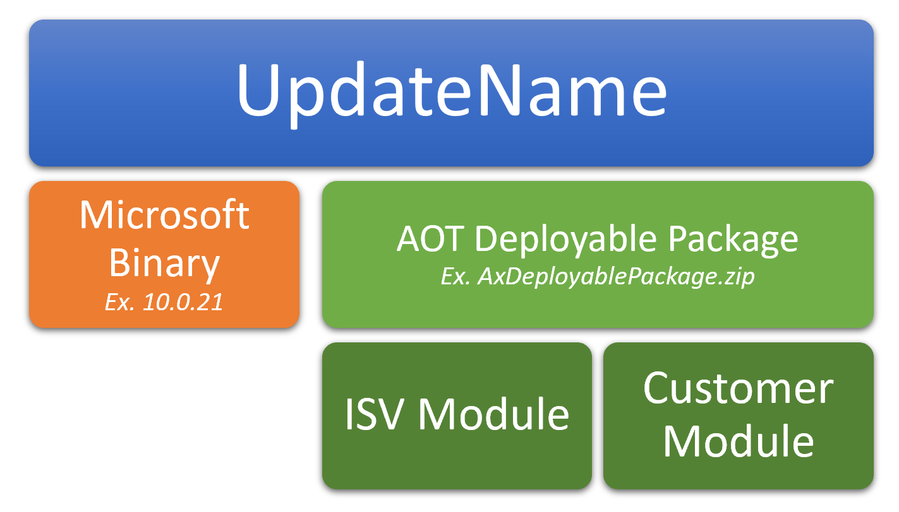

# Update an environment

[!include [banner](../includes/banner.md)]
[!include [banner](../includes/limited-availability.md)]

This article walks through the process of applying updates to an environment that was deployed by using the [self-service deployment](infrastructure-stack.md) experience.

> [!IMPORTANT]
> In the next-generation infrastructure, updates are applied differently than they are applied in the current flow. *Whatever is provided in the package is applied to the environment, and it **overwrites** whatever is already present in that environment.* Therefore, you **must** create a single deployable package that contains all customizations and independent software vendor (ISV) solutions from your build environment. If the list of models in the environment differs from the list of models in in the package, you receive a warning before the update is applied. For information about how to create a single package, see [Manage third-party models and runtime packages by using source control](../dev-tools/manage-runtime-packages.md).

## Applying updates to self-service environments

Self-service environments use a special approach to performing updates, because the container-based image process is used to build the environment's runtime. When these images are applied to a sandbox environment, the customer gives an **Update name** value to them, and they are shown in the environment history. An update image consists of three parts:

- **Microsoft binaries** that Microsoft releases on a regular basis, and that include new platform and application software updates. These binaries are available from the environment details page for your environment in Microsoft Dynamics Lifecycle Services (LCS). You will see a **single tile** that shows a cumulative binary update of all the application and platform fixes. To apply this update, select the package, and then select **Save package** to save the Microsoft update to the project asset library.
- An **AOT deployable package**, which is an all-in-one package that is the sum of all the custom code that the customer wants to apply to its environment.
- An **Update name** value that the customer provides in LCS. 
 

 
The combination of these binaries is the basis for an image that is used to create an instance of an Application Object Server (AOS). The **Update name** value lets customers provide a meaningful name that indicates what the update contains.

### Update by using packages on Tier 1 sandbox/development and test/demo/build environments

To apply updates to a Tier 1 sandbox/development and test/demo/build environments that were deployed through LCS, follow the steps in [Apply updates to cloud environments](apply-deployable-package-system.md).

### Update by using packages on Tier 2 and above Standard Acceptance Test/sandbox environments

> [!IMPORTANT]
> Package application causes system downtime. All relevant services will be stopped, and you won't be able to use your environments while the package is being applied.

At the sandbox tier, updates are still applied via LCS by using the same packages that were used for the Microsoft-managed environments before self-service. When a customer applies a package, it can be either a Microsoft binary or an AOT deployable package. In both cases, Microsoft takes the latest image of the environment, overwrites the binary or AOT component, and produces a new image that is used to re-create the runtime for the environment.

Before you begin, verify that the deployable package has been uploaded to the project asset library in LCS, and that validations have succeeded.

After the package is in the project asset library, follow these steps to update your environment.

1. Open the environment details page for the environment where you want to apply the package.
2. Select **Maintain \> Apply updates** to apply an update.
3. Enter a **unique name** for the update. You will use this name to identify the update for which you want to promote the image (both the Microsoft binary and the customer AOT package) to the production environment.
4. Select the package to apply. Use the filter at the top to find your package. The list will include application and platform binary packages and application deployable packages that have passed validation from the asset library.
5. Select **Apply**.

    The status in the upper-right corner of the environment details page changes from **Queued** to **Servicing** and then to **Post-servicing**. When package application is completed, the status changes to **Deployed**.

6. After package application is completed, the environment history is updated. To view the environment history, select **History \> Environment changes** on the environment details page.
7. You can also download the logs from the environment history page.
8. After the validations are completed, you can sign-off on the update from the environment history page by selecting either **Sign off** or **Sign off with issues**.

## Servicing changes
Microsoft has introduced a new post-servicing step that lets you do index creation in online mode to help reduce the overall servicing downtime. While the post-processing step is occurring, the LCS dashboard will show **Post-servicing** after offline servicing is completed. During this time, some index creation and modification will be done in online mode. The environment will be accessible so that users can perform regular activities, but performance on the package changes that are involved might be degraded. During post-servicing, users won't be able to cancel or trigger new service requests.

If any failure occurs during the post-processing step, the LCS dashboard will display **Post-servicing failed**. The environment will still be accessible so that users can perform regular activities, but performance might be degraded. If you experience that the issue is not resolved in 24 hours, then contact Microsoft Support.

#### Uninstalling a module

AOT deployable packages consist of one or many customer modules. They might be a combination of ISV modules, partner modules, or a customer's own customization modules. If you want to completely uninstall an AOT deployable package, there are two options in the sandbox environments:

- **Recommended option:** Use the ModuleToRemove.txt process that is outlined in [Uninstall a package](uninstall-deployable-package.md). This option does everything that the previous option does, but the resulting image can be promoted to production environments.

- **Option not supported for production:** Create a new AOT deployable package that no longer includes the module that you want to remove. When you apply this package directly to your sandbox environment, a message in LCS will warn you that a module that is included in the current image of the environment is missing from your package.

    - You can proceed in LCS. Microsoft will create a new image that combines the Microsoft binary from the last update and the current AOT package that doesn't contain the module that you want to remove. In effect, the module will be uninstalled.
    - This option is advised only in situations where you don't yet have a production environment, or where you must quickly test the resulting environment but don't plan to promote this AOT package to production.
    - Promotion of the resulting image of the sandbox environment to production environments will be blocked.

#### Microsoft automatic updates in sandbox environments

On a regular basis, Microsoft will push automatic updates of new Microsoft binaries to your sandbox environments. This automatic update will be done only if your sandbox environment version has fallen behind and is older than the supported generally available version.

This automatic update will overwrite the Microsoft binary from your latest sandbox image. In effect, it will create a new update that includes the new Microsoft binary and your earlier customizations.

### Promote an update to production environments

Packages are no longer applied directly to production environments. Historically, in Microsoft-managed environments, customers were able to apply any package that was successfully applied to a sandbox environment and marked as a *Release candidate*. However, this approach posed many challenges, because there are order of operation scenarios where application of package A before package B produced a healthy environment, but a different order led to regressing functionality.

To address these challenges, Microsoft has introduced the image-based, update process. As was discussed earlier in this article, as packages are applied to sandbox environments, Microsoft creates images that are given an **Update name** value. This value represents the whole runtime, including Microsoft code and all custom code as a single unit. When customers want to promote a change to a production environment, they select an update from a sandbox environment's history. The whole runtime is then moved to the production infrastructure as is and should better safeguard against regressions.

> [!IMPORTANT]
> Package application causes system downtime. All relevant services will be stopped, and you won't be able to use your environments while the package is being applied.

After you've successfully applied the update in the sandbox environment and are ready to move the update over to the production environment, follow these steps to mark an update as a release candidate.

1. Open the environment history page by selecting **History \> Environment changes** on the environment details page.
2. Select the update to move over to the production environment.
3. In the details for the update, select **Mark as release candidate**.

    The **Is Release Candidate** option is set to **Yes**.

After you've marked an update as a release candidate, follow these steps to update your environment.

1. Open the environment details page for the production environment.
2. Select **Maintain \> Update environment** to apply an update.
3. In the **Available sandboxes** list, select the source sandbox environment where the update was applied, validated, and marked as a release candidate.
4. In the grid, select the update to apply to the production environment. This grid shows only updates that have been marked as release candidates.
5. In the **Downtime start** field, select a date and time. The environment will be taken down for servicing at the specified time on the specified date. The **Downtime end** is calculated automatically based on the expected duration.

    No lead time is required for this update.

6. Select **Schedule**. LCS runs validations to make sure that the selected update is applicable to the environment. To prevent downgrade of the environment, the update isn't allowed if its application version is lower than the current environment version. Additionally, customers are asked to confirm that they want the update to proceed.

    If the update is **successfully** scheduled, an email notification is sent to all project stakeholders.

    The status in the upper-right corner of the environment details page changes from **Queued** to **Servicing**. Then, when the update is completed, the status changes to **Deployed**.

    All stakeholders are notified of the progress of the operation.

7. After the update is completed, the environment history is updated. To view the environment history, select **History \> Environment changes** on the environment details page.
8. You can also download the logs from the environment history page.
9. After the validations are completed, you can sign-off on the update from the environment history page by selecting either **Sign off** or **Sign off with issues**.

> [!NOTE]
> If there is an on-going operation in the environment, or if the environment is already running on the same version or a later version, the scheduled update is canceled. When a scheduled update is canceled, an email notification is sent to all project stakeholders. Customers can also cancel an update by selecting **Cancel** on the environment details page. If customers want to reschedule or change an update, they can cancel the current operation and schedule a new one.

#### Things to consider about production updates

When you're promoting an update from sandbox to production, it includes **both the Microsoft binary and the customer AOT package**. Customers can't promote the Microsoft binary and the customer AOT package independently. 

If you want to promote a Microsoft binary update from your sandbox environment, be aware that it will include the latest customer packages that have been applied as of that same point in time from the sandbox.

If you want to promote a customer AOT package from your sandbox environment, be aware that it will also include the most recently applied Microsoft binary update.

#### Microsoft automatic updates in production environments

On a regular basis, Microsoft will push automatic updates of new Microsoft binaries to your production environment. This automatic update will always occur a week after successful update to your sandbox environments.

In this automatic update, Microsoft won't promote any customer AOT packages. Instead, we will take the newer binary version and combine it with the latest customer AOT package in the target production environment to create a new image for the production runtime.

### Rollback
For environments that are deployed in the modern infrastructure stack, if servicing is unsuccessful, the environment is automatically rolled back in most cases. To learn why the operation was unsuccessful, you can download the logs from the environment history page.

> [!NOTE]
> For a small subset of environments where rollback may result in extended downtime, such as when the database size is large, the environment is left in a failed state to determine if actions can be taken to avoid performing the rollback. If the failed operation cannot move forward, then the normal rollback process is initiated.

[!INCLUDE[footer-include](../../../includes/footer-banner.md)]
