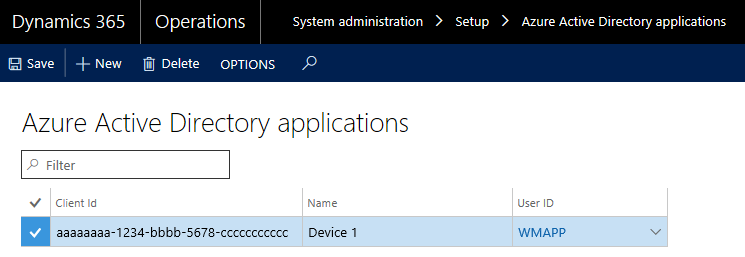

---
# required metadata

title: Configure the Warehousing app for on-premises deployments
description: This article describes the prerequisites for the warehousing app for on-premises deployments.
author: faix
ms.date: 04/05/2022
ms.topic: article
ms.prod: 
ms.technology: 

# optional metadata

# ms.search.form: 
# ROBOTS: 
audience: Developer
# ms.devlang: 
ms.reviewer: sericks
# ms.tgt_pltfrm: 
ms.assetid: 63e43066-76c7-400b-be7d-d14785e7985d
ms.search.region: Global
# ms.search.industry: 
ms.author: osfaixat
ms.search.validFrom: 2017-12-04
ms.dyn365.ops.version: 7.3

---
# Configure the Warehousing app for on-premises deployments

[!include [banner](../includes/banner.md)]

This article describes how to configure Dynamics 365 Finance – Warehousing app for on-premises deployments.

## Prerequisites
The Warehousing app is available on Android and Windows operating systems. To use the app for on-premises deployments, at a minimum, it must be version 1.1.1.0. You must also have one of the following supported versions of Dynamics 365 Finance + Operations (on-premises). Use the information in the following table to evaluate if your hardware and software environment supports the configuration.

| Platform               | Version                                                                            |
|------------------------|------------------------------------------------------------------------------------|
| Android                | 4.4 and up                                                                         |
| Windows (UWP)          | Windows 10 (all versions)                                                          |
| App version            | 1.1.1.0 and above                                                                  |
| Dynamics 365 | Dynamics 365 Finance + Operations (on-premises) with Platform update 11 |

To be able to reach your on-premises resources with the app, you will need to create DNS records for your AOS and for Active Directory Federation Services (AD FS). For guidance, see [Create DNS zones, and add a record](setup-deploy-on-premises-latest.md#setup).

## Create an application entry in AD FS
For a successful authentication exchange between AD FS and Finance + Operations, an application entry must be registered in AD FS under an AD FS application group. To create this application entry, run the following Windows PowerShell commands on a machine where the AD FS is installed. The user account must have enough permissions to administer AD FS.

1.  Enter the following command in the Windows PowerShell console to create the application entry.  

    ```powershell
    Add-AdfsClient -Name 'Dynamics 365 Finance - Warehousing' -ClientId ([guid]::NewGuid()) -ClientType Confidential -GenerateClientSecret -RedirectUri '\<Resource URL\>' -ADUserPrincipalName '\<Admin user\>' 
    ```

    - The \<Resource URL\> can, for example, be `https://ax.d365ffo.onprem.contoso.com` (where `https://ax.d365ffo.onprem.contoso.com`
is the URL to access Finance + Operations).
    - The \<Admin user\> can be any user with admin access to the AD FS machine.

2.  Save the values that you received.

3.  Run the following command to grant permission to the application.  
    
    ```powershell
    Grant-AdfsApplicationPermission -ClientRoleIdentifier '\<Client ID received in previous steps\>' -ServerRoleIdentifier '\<Resource URL\>' -ScopeNames 'openid'
    ```

## Create and configure a user account

To enable Finance + Operations to use your AD FS application, you must create a user account in Microsoft Dynamics 365 with the same user credentials as the user of the Warehousing app:

1.  Create a user in Finance + Operations and assign the Warehousing mobile
    device user role to the user.

    1.  Go to **System administration** \> **Common** \> **Users**.
    
    2.  Create a new user.
    
    3.  Assign the warehouse mobile device user role, as shown in the example screenshot.

    

2.  Associate your AD FS application with the Warehousing app user.

    1.  In Finance + Operations, click **System administration** \> **Setup** \> **Azure Active Directory applications**.
    
    2.  Create a new line.
    
    3.  Enter the client ID that you obtained when you created an application entry in AD FS (step 2 in "Create an application entry in AD FS"). Enter a name, and select the Warehousing app user.

    

## Certificates 

Make sure that the devices where the app is installed have the correct certificates to access the resources. If you're using self-signed certificates, you must install them on each device by importing the star certificate and the AD FS certificate into the trusted root of the computer account/user account. For more information, see [Create and export a self-signed certificate](/previous-versions/windows/it-pro/windows-server-2008-R2-and-2008/ff710475(v=ws.10)).

> [!IMPORTANT]
> Environments with self-signed certificates will not be accessible from Android devices. If you need to access the environment from an Android device, use publicly trusted certificates for AD FS and Finance + Operations. Alternatively, you can also use AD CS to generate the certificates for AD FS and Finance + Operations. However, if you do this you will have to manually import the certificate authority certificate into your Android device.   

## Configure the application

You must configure the Warehousing app on the device to connect to the server through the AD FS application by setting up a connection. There are multiple ways to set up a new connection:

- Add connections from a file.
- Add connections from a QR code.
- Manually add connections.

### Create a connection settings file or QR code

You can import connection settings from either a file or a QR code. For both approaches, you must first create a settings file that uses JavaScript Object Notation (JSON) format and syntax. The file must include a connection list that contains the individual connections that have to be added. The following table summarizes the parameters that you must specify in the connection settings file.

| Parameter                  | Description | 
|----------------------------|-------------|
| ConnectionName             | Specify the name of the connection setting. The maximum length is 20 characters. Because this value is the unique identifier for a connection setting, make sure that it's unique in the list. If a connection that has the same name already exists on the device, it will be overridden by the settings from the imported file. |
| ActiveDirectoryClientAppId | Specify the client ID that you made a note of while you were setting up the AD FS application. |
| ActiveDirectoryResource    | <p>Specify the root URL of Finance + Operation (on-premises).</p><p>**Note:** Be sure to include **/namespaces/AXSF**.</p> | 
| ActiveDirectoryTenant      | Specify the Open Authorization (OAuth) 2.0 endpoint of your AD FS server. This value has the form `https://your-adfs-server/adfs/oauth2`. Here is an example: `https://adfs.contoso.com/adfs/oauth2.` | 
| Company                    | Specify the legal entity in Finance + Operation (on-premises) that you want the application to connect to. | 
| ConnectionType             | <p>(Optional) Specify whether the connection setting should use a certificate or a client secret to connect to an environment. Valid values are **"certificate"** and **"clientsecret"**. The default value is **"certificate"**.</p><p>**Note:** Client secrets can't be imported.</p> |
| IsEditable                 | (Optional) Specify whether the app user should be able to edit the connection setting. Valid values are **"true"** and **"false"**. The default value is **"true"**. | 
| IsDefault                  | (Optional) Specify whether the connection is the default connection. A connection that is set as the default connection will automatically be preselected when the app is opened. Only one connection can be set as the default connection. Valid values are **"true"** and **"false"**. The default value is **"false"**. | 
| CertificateThumbprint      | (Optional) For Windows devices, you can specify the certificate thumbprint for the connection. For Android devices, the app user must select the certificate the first time that a connection is used. | 

The following example shows a valid connection settings file that contains two connections. As you can see, the connection list (named "ConnectionList" in the file) is an object that has an array that stores each connection as an object. Each object must be enclosed in braces ({}) and separated by commas, and the array must be enclosed in brackets ([]).

```json
{
    "ConnectionList": [
        {
            "ActiveDirectoryClientAppId":"aaaaaaaa-bbbb-ccccc-dddd-eeeeeeeeeeee",
            "ConnectionName": "Connection1",
            "ActiveDirectoryResource": "https://ax.d365ffo.onprem.contoso.com/namespaces/AXSF",
            "ActiveDirectoryTenant": "https://adfs.d365ffo.onprem.contoso.com/adfs/oauth2",
            "Company": "USMF",
            "IsEditable": false,
            "IsDefaultConnection": true,
            "CertificateThumbprint": "aaaabbbbcccccdddddeeeeefffffggggghhhhiiiii",
            "ConnectionType": "certificate"
        },
        {
            "ActiveDirectoryClientAppId":"aaaaaaaa-bbbb-ccccc-dddd-eeeeeeeeeeee",
            "ConnectionName": "Connection2",
            "ActiveDirectoryResource": "https://ax2.d365ffo.onprem.contoso.com/namespaces/AXSF",
            "ActiveDirectoryTenant": "https://adfs2.d365ffo.onprem.contoso.com/adfs/oauth2",
            "Company": "USMF",
            "IsEditable": true,
            "IsDefaultConnection": false,
            "ConnectionType": "clientsecret"
        }
    ]
}
```

For more information about how to save the JSON file, see [Save the connection settings file on each device](../../../supply-chain/warehousing/install-configure-warehousing-app.md#save-the-connection-settings-file-on-each-device).

After you create your file, you must import it. For more information, see [Import the connection settings](../../../supply-chain/warehousing/install-configure-warehousing-app.md#import-the-connection-settings).

### Manually configure the application

1. Open the Warehousing app on your mobile device.
1. Go to **Connection settings**.
1. Set the **Use demo mode** option to **No**.
1. Tap the **Select connection** drop-down control to expand the settings that are required to manually enter the connection details.

    - **Use client secret** – Set this option to **Yes** to use a client secret to authenticate with Dynamics 365 Supply Chain Management. Set it to **No** to use a certificate for authentication.
    - **Connection name** – Enter a name for the new connection. This name will appear in the **Select connection** field the next time that you open the connection settings. The name that you enter must be unique. (In other words, it must differ from all other connection names that are stored on your device, if any other connection names are stored there.).
    - **Active Directory Client ID** – The client ID that you obtained when you created an application entry in AD FS (step 2 in the [Create an application entry in AD FS](#create-an-application-entry-in-ad-fs) section).
    - **Active Directory Client Secret** – The client secret that you obtained when you created an application entry in AD FS.
    - **Active Directory Resource** – The DNS URL for the AOS instance. Add **/namespaces/AXSF** to the end of the URL.

        > [!NOTE]
        > Don't end the value with a slash (/). For example, enter `https://ax.d365ffo.onprem.contoso.com/namespaces/AXSF`.

    - **Active Directory Tenant** – The DNS URL for the AD FS machine. Add **/adfs/oauth2** to the end of the URL. 

        > [!NOTE]
        > Don't end the value with a slash (/). For example, enter `https://adfs.d365ffo.onprem.contoso.com/adfs/oauth2`.

    - **Company** – Enter the legal entity that you want the application to connect to.

1. Select the **Save** button in the upper-right corner of the application.
1. If you're using an Android device, and you're using a certificate for authentication, the device prompts you to select the certificate.

The application connects to Finance + Operations (on-premises), and the sign-in page for the warehouse worker appears.

> [!NOTE]
> In older releases, if you don't have a telemetry ID for the Warehousing app user, you might encounter some errors. The workaround is to sign in to Finance + Operations (on-premises) through the web client to get a telemetry ID.

[!INCLUDE[footer-include](../../../includes/footer-banner.md)]

